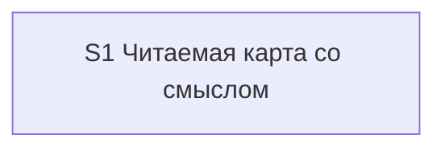

# Quality Control — scenario-map-readability-meaning

Date: 2026-08-29  
Report: `quality-control-2026-08-29.md`  
Mode: **proposed-slice** (`design.md` `## Slices`; `tasks.md` **не существует**)  
Scope (prompt): criteria **1, 3, 5, 5b, 8, 8b, 9, 10, 11** from `.cursor/rules/vertical-slices.mdc` QUALITY CONTROLLER — SLICE COHERENCE, applied to proposed decomposition + delta spec  
Also filled (output format): independence, dependency graph, rework, task readability (N/A)  
Out of scope: IB/runtime executability now, test data, baseline snapshots; product `src/**` / `.bsl` (kit-only)

Context: kit-only change (skill, panel template, etalons, cartographer role, delta spec). Prompt: Primary journey is opening a canvas panel next to chat — that is the black-box user journey. **`no-slices` not emitted as a blocker** (prompt override): treat `## Slices` as the proposed decomposition.

Sources: `proposal.md`, `design.md` (`## Slices`), `specs/scenario-map-canvas/spec.md` (10 `#### Scenario:`), `.cursor/rules/vertical-slices.mdc`, `.cursor/rules/task-readability.mdc`. Cross-check: `reports/architecture-new-2026-08-29.md` § «Вердикт 3 — срезы» (not a second SoT).

## Verdict

`WARNING`

Один предложенный срез вертикален, самодостаточен и не является foundation+gate. Primary — наблюдаемое открытие панели штатной кнопкой. В таблице покрытия `## Slices` нет сценария дельты «Связь без видимого отношения не выдумывается» (10-й из 10).

## Slice Summary

| Slice | Scenario | Tasks | Acceptance | Dependencies | Gate |
|---|---|---|---|---|---|
| S1: Читаемая карта со смыслом | Разработчик просит карту по теме с несколькими отчётами и открывает панель штатной кнопкой | ещё нет (`tasks.md` отсутствует); слои по design: скилл карты, шаблон панели, эталоны, роль сборщика, дельта требований | S1.accept предложен (1 mandatory Primary + optional/задачи сверки); **9/10** Scenario из дельты явно размещены, **1 не размещён** | нет | предложен один accept на границе среза; маркер `<!-- slice-gate -->` в design нет (формат `tasks.md`; см. критерий 5) |

Notes:

- Порог Standard (архитектор: 6–15 задач). По `vertical-slices.mdc` § ТРИГГЕРЫ — **1 срез по умолчанию**. Дополнительные срезы отклонены явно (foundation «шаблон»; дубль Primary «читаемость» / «смысл»).
- `form_mode: n/a`. Продуктовый BSL/Form/XML не требуется.
- Группы `## 1…## 5` внутри среза (архитектурный отчёт) — не отдельные срезы; QC их не штрафует.
- `**Режим apply:**` в design не указан; для kit markdown допустим `mechanical` на этапе генерации `tasks.md` — вне запрошенных критериев.

## Scenario Coverage

10 `#### Scenario:` в `openspec/changes/scenario-map-readability-meaning/specs/scenario-map-canvas/spec.md`.

| Scenario | Covered by (proposed) | Status |
|---|---|---|
| Направление связей и легенда видны без клика | S1 Primary | OK — covered-by-Primary |
| Главный вывод виден без клика по узлу | S1 Primary | OK — covered-by-Primary |
| Находка, меняющая действие, на полотне | S1 Primary | OK — covered-by-Primary |
| С узла открывается доказательство, новый чат с панели не запускается | S1 optional / шаг кнопки | OK — covered-by-optional |
| Вывод только в шапке не публикуется | S1 optional | OK — covered-by-optional |
| Режим не прячет рёбра | S1 optional | OK — covered-by-optional |
| Слои или ветвление видны на панели | S1 optional | OK — covered-by-optional |
| Провал смысла не уходит в текстовый резерв | S1 задача сверки скилла (agent static / «по тексту») | OK — covered-by-task (implementation-only; не отдельный accept) |
| Эталон карты в скилле — граф, не список | S1 задача сверки эталона (agent static / «по тексту») | OK — covered-by-task |
| Связь без видимого отношения не выдумывается | **нигде в `## Slices`** (нет Primary, нет optional, нет заявленной `S1.<M>`) | **GAP** — `accept-bullets-missing-scenario` |

Сценарий в дельте **новый по смыслу брифа** (WHEN включает «в том числе если в брифе перечислены расхождения отчётов»). Это не «наследие архива, которое можно молча опустить»: Behavior Contract п.6 и Decisions п.4 / риск 5 как раз запрещают достраивать ребро из блока расхождений. Архитектор (вердикт 3) относил «расхождение совета с отчётами» к optional или сверке скилла; таблица покрытия `design.md` это имя Scenario не перенесла.

**Связь со spec** в строке S1 перечисляет 9 имён и **не** включает «Связь без видимого отношения не выдумывается».

## Dependency Graph

- Cycles: none.
- Forward acceptance dependencies: none (единственный срез).
- Undeclared predecessors: none (`**Зависимости:**` в таблице = нет).
- Intra-slice (projected): шаблон + две проверки скилла + бриф сборщика (несколько отчётов) + эталон «граф без смысла» + контракт клика → один `S1.accept`.

## Checklist Results

| # | Criterion | Result |
|---|---|---|
| 1 | Scenario Coverage | **Fail (WARNING)** — 9/10. Пропуск: «Связь без видимого отношения не выдумывается». Остальные: Primary / optional / agent-сверка по тексту скилла (kit-аналог «верифицировать по коду») |
| 2 | Slice Independence | **Pass** (информативно, не в запросе) — принимать S1 можно без несуществующего S2+ |
| 3 | Slice Completeness | **Pass** — слои kit, нужные для Primary «открыть панель → видно направление, легенду, полосы, виновника и находку», в колонке «Файлы» названы: шаблон (представление), скилл (смысл до записи + читаемость после проверки панели), роль сборщика (несколько отчётов и расхождения), эталоны, дельта требований. Нет недостающего слоя метаданных/форм 1С. Prompt-файл `1c-agent-patterns/scenario-map-designer.md` в колонке сжат в «роль сборщика» — не дыра слоя, см. SUGGESTION |
| 4 | Slice Dependency Graph | **Pass** (информативно) — S1 → нет |
| 5 | Slice Gate Integrity | **Pass (projected)** — предложен **ровно один** `S1.accept`. Дубля нет. Маркер `<!-- slice-gate -->` — артефакт `tasks.md`, в `## Slices` его нет по формату design; **не** эмитирован CRITICAL (нет `# Срез` в tasks). При генерации tasks — ровно один accept + один маркер (SUGGESTION) |
| 5b | Acceptance Checklist Coverage | **Fail (WARNING)** — Primary в metadata таблицы есть; mandatory Primary в чеклисте есть → `primary-acceptance-missing` / `accept-checklist-empty` **не** срабатывают. `accept-bullet-foreign-scenario` N/A (один срез). `accept-bullets-missing-scenario` — да (см. критерий 1) |
| 6 | Rework Risk | **Pass** (информативно) — один срез снимает риск «принята читаемость без смысла». Плотность Primary (находка + грамматика графа в одном взгляде) — намеренно; не rework между срезами |
| 8 | Slice Verticality | **Pass** — mandatory Primary: открыть панель штатной кнопкой среды и **взглядом** увидеть направление, легенду, полосы по слоям, выбранного виновника и находку. Это black-box (панель рядом с чатом), не вызов API / код-ревью контракта. Programmatic (сверка скилла, эталон в markdown) вынесены из Primary в задачи — верно |
| 8b | Self-Achievable Acceptance | **Pass** — нет пары S1/S2. Наблюдаемый исход не заимствован у более позднего среза. Все включающие слои Primary (шаблон, скилл родителя, бриф сборщика) заявлены в том же S1. Отказ от трёх срезов черновика как раз закрывает этот критерий |
| 9 | Foundation slice with gate | **Pass** — нет S_k с programmatic accept и зависимого S_k+1 с UX. Черновик «срез шаблон» отвергнут в `## Slices` со ссылкой на антипаттерн |
| 10 | Acceptance Simplicity | **Pass** — в предложенном чеклисте **один** mandatory black-box journey (одна открытая панель, один взгляд). Три Scenario упакованы в **один** Then, не в три mandatory sub-bullet. Optional / сверка — отдельно. Риск при генерации tasks: развернуть упаковку в несколько обязательных буллетов → тогда сработает overload (SUGGESTION) |
| 11 | User Task Contract | **Pass (projected)** — строк `S<N>.<M>` нет, DENY-grep не к чему применить. Приёмка «ручной осмотр живой панели» / «пересборка карты» стоит на границе среза (`S1.accept`) — **допустимо**. Сверка скилла/эталона заявлена как **задача** (агент по тексту), не user-spike в середине среза. Assumptions п.4 («приёмка в проекте Документооборота») = accept, не mid-slice user runtime. CRITICAL не ставить до появления запрещённых формулировок в tasks |

Task readability: **N/A** — нет `- [ ] S1.<M>`. Критерий 7 не в запросе; при генерации tasks действует `.cursor/rules/task-readability.mdc`.

## Alerts

### 1. `accept-bullets-missing-scenario`

- affected: S1 / delta spec Scenario «Связь без видимого отношения не выдумывается»
- alert type: `accept-bullets-missing-scenario`
- severity: `WARNING`
- evidence: `specs/scenario-map-canvas/spec.md` (Requirement «Node contract…», WHEN с блоком расхождений в брифе). Таблица «Покрытие Scenarios» и колонка «Scenarios из spec» в `design.md` `## Slices` имя не содержат. Остальные 9 Scenario размещены.
- recommendation: при генерации `tasks.md` покрыть сценарий **хотя бы в одном месте**: optional sub-bullet `S1.accept` (предпочтительно: просьба карты при расхождениях без видимого отношения → ребро не появляется, панель не публикуется за счёт выдуманных стрелок, в чате одна строка) **или** `S1.<M>` агенту «по тексту скилла/роли: расхождения — кандидаты, ребро без видимого отношения не ставится». **Не** делать второй mandatory journey (критерий 10). Добавить имя в `**Связь со spec:**` S1.

### Remediation (auto-repair)

- alert: `accept-bullets-missing-scenario`
- target: `design.md` `## Slices` (таблица покрытия + «Scenarios из spec») и будущий `tasks.md` срез S1
- action: (1) В `design.md` добавить строку покрытия: Scenario «Связь без видимого отношения не выдумывается» → S1 optional **или** S1 задача сверки скилла/роли. (2) Вписать то же имя в колонку «Scenarios из spec». (3) В `S1.accept` — optional-буллет с буквальным именем Scenario **либо** задача `S1.<M>` со сверкой запрета выдуманных рёбер при блоке расхождений. Не включать этот путь в mandatory Primary.

### 2. `slice-gate-pending-tasks`

- affected: S1 (generation of `tasks.md`)
- alert type: (informational for criterion 5; not in the removed-alert list)
- severity: `SUGGESTION`
- evidence: `## Slices` задаёт один `S1.accept` и критерии приёмки; HTML-маркер конца среза в design не пишется.
- recommendation: в `tasks.md` — `# Срез S1: …`, ровно один `- [ ] S1.accept …` с `**Primary (обязательно):**` из metadata, затем `<!-- slice-gate: на открытой панели видны направление, легенда, честные полосы, виновник и находка, меняющая действие; клик не открывает модуль -->`.

### 3. `acceptance-simplicity-guard`

- affected: S1.accept (projected)
- alert type: профилактика критерия 10 (`acceptance-simplicity-overload`)
- severity: `SUGGESTION`
- evidence: Primary одним предложением закрывает три Scenario («направление и легенда», «главный вывод», «находка на полотне»). Это один journey (открыть пересобранную панель → один взгляд), сейчас критерий 10 соблюдён.
- recommendation: в теле `S1.accept` оставить **один** mandatory sub-bullet. Имена трёх Scenario не превращать в три строки без пометки «опционально». Кликовые / негативные / режим / слои — optional; эталон и провал смысла — `S1.<M>`.

### 4. `user-task-contract-guard`

- affected: будущие `S1.<M>`
- alert type: профилактика критерия 11
- severity: `SUGGESTION`
- evidence: колонка «Приёмка» смешивает осмотр панели и сверку скилла; Assumptions п.4 — пересборка в проекте Документооборота.
- recommendation: пересборку и осмотр панели держать только в `S1.accept`. Правки markdown и «верифицировать по тексту скилла/шаблона/роли» — агентские `S1.<M>` (ALLOW-agent). Не писать в `S1.<M>` «на стенде», «runtime-verify», «в консоли», условные «после verify».

### 5. Completeness — явные задачи слоёв

- affected: S1 task generation
- alert type: профилактика критерия 3
- severity: `SUGGESTION`
- evidence: колонка «Файлы» достаточна семантически; архитектурный отчёт перечисляет ещё `fixtures/canvas-shell.md`, `onec-scenario-map-designer.md`, `1c-agent-patterns/scenario-map-designer.md`, новый плохой эталон смысла.
- recommendation: в группах S1 до accept явно закрыть слои: шаблон панели (направление, легенда, полосы по `layer`, клик = выбор, кнопка доказательства); скилл (смысл на манифесте до записи; читаемость на файле после проверки панели); роль + prompt сборщика (все пути отчётов + расхождения-кандидаты); эталон «граф есть — смысла нет»; дельта spec.

**Не эмитировано:** `no-slices` (просьба промпта); `primary-acceptance-missing`; `accept-checklist-empty`; `accept-bullet-foreign-scenario`; `slice-not-vertical`; `slice-accept-not-self-achievable`; `slice-foundation-with-gate`; `acceptance-simplicity-overload`; `user-task-contract-violation`; `legacy-acceptance-format`; `deprecated-phase-gate`.

## Recommendations

**Automatic fix**

1. Дописать в `## Slices` покрытие Scenario «Связь без видимого отношения не выдумывается» (optional accept или задача сверки) — см. Remediation alert 1.
2. При генерации `tasks.md`: один `# Срез S1`, один `S1.accept` с одним mandatory Primary, `<!-- slice-gate -->`, optional/agent для остальных Scenario из Связь.

**Decision required**

Нет. Критерий 8b / объединение срезов не требуется: декомпозиция уже один срез. Переписывать Primary на другой путь не нужно.

**Do not**

- Не вводить второй срез «шаблон» или «смысл отдельно» (критерии 8b и 9).
- Не ставить два+ mandatory black-box journey в `S1.accept`.
- Не закрывать пропуск «выдуманные рёбра» вторым обязательным accept-путём.
- Не откладывать `S1.accept` «пока не будет S2».
