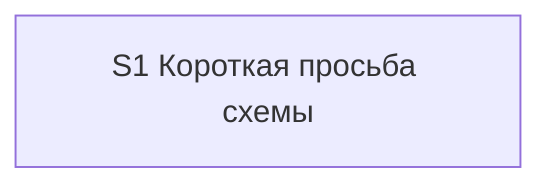

# Quality Control — scenario-map-show-scheme-phrase

Date: 2026-08-30  
Mode: **slice** (`# Срез S1` in `tasks.md`)  
Scope: критерии 1, 3, 5, 5b, 8, 8b, 9–11 (по запросу). Критерии 2, 4, 6 и читаемость — вспомогательно, без влияния на вердикт.  
Out of scope: исполнимость приёмки «прямо сейчас»; тестовые данные; эталон ИБ; качество формулировок скилла.

Context: kit-only, mechanical, один срез. Продуктовый `src/**` / `.bsl` не требуется. `form_mode: n/a`. Приёмка — ручной прогон чата; сверка текста — агентские `S1.<M>`. User-spike на ИБ в `S1.<M>` нет.

Sources: `proposal.md`, `design.md` (`## Slices`), `tasks.md`, `specs/scenario-map-canvas/spec.md` (4 `#### Scenario:`), `.cursor/rules/vertical-slices.mdc`, `.cursor/rules/task-readability.mdc`.

Mechanical pre-check: ровно один `S1.accept`; закрывающий `<!-- slice-gate -->` есть; `<!-- phase-gate -->` нет; legacy `S1.T<M>` нет. DENY User Task Contract по строкам `^- \[[ x]\] S\d+\.\d+`: совпадений нет. Repair-grep (`При успешном verify S` / `после verify S` / `после стенда`): нет.

### Verdict

`Pass` (`OK`)

Алертов нет (`CRITICAL` / `WARNING` / `SUGGESTION` не эмитируются).

Один срез, одна приёмка, один маркер границы. Четыре сценария дельты покрыты. Обязательный осмотр — один black-box путь в чате: «покажи схему» при источнике → кнопка панели, без рисунка и без вопроса. Остальные три сценария — optional. Primary достижим задачами этого же среза. Рабочие задачи не поручают пользователю runtime на ИБ.

### Slice Summary

| Slice | Scenario | Tasks | Acceptance | Dependencies | Gate |
|---|---|---|---|---|---|
| S1: Короткая просьба схемы | В разборе или исследовании с источником написать «покажи схему» → панель штатной кнопкой, без вопроса | 5 рабочих (`S1.1`–`S1.5`) `[ ]` + `S1.accept` `[ ]` | `S1.accept` (4/4: 1 Primary + 3 optional) | нет | да (`<!-- slice-gate -->`) |

Notes:

- Порог: Lite (5 рабочих) / Standard, если считать accept. `# Срез` допустим как срез-контейнер. Второй срез не нужен: `design.md` явно «узнавание без панели не принимается отдельно».
- `**Режим apply:** mechanical` согласован с kit-only markdown.
- Группы `## 1.`–`## 6.` — не отдельные срезы. `S1.5` «последней после S1.1–S1.4» — внутрисрезовый порядок apply, не второй gate.
- Слои продукта 1С не требуются. Слои kit в срезе: Entry Protocol + `description` (S1.1), cue диспетчера (S1.2), указатели разбора и исследования (S1.3), словарь и лексикон (S1.4), сверка текста (S1.5).

### Scenario Coverage

4 `#### Scenario:` в `specs/scenario-map-canvas/spec.md`. Других `specs/**` в change нет. Имена в `**Связь со spec:**` и в ёлочках `S1.accept` совпадают с заголовками spec буквально.

| Scenario | Covered by | Status |
|---|---|---|
| Голая просьба схемы рисует панель | Primary `S1.accept` + слой узнавания `S1.1`–`S1.3` | OK |
| Явный объект 1С не рисует панель | optional `S1.accept` + предикат в `S1.1` | OK |
| Неоднозначная просьба спрашивает одной строкой | optional `S1.accept` + предикат в `S1.1` / указатель в `S1.3` | OK |
| Предмет прохода — схема 1С, голая просьба спрашивает | optional `S1.accept` + предикат в `S1.1` | OK |

Implementation-only путь: сверка текста в `S1.5` (агент, static). User IB/runtime в `S1.<M>` нет. Покрытие optional только в accept — OK.

### Dependency Graph

- Cycles: none.
- Forward acceptance dependencies: none (единственный срез).
- Undeclared predecessors: none (`**Зависимости:** нет`).
- Intra-slice: `S1.5` после `S1.1`–`S1.4`; затем `S1.accept`. Не межсрезовая зависимость.

### Criteria (requested)

**1. Scenario Coverage** — PASS. Все 4 Scenario покрыты Primary или optional в `S1.accept`. Отдельный срез под implementation-only не создан.

**3. Slice Completeness** — PASS. Для kit-only приёмки нужны поверхности узнавания, не метаданные/форма/BSL. Файлы из `design.md` ## Slices закрыты: скилл карты включая `description` (S1.1), диспетчер (S1.2), разбор и исследование (S1.3), словарь и лексикон (S1.4). Дельта spec уже в change (этап new), отдельной apply-задачи на spec не требуется. Пайплайн панели — существующий механизм архива `2026-08-28-scenario-map-canvas`, в этот срез не входит.

**5. Slice Gate Integrity** — PASS. Ровно один `S1.accept`, один `<!-- slice-gate -->`. Дублей нет. Legacy `T<M>` нет.

**5b. Acceptance Checklist Coverage** — PASS. Есть `**Primary acceptance:**` в metadata и `**Primary (обязательно):**` в теле accept. Тело не пустое. Чужих Scenario нет (один срез). `accept-bullets-missing-scenario` не срабатывает: 4/4 в чеклисте.

**8. Slice Verticality** — PASS (семантика, не grep). Mandatory Primary описывает внешнее поведение чата: написать фразу → кнопка панели / нет рисунка / нет вопроса. Это black-box journey по kit как продукту, не вызов функции в отладчике и не ревью контракта API. Сверка текста — `S1.5`, не mandatory accept. `slice-not-vertical` не эмитируется.

**8b. Self-Achievable Acceptance** — PASS. Пары `S1`/`S2` нет. Дубля Primary нет. Слои узнавания (Entry Protocol, две поверхности подгрузки, указатели сессий) лежат в `S1.1`–`S1.3`. Primary не заимствует исход у более позднего среза. Живая панель после apply — transient, не structural. `slice-accept-not-self-achievable` не эмитируется.

**9. Foundation slice with gate** — PASS (не срабатывает). Условия «все три» не выполнены: нет `S2` с `**Зависимости:** S1`. `S1.accept` сам user-journey, не programmatic-only. Согласовано с design: «узнавание без панели не принимается отдельно».

**10. Acceptance Simplicity** — PASS. Ровно один mandatory black-box journey. Три остальных помечены «(опционально)». `acceptance-simplicity-overload` не эмитируется.

**11. User Task Contract** — PASS. В `S1.1`–`S1.5` нет user runtime (ИБ, консоль, отладчик, API без UX-proxy) и нет цепочек «после verify/стенда». `S1.5` — агентская сверка по тексту файлов (ALLOW-agent). Ручной прогон чата только в `S1.accept`. `user-task-contract-violation` не эмитируется.

### Supporting (not in requested set)

**2. Independence / 4. Graph / 6. Rework:** один срез, зависимости «нет», циклов нет, чужого Scenario нет. Риск переделки низкий: ADDED-требование не копирует текст соседа.

**Task readability:** рабочие задачи — глагол + файл + результат + ссылка на Decisions. `S1.accept` — бизнес-результат в заголовке, по строке на Scenario. `task-opaque-title` / `task-too-short` / `task-opaque-acceptance` не эмитируются. `S1.1` плотная (несколько правил в одном чекбоксе) — не именованный алерт.

### Alerts

Нет.

### Recommendations

**Automatic fix:** не требуется.

**Decision required:** не требуется. Объединение срезов не нужно.

**Remediation blocks:** нет (нет CRITICAL/WARNING).
