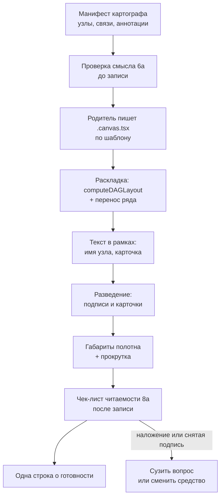

# Architecture: карта сценария — текст не ложится на коробки, полотно объясняет устройство

**Исход:** чинить надо шаблон панели в первую очередь и правило во вторую — состав манифеста в трёх снимках, скорее всего, был приемлемым, а провалила его геометрия шаблона, где текст рисуется без единой проверки габаритов; поэтому Chosen — три среза правок в одном файле шаблона плюс одна правка чек-листа и приёмки, без нового средства вида, без координат в манифесте и без смены модели сборщика.

Найдены два безусловных дефекта (срабатывают на **любой** панели, а не при неудачном стечении): карточка доказательства физически меньше своего текста, а подпись связи шире зазора между рангами. Это снимает вопрос «укладка или состав» в пользу укладки как первопричины наложений. Отдельно от неё стоит вторая половина цели — «восстановить устройство с полотна»: это уже состав, и он закрывается не шаблоном, а формулировкой одного уже существующего пункта самопроверки.

## KB references

Блок `## Existing Knowledge` пришёл пустым: discovery без совпадений, `openspec/knowledge/_index.yaml` отсутствует. Фактов базы знаний в этом отчёте не используется и не выдумано. Ссылок `used` / `not relevant` / `conflict` нет, конфликтов с KB нет.

## Task

Сделать так, чтобы живые схемы перестали быть бесполезными как объяснение «на пальцах»:

1. подписи связей и карточки доказательств не наезжают на коробки узлов, друг на друга и на соседние подписи;
2. с полотна восстанавливается устройство («кто кого питает / где ломается»), а не только фраза шапки и одна ловушка.

Охват шире укладки: шаблон **плюс** правило «схема объясняет устройство».

## Complexity

**Medium.** Три файла kit, один из них — шаблон панели с геометрией. Нет `src/**`, нет BSL, нет метаданных 1С. Риск сосредоточен в одном файле и проверяется глазами на живой панели.

## Existing Mechanisms

Всё, на что опирается Chosen, в оболочке и скилле уже есть. Новых абстракций не вводится.

| Механизм | Где | Как переиспользуется |
|---|---|---|
| `boxesOverlap(a, b)` — пересечение двух прямоугольников | `canvas-shell.md:135-145` | Единственный предикат коллизий для подписей, карточек и коробок. Новой геометрии пересечения не пишется |
| Прецедент деградации «пересеклось — не рисуем» (`bandsOverlap` → заливка полос не рисуется) | `canvas-shell.md:199-206`, `:489` | Тот же приём распространяется на подпись связи: не нашлось свободного места — подпись с полотна снимается |
| Панель деталей: `effect`, инцидентные связи `label · relation · evidence_ref`, кнопка доказательства | `canvas-shell.md:711-727` | Готовый адресат для текста, который не поместился на полотно. Скилл уже отправляет туда длинные подписи (`SKILL.md:109`) |
| Контейнер с горизонтальной прокруткой + натуральные размеры `svg` | `canvas-shell.md:458-466`, границы `:377-387` | Расширение полотна под разведённый текст не ломает бюджет ширины: прокрутка уже есть, масштабирования целиком нет |
| `computeDAGLayout` среды + `wrapLayout` (`MAX_ROW = 5`) | `canvas-shell.md:309-318`, `:231-257` | Раскладка узлов остаётся средой; правится только перенос ряда, движок не меняется |
| Выноска от якоря к карточке (линия `point → box`) | `canvas-shell.md:635-642` | Карточку можно двигать вокруг якоря, не теряя привязку: связь «карточка ↔ узел» держит уже нарисованная линия |
| Два круга ремонта и «сменить средство или сузить вопрос» | `SKILL.md:64`, `SKILL.md:53`, ADR-0009 | Готовый выход при неустранимой тесноте. Третье средство вида не нужно |
| Самопроверка сборщика 6a (смысл до записи) и родителя 8a (читаемость после записи) | `SKILL.md:300`, `:309`, наследование ролью — `.cursor/agents/onec-scenario-map-designer.md:52` | Правится **текст** существующих пунктов. Новых стадий проверки не заводится, файл роли не трогается |

## Found Patterns

### Pattern 1: карточка доказательства меньше своего текста (безусловный дефект)

- **Where:** `canvas-shell.md:280-290` (`annotationBox`: `w = 168`, `h = 42`), отрисовка `:643-667` — две однострочные `<text>` без переноса и без усечения.
- **Contract:** текст аннотации разрешён до **четырнадцати** слов (`SKILL.md:124`), плюс вторая строка — `evidence_ref` (путь с диапазоном).
- **Evidence:** четырнадцать слов при `fontSize 11` — порядка 400–450 px; рамка 168 px. Текст выходит за карточку примерно втрое и ложится на всё, что справа. `evidence_ref` при `fontSize 9` — та же картина.
- **Confidence:** high (арифметика по прочитанному коду, не гипотеза).
- **Applicability:** это и есть «синие плашки поверх узлов» на снимках. Срабатывает на **каждой** панели с аннотацией, независимо от манифеста.

### Pattern 2: подпись связи шире зазора между рангами (безусловный дефект)

- **Where:** `canvas-shell.md:544-565` — `x = midX`, `y = midY - 8`, `textAnchor="middle"`, разведения нет.
- **Contract:** подпись до **четырёх** слов (`SKILL.md:109`); зазор рангов `rankGap: 64` (`canvas-shell.md:315`).
- **Evidence:** четыре слова при `fontSize 10` — порядка 130–160 px, центрируются в зазоре 64 px. Каждый конец подписи заходит на соседнюю коробку примерно на 35–50 px. Для связи «через ранг» отрезок пересекает промежуточные коробки, и середина отрезка попадает прямо на узел.
- **Confidence:** high.
- **Applicability:** второй безусловный источник наложения текста на коробки.

### Pattern 3: имя узла не ограничено ни контрактом, ни рамкой

- **Where:** `canvas-shell.md:607-625` — `name` и `state ?? layer` рисуются одной строкой по центру коробки `NODE_W = 180`; контракт узла (`SKILL.md:94`) требует человекочитаемое имя и **не** ограничивает длину.
- **Evidence:** имя длиннее ~28 символов выходит за коробку в обе стороны; горизонтальный зазор `nodeGap: 28` — соседние имена сходятся.
- **Confidence:** high.
- **Applicability:** «узлы и подписи слипаются» из второго разбора. Лечится в шаблоне, без правки контракта манифеста.

### Pattern 4: перенос ряда написан под вертикальную раскладку, применяется к обеим

- **Where:** `canvas-shell.md:231-257`. При `group.length > MAX_ROW` координаты назначаются как `x = PAD + col * (NODE_W + ROW_GAP)`, `y = originY + row * (NODE_H + ROW_GAP)`.
- **Evidence:** в главном виде `direction: "horizontal"` (`canvas-shell.md:312`) ранг — это **колонка**, а не ряд. Ранг из шести узлов получает `x`, отсчитанный от `PAD`, то есть переезжает в левые колонки полотна поверх узлов рангов 0–4. Накопитель `extra` при этом сдвигает по `y` чужие колонки.
- **Confidence:** high по коду; срабатывание условное — нужен ранг шире пяти узлов. На трёх снимках это не подтверждено и не опровергнуто.
- **Applicability:** единственный найденный источник наложения **коробки на коробку**. Правится в той же функции, что и остальная геометрия.

### Pattern 5: границы полотна не знают про текст

- **Where:** `canvas-shell.md:377-387` — `svgWidth` / `svgHeight` расширяются только под карточки аннотаций по их (заниженной) рамке; подписи связей в расчёт не входят.
- **Confidence:** high.
- **Applicability:** после разведения текст обязан попасть в габариты, иначе он просто обрежется, и «не наезжает» превратится в «не видно».

### Pattern 6: правило есть, алгоритма нет — и правило слабее симптома

- **Where:** `SKILL.md:64` (чек-лист читаемости), `SKILL.md:309` (8a), `SKILL.md:300` (6a), ADR-0009 п. 4.
- **Evidence:** общее «текст читается в ширине панели» есть; отдельного требования «подпись и карточка не перекрывают коробку» нет ни в скилле, ни в главной спеке (подтверждено обоими разборами). Смысл операционализирован как «назвать ответ шапки и ловушку» — это не «восстановить устройство».
- **Confidence:** high.

## Architecture

### Chosen

**Approach:** прагматичный минимум в существующем шаблоне — измерять текст, разводить его существующим предикатом коллизий, деградировать по уже принятому в оболочке образцу; правило и приёмку подтянуть до симптома одной правкой каждого из двух уже существующих пунктов самопроверки.

**Rationale:**

- Координат в манифесте нет по контракту (ADR-0008), сборщик их не ставит — значит наложение невозможно вылечить ни составом манифеста, ни кругами ремонта. Только шаблон.
- Два из трёх источников наложения безусловны и арифметически доказуемы по коду. Их устранение не требует ни библиотеки раскладки, ни смены движка: хватает `boxesOverlap`, который в файле уже есть.
- «Устройство с полотна» — это состав, а не геометрия. Единственная точка, где состав ещё можно поправить дёшево, — проверка **до** записи файла. Она уже существует (6a); ей меняется формулировка, а не место в потоке.
- Деградация при неустранимой тесноте берётся не новая: «пересеклось — не рисуем» уже применяется к заливке полос, а выход «сменить средство или сузить вопрос» уже записан в ADR-0009.

**Что меняется по уровням:**

| Уровень | Что меняется | Почему здесь |
|---|---|---|
| **Шаблон панели** (`canvas-shell.md`) | Текст помещается в свои рамки; подписи и карточки разводятся от коробок и друг от друга; перенос ряда учитывает направление; габариты полотна включают текст | Единственный владелец координат |
| **Чек-лист читаемости** (`SKILL.md` шаг 7 и пункт 8a) | Добавляется проверяемое «ни одна подпись и ни одна карточка не перекрывает коробку, другую подпись, другую карточку»; снятая шаблоном подпись объявляется провалом бюджета, а не нормой | Закрывает дыру, названную обоими разборами |
| **Приёмка** | Живой осмотр наложения + восстановление устройства при скрытой шапке | Приёмку прошлого захода закрыла фраза про несжатые имена; новая так закрыться не может |
| **Сборщик** | Меняется **текст пункта 6a** (что именно должно складываться с полотна). Модель сборщика, его стадии, поля манифеста и файл роли — без изменений | Состав можно поправить только до записи; шаблон структуру не выдумывает. Обоснование недостаточности уровня шаблона — ниже |

**Почему уровня «существующий шаблон» недостаточно для второй половины цели.** Шаблон рисует то, что ему дали. Если в манифесте одна подписанная связь и одна аннотация, никакая геометрия не даст читателю «кто кого питает / где ломается» — на полотне просто нечего восстанавливать. Требование «устройство» — это требование к набору узлов, подписей связей и якорей, то есть к манифесту. Поэтому правка обязана коснуться проверки сборщика. Граница проведена жёстко: правится формулировка **уже существующего** пункта самопроверки 6a; новых полей, новых стадий, нового порога и новой модели отбора не вводится, файл роли не трогается (роль ссылается на «пункты 1–6» скилла и подхватывает новую формулировку сама — `.cursor/agents/onec-scenario-map-designer.md:52`). Архивный Non-Goal «смена модели сборщика» этим не открывается.

### Components

#### Component 1: измерение и вписывание текста

- **Path:** `.cursor/skills/scenario-map-canvas/fixtures/canvas-shell.md`
- **Responsibility:** оценить ширину строки по числу символов и кеглю; разбить длинный текст на строки под заданную ширину; вернуть строки и фактическую высоту блока.
- **Dependencies:** нет (чистая функция).
- **Evidence:** необходимость — Pattern 1 и Pattern 3; в оболочке такой функции нет (проверено чтением всего файла).
- **Interface:**
  - `textWidth(text, fontSize)` — оценка ширины;
  - `fitLines(text, maxWidth, fontSize, maxLines)` — строки + высота, последняя строка с многоточием при переполнении.
- **Применение:** имя узла и вторая строка узла — в границы `NODE_W` (до двух строк, дальше многоточие; полное имя всегда доступно в панели деталей); текст и `evidence_ref` карточки — в её ширину, высота карточки считается по числу строк, а не фиксируется на 42.

#### Component 2: размещение подписи связи

- **Path:** там же, замена блока `canvas-shell.md:556-566`.
- **Responsibility:** поставить подпись так, чтобы её рамка не пересекала коробки узлов и уже размещённые подписи; если места нет — не рисовать.
- **Dependencies:** `boxesOverlap`, `fitLines`.
- **Interface:** `placeLabelBox(edge, labelBox, obstacles)` — перебор кандидатов вдоль нормали к ребру (середина, затем смещения ±12, ±24, ±36, ±48 px), возвращает первую свободную позицию или `null`.
- **Дополнительно:** зазор рангов перестаёт быть константой 64 и берётся как `Math.max(64, самая широкая подпись + 16)` — это не гарантия, а способ резко сократить число `null` (то есть число снятых подписей) в главном горизонтальном виде.
- **Деградация:** `null` → подпись на полотне не рисуется. Смысл не теряется: она остаётся в панели деталей при выборе любого из двух узлов связи (`canvas-shell.md:715-722`), направление даёт маркер, тип — цвет и легенда.

#### Component 3: размещение карточки доказательства

- **Path:** там же, замена `annotationBox` (`canvas-shell.md:280-290`).
- **Responsibility:** найти свободное место вокруг якоря вместо фиксированного `+16 / −h` со сдвигом `index * 2`.
- **Dependencies:** `boxesOverlap`, `fitLines`.
- **Interface:** `placeAnnotationBox(point, box, obstacles)` — кандидаты по кольцу вокруг якоря (вверх-вправо, вверх-влево, вниз-вправо, вниз-влево, вправо, влево, вверх, вниз) на двух радиусах; препятствия — коробки узлов, размещённые подписи, ранее размещённые карточки.
- **Привязка:** сохраняется выноской от якоря к карточке — линия уже рисуется (`canvas-shell.md:635-642`). Правило «у якоря, не колонкой справа» не нарушается: карточка остаётся рядом с якорем и соединена с ним.
- **Деградация:** свободного места нет ни на одном кандидате — карточка ставится на дальнем радиусе с удлинённой выноской; из полотна карточка **не** исчезает (аннотаций не больше двух, и обе несут ловушку).

#### Component 4: перенос ряда по направлению

- **Path:** там же, `wrapLayout` (`canvas-shell.md:231-257`).
- **Responsibility:** переносить только то, что визуально является рядом. В вертикальной раскладке ранг — ряд (перенос по `x`, сдвиг последующих рангов по `y`); в горизонтальной ранг — колонка (перенос по `y`, сдвиг последующих рангов по `x`).
- **Interface:** `wrapLayout(raw, direction)`.
- **Evidence:** Pattern 4.

#### Component 5: габариты полотна

- **Path:** там же, `canvas-shell.md:377-387`.
- **Responsibility:** в `svgWidth` / `svgHeight` включить рамки размещённых подписей и карточек с их фактической высотой.
- **Дополнительно:** порядок отрисовки — коробки узлов, затем подписи, затем карточки (как сейчас); после разведения перекрытий быть не должно, порядок остаётся страховкой читаемости самого верхнего слоя.

#### Component 6: правило и приёмка

- **Path:** `.cursor/skills/scenario-map-canvas/SKILL.md`, дельта в `openspec/specs/scenario-map-canvas/spec.md`.
- **Responsibility:**
  - пункт 6a (сборщик, до записи): с полотна при скрытой шапке восстанавливается устройство — не менее двух связей с направлением по их подписям и точка отказа с доказательством; «называется вывод шапки» больше не достаточное условие;
  - чек-лист читаемости шага 7 и пункт 8a (родитель, после записи): ни одна подпись связи и ни одна карточка доказательства не перекрывает коробку узла, другую подпись или другую карточку; имя узла умещается в коробку; если шаблон снял хотя бы одну подпись — это провал бюджета: сузить вопрос или сменить средство, готовность не объявлять.
- **Не меняется:** бюджет ширины (натуральный размер, прокрутка, перенос >5), проверка смысла как стадия, два средства вида, порог четырёх сущностей, запрет координат в манифесте, два круга ремонта.

## Simplicity Check

**Viable alternatives:**

1. **Только правило и приёмка, шаблон не трогать.** Ужесточить 8a и приёмку, наложение ловить глазами, лечить перезаписью.
2. **Только расширить зазоры.** Поднять `rankGap` под самую широкую подпись и увеличить карточку до 260×64, без перебора кандидатов и без проверки коллизий.
3. **Внешний движок раскладки** (ELK / dagre с узлами-подписями) вместо `computeDAGLayout`.
4. **Вынести весь текст с полотна:** подписи связей и аннотации только в панель деталей, на полотне — цвет, стрелка, легенда.
5. **Chosen:** измерить текст, вписать в рамки, развести существующим `boxesOverlap`, деградировать снятием подписи; перенос ряда по направлению; 6a и 8a дотянуть до симптома.

**Selected simplest viable design:** вариант 5. Он не добавляет ни одной зависимости, ни одного поля манифеста, ни одного нового средства вида; предикат коллизий и приём деградации в файле уже есть; правится один файл шаблона и текст двух уже существующих пунктов самопроверки.

**Why not simpler:**

- Вариант 1 отпадает жёстко: манифест не содержит координат по контракту (ADR-0008, `spec.md:201`), поэтому у сборщика и у родителя **нет рычага** исправить наложение. Круги ремонта дали бы ту же геометрию — правило, которое нельзя выполнить, превращается в текстовый резерв на каждой второй карте.
- Вариант 2 дешевле Chosen примерно на 25 строк, но не даёт того, что требует приёмка. Связь «через ранг» пересекает промежуточные коробки, и её середина остаётся на узле при любом зазоре; две аннотации с близкими якорями всё так же садятся друг на друга. Требование «ни одна подпись не перекрывает коробку» без проверки пересечения недоказуемо. Часть варианта 2 (адаптивный зазор) взята в Chosen как средство сократить число снятых подписей.
- Вариант 3 нарушает «импорт только из `cursor/canvas`» (`canvas-shell.md:5`), меняет движок раскладки и делает диффы шаблона непроверяемыми глазами. Симптом такого размена не стоит.
- Вариант 4 отменяет ADR-0008 в части «ребро с отношением и источником видно на полотне» и рушит ADR-0009: главный вид перестаёт отвечать на вопрос шапки без клика. Это revoke, а не extends.

**Complexity budget:**

- Files touched: **3** (`canvas-shell.md`, `SKILL.md`, дельта `spec.md`).
- Hooks/intercepts: **0**. Полей манифеста: **0** новых. Новых средств вида: **0**. Новых ADR: **0**.
- New functions: **4** (`textWidth`, `fitLines`, `placeLabelBox`, `placeAnnotationBox`); changed: **2** (`wrapLayout`, `annotationBox` → замена); reused: **1** (`boxesOverlap`).
- Conditional branches / feature flags: **0** новых режимов; **1** ветка деградации (подпись снята), повторяющая уже существующий образец «полосы пересеклись — заливку не рисуем».

## Assumptions

- **Assumption 1:** ширину текста достаточно оценивать по числу символов и кеглю; API измерения в `cursor/canvas` нет.
  - **Confidence:** medium.
  - **Verification:** коэффициент берётся с запасом (кириллица шире латиницы), а страховкой служит живой осмотр приёмки — формула не является критерием успеха.
- **Assumption 2:** в горизонтальной раскладке `computeDAGLayout` ранг задаёт колонку (`x`), порядок внутри ранга — `y`.
  - **Confidence:** high (следует из вычисления концов рёбер `canvas-shell.md:264-271`).
  - **Verification:** первый же прогон вида «Связи» на карте с рангом шире пяти узлов.
- **Assumption 3:** три снимка пользователя воспроизводимы из тех же источников, по которым собирались.
  - **Confidence:** medium (сами манифесты не сохранялись — файлы панелей вне git).
  - **Verification:** пересборка карт из тех же отчётов на срезе приёмки; если манифест не повторится дословно, регрессия проверяется на карте того же класса — с аннотацией, со связью через ранг и с длинным именем узла.

## Open Questions

- **Question 1:** ограничивать ли длину `name` узла в контракте манифеста (например, четырьмя-пятью словами), или оставить вписывание целиком на шаблоне.
  - **Addressed to:** User.
  - **Blocker:** No. Chosen обходится шаблоном (перенос на две строки, дальше многоточие, полное имя в деталях). Ограничение в контракте — отдельное решение о качестве текста, а не о наложении, и его отсутствие приёмку не блокирует.

## Clarifications

- **Decision 1 — охват.** Пользователь выбрал шире укладки: шаблон **и** правило «схема объясняет устройство». Отражено разделением на S1/S2 (геометрия) и S3 (правило и приёмка).
- **Decision 2 — сборщик.** Трогать только при необходимости. Необходимость доказана для второй половины цели; ограничена правкой формулировки существующего пункта 6a.
- **Decision 3 — третье средство вида.** Не вводится. При неустранимой тесноте работает уже записанный в ADR-0009 выход: сузить вопрос или сменить средство.

## Implementation Phases

### S1 — текст остаётся в своих границах и не ложится на коробки

- [ ] **Вписать текст в рамки:** `textWidth`, `fitLines`; имя узла и вторая строка — в `NODE_W`; текст и доказательство карточки — в её ширину, высота карточки по числу строк.
  - Files: `.cursor/skills/scenario-map-canvas/fixtures/canvas-shell.md`
  - Criteria: аннотация на четырнадцать слов целиком внутри своей рамки; имя узла длиной 40+ символов не выходит за коробку; полное имя видно в панели деталей.
- [ ] **Развести подписи связей:** `placeLabelBox` + адаптивный зазор рангов; при отсутствии места подпись не рисуется.
  - Criteria: ни одна нарисованная подпись не пересекает коробку узла и другую подпись; снятая подпись доступна в панели деталей при выборе узла.
- [ ] **Развести карточки доказательств:** `placeAnnotationBox` по кольцу вокруг якоря, выноска сохраняется.
  - Criteria: две аннотации не накладываются друг на друга и на коробки; каждая соединена с якорем.
- [ ] **Учесть текст в габаритах полотна.**
  - Criteria: ни одна подпись и ни одна карточка не обрезана краем `svg`; полотно целиком не масштабируется, прокрутка работает.
- Dependencies: нет.

### S2 — перенос ряда честен в обоих видах

- [ ] **Сделать `wrapLayout` зависимым от направления.**
  - Files: тот же шаблон.
  - Criteria: ранг из шести узлов в виде «Связи» переносится по кросс-оси и не заезжает на чужие колонки; в виде «Слои» поведение прежнее; ни одна коробка не пересекает другую.
- Dependencies: S1 не обязателен, но проверять удобнее после него.

### S3 — правило и приёмка догоняют симптом

- [ ] **Дополнить чек-лист читаемости и пункт 8a** запретом перекрытия и трактовкой снятой подписи как провала бюджета.
- [ ] **Переформулировать пункт 6a:** с полотна восстанавливается устройство (≥2 связи с направлением + точка отказа), а не только вывод шапки.
- [ ] **Дельта главной спеки:** перенести оба требования в `openspec/specs/scenario-map-canvas/spec.md` рядом с бюджетом ширины.
  - Criteria: приёмку нельзя закрыть фразой «имена не сжаты»; в тексте не появилось нового поля манифеста, новой стадии проверки и третьего средства вида.
- Dependencies: S1 (иначе новое требование невыполнимо на живой панели).

## Test Scenarios

### Scenario 1 — регрессия трёх снимков
- **Actor:** родитель сессии.
- **Action:** пересобрать карты из тех же трёх источников и открыть каждую панель кнопкой среды в фактической ширине.
- **Expected Result:** ни одна подпись связи и ни одна карточка доказательства не перекрывает коробку узла, другую подпись или другую карточку; коробки не пересекаются между собой.

### Scenario 2 — аннотация на пределе контракта
- **Actor:** родитель.
- **Action:** карта с двумя аннотациями по четырнадцать слов, обе с якорями на соседние узлы.
- **Expected Result:** обе карточки читаются целиком внутри своих рамок, стоят в разных местах, каждая соединена выноской со своим якорем, ни одна не лежит на узле.

### Scenario 3 — связь через ранг
- **Actor:** родитель.
- **Action:** карта, где ребро идёт через промежуточный ранг.
- **Expected Result:** подпись стоит в свободном месте **или** отсутствует на полотне; при отсутствии — она видна в панели деталей при выборе любого из двух узлов, а родитель не объявляет готовность, а сужает вопрос либо переключает средство.

### Scenario 4 — широкий ранг
- **Actor:** родитель.
- **Action:** карта с рангом из шести узлов, оба вида — «Связи» и «Слои».
- **Expected Result:** перенос виден, коробки не накладываются, полосы слоёв подписаны слоем своих узлов.

### Scenario 5 — длинное имя узла
- **Actor:** родитель.
- **Action:** узел с именем длиннее сорока символов.
- **Expected Result:** имя умещается в коробку (перенос или многоточие), соседние имена не сливаются, полное имя доступно в панели деталей.

### Scenario 6 — устройство при скрытой шапке (Primary)
- **Actor:** читатель, не открывавший отчёт-источник.
- **Action:** открыть панель, скрыть шапку, смотреть только на полотно.
- **Expected Result:** называет не менее двух связей с направлением («кто кого питает») по подписям на полотне **и** точку отказа с её доказательством. Названного только вывода шапки недостаточно.

### Scenario 7 — отрицательный: приёмку нельзя закрыть несжатыми именами
- **Actor:** приёмщик.
- **Action:** предъявить панель, где имена не сжаты и прокрутка есть, но одна подпись лежит на коробке.
- **Expected Result:** приёмка не проходит; фраза «имена читаются без сжатия полотна» результатом не считается.

## Error Handling

| Ситуация | Поведение | Откуда взято |
|---|---|---|
| Подписи связи некуда встать | Подпись не рисуется; смысл держат маркер направления, цвет, легенда и панель деталей | Образец «полосы пересеклись — заливку не рисуем» (`canvas-shell.md:199-206`, `:489`) |
| Снятых подписей больше нуля | Провал бюджета: сузить вопрос или сменить средство; готовность не объявлять | ADR-0009 п. 4; `SKILL.md:53` |
| Карточке некуда встать | Ставится на дальнем радиусе с удлинённой выноской, с полотна не исчезает | Аннотаций не больше двух (`SKILL.md:120`), обе несут ловушку |
| Наложение видно после перезаписи | Один круг перезаписи родителя, затем существующая причина резерва «запись или проверка исчерпала ремонт» | `SKILL.md:64` |
| Устройство с полотна не складывается | Провал проверки смысла: повтор сборки в двух кругах, дальше «публиковать нельзя», одна строка в чат. Текстовым резервом это **не** является | `SKILL.md:61` |

## Blast Radius (для будущего `design.md`)

| Контракт | Архивный источник | Эффект для читателя схемы | Альтернативы | Обоснование |
|---|---|---|---|---|
| Текст сущностей читается в фактической ширине панели | ADR-0009 п. 4 | Читалось «шрифт не сжат»; станет «текст ещё и не перекрыт другим текстом» | Оставить общую формулировку и надеяться на глаз приёмщика | **extends.** Требование не отменяется, а получает проверяемую часть, которой оба разбора не нашли ни в скилле, ни в спеке |
| Ровно два средства главного вида | ADR-0009 | Без изменений: те же «граф» и «таблица» | Ввести третье средство под плотные карты | Не затрагивается. При неустранимой тесноте работает уже записанный выход «сменить средство или сузить вопрос» |
| Координаты считает панель; в манифесте координат нет | ADR-0008, `spec.md:201` | Без изменений | Разрешить сборщику подсказывать координаты | Не затрагивается и усиливается: вся правка живёт в шаблоне |
| Аннотация рисуется у якоря, не колонкой справа | ADR-0008, `SKILL.md:128`, `canvas-shell.md:20` | Карточка может встать с другой стороны якоря, но остаётся соединённой с ним выноской | Фиксировать сторону размещения | **extends.** «У якоря» уточняется как «в свободном месте вокруг якоря»; запрет правой колонки карточек в силе |
| Цепочка длиннее пяти в одном ряду переносится | `archive/2026-08-30-scenario-map-readability-meaning` | Перенос начинает работать в главном виде так, как обещан | Не трогать перенос, чинить только текст | **extends** (исправление реализации). Риск: фактическое поведение горизонтального вида могли принять за контракт — в design это фиксируется явно |
| Смена модели сборщика — Non-Goal | `archive/2026-08-30-scenario-map-readability-meaning` | Правило «что должно складываться с полотна» становится строже; порядок работы сборщика прежний | Оставить 6a как есть и судить устройство только после записи | Non-Goal **не** отменяется: правится формулировка существующего пункта самопроверки, без новых полей, стадий, порогов и правки файла роли |
| Приёмка Primary: назвать ответ шапки и ловушку | `archive/2026-08-30-scenario-map-readability-meaning` | Читателю придётся восстановить устройство, а не одну фразу | Оставить прежнюю приёмку | **extends.** Прежняя формулировка сохраняется как необходимое условие и дополняется достаточным |

Отмены (`revoke`) ни одного Load-Bearing пункта в Chosen нет. Единственный `restructure` — формулировка 6a; он не меняет наблюдаемого поведения сборщика, только планку его самопроверки.

## Рекомендации оркестратору

Для блока `## Постановка ЗНИ`:

**Что менять**

1. Шаблон панели: вписать текст в рамки (имя узла, карточка доказательства с высотой по содержимому), развести подписи связей и карточки существующим предикатом пересечения, включить текст в габариты полотна.
2. Шаблон панели: перенос ряда должен зависеть от направления раскладки — сейчас правило переноса написано под вертикальный вид и в главном горизонтальном виде сдвигает узлы на чужие места.
3. Чек-лист читаемости и самопроверка после записи: добавить запрет перекрытия подписей и карточек; снятая шаблоном подпись — провал бюджета, а не норма.
4. Проверка смысла до записи: «с полотна восстанавливается устройство — не менее двух связей с направлением и точка отказа», вместо «называется вывод шапки».
5. Дельта главной спеки под пункты 3 и 4, рядом с бюджетом ширины.

**Чего не делать:** не заводить третье средство вида, не вносить координаты в манифест, не менять модель сборщика, не откатывать бюджет ширины и проверку смысла.

**Приёмка** (её нельзя закрыть фразой «имена не сжаты»)

- Живой осмотр: ни одна подпись связи и ни одна карточка доказательства не перекрывает коробку узла, другую подпись или другую карточку; коробки не пересекаются между собой.
- Скрытая шапка: читатель без отчёта называет не менее двух связей с направлением и точку отказа с доказательством.
- Регрессия: три карты из тех же источников, что дали снимки, плюс карта с аннотацией на четырнадцать слов, карта со связью через ранг и карта с рангом из шести узлов.
- Отрицательный случай: панель с несжатыми именами, но с подписью на коробке приёмку не проходит.

**Срезы:** S1 «текст не ложится на коробки» → S2 «честный перенос ряда» → S3 «правило и приёмка» (S3 после S1, иначе требование нечем выполнить).

**Открытые развилки:** одна, не блокирующая — ограничивать ли длину имени узла в контракте манифеста или оставить вписывание шаблону. Chosen обходится шаблоном; решение можно принять на `/opsx:new` без пересмотра дизайна.
