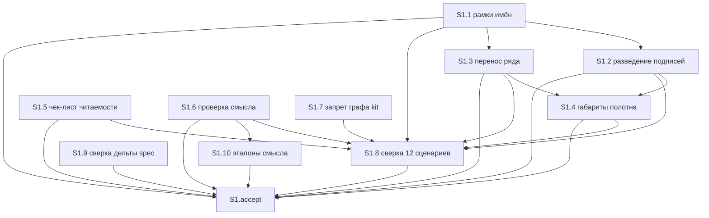

# Quality Control — scenario-map-explain-and-overlap

**Дата:** 2026-08-30  
**Режим:** slice (`# Срез S1` в `tasks.md`)  
**Прогон:** повторная независимая оценка **текущего** текста после дописки постановки (не копия `reports/quality-control-2026-08-30.md`)  
**Артефакты:** `tasks.md`, `design.md`, `proposal.md`, `specs/scenario-map-canvas/spec.md`  
**Критерии:** `.cursor/rules/vertical-slices.mdc` (1–6, 8, 8b, 9–11), `.cursor/rules/task-readability.mdc`  
**Контекст прогона:** kit, один срез; в рабочих задачах — эталоны смысла (`S1.10`); в обязательном осмотре — ранг длиннее пяти в виде «Связи» как часть того же взгляда. Исполнимость живой панели сейчас — вне scope.

---

## Verdict

`OK`

Один пользовательский срез. Обязательная приёмка — один наблюдаемый осмотр панели (не два отдельных user-journey). Исход достижим задачами этого среза. Все 18 сценариев спецификации покрыты (обязательный осмотр / опциональный осмотр / сверка по тексту). Контракт исполнителя рабочих задач не нарушен. CRITICAL, WARNING и SUGGESTION нет.

---

## Slice Summary

| Slice | Scenario | Tasks | Acceptance | Dependencies | Gate |
|---|---|---|---|---|---|
| S1: Схема читается и объясняет | Разработчик открывает живую карту штатной кнопкой | 10 рабочих (`S1.1`–`S1.10`) + `S1.accept` | `S1.accept` (4 именованных сценария в обязательном буллете + 2 именованных optional / 18 в «Связь со spec»; остальные 12 — сверка по тексту) | нет | `<!-- slice-gate -->` есть |

Метаданные среза полные: сценарий, обязательный user-journey, способ приёмки, связь со spec, зависимости.

`form_mode: n/a` (kit, proposal). Ручного конфигурирования в `S1.1`–`S1.10` нет. Маркеров `<!-- phase-gate -->` нет. Формат приёмки — один родительский чекбокс, не legacy `S<N>.T<M>`.

Текущий текст (отличие от постановки до дописки, фиксируется как факт оценки, не как дифф прошлого отчёта):

- в обязательном буллете и в метаданных `**Primary acceptance:**` явно входит карта с рангом длиннее пяти в виде «Связи», плюс фраза, что отрицательный «имена не сжаты, но подпись на коробке» — тот же пункт, не вторая обязательная проверка;
- есть `S1.10` (эталоны смысла в фикстурах).

---

## Scenario Coverage

В дельте `specs/scenario-map-canvas/spec.md` — 18 заголовков `#### Scenario:` (1 ADDED + 17 у MODIFIED «Causal map has layers or branches»).

| Scenario | Covered by | Status |
|---|---|---|
| Граф конвейера kit не отвечает за заказчика | `S1.accept` optional + `S1.7` | OK |
| Слои или ветвление видны на панели | `S1.8` (сверка по тексту скилла и шаблона) | OK |
| Семь линейных шагов не обязаны давать карту | `S1.8` | OK |
| Направление связей и легенда видны без клика | `S1.8` | OK |
| Главный вывод виден без клика по узлу | `S1.8` | OK |
| Вывод только в шапке не публикуется | `S1.8` | OK |
| Находка, меняющая действие, на полотне | `S1.8` | OK |
| Ловушка одной подписи видна на полотне | `S1.8` | OK |
| Плашка без доказательства не публикуется | `S1.8` | OK |
| Аннотации не добирают порог | `S1.8` | OK |
| Переключатель вида не прячет рёбра | `S1.8` | OK |
| Ответ читается при скрытой шапке | `S1.accept` Primary | OK |
| Текст полотна читается в ширине панели | `S1.accept` optional + `S1.4`, `S1.5` | OK |
| Текст не перекрыт на полотне | `S1.accept` Primary | OK |
| Несжатые имена не закрывают приёмку | `S1.accept` Primary (отрицательный исход того же осмотра) | OK |
| Перенос ряда не заезжает на чужие колонки | `S1.accept` Primary (тот же осмотр, вид «Связи») + `S1.3` | OK |
| Стартово выбран носитель исхода | `S1.8` | OK |
| Таблица со смысловыми колонками отвечает на вопрос | `S1.8` | OK |

Имена в чеклисте и в `S1.8` совпадают с `#### Scenario:` буквально.

**Критерий 1 (путь агента):** двенадцать унаследованных сценариев закрыты статической сверкой «по тексту» скилла и шаблона; в задаче явно: «Живой осмотр панели в эту задачу не входит». Это допустимый agent-path (static), не user-spike. Пользовательский runtime — только на границе среза (`S1.accept`).

Покрытие только задачей `S1.8` (без буллета в accept) по правилу 6 / критерию 5b — допустимо; `accept-bullets-missing-scenario` не ставится.

Три опциональных пункта accept без имени Scenario («три источника претензии», «длинная аннотация», «связь через ранг») — не сценарии spec; дополнительные осмотры из критериев proposal / таблицы покрытия в design. В покрытие spec не входят и чужих срезов не создают.

`S1.10` (эталоны смысла) не является отдельным `#### Scenario:`; это носитель Behavior Contract п. 5–6 для обязательного «объясни ход с полотна».

---

## Dependency Graph

Один срез. Межсрезовых рёбер нет. Циклов нет. Объявлено: `**Зависимости:** нет` — соответствует.

Внутри среза (как в текстах задач):

`S1.8` объявляет зависимости `S1.1`–`S1.7` (и шаблон, и скилл) — внутрисрезовый граф согласован с текстом задачи. `S1.10` зависит от `S1.6`. `S1.9` без исходящих рёбер на другие рабочие задачи — сверка уже существующей дельты spec, не блокер графа.

Forward-зависимости приёмки нет (соседнего среза нет).

---

## Criteria 1–6, 8, 8b, 9–11

### 1. Scenario Coverage

Все 18 сценариев покрыты. Унаследованные — agent static (`S1.8`). Новый запрет графа kit — optional accept + `S1.7`. Обязательный осмотр закрывает смысл при скрытой шапке, отсутствие наложений, отрицательный случай «имена не сжаты» и перенос ранга в виде «Связи». Бюджет ширины — optional + задачи шаблона/скилла.

### 2. Slice Independence

Единственный срез принимается без последующих. `design.md` § Design Rationale и Decision 5 сливают геометрию, перенос ряда и планку смысла в одну приёмку: отдельный «только шаблон» не даёт самостоятельного «схема объясняет».

### 3. Slice Completeness

Для kit-панели нужные слои есть: шаблон (`S1.1`–`S1.4`), скилл (`S1.5`–`S1.7`), сверка унаследованного и дельты (`S1.8`–`S1.9`), эталоны смысла (`S1.10`), осмотр на границе. Слоёв 1С (метаданные, форма, BSL) изменение не требует (`form_mode: n/a`, proposal: прикладная конфигурация вне scope).

Обязательный исход теперь включает перенос ранга в «Связи» — слой шаблона для этого есть (`S1.3`). Планка «ход с полотна» — скилл (`S1.6`) и эталоны (`S1.10`). Пропуск слоя, без которого нельзя увидеть обязательный исход, не обнаружен.

Исполнимость осмотра «прямо сейчас» на живой панели — вне scope (transient; `design.md` § Assumptions: живые файлы панели не в git). Наличие отдельного снимка «шесть узлов в одном ранге» как тестовых данных — тоже вне scope.

### 4. Slice Dependency Graph

Объявленные зависимости среза существуют (пустое «нет»). Несуществующих дедов нет. Циклов нет.

### 5. Slice Gate Integrity

Ровно один `S1.accept`, ровно один `<!-- slice-gate: … -->`. Дублей нет. Legacy `T<M>` нет.

### 5b. Acceptance Checklist Coverage

- `**Primary acceptance:**` в метаданных есть.
- Первый sub-bullet accept — `**Primary (обязательно):**`, текст согласован с метаданными (тот же осмотр, включая ранг в «Связи» и оговорку про отрицательный случай).
- Тело accept не пустое.
- Чужих срезов нет → `accept-bullet-foreign-scenario` не применим.
- Сценарии spec, не попавшие в чеклист, покрыты `S1.8`.

Алерты `primary-acceptance-missing`, `accept-checklist-empty`, `accept-bullets-missing-scenario` — не ставятся.

### 6. Rework Risk

Повторного сценария между срезами нет (срез один). Опора на непринятый предыдущий срез отсутствует. Риск переделки из-за ложной границы «foundation → consumer» низкий: постановка уже склеила технические пакеты в один пользовательский исход. Добавление `S1.10` внутрь того же среза перед accept — не новый срез и не вторая приёмка.

### 8. Slice Verticality

Обязательный пункт — чёрный ящик: открыть панель штатной кнопкой → скрыть шапку → своими словами объяснить ход механизма с полотна; подписи и карточки не на коробках; в «Связи» при ранге длиннее пяти коробки не на чужих колонках. Это действие читателя и проверяемый вид полотна, не вызов функции в отладчике и не ревью контракта API. `slice-not-vertical` не ставится.

### 8b. Self-Achievable Acceptance

Соседнего среза нет, дубля user-journey нет. Обязательный исход требует:

- правок шаблона: рамки, разведение, перенос ряда по направлению, габариты (`S1.1`–`S1.4`);
- планки смысла в скилле (`S1.6`) и эталонов (`S1.10`);
- запрета подписи на коробке в чек-листе скилла (`S1.5`).

Все эти слои в том же срезе. Запрет графа kit (`S1.7`) в обязательную приёмку не входит (optional). `slice-accept-not-self-achievable` не ставится.

Отсутствие живого файла панели в git — среда, не структурная недостижимость.

### 9. Foundation slice with gate

Второго среза с `Зависимости: S1` нет. Условия `slice-foundation-with-gate` не выполнены.

### 10. Acceptance Simplicity — отдельная семантическая проверка

**Вопрос прогона:** один mandatory journey или два? Постановка считает перенос ранга частью того же взгляда на панель.

**Механический счёт mandatory-буллетов в теле `S1.accept`:**

| Буллет | Пометка | Тип |
|---|---|---|
| `**Primary (обязательно):**` открыть панель … объяснить ход … не на коробке … ранг в «Связи» не на чужих колонках … отрицательный случай — тот же пункт | обязательно | 1 journey |
| Scenario «Граф конвейера kit не отвечает за заказчика» | (опционально) | не blocking |
| Scenario «Текст полотна читается в ширине панели» | (опционально) | не blocking |
| три источника претензии | (опционально) | не blocking, не Scenario spec |
| длинная аннотация | (опционально) | не blocking, не Scenario spec |
| связь через ранг | (опционально) | не blocking, не Scenario spec |

Ровно один sub-bullet без пометки «опционально». Второго `**Primary (обязательно):**` нет. Непомеченных mandatory-буллетов нет.

**Семантика «journey» (не число Scenario в скобках):**

Критерий 10 срабатывает, когда в accept больше одного **обязательного** black-box пути (отдельный Given → When → Then, который сам по себе блокирует `[x]`). Несколько Then на одном When — один путь с составным критерием успеха, не несколько приёмок.

Текущий обязательный буллет — одна цепочка When:

1. открыть панель штатной кнопкой;
2. экземпляр осмотра **включает** карту с рангом длиннее пяти в виде «Связи» (`в том числе`, не «затем отдельно открыть вторую панель как вторую приёмку»);
3. скрыть шапку;
4. Then: объяснить ход с полотна; подписи/карточки не на коробках; в «Связи» коробки не на чужих колонках; перечень влияний недостаточен; отрицательный «имена не сжаты, подпись на коробке» — **тот же пункт не пройден**.

Четыре имени Scenario в скобках у обязательного буллета («Ответ читается…», «Текст не перекрыт…», «Несжатые имена…», «Перенос ряда…») — наблюдаемые свойства **одного** взгляда, как в `design.md` Decision 5 и матрице приёмки («живая панель штатной кнопкой, в том числе карта с рангом из шести узлов»). Это не четыре mandatory journey и не два.

Контраст, который **был бы** перегрузом: второй обязательный буллет без «опционально» вида «открыть другую карту → проверить только перенос ряда» как отдельный blocking путь. Такого буллета нет. Перенос не вынесен во второй mandatory; он вшит в тот же осмотр формулировкой «в том числе».

Оговорка про отрицательный случай в том же буллете — явный отказ считать его второй обязательной проверкой; на перенос ранга распространяется та же модель «тот же взгляд».

**Вердикт критерия 10:** `acceptance-simplicity-overload` не ставится. Mandatory journey — **один**.

### 11. User Task Contract

Строки `S1.1`–`S1.10` (не accept, не Follow-up): агентские правки файлов и сверка по тексту.

Mechanical DENY (`тестовой ИБ`, `на ИБ вериф`, `на стенде`, `runtime-verify`, `спайк`, `в консоли`, `отладчик`, `эмулировать вызов`, `вызвать API` без пути к файлу и без «по коду») — совпадений нет.

Repair-цепочек (`При успешном verify S`, `после verify S`, `после стенда`) нет.

Семантика: нет перефразированного user-spike (ИБ, консоль, живой осмотр как обязанность в рабочей задаче). `S1.8` — ALLOW-agent («верифицировать по тексту») плюс явный отказ от живого осмотра в этой задаче. Живой осмотр — только метаданные приёмки и `S1.accept`. `user-task-contract-violation` не ставится.

---

## Task readability

Паттерн «глагол + файл + изменение + зачем + (опора)» для `S1.1`–`S1.10`:

| Задача | Глагол | Файл | Результат | Опора |
|---|---|---|---|---|
| S1.1 | Вписать | `fixtures/canvas-shell.md` | длинное имя/аннотация не на соседние коробки | BC п. 1, ADR-0009 |
| S1.2 | Развести | тот же шаблон | подписи и карточки не на коробках | BC п. 1–2 |
| S1.3 | Перенести | тот же шаблон | ранг длиннее пяти не на чужие колонки | BC п. 3 |
| S1.4 | Включить текст в габариты | тот же шаблон | край не обрезает подписи; без масштаба всего полотна | BC п. 4, ADR-0009 |
| S1.5 | Заменить | `SKILL.md` | подпись на коробке запрещена; снятая подпись = провал бюджета | BC п. 1 |
| S1.6 | Заменить | `SKILL.md` | с манифеста складывается «как работает», не каталог влияний | BC п. 5–6 |
| S1.7 | Добавить | `SKILL.md` | граф kit-конвейера не ответ заказчику | BC п. 7 |
| S1.8 | Верифицировать по тексту | скилл + шаблон | 12 унаследованных сценариев не ослабли | ADR-0009 |
| S1.9 | Сверить по тексту | дельта spec | контракт 1–8 держится, координаты в манифест не вносятся | ADR-0009 |
| S1.10 | Заменить | `map-bad-no-insight.md` (+ при необходимости `map-good-causal.md`) | эталон: плохой = каталог влияний; хороший = ход с полотна | BC п. 5–6 |

Заголовки не сводятся к голому идентификатору решения. Короче 8 слов нет. Рецепт «имя новой функции как контракт» в заголовках не закреплён (вводная к группе шаблона это запрещает).

`S1.accept`: в заголовке есть бизнес-результат («схема объясняет, как работает механизм, и читается»). Имена Scenario в ёлочках совпадают со spec. `task-opaque-title`, `task-too-short`, `task-opaque-acceptance` не ставятся.

---

## Alerts

Нет.

---

## Recommendations

### Automatic fix

Нет. Repairable-алерты (`primary-acceptance-missing`, `accept-bullets-missing-scenario`, `acceptance-simplicity-overload`, `slice-not-vertical`, `slice-foundation-with-gate`, `user-task-contract-violation`) не выставлены — блока remediation нет.

### Decision required

Нет. Объединять срезы не нужно: срез уже один, обязательный осмотр самодостаточен (`slice-accept-not-self-achievable` не выставлен). Переписывать Primary, чтобы вынести перенос ранга в optional, не требуется: это не второй mandatory journey.
