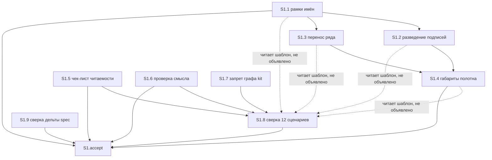

# Quality Control — scenario-map-explain-and-overlap

**Дата:** 2026-08-30  
**Режим:** slice (`# Срез S1` в `tasks.md`)  
**Прогон:** независимая оценка плана (не копия отчёта с `/opsx:new`)  
**Артефакты:** `tasks.md`, `design.md`, `proposal.md`, `specs/scenario-map-canvas/spec.md`  
**Критерии:** `.cursor/rules/vertical-slices.mdc` (1–6, 8, 8b, 9–11), `.cursor/rules/task-readability.mdc`

---

## Verdict

`OK`

Один пользовательский срез, обязательная приёмка наблюдаема и достижима задачами этого среза, все 18 сценариев спецификации покрыты (обязательный осмотр / опциональный осмотр / сверка по тексту), контракт исполнителя задач не нарушен. CRITICAL и WARNING нет.

---

## Slice Summary

| Slice | Scenario | Tasks | Acceptance | Dependencies | Gate |
|---|---|---|---|---|---|
| S1: Схема читается и объясняет | Разработчик открывает живую карту штатной кнопкой | 9 рабочих (`S1.1`–`S1.9`) + `S1.accept` | `S1.accept` (6 именованных сценариев в чеклисте / 18 в «Связь со spec»; остальные 12 — задача сверки по тексту) | нет | `<!-- slice-gate -->` есть |

Метаданные среза полные: сценарий, обязательный user-journey, способ приёмки, связь со spec, зависимости.

`form_mode: n/a` (kit). Ручного конфигурирования в задачах нет. Маркеров `<!-- phase-gate -->` нет. Формат приёмки — один родительский чекбокс, не legacy `S<N>.T<M>`.

---

## Scenario Coverage

В дельте `specs/scenario-map-canvas/spec.md` — 18 заголовков `#### Scenario:` (1 ADDED + 17 у MODIFIED «Causal map has layers or branches»).

| Scenario | Covered by | Status |
|---|---|---|
| Граф конвейера kit не отвечает за заказчика | `S1.accept` optional + `S1.7` | OK |
| Слои или ветвление видны на панели | `S1.8` (сверка по тексту скилла и шаблона) | OK |
| Семь линейных шагов не обязаны давать карту | `S1.8` | OK |
| Направление связей и легенда видны без клика | `S1.8` | OK |
| Главный вывод виден без клика по узлу | `S1.8` | OK |
| Вывод только в шапке не публикуется | `S1.8` | OK |
| Находка, меняющая действие, на полотне | `S1.8` | OK |
| Ловушка одной подписи видна на полотне | `S1.8` | OK |
| Плашка без доказательства не публикуется | `S1.8` | OK |
| Аннотации не добирают порог | `S1.8` | OK |
| Переключатель вида не прячет рёбра | `S1.8` | OK |
| Ответ читается при скрытой шапке | `S1.accept` Primary | OK |
| Текст полотна читается в ширине панели | `S1.accept` optional + `S1.4`, `S1.5` | OK |
| Текст не перекрыт на полотне | `S1.accept` Primary | OK |
| Несжатые имена не закрывают приёмку | `S1.accept` Primary (отрицательный исход того же осмотра) | OK |
| Перенос ряда не заезжает на чужие колонки | `S1.accept` optional + `S1.3` | OK |
| Стартово выбран носитель исхода | `S1.8` | OK |
| Таблица со смысловыми колонками отвечает на вопрос | `S1.8` | OK |

Имена в чеклисте и в `S1.8` совпадают с `#### Scenario:` буквально.

**Критерий 1 (путь агента):** двенадцать унаследованных сценариев закрыты статической сверкой «по тексту» скилла и шаблона; в задаче явно сказано, что живой осмотр панели в неё не входит. Это допустимый agent-path (static), не user-spike. Пользовательский runtime — только на границе среза (`S1.accept`).

Покрытие только задачей `S1.8` (без буллета в accept) по правилу 6 / критерию 5b — допустимо; алерт `accept-bullets-missing-scenario` не ставится.

Три опциональных пункта accept без имени Scenario («три источника претензии», «длинная аннотация», «связь через ранг») — не сценарии spec; это дополнительные осмотры из критериев proposal. В покрытие spec не входят и чужих срезов не создают.

---

## Dependency Graph

Один срез. Межсрезовых рёбер нет. Циклов нет. Объявлено: `**Зависимости:** нет` — соответствует.

Внутри среза (как в текстах задач):

Пунктир — некритичное замечание: `S1.8` сверяет и шаблон полотна, но в «Зависимости» указаны только правки скилла. На оценку межсрезового графа (критерий 4) это не влияет: второго среза нет, apply всё равно закрывает рабочие задачи до передачи на приёмку. См. Recommendations.

Forward-зависимости приёмки нет.

---

## Criteria 1–6, 8, 8b, 9–11

### 1. Scenario Coverage

Все 18 сценариев покрыты. Унаследованные — agent static (`S1.8`). Новый запрет графа kit — optional accept + `S1.7`. Обязательный осмотр закрывает смысл при скрытой шапке, отсутствие наложений и отрицательный случай «имена не сжаты».

### 2. Slice Independence

Единственный срез принимается без последующих. `design.md` § Slices явно сливает геометрию и смысл в одну приёмку: отдельный «только шаблон» не даёт самостоятельного «схема объясняет».

### 3. Slice Completeness

Для kit-панели нужные слои есть: шаблон (`S1.1`–`S1.4`), скилл (`S1.5`–`S1.7`), сверка унаследованного и дельты (`S1.8`–`S1.9`), осмотр на границе. Слоёв 1С (метаданные, форма, BSL) изменение не требует (`form_mode: n/a`, proposal: прикладная конфигурация вне scope). Пропуск слоя, без которого нельзя увидеть обязательный исход, не обнаружен.

Исполнимость осмотра «прямо сейчас» на живой панели — вне scope (transient; `design.md` § Assumptions: живые файлы панели не в git).

### 4. Slice Dependency Graph

Объявленные зависимости среза существуют (пустое «нет»). Несуществующих дедов нет. Циклов нет.

### 5. Slice Gate Integrity

Ровно один `S1.accept`, ровно один `<!-- slice-gate: … -->`. Дублей нет. Legacy `T<M>` нет.

### 5b. Acceptance Checklist Coverage

- `**Primary acceptance:**` в метаданных есть.
- Первый sub-bullet accept — `**Primary (обязательно):**`, текст согласован с метаданными.
- Тело accept не пустое.
- Чужих срезов нет → `accept-bullet-foreign-scenario` не применим.
- Сценарии spec, не попавшие в чеклист, покрыты `S1.8`.

Алерты `primary-acceptance-missing`, `accept-checklist-empty`, `accept-bullets-missing-scenario` — не ставятся.

### 6. Rework Risk

Повторного сценария между срезами нет (срез один). Опора на непринятый предыдущий срез отсутствует. Риск переделки из-за ложной границы «foundation → consumer» низкий: постановка уже склеила технические пакеты в один пользовательский исход.

### 8. Slice Verticality

Обязательный пункт — черный ящик: открыть панель штатной кнопкой → скрыть шапку → своими словами объяснить ход механизма; подписи и карточки не на коробках. Это действие читателя и проверяемый вид полотна, не вызов функции в отладчике и не ревью контракта API. `slice-not-vertical` не ставится.

### 8b. Self-Achievable Acceptance

Соседнего среза нет, дубля user-journey нет. Обязательный исход требует правок шаблона (рамки, разведение) и планки смысла в скилле — оба слоя в `S1.1`–`S1.6`. Запрет графа kit (`S1.7`) в обязательную приёмку не входит. `slice-accept-not-self-achievable` не ставится.

Отсутствие живого файла панели в git — среда, не структурная недостижимость.

### 9. Foundation slice with gate

Второго среза с `Зависимости: S1` нет. Условия `slice-foundation-with-gate` не выполнены.

### 10. Acceptance Simplicity

В теле accept ровно один mandatory black-box journey. Отрицательный случай «имена не сжаты, но подпись на коробке» явно помечен как тот же пункт, не вторая обязательная проверка. Остальные буллеты — «(опционально)». `acceptance-simplicity-overload` не ставится.

### 11. User Task Contract

Строки `S1.1`–`S1.9` (не accept): агентские правки файлов и сверка по тексту. DENY-маркеров (тестовая ИБ, стенд, консоль, отладчик, runtime-verify, спайк, вызов API) нет. Цепочек «после verify / после стенда» нет. `S1.8` — ALLOW-agent («верифицировать по тексту») плюс явный отказ от живого осмотра в этой задаче. Живой осмотр — только `S1.accept`. `user-task-contract-violation` не ставится.

---

## Task readability

Паттерн «глагол + файл + изменение + зачем + (опора)» для `S1.1`–`S1.9`:

| Задача | Глагол | Файл | Результат | Опора |
|---|---|---|---|---|
| S1.1 | Вписать | `fixtures/canvas-shell.md` | длинное имя/аннотация не на соседние коробки | BC п. 1, ADR-0009 |
| S1.2 | Развести | тот же шаблон | подписи и карточки не на коробках | BC п. 1–2 |
| S1.3 | Перенести | тот же шаблон | ранг длиннее пяти не на чужие колонки | BC п. 3 |
| S1.4 | Включить текст в габариты | тот же шаблон | край не обрезает подписи; без масштаба всего полотна | BC п. 4, ADR-0009 |
| S1.5 | Заменить | `SKILL.md` | подпись на коробке запрещена; снятая подпись = провал бюджета | BC п. 1 |
| S1.6 | Заменить | `SKILL.md` | с манифеста складывается «как работает», не каталог влияний | BC п. 5–6 |
| S1.7 | Добавить | `SKILL.md` | граф kit-конвейера не ответ заказчику | BC п. 7 |
| S1.8 | Верифицировать по тексту | скилл + шаблон | 12 унаследованных сценариев не ослабли | ADR-0009 |
| S1.9 | Сверить по тексту | дельта spec | контракт 1–8 держится, координаты в манифест не вносятся | ADR-0009 |

Заголовки не сводятся к голому идентификатору решения. Короче 8 слов нет. Рецепт «имя новой функции как контракт» в заголовках не закреплён (вводная к группе шаблона это запрещает).

`S1.accept`: в заголовке есть бизнес-результат («схема объясняет, как работает механизм, и читается»). Имена Scenario в ёлочках совпадают со spec. `task-opaque-title`, `task-too-short`, `task-opaque-acceptance` не ставятся.

---

## Alerts

Нет.

---

## Recommendations

### Automatic fix

Нет обязательных правок. По желанию (не блокирует): в `S1.8` дописать зависимости `S1.1`–`S1.4`, чтобы сверка шаблона не стартовала раньше геометрии при параллели по файлам. На целостность среза и приёмку не влияет.

### Decision required

Нет. Объединять срезы не нужно: срез уже один, обязательный осмотр самодостаточен.
