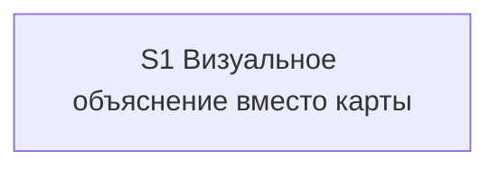

# Quality Control — Slice Coherence (Quick / Slice Generation Gate)

**Change:** `universal-visual-explanation`  
**Дата:** 2026-08-30  
**Режим:** design-stage (`## Slices` в `design.md`; `tasks.md` отсутствует)  
**Прогон:** оценка декомпозиции **до** `tasks.md`  
**Артефакты:** `proposal.md`, `design.md` (`## Slices`), `specs/**/spec.md`; опора нарезки — `reports/architecture-slice-decomposition-2026-08-30.md` (ссылка из design)  
**Критерии:** 1, 3, 5b (покрытие Scenario в design `## Slices`), 8, 8b, 9–11 из `.cursor/rules/vertical-slices.mdc`  
**Не применялось как CRITICAL:** критерий 5 (чекбокс `S<N>.accept` и маркер `<!-- slice-gate -->` в `tasks.md`) — файла задач нет  
**Линза:** kit-only (нет `src/`, `form_mode: n/a`); приёмка = панель рядом с чатом, не ИБ 1С  
**Out of scope:** исполнимость на ИБ; генерация `tasks.md`; критерии 2, 4, 6 — только как фон (один срез)

---

## Verdict

`OK`

Один пользовательский срез, один обязательный user-journey, все 22 заголовка `#### Scenario:` дельт с сценариями привязаны к S1, обязательная приёмка наблюдаема и достижима слоями этого среза. CRITICAL и WARNING нет. Механическая целостность `S1.accept` + `<!-- slice-gate -->` — после генерации `tasks.md`.

---

## Slice Summary

| Slice | Scenario | Tasks | Acceptance | Dependencies | Gate |
|---|---|---|---|---|---|
| S1: Визуальное объяснение вместо карты сценария | Разработчик просит показать, как устроен ответ — рядом с чатом открывается понятная панель; старый конвейер карты больше не вызывается | n/a (pre-tasks); план ≈ 8–14 `S1.<M>` + accept (Standard, 1 срез по умолчанию) | Один Primary (Given → When → Then): попросить «покажи, как это устроено» на обычный ответ → панель кнопкой среды, вопрос + вывод + структура, без пути в чате, без отказа «мало сущностей» / «укажите отчёт». Планируемый `S1.accept` (1/1 mandatory journey; 22 Scenario — Primary / optional / agent static) | нет | planned (после `tasks.md`) |

**Критерий 5 (не CRITICAL):** в `design.md` `## Slices` ровно **один** срез S1 и ровно **один** заполненный **Primary acceptance** (один Given-When-Then). Второго среза, второго Primary и `<!-- phase-gate -->` нет. Чекбокс `S1.accept` и маркер `<!-- slice-gate -->` появятся при генерации `tasks.md`.

Метаданные плана полные для Slice Generation Gate: пользовательский сценарий, Primary, способ приёмки, связь со spec (все Scenario двух дельт со сценариями), зависимости «нет», файлы/модули kit.

`form_mode: n/a`. Ручного конфигурирования 1С нет.

---

## Scenario Coverage

В дельтах **22** заголовка `#### Scenario:`:

| Spec | Заголовки `#### Scenario:` |
|---|---|
| `specs/visual-explanation/spec.md` (ADDED) | 21 |
| `specs/always-apply-context-budget/spec.md` (MODIFIED) | 1 (`Cue «покажи схему»`) |
| `specs/scenario-map-canvas/spec.md` (REMOVED) | 0 |
| `specs/delegation-safeguards/spec.md` (REMOVED) | 0 |

REMOVED без `#### Scenario:` в покрытие критерия 1 / 5b не входят; закрытие — задачи удаления в S1 (D6), не отдельный срез.

Матрица `design.md` `## Slices` назначает **все** Scenario дельт `visual-explanation` и `always-apply-context-budget` срезу S1. Поимённое Primary / optional / `S1.M` — в `reports/architecture-slice-decomposition-2026-08-30.md` (источник нарезки). Абзац design «Остальные — optional или сверка по тексту скилла» согласован с этой таблицей.

| Scenario | Covered by (план S1) | Status |
|---|---|---|
| Просьба на обычный ответ в чате | S1 Primary (When + Then: панель, вопрос/вывод/структура, нет «укажите отчёт») | OK |
| Просьба без порога по числу элементов | S1 optional | OK |
| Просьба в середине разбора | S1 optional | OK |
| Среда есть — не подменять панелью рисунок в чате | S1 Primary (тот же Then: кнопка среды, не рисунок в чате) | OK |
| Ветвление в ответе | S1 optional | OK |
| Простой факт без панели | S1 optional | OK |
| Три буллета без связей | S1 optional | OK |
| Проверка постановки без панели | S1.M (текст скилла: на `/opsx:verify` и `/review` панели нет) | OK |
| Отказ «без схемы» в сессии | S1 optional | OK |
| Вывод виден без каталога сущностей | S1 Primary (тот же Then: вопрос + вывод + структура) | OK |
| Вывод только в шапке не публикуется | S1.M (контракт скилла) | OK |
| Догадка не выдаётся за факт | S1 optional / S1.M (`confidence`) | OK |
| Правило о условиях — таблица или сравнение | S1 optional | OK |
| Неизвестный жанр не даёт отказ | S1.M (ближайшая форма из стартового набора) | OK |
| Сложная схема упрощается | S1 optional | OK |
| Нет среды панели | S1.M (полный текст в чате, без «текстового резерва карты») | OK |
| Первая схема в проекте | S1 Primary (тот же Then: кнопка среды, путь не в чат) | OK |
| Выбор не открывает файл сам | S1 optional | OK |
| Голая «покажи схему» | S1 optional | OK |
| Схема компоновки | S1 optional | OK |
| Просьба внутри исследования | S1 optional | OK |
| Cue «покажи схему» | S1.M (указатель диспетчера, без тела протокола) | OK |

**22/22** названы и привязаны. Покрытие только `S1.M` (static) без буллета accept — допустимо (правило 6 / критерий 5b). Имена совпадают с `#### Scenario:` буквально.

**Критерий 1 (путь агента):** implementation-only и охранные сценарии (указатель диспетчера, запрет панели на verify/review, контракт «не публиковать каталог + вывод только в шапке», неизвестный жанр, нет среды) закрыты сверкой по файлам kit / тексту скилла. User IB/runtime spike не запланирован. Живой осмотр панели — на границе среза (Primary / optional accept), не как user-задача посередине.

Четыре Scenario, помеченные «S1 Primary», — **не** четыре обязательных journey: это утверждения одного Then (кнопка среды, вопрос/вывод/структура, путь не в чат, нет отказа старой карты). См. критерий 10.

---

## Dependency Graph

Один срез. Межсрезовых рёбер нет. Циклов нет. Объявлено: S1 → нет.

Forward-зависимости приёмки нет: следующего среза нет, дубля Primary нет.

Отклонённые нарезки архитектора (удаление комбайна как S2; скилл затем указатели; просьба vs автопанель; «схема компоновки» как отдельный продукт) правильно отвергнуты: каждый кандидат либо foundation-с-gate, либо не самостоятельный outcome.

---

## Criteria (requested)

### 1. Scenario Coverage

Все 22 `#### Scenario:` покрыты одним из: Primary, optional accept, agent static `S1.M`. Отдельный срез с accept ни для одного Scenario не требуется: самостоятельный пользовательский исход один. Пропусков нет. Алерт «Scenario "X" не покрыт» не ставится.

### 3. Slice Completeness

Kit-слои, без которых Primary недостижим:

| Слой для Primary | В design `## Slices` / Migration | Status |
|---|---|---|
| Новый скилл + шаблон панели | да (файлы/модули; Migration п. 1) | OK |
| Указатель «покажи схему» → новый скилл | да (указатели сессий; Migration п. 2) | OK |
| Снятие старого скилла, агента-сборщика, шаблона промпта | да (иначе Then «это не граф старой карты» и отсутствие отказа комбайна недостижимы) | OK |
| ADR-0010 / статус 0008–0009 | да (несущая замена, не отдельный UX) | OK |

Слоёв 1С (метаданные, форма, BSL) изменение не требует. Пометка в `debug.md` соседней ЗНИ — служебный слой D6 в том же срезе, не отдельная приёмка. Пропуска слоя, без которого нельзя увидеть обязательный исход, нет. `slice` не foundation-only.

Исполнимость осмотра «прямо сейчас» (живой `.canvas.tsx` не в git) — transient, вне scope QC.

### 5b. Acceptance Checklist Coverage (design `## Slices`)

- **Primary acceptance** в матрице среза есть (Given-When-Then). `primary-acceptance-missing` не ставится.
- Планируемый чеклист: один mandatory Primary; остальные — optional или задачи агента. `accept-checklist-empty` не ставится (тела `S1.accept` в `tasks.md` ещё нет; план не пустой).
- Каждый Scenario spec покрыт (таблица выше). `accept-bullets-missing-scenario` не ставится.
- Чужого среза нет → `accept-bullet-foreign-scenario` не применим.
- Чеклист `S<N>.accept` в `tasks.md` отсутствует — критерий 5 (ровно один чекбокс + маркер) **не** CRITICAL на этом прогоне.

**Проверка «ровно один срез / один Primary»:** выполняется. Четыре имени Scenario в строке «Primary:» design — свёртка в один journey, не четыре mandatory буллета.

### 8. Slice Verticality

Обязательный пункт — чёрный ящик: в чате есть ответ → попросить «покажи, как это устроено» → рядом кнопка среды, на панели видны вопрос, вывод и структура; в чате нет пути к файлу; отказа «мало сущностей» / «укажите отчёт» нет. Это действие читателя и проверяемый вид панели, не вызов функции в отладчике и не ревью контракта API. Сверка «старого скилла нет» — agent static, не mandatory Primary. `slice-not-vertical` не ставится.

### 8b. Self-Achievable Acceptance

Соседнего среза нет. Дубля user-journey нет. Primary достижим силами планируемых задач S1 (скилл, шаблон, указатели, удаление комбайна). Слой, нужный для Then (панель + новый протокол просьбы), не отложен в S2. `slice-accept-not-self-achievable` не ставится.

Отсутствие живого файла панели в git — среда, не структурная недостижимость.

### 9. Foundation slice with gate

Второго среза с `Зависимости: S1` нет. Условия `slice-foundation-with-gate` не выполнены (нет пары foundation programmatic-only + consumer UX). Удаление комбайна и новый скилл в одном срезе — правильное лечение антипаттерна, не два gate.

### 10. Acceptance Simplicity

В плане accept ровно один mandatory black-box journey (одна ячейка Primary / один буллет «Primary (обязательно)» в чеклисте design). Составной Then (кнопка, вопрос/вывод/структура, без пути, без отказа комбайна) — тот же осмотр, не вторая обязательная проверка. `acceptance-simplicity-overload` не ставится.

Риск при генерации `tasks.md`: не выпускать четыре sub-bullet `**Primary (обязательно):**` по четырём Scenario, свёрнутым в Then.

### 11. User Task Contract

Задач `S<N>.<M>` нет. Pre-check: none. `design.md` § Assumptions: приёмка — открыть панель в чате, без стенда 1С. DENY-маркеров в плане среза нет. Живой осмотр запланирован на границе (`S1.accept`), сверка kit — агенту. `user-task-contract-violation` не ставится.

---

## Task readability

`tasks.md` нет — критерий 7 не применяется. При генерации: паттерн «глагол + файл/процедура + результат + (опора D1–D7)»; accept — один родительский чекбокс, первый sub-bullet `**Primary (обязательно):**` = текст Primary metadata; имена Scenario в ёлочках буквально со spec; static-покрытие — «верифицировать по тексту / по файлам kit», без user-spike на ИБ.

---

## Alerts

Нет.

---

## Recommendations

### Automatic fix

Нет обязательных правок постановки до `tasks.md`.

При генерации `tasks.md` (не auto-repair этого прогона):

- Один `# Срез S1`, один `- [ ] S1.accept`, один `<!-- slice-gate -->`.
- Один sub-bullet `**Primary (обязательно):**` с Given-When-Then из матрицы; не четыре mandatory journey.
- Поимённо перенести optional и `S1.M` из `reports/architecture-slice-decomposition-2026-08-30.md` (не полагаться только на абзац «остальные» в design).
- Снятие старого скилла / сборщика — agent `S1.<M>` (static), не второй Primary и не user-spike.
- Живой осмотр панели только в `S1.accept`; в рабочих задачах — правки файлов kit и сверка по тексту.

### Decision required

Нет. Объединять срезы не нужно: срез уже один, обязательный осмотр самодостаточен. Дробить S1 (удаление комбайна / указатели / автопанель) нельзя — получится `slice-foundation-with-gate` или недостижимый Primary.
