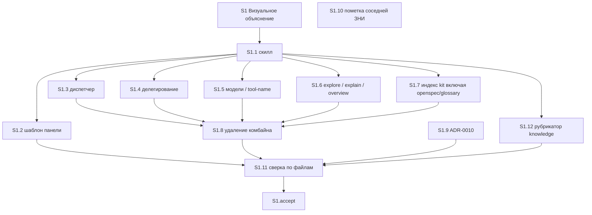

# Quality Control — Slice Coherence

**Change:** `universal-visual-explanation`  
**Дата:** 2026-08-31  
**Прогон:** `quality-control-2026-08-31-2` (после silent repair-from-verify: в список миграции добавлены словарные файлы kit; порог читаемости явно «не иерархия». Не перезаписывает `quality-control-2026-08-31.md` / `quality-control-2026-08-30.md` / `quality-control-2026-08-30-2.md`)  
**Режим:** slice mode (`# Срез S1` в `tasks.md`)  
**Артефакты:** `proposal.md`, `design.md`, `tasks.md`, `specs/**/spec.md`  
**Критерии:** 1–6, 8, 8b, 9–11 из `.cursor/rules/vertical-slices.mdc`; читаемость задач — `.cursor/rules/task-readability.mdc`  
**Линза:** kit-only (`form_mode: n/a`); apply mechanical (markdown/TSX); приёмка — панель рядом с чатом, не ИБ 1С  
**Out of scope:** исполнимость осмотра панели в Cursor прямо сейчас; тестовые данные / эталон ИБ (transient)

Pre-check оркестратора: Manual config checklist — none; User Task Contract pre-check evidence — none; DENY-маркеров в строках `S1.1`–`S1.12` нет (grep: `тестовой ИБ`, `на стенде`, `runtime-verify`, `спайк`, `в консоли`, `отладчик`, `эмулировать вызов`, `вызвать API`, `При успешном verify S`, `после verify S`, `после стенда`). Чекбоксы на месте; `<!-- slice-gate -->` закрыт; префиксы `S1.` есть; `<!-- phase-gate -->` нет. QC подтверждает.

Дельта к `quality-control-2026-08-31` (тот прогон: OK, 24/24): новых срезов нет. Добавлена задача `S1.12` (поддомен `kit` в `openspec/knowledge/_taxonomy.yaml`: `scenario-map` → `visual-explanation`). `S1.7` включает `openspec/glossary.md`. `S1.11` сверяет оба глоссария, рубрикатор и порог читаемости «таблица или карточка, не поток и не иерархия». `S1.11` зависит от `S1.12`. Spec и чеклист `S1.accept` не менялись.

Состояние репозитория (контекст оркестратора, не критерий QC): поддомен `scenario-map` в `_taxonomy.yaml` ещё на месте; статьи «Карта сценария» / «Текстовый резерв» в `openspec/glossary.md` ещё на месте. Это до apply, не дыра постановки.

---

## Verdict

`OK`

Один срез S1, один mandatory Primary (black-box), 24/24 заголовка `#### Scenario:` покрыты Primary / optional accept / задачами агента. Межсрезовых зависимостей нет. Gate цел. Structural spike и foundation-с-gate отсутствуют. CRITICAL и WARNING нет. Правка словаря — inside-slice, без новой границы приёмки.

---

## Slice Summary

| Slice | Scenario | Tasks | Acceptance | Dependencies | Gate |
|---|---|---|---|---|---|
| S1: Визуальное объяснение вместо карты сценария | Разработчик просит показать, как устроен ответ — рядом с чатом открывается понятная панель; старый конвейер карты больше не вызывается | 12 `S1.1`–`S1.11` + `S1.12` + `S1.accept` (Standard, 1 срез по умолчанию; ID `S1.12` вставлен в группу указателей после `S1.7`, без перенумерации `S1.8`–`S1.11`) | `S1.accept` (17/24 имени в чеклисте: 1 Primary + 16 optional; 24/24 с `S1.<M>`) | нет | да (`<!-- slice-gate -->`) |

Метаданные среза полные: `**Сценарий:**`, `**Primary acceptance:**` (Given → When → Then), `**Приёмка:**`, `**Связь со spec:**` (все 24 Scenario двух дельт со сценариями), `**Зависимости:** нет`, `**Режим apply:** mechanical`.

`form_mode: n/a`. Ручного конфигурирования 1С нет. `<!-- phase-gate -->` нет. Legacy `S1.T<M>` нет.

Согласование с `design.md` `## Slices`: имя среза, Primary, состав файлов/модулей и «все Scenario дельт `visual-explanation` и `always-apply-context-budget`» совпадают с `tasks.md`. `## Migration Plan` шаг 2 называет `openspec/glossary.md` и `_taxonomy.yaml` — теперь это есть в `S1.7` / `S1.12` / сверке `S1.11`. Число заголовков в `tasks.md` (24) совпадает со spec.

Порог Standard 6–15 задач: 12 рабочих + accept. Второй срез не требуется и не предлагается.

---

## Scenario Coverage

В дельтах **24** заголовка `#### Scenario:`:

| Spec | Заголовки `#### Scenario:` |
|---|---|
| `specs/visual-explanation/spec.md` (ADDED) | 23 |
| `specs/always-apply-context-budget/spec.md` (MODIFIED) | 1 (`Cue «покажи схему»`) |
| `specs/scenario-map-canvas/spec.md` (REMOVED) | 0 |
| `specs/delegation-safeguards/spec.md` (REMOVED) | 0 |

REMOVED без `#### Scenario:` в покрытие критерия 1 / 5b не входят; закрытие — задачи снятия комбайна, роли сборщика и словарных хвостов (`S1.4`, `S1.5`, `S1.7`, `S1.8`, `S1.11`, `S1.12`), не отдельный срез.

| Scenario | Covered by | Status |
|---|---|---|
| Просьба на обычный ответ в чате | S1 Primary (When + Then: панель, вопрос/вывод/структура, нет «укажите отчёт») | OK |
| Просьба без порога по числу элементов | S1.accept optional | OK |
| Просьба в середине разбора | S1.accept optional | OK |
| Среда есть — не подменять панелью рисунок в чате | S1 Primary (тот же Then: кнопка среды, не рисунок в чате) | OK |
| Ветвление в ответе | S1.accept optional | OK |
| Простой факт без панели | S1.accept optional | OK |
| Три буллета без связей | S1.accept optional | OK |
| Проверка постановки без автопанели | S1.accept optional + S1.1, S1.11 (static по тексту скилла) | OK |
| Просьба на проверке постановки | S1.accept optional + S1.1, S1.11 (static) | OK |
| Отказ «без схемы» в сессии | S1.accept optional | OK |
| Вывод виден без каталога сущностей | S1 Primary (Then: вопрос + вывод + структура) | OK |
| Вывод только в шапке не публикуется | S1.1, S1.11 (static) | OK |
| Догадка не выдаётся за факт | S1.accept optional + S1.2 (`confidence`) | OK |
| Правило о условиях — таблица или сравнение | S1.accept optional | OK |
| Неизвестный жанр не даёт отказ | S1.1, S1.11 (static) | OK |
| Сложная схема упрощается | S1.accept optional + S1.11 (static: порог «не поток и не иерархия») | OK |
| Нет среды панели | S1.1, S1.6, S1.11 (static: полный текст в чате, без «текстового резерва карты») | OK |
| Первая схема в проекте | S1 Primary (Then: кнопка среды, путь не в чат) | OK |
| Выбор не открывает файл сам | S1.accept optional | OK |
| Голая «покажи схему» | S1.accept optional | OK |
| Схема компоновки | S1.accept optional | OK |
| Оба чтения «покажи схему» | S1.accept optional + S1.1, S1.11 (static) | OK |
| Просьба внутри исследования | S1.accept optional + S1.6 | OK |
| Cue «покажи схему» | S1.3, S1.11 (static указатель диспетчера) | OK |

**24/24.** Имена в ёлочках `S1.accept` и в телах `S1.<M>` совпадают с `#### Scenario:` буквально. Покрытие только `S1.<M>` без буллета accept — допустимо (правило среза 6 / критерий 5b). `S1.12` Scenario не добавляет и не отнимает: это миграция имени снятого продукта в рубрикаторе (D6).

Четыре Scenario, свёрнутые в Primary Then («Просьба на обычный ответ в чате», «Среда есть — не подменять панелью рисунок в чате», «Вывод виден без каталога сущностей», «Первая схема в проекте»), — **не** четыре mandatory journey: один осмотр (кнопка среды, вопрос/вывод/структура, путь не в чат, нет отказа старой карты). См. критерий 10.

**Критерий 1 (путь агента):** implementation-only / охранные сценарии закрыты сверкой по файлам kit и текстом скилла (`S1.1`, `S1.3`, `S1.6`, `S1.11`). User IB/runtime spike в `S1.<M>` нет. Живой осмотр панели — только на границе среза (`S1.accept`).

---

## Dependency Graph

Один срез. Межсрезовых рёбер нет. Циклов нет. Объявлено: `**Зависимости:** нет`. Объявленные деды существуют (пустое множество). Forward-зависимости приёмки нет: следующего среза нет, дубля Primary нет.

Внутри среза (из полей «Зависимости:» в телах задач):

`S1.9` и `S1.10` не зависят от скилла: параллельны указателям. `S1.11` не ждёт `S1.10` (пометка в чужом `debug.md` не нужна для сверки рабочих файлов kit) — это не дыра приёмки.

`S1.8` ждёт `S1.3`–`S1.7`, **не** `S1.12`: рубрикатор не держит путь к удаляемым файлам комбайна; промежуточное имя поддомена до сверки не ломает Primary. `S1.11` ждёт `S1.12`, поэтому подпись `visual-explanation` в `_taxonomy.yaml` проверяется до accept. В файле `S1.12` стоит перед `S1.8` (порядок групп 2→3). Незаявленных рёбер, ломающих порядок Primary, нет.

---

## Criteria

### 1. Scenario Coverage

Все 24 `#### Scenario:` покрыты одним из: Primary, optional accept, agent `S1.<M>` (static / реализация протокола). Отдельный срез с accept ни для одного Scenario не требуется: самостоятельный пользовательский исход один. Пропусков нет. Алерт «Scenario "X" не покрыт» не ставится. Словарные файлы не порождают новый Scenario и не требуют нового среза.

### 2. Slice Independence

S1 принимаем без следующих срезов: следующих нет. Циклов нет. Forward acceptance dependency нет. Критерий 8b не дублирует нарушение независимости.

### 3. Slice Completeness

Kit-слои, без которых Primary недостижим:

| Слой для Primary | Задача | Status |
|---|---|---|
| Новый скилл (протокол просьбы, автопанель, запреты verify/review, двусмысленная «покажи схему») | S1.1 | OK |
| Шаблон панели (модель D3, форма по содержанию) | S1.2 | OK |
| Указатель «покажи схему» → новый скилл | S1.3 | OK |
| Снятие сборщика из делегирования / моделей | S1.4, S1.5 | OK |
| Слоты исследования / разбора / описания | S1.6 | OK |
| Индекс kit без старого продукта (включая `openspec/glossary.md`) | S1.7 | OK |
| Рубрикатор knowledge: поддомен `kit` | S1.12 | OK (D6; не отдельный UX) |
| Удаление скилла карты, агента, шаблона промпта | S1.8 | OK |
| ADR-0010 / статус 0008–0009 | S1.9 | OK (несущая замена, не отдельный UX) |
| Пометка соседней ЗНИ (D6) | S1.10 | OK (служебный слой того же среза) |
| Static-сверка файлов kit (глоссарии, рубрикатор, порог «не иерархия») | S1.11 | OK |

Слоёв 1С (метаданные, форма, BSL) изменение не требует. Пропуска слоя, без которого нельзя получить обязательный Then, нет. Срез не foundation-only: скилл, шаблон, указатель, словарь и снятие комбайна входят в тот же контейнер, что и `S1.accept`.

Исполнимость «откроется ли панель Cursor прямо сейчас» — transient, вне scope.

### 4. Slice Dependency Graph

Метаданные: `нет`. Соседей нет. Внутрисрезовые зависимости ацикличны и согласованы с порядком групп 1→6. Несоответствия «объявлено / существует» нет. `S1.12` объявляет `Зависимости: S1.1` — дед существует.

### 5. Slice Gate Integrity

Ровно один `- [ ] S1.accept`. Ровно один маркер `<!-- slice-gate: по просьбе «покажи, как это устроено» открывается панель визуального объяснения текущего ответа; старой карты сценария в рабочих файлах kit нет -->`. Дубля accept нет. Legacy `S1.T<M>` нет. `legacy-acceptance-format` не ставится. `S1.12` не вводит второго gate.

### 5b. Acceptance Checklist Coverage

- `**Primary acceptance:**` в metadata есть. Первый sub-bullet `S1.accept` — `**Primary (обязательно):**` с тем же Given-When-Then. `primary-acceptance-missing` не ставится.
- Тело accept не пустое. `accept-checklist-empty` не ставится.
- Каждый Scenario spec покрыт (таблица выше). `accept-bullets-missing-scenario` не ставится (покрытие только в `S1.<M>` допустимо).
- Чужого среза нет → `accept-bullet-foreign-scenario` не применим.

`**Связь со spec:**` перечисляет те же 24 имени, что и spec. Четыре охранных Scenario (каталог+шапка, неизвестный жанр, нет среды, cue диспетчера) сознательно вынесены в agent static, не в optional accept — согласовано с картой non-scenario правила 6. Сценарии verify/review и двусмысленной «покажи схему» дублируются в optional accept **и** в `S1.1`/`S1.11` — это не foreign и не overload.

### 6. Rework Risk

Предыдущего непринятого среза нет. Сценарии не повторяются в другом срезе. Порядок S1.3–S1.7 → S1.8 снимает риск «удалили комбайн, указатели ещё зовут старый скилл». `S1.12` не создаёт второй исход и не требует повторной нарезки. WARNING/SUGGESTION по rework не ставится.

### 8. Slice Verticality

Обязательный пункт — чёрный ящик: в чате есть ответ → попросить «покажи, как это устроено» → рядом кнопка среды, на панели видны вопрос, вывод и структура; в чате нет пути к файлу; отказа «мало сущностей» / «укажите отчёт» нет. Это действие читателя и проверяемый вид панели, не вызов функции в отладчике и не ревью контракта API. Сверка «старого скилла нет» / рубрикатор / глоссарий — `S1.11` (agent static), не mandatory Primary. `slice-not-vertical` не ставится.

### 8b. Self-Achievable Acceptance

Соседнего среза нет. Дубля user-journey нет. Primary достижим силами задач этого среза: протокол просьбы (S1.1), шаблон (S1.2), указатель (S1.3), снятие комбайна (S1.8) — все внутри S1. Словарные правки (S1.7, S1.12) не откладывают Then. Слой, нужный для Then, не отложен в S2. `slice-accept-not-self-achievable` не ставится.

Отсутствие живого `.canvas.tsx` в git — среда (файл панели не коммитится, D1/ADR-0008), не структурная недостижимость.

### 9. Foundation slice with gate

Второго среза с `Зависимости: S1` нет. Условия `slice-foundation-with-gate` не выполнены (нет пары foundation programmatic-only + consumer UX). Удаление комбайна, новый скилл и словари в одном срезе — правильное лечение антипаттерна, не два gate. Выделять `S1.12` в отдельный срез нельзя.

### 10. Acceptance Simplicity

В теле `S1.accept` ровно один mandatory black-box journey (`**Primary (обязательно):**`). Остальные 16 sub-bullets помечены «(опционально)». Составной Then — тот же осмотр, не вторая обязательная проверка. Чеклист после repair не раздувался. `acceptance-simplicity-overload` не ставится.

### 11. User Task Contract

Строки `^- \[[ x]\] S1\.\d+` (включая `S1.12`): DENY-маркеров нет. Условных цепочек `При успешном verify S` / `после verify S` / `после стенда` нет.

Упоминания `/opsx:verify` и `/review` в `S1.1` / `S1.11` — текст протокола скилла (агент пишет правило), не обязанность пользователя гонять стенд. Optional-буллеты accept про те же команды — граница среза, пользователю допустимо.

`S1.11` — сверка по файлам kit (ALLOW-agent: static, не user-spike на ИБ). `S1.12` — правка YAML рубрикатора агентом. Живой осмотр панели — только `S1.accept` (граница среза, допустимо пользователю). Семантических перифраз runtime-spike в `S1.<M>` нет. `user-task-contract-violation` не ставится.

`design.md` § Assumptions: приёмка — открыть панель в чате, без стенда 1С. Согласовано с tasks.

---

## Task readability

Паттерн «глагол + файл + результат + (D1–D7 / Scenario)» выполнен для `S1.1`–`S1.12`. Голых «Реализовать D7» нет. Описания длиннее 8 слов.

`S1.12`: «Переименовать» + `openspec/knowledge/_taxonomy.yaml` + поддомен `kit` + зачем (рубрикатор не называет снятый продукт) + (D6). Объект и исход ясны.

`S1.7`: список файлов включает `openspec/glossary.md`; глагол «Заменить», результат — индекс kit не зовёт снятый продукт.

`S1.11`: сверка по файлам; добавлены оба глоссария, рубрикатор и порог «не иерархия» — это критерии static-pass, не рецепт раскладки как контракт приёмки.

`S1.accept`: заголовок с бизнес-результатом среза; первый sub-bullet — mandatory Primary = текст metadata; optional — `Scenario «<имя>»` буквально со spec.

`task-opaque-title`, `task-too-short`, `task-opaque-acceptance` не ставятся.

Замечание без алерта: `S1.1` — одна задача на весь протокол скилла (длинное тело). Для mechanical apply одного среза это допустимо: объект файла один (`.cursor/skills/visual-explanation/SKILL.md`). Дробить S1.1 на отдельный срез нельзя. ID `S1.12` не последователен (`S1.8`–`S1.11` уже заняты) — на исполняемость и читаемость заголовка не влияет; перенумерация не требуется.

---

## Alerts

Нет.

---

## Recommendations

### Automatic fix

Нет. Repairable-алерты (`primary-acceptance-missing`, `accept-bullets-missing-scenario`, `acceptance-simplicity-overload`, `slice-not-vertical`, `slice-foundation-with-gate`, `user-task-contract-violation`) не сработали.

### Decision required

Нет. Объединять срезы не нужно: срез уже один, Primary самодостаточен. Дробить S1 (удаление комбайна / указатели / словари / автопанель) нельзя — получится `slice-foundation-with-gate` или `slice-accept-not-self-achievable`. Новых срезов не изобретать.
