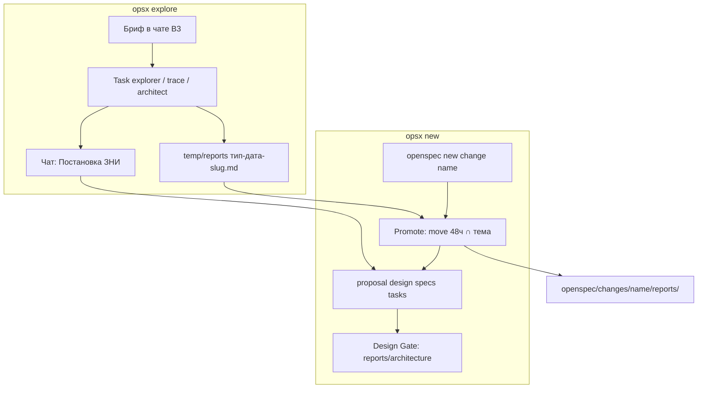
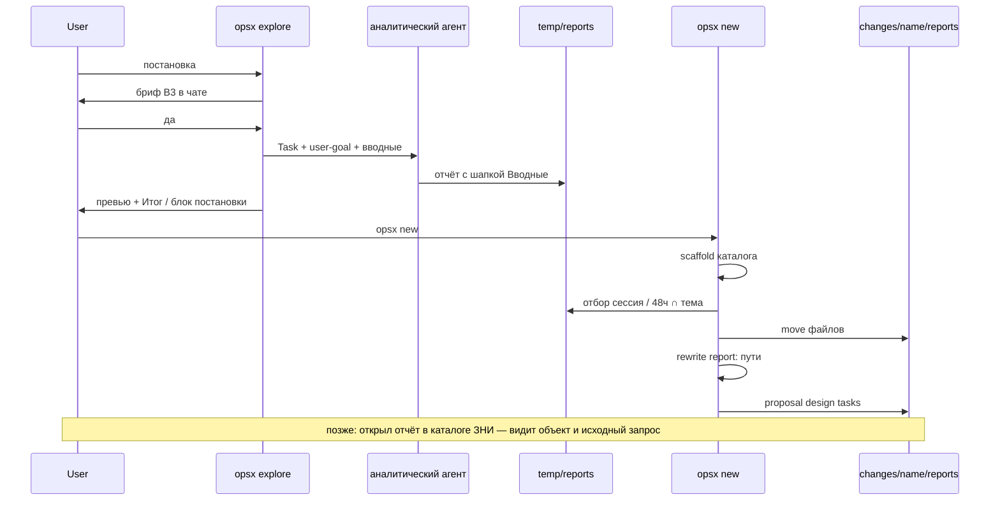

# Architecture: фактура исследования в каталоге ЗНИ и шапка вводных в отчёте

## Вводные

- **Исходный запрос:** какие файлы исследования должны оказаться в каталоге ЗНИ при её создании, и какие вводные должны быть в самом отчёте, чтобы при следующем разборе по файлу было видно: с каким объектом была проблема и что просили разобрать.
- **Область:** kit (скиллы исследования и создания ЗНИ), не конфигурация 1С. Кода `.bsl` нет.
- **Объекты / пути из постановки:** `.cursor/skills/openspec-new-change/`, `temp/reports/`, `temp/explore-handoff-*.md`, шаблоны вывода explorer / trace / architect.
- **Симптом:** после `/opsx:new` отчёты остаются в `temp/` (gitignore); в отчёте обследования нет объекта из постановки.
- **Вопрос:** какой минимальный перенос файлов и какой минимум полей шапки закрывают оба критерия готовности без параллельного контура.

## KB references

- Совпадений нет — Discovery: `openspec/knowledge/_index.yaml` отсутствует; таксономия есть. Факты KB не выдумывались.

## Task

Закрыть два разрыва kit, подтверждённые обследованием:

1. `/opsx:new` забирает **текст** блока `## Постановка ЗНИ`, но не переносит файлы `temp/reports/*` в `openspec/changes/<name>/reports/`.
2. В отчёте обследования / разбора трассы нет шапки «с чем пришли»: исходная формулировка, названный объект/область, симптом, вопрос исследования.

Решено, когда разработчик kit позже открывает каталог ЗНИ и по файлу отчёта видит объект и исходный запрос.

## Complexity

**Medium** — 3–5 точек правки контракта (правило сохранения, ingest в new/extend, шаблон вывода трёх аналитических агентов), без метаданных 1С и без нового каталога артефактов.

## Chosen Approach

**Approach**: Minimal changes — расширить уже существующий контур «сохранил полный отчёт → подхватил постановку при создании ЗНИ», не вводя второй pipeline.

**Rationale**:

- Маршрут temp vs change уже есть в `preserve-subagent-reports.mdc`; не описан только **перенос уже лежащих** файлов в момент появления каталога ЗНИ.
- Окно 48 ч и отбор по теме уже есть в `/opsx:new` для `explain-*` и `explore-handoff-*`. Тот же приём — для типов `exploration` / `trace-analysis` / `architecture`.
- Design Gate уже ищет `architecture-*.md` в `reports/` ЗНИ и поле `Architect / verify: report: <путь>`. Перенос закрывает дыру: отчёт explore лежит в temp, а гейт смотрит в каталог ЗНИ.
- Шапка вводных — agent-facing файл (ADR-0001). Чат-бриф и блок постановки не раздуваются.
- Пользователь явно: **переезд** (move), не обязательное дублирование в temp; handoff-файл не делать обязательным; бриф в `temp/briefs/` не писать; `openspec/sessions/` не возвращать.

## Existing Mechanisms

Что уже есть в kit, какой контракт, какой уровень Preference Hierarchy выбран. Параллельный pipeline не вводится (уровень 4 отвергнут).

| Механизм | Контракт сейчас | Уровень переиспользования | Почему не invent-new |
|----------|-----------------|---------------------------|----------------------|
| `preserve-subagent-reports.mdc` | Полный текст аналитического отчёта: нет ЗНИ → `temp/reports/`; есть ЗНИ → `openspec/changes/<id>/reports/`. Именование `<тип>-<дата>[-<slug>].md`. Типы: `architecture`, `exploration`, `trace-analysis`, `explain`, `resolved-contract`. | **Расширить (L2)** — добавить шаг promote (move) и шаблон `## Вводные` + страховку prepend-if-missing | Это уже SSOT «куда класть полный отчёт». Второй каталог / манифест сессии = Shadow Storage |
| `/opsx:new` шаг 1b / 1.25 | Текст постановки: чат → explain ≤48ч → handoff ≤48ч. `exploreContext` — primary для proposal/design/tasks. Design Gate: есть ли `reports/architecture-*.md` и `report: <путь>` | **Расширить (L2)** — после scaffold каталога: promote файлов, затем rewrite `report:` с `temp/reports/` на `reports/` | Ingest постановки уже есть; не хватает ingest **файлов**. Новый «индекс сессии» дублирует glob 48ч |
| Handoff Contract / `handoff-block.md` | Поля блока в чате. `Architect / verify`: `required` \| `not-required` \| `report: <путь>` | **Использовать как есть (L1)** + механический rewrite пути `report:` после move. **Новое обязательное поле в чат-блок не добавлять** | Поле «Источники» в чате нарушит ADR-0001 (thin chat) и Chat Surface Contract (не перечень файлов) |
| `/opsx:explore` | Пишет отчёты в temp; не создаёт `openspec/changes/`; handoff только по словесной просьбе; Continuity: glob temp 7 дней, при названной ЗНИ — ещё `changes/<name>/reports/` | **Расширить точечно (L2)** — в промпт `Task` передать четыре слота вводных; в Continuity — glob `openspec/changes/*/reports/{exploration,trace-analysis,architecture,explain}-*` за 7 дней (после move temp пуст). Не писать ЗНИ из explore | Explore остаётся исследованием. Перенос — ответственность new/extend, как просил пользователь |
| `/opsx:extend --from-report` | Читает `temp/reports/<тип>-*.md` или handoff; пишет в артефакты **существующей** ЗНИ | **Зеркало (L2)** — если source ещё в temp, move в `changes/<name>/reports/`, дальше работать с новым путём | Уже есть вход `--from-report`; не описан только переезд файла |
| OUTPUT GUIDANCE explorer | `## Для заказчика` **в конце**: вердикт шага vs `user-goal`. Каркас Full Exploration — с Entry Points, без шапки «с чем пришли» | **Расширить (L2)** — `## Вводные` **сразу после H1**; секцию «Для заказчика» не трогать | Это разные роли: вводные = intake, «Для заказчика» = исход шага |
| OUTPUT FORMAT trace | `## Для заказчика` п.1 «Что наблюдаешь у себя» = слот **Вопрос** / `user-goal`, не объекты из **Контекст** | **Расширить (L2)** — `## Вводные` после H1; четырёхстрочный шаблон bug **не менять** | Пользователь явно: в отчёте не оказалось объекта. Объект — в шапке, не вместо Symptom Lock |
| OUTPUT FORMAT architect | YAML front-matter + тело. `scope.files` — метаданные отчёта, не «что назвал пользователь» | **Расширить (L2)** — `## Вводные` после YAML и H1, до KB / Task | YAML не заменяет человекочитаемую шапку intake |
| Журнал explain (`explain-report.md`) | Уже есть `## Мета` (Сценарий, Вопрос, Охват). Путь temp vs change уже в таблице. Относительные href citation зависят от каталога | **Перенос (L1)** в набор promote; **не дублировать** `## Вводные`, если `## Мета` заполнена. При move — поправить `../../src/` → `../../../../src/` | Мета журнала уже intake; четвёртая копия слотов — дубль |
| Adaptive Brief / `brief-card.md` | Бриф после «да» в файл **не** пишется; `temp/briefs/*.md` запрещены | **Не трогать контракт (L1)** | Шапка в отчёте — не «сохранённый бриф», а 4 поля intake. Полный B3 в файл = запрещённый briefs-файл под другим именем |
| ADR-0001 (Load-Bearing) | Чат — продуктовые формулировки; полный handoff/таблицы — в reports | **Соблюсти (L1)** | Шапка только в файле отчёта; в чат-бриф служебные поля не тащить |
| `.gitignore` → `temp/` | Файлы в temp не живут в git | **Учесть (L1)** — durable-копия = каталог ЗНИ после move | Копирование «на всякий случай» в temp не даёт git-истории |

**Итог иерархии:** L2 на существующих точках save/ingest/output. L4 (новый sessions-каталог, обязательный handoff, индекс-манифест сессии, сохранённый бриф) — запрещён постановкой.

## Alternatives

### 1. Перенос фактуры при `/opsx:new`

| ID | Вариант | Как реализуется | Плюсы | Минусы | Вердикт |
|----|---------|-----------------|-------|--------|---------|
| T-A | **Move по цитатам сессии + fallback glob 48ч ∩ тема/slug** | После `openspec new change`: собрать пути из чата, `report:`, строки «Источники» handoff, `@path`; недостающее — glob `temp/reports/{exploration,trace-analysis,architecture,explain}-*` и опциональный `temp/explore-handoff-*` за 48ч, оставить только пересечение с темой change. `Move-Item` в `openspec/changes/<name>/reports/<basename>` | Совпадает с окном handoff/explain; не загребает чужие исследования; файлы попадают в git | Нужно правило slug; при нуле файлов — no-op | **Chosen** |
| T-B | Copy, оригинал оставить в temp | То же, `Copy-Item` | Continuity 7 дней по temp не ломается | Дубль; пользователь сказал «переезжал»; temp всё равно не в git | Отклонён |
| T-C | Обязательный `temp/explore-handoff-*.md` со списком источников, new копирует по списку | Explore всегда пишет handoff | Явный манифест | Нарушает Non-Goal «handoff только по просьбе»; второй SSOT рядом с чат-блоком | Отклонён |
| T-D | Вернуть `openspec/sessions/` | Каталог сессии с analysis.md | Исторический прецедент | Явный запрет постановки; удалённый контур | Отклонён |
| T-E | Переносить весь `temp/reports` за 48ч без фильтра темы | Один glob | Проще алгоритм | Параллельные исследования в одном temp (гипотеза обследования) — чужая фактура в чужой ЗНИ | Отклонён: miss предпочтительнее scoop |
| T-F | Только rewrite `Architect / verify: report:` без переноса exploration/trace | Design Gate находит architecture по пути в temp | Малый diff | Критерий 1 не закрыт: exploration/trace остаются вне ЗНИ и вне git | Отклонён |
| T-G | Манифест `temp/reports/_session.yaml` со списком файлов темы | Explore дописывает индекс | Точный отбор | Новый артефакт в gitignore; invent-new-pipeline | Отклонён |

**Если файлов нет** (feature-redirect, свободный текст B1, только чат-постановка): promote — **no-op**, не ошибка, new идёт как сейчас. Чат-постановка самодостаточна для proposal.

**Move vs copy:** только move. Коллизия имён в назначении: если dest существует и содержимое тождественно — удалить source; если разное — не затирать dest, source → `<basename-stem>-from-temp.md`. После успешного move исходного пути в temp нет.

**Отбор (детерминированный):**

1. **Сессия (primary):** пути `temp/reports/{exploration,trace-analysis,architecture,explain}-*.md` и `temp/explore-handoff-*.md`, упомянутые в текущем чате, в `exploreContext` (`report:`), в handoff «Источники», в `@`-ссылках пользователя — если файл ещё существует.
2. **Fallback 48ч ∩ тема:** glob тех же масок с датой в имени или mtime ≤ 48 часов (тот же порог, что шаг 1b.1–1b.2 new). Оставить файл, если slug в имени **или** H1 / `## Вводные` пересекается ≥1 значимым токеном с kebab-именем change / темой блока постановки (служебные токены `exploration`, `trace`, `analysis`, дата — не считаются).
3. **Не брать:** `resolved-contract-*`, `quality-control-*`, `handoff-acceptance-*`, `handoff-pause-*`, `code-map.md`, `session-notes`, чужой slug без цитаты сессии.
4. **Сомнение (два разных slug в окне, ни один не процитирован):** не переносить спорные; процитированные — переносить. Вопрос пользователю на этом шаге не задавать (Metadata Gate — единственный выбор хода).
5. **Момент в new:** сразу после появления каталога `openspec/changes/<name>/` (шаг 2), **до** записи proposal/design и **до** Design Gate — чтобы `reports/architecture-*.md` уже лежал в ЗНИ.
6. **Resume:** тот же promote идемпотентно (остатки в temp по теме).
7. **Rewrite путей:** в `exploreContext` и далее в proposal/design поле `Architect / verify: report: temp/reports/X` → `reports/X`. Внутри перенесённых md: ссылки на `temp/reports/<перенесённый>` → `reports/<basename>`. Для `explain-*`: href `../../src/` → `../../../../src/` (канон `explain-report.md`). Label citation `start:end:src/...` не менять.
8. **Чат T-CONFIRM:** не список файлов. Допустима одна фраза эффекта: «материалы разбора перенесены в задачу» — без путей. Детали — в `reports/`.

**Зеркало extend:** при `--from-report temp/reports/...` (или handoff в temp) — если файл ещё в temp, сначала move в `openspec/changes/<name>/reports/`, затем читать/ссылаться на новый путь. Не оставлять оригинал в temp.

**Continuity explore (сопутствующее, не отдельный контур):** шаг glob 7 дней дополнить `openspec/changes/*/reports/{exploration,trace-analysis,architecture,explain}-*` — иначе после move «продолжи вчерашний разбор» без имени ЗНИ не найдёт файлы. Фильтр по теме и подтверждение текстом — как сейчас.

### 2. Шапка вводных в отчёте

| ID | Вариант | Как реализуется | Плюсы | Минусы | Вердикт |
|----|---------|-----------------|-------|--------|---------|
| H-A | **Агент пишет `## Вводные` после H1; оркестратор prepend-if-missing при сохранении.** SSOT полей — одна секция в `preserve-subagent-reports.mdc` | Промпт explore уже передаёт `user-goal`; добавить три слота (исходный запрос, объекты/пути из Контекст, симптом). Три агента: ссылка на правило, не три копии таблицы | Работает и когда файл пишет субагент, и когда оркестратор. Одинаково для explorer/trace/architect | Две точки (агент + страховка) | **Chosen** — страховка обязательна: агент может забыть |
| H-B | Только оркестратор prepend при Write | Один файл правки | Субагент, который сам делает Write (этот режим architect), обойдёт страховку | Отклонён как единственный путь; остаётся как fallback внутри H-A |
| H-C | Дублировать весь бриф B3 в начало отчёта | Полная память сессии | Запрет `temp/briefs`; раздувание; ADR-0001 | Отклонён |
| H-D | Слить вводные с «Для заказчика» / «Что наблюдаешь» | Меньше секций | Ломает Symptom Lock bug-профиля; «Что наблюдаешь» = Вопрос, не объект из Контекст | Отклонён |
| H-E | Полагаться на YAML `scope.files` architect и на найденные модули explorer | Без новой секции | `scope.files` — что трогал агент, не что назвал пользователь; у explorer YAML нет | Отклонён: это и есть дыра «в отчёте не оказалось объекта» |

**Минимум полей (не весь бриф):**

```markdown
## Вводные

- **Исходный запрос:** <формулировка пользователя на входе, не пересказ находок>
- **Область:** <названный объект / форма / подсистема / контур kit; если не назвал — «не назван»>
- **Объекты / пути из постановки:** <список из слота Контекст или текста пользователя; пусто → «не указаны»>
- **Симптом:** <слот Симптом B3; для question — что беспокоит / о чём вопрос>
- **Вопрос:** <слот Вопрос / `user-goal`>
```

Правила заполнения:

- Писать **названное пользователем**, не выведенное из кода. Находки агента — в теле отчёта.
- Не копировать Маршрут, Варианты, Ожидание, «Решено, когда», KB, имена агентов.
- Объём: 1–2 предложения на поле; пути — маркированным списком только в «Объекты / пути».
- Место: сразу после заголовка отчёта (у architect — после YAML и H1), **до** Entry Points / Trace summary / Task. «Для заказчика» остаётся в конце.
- Explain: `## Мета` уже закрывает Вопрос/Сценарий; отдельную `## Вводные` не требовать, если Мета заполнена. При отсутствии объекта в Мета — одна строка «Объекты / пути из постановки» допустима в Мета, не вторая шапка.

**Кто пишет:** агент по OUTPUT GUIDANCE (primary). Оркестратор при сохранении по `preserve-subagent-reports.mdc`: если после H1 нет `## Вводные` (для exploration/trace/architecture) — вставить блок из слотов промпта `Task`. Не выдумывать объект: нет в постановке → «не назван».

### 3. Стык с постановкой ЗНИ

| ID | Вариант | Вердикт |
|----|---------|---------|
| P-A | **Файлы в `openspec/changes/<name>/reports/` — SSOT фактуры.** В чат-блок новое поле не добавлять. После move rewrite `report:` → `reports/<file>`. В `design.md` agent-facing ссылки `см. reports/<file>` как уже требует preserve §2 | **Chosen** |
| P-B | Обязательное поле **Отчёты исследования:** в `## Постановка ЗНИ` / Handoff Contract | Отклонён: раздувает чат, перечень файлов как handoff, конфликт с ADR-0001 |
| P-C | Дублировать список отчётов в proposal `## Why` как в архиве `kit-evolution-models-economy-profiles` (пути temp) | Не запрещать опциональную ссылку `reports/...` в Why; не делать обязательным и не оставлять `temp/reports/` после успешного promote |

### 4. Чёрный список / Non-Goals

- Не делать `temp/explore-handoff-*.md` обязательным.
- Не сохранять бриф в `temp/briefs/*.md` и не маскировать полный B3 под «шапку».
- Не возвращать `openspec/sessions/`.
- Не оставлять копию в temp после успешного move.
- Не переносить весь `temp/reports` и не забирать `resolved-contract` / apply-handoff / `code-map`.
- Не менять слоты чат-брифа B3 и не тащить шапку вводных в чат.
- Не переписывать архивную ЗНИ `kit-evolution-models-economy-profiles` (пути в Why остаются историческим свидетельством дыры).
- Explore по-прежнему не создаёт `openspec/changes/<name>/` целиком и не пишет BSL.

## Chosen (simplest viable)

Один контур из двух операций на существующих точках:

1. **Promote (move)** в `/opsx:new` (после scaffold) и зеркало в `/opsx:extend --from-report`: типы `exploration`, `trace-analysis`, `architecture`, `explain` + опциональный handoff; отбор сессия → 48ч∩тема; нет файлов → no-op.
2. **Шапка `## Вводные`** (4–5 полей) в exploration / trace / architecture: пишет агент, оркестратор дописывает если нет. Explain — существующая `## Мета`. Чат-блок постановки не расширять; только rewrite `report:`.

Это минимальный набор, который делает фактуру **находимой в git-каталоге ЗНИ** и **самоописанной без чата**.

## Simplicity Check

- **Viable alternatives:** T-A (chosen), T-B copy, T-C обязательный handoff, H-A (chosen), H-B только оркестратор, P-A (chosen), P-B поле в чат-блоке. T-D/T-G отвергнуты постановкой как invent-new.
- **Selected simplest viable design:** T-A + H-A + P-A. Нет нового каталога, нет нового типа файла, нет обязательного handoff. Добавляются: шаг promote в уже существующий ingest; секция в уже существующее правило сохранения; 8–12 строк OUTPUT GUIDANCE; четыре слота в уже обязательный промпт `Task`.
- **Why not simpler:**
  - Только chat-постановка (как сейчас) — критерий 1 не выполнен: temp не в git.
  - Только перенос без шапки — критерий 2 не выполнен: в файле нет объекта из постановки (подтверждено обследованием).
  - Только шапка без переноса — отчёт с вводными всё равно умрёт вместе с temp.
  - Copy проще для Continuity, но прямо запрещён формулировкой «переезжал» и плодит два источника правды.
- **Complexity budget:**
  - Files touched: ~12 путей kit (скиллы/правило/агенты/дока/1 test-case)
  - Hooks/intercepts: 1 новый шаг (promote) в new + зеркало в extend; 0 перехватов 1С
  - New procedures/functions: 0 (kit, не BSL)
  - Conditional branches / feature flags: 1 ветка no-op при пустом наборе; 1 правило коллизии имён; без feature-flag

Only-one-viable **не** утверждается: T-B и P-B жизнеспособны, но хуже по постановке и ADR-0001.

## Found Patterns

### Pattern 1: Полный отчёт субагента — отдельный файл, не суммаризация

- **Where:** `.cursor/rules/preserve-subagent-reports.mdc:18-21`
- **Usage:** нет активной ЗНИ → `temp/reports/`; есть → `openspec/changes/<id>/reports/`
- **Evidence:** exploration-2026-09-02 fact 2; текст правила
- **Confidence:** high
- **Applicability:** точка расширения — promote при появлении `<id>`

### Pattern 2: Ingest постановки с окном 48ч и фильтром темы

- **Where:** `.cursor/skills/openspec-new-change/SKILL.md` шаг 1b.1–1b.2, 1.25
- **Usage:** glob `explain-*` и `explore-handoff-*`, совпадение темы, иначе источник старше 48ч игнорируется
- **Evidence:** exploration fact 1, 7
- **Confidence:** high
- **Applicability:** тот же порог и тот же фильтр темы для promote отчётов Task

### Pattern 3: Design Gate смотрит отчёты в каталоге ЗНИ

- **Where:** new-change SKILL шаг 5.e.2–5.e.3
- **Usage:** `architecture-*.md` в `reports/` change; `report: <path>` из блока, если путь существует
- **Evidence:** Read SKILL; сейчас explore кладёт architecture в temp — гейт по п.2 может не увидеть файл, пока не сработает п.3 с абсолютным temp-путём
- **Confidence:** high
- **Applicability:** move до Design Gate закрывает п.2 без зависимости от живого temp

### Pattern 4: Thin chat / полный файл (ADR-0001)

- **Where:** `openspec/adrs/ADR-0001-chat-facing-vs-agent-facing.md`; archive `2026-08-01-chat-surface-clarity/design.md`
- **Usage:** таблицы и полный handoff — в reports; чат — эффект и постановка
- **Evidence:** ADR Protects-invariants; exploration «Связь с архивом»
- **Confidence:** high
- **Applicability:** шапка вводных — только файл; чат-блок не расширять списком отчётов

### Pattern 5: «Для заказчика» — исход шага, не intake

- **Where:** `onec-code-explorer.md` OUTPUT GUIDANCE ~417; `onec-trace-analyst.md` OUTPUT FORMAT ~320; `profiles/bug.md` шаблон 4 строк
- **Usage:** оркестратор берёт текст для Итог/Вердикт/Дальше; у trace п.1 = слот Вопрос
- **Evidence:** exploration facts 5–6
- **Confidence:** high
- **Applicability:** новую шапку ставить **сверху** и не сливать с этим шаблоном

### Pattern 6: Архивная ЗНИ ссылается на temp как на источник

- **Where:** `openspec/changes/archive/2026-08-18-kit-evolution-models-economy-profiles/proposal.md` § Why
- **Usage:** `temp/reports/exploration-2026-08-16-*.md` — пути вне каталога ЗНИ
- **Evidence:** exploration fact 8; Read proposal
- **Confidence:** high
- **Applicability:** иллюстрация дыры; контракт той ЗНИ не отменяем; новые ЗНИ должны ссылаться на `reports/` внутри change

### Pattern 7: Explain уже различает temp vs change и держит Мета

- **Where:** `.cursor/skills/openspec-explain/templates/explain-report.md` (путь, `## Мета`, таблица href)
- **Usage:** при привязке к ЗНИ журнал сразу пишется в change/reports; relative href зависит от глубины
- **Evidence:** Read шаблона
- **Confidence:** high
- **Applicability:** explain входит в promote, если журнал ещё в temp; шапку не дублировать; href починить при move

## Assumptions

- **A1:** Имя файла отчёта содержит slug, пересекающийся с kebab-именем change / темой постановки, либо путь процитирован в чате. **Confidence:** high для основного потока explore→new в том же чате. **Verification:** test-case `question-to-new-handoff` + прогон с двумя параллельными exploration в temp.
- **A2:** Промпт `Task` уже обязан содержать `user-goal`; оркестратор может добавить исходный запрос, симптом и Контекст без нового канала. **Confidence:** high (explore SKILL «Промпт Task обязан содержать»). **Verification:** grep промпта в скилле после правки.
- **A3:** Windows-оркестратор может сделать filesystem move (`Move-Item` / rename) в том же ходе, что scaffold. **Confidence:** high (уже делает Write в `openspec/changes/`). **Verification:** шаг promote в new на kit-only ЗНИ.

## Open Questions

Нет. Развилки закрыты постановкой (move, не обязательный handoff, не briefs, не sessions) и ADR-0001 (шапка не в чат).

## Clarifications

### Decision 1: Move, не copy

- **Question:** дублировать в temp или переезжать?
- **Answer:** переезд. Пользователь: «переезжал».
- **Impact:** Continuity glob обязан видеть `changes/*/reports/`; explain href — механическая правка при move.

### Decision 2: Handoff остаётся опциональным

- **Question:** сделать список файлов через обязательный handoff?
- **Answer:** нет. Прямой путь — promote из сессии + 48ч∩тема.
- **Impact:** `explore-handoff-*` если есть — входит в набор move, но не является условием new.

### Decision 3: Объект проблемы — в шапке отчёта, не в чат-брифе

- **Question:** куда фиксировать названный объект, которого не оказалось в отчёте?
- **Answer:** поле «Область» + «Объекты / пути из постановки» в `## Вводные`. В чат-бриф служебную шапку не тащить (ADR-0001).
- **Impact:** OUTPUT GUIDANCE + страховка оркестратора; «Для заказчика» не переписывать.

### Decision 4: Список отчётов не в блоке постановки

- **Question:** новое поле Handoff Contract?
- **Answer:** нет. SSOT — файлы в `reports/` ЗНИ; `report:` rewrite.
- **Impact:** handoff-contract.md — примечание про rewrite пути, без новой строки таблицы обязательных полей.

## Architecture

### Components



#### Component 1: Правило сохранения отчётов

- **Path:** `.cursor/rules/preserve-subagent-reports.mdc`
- **Responsibility:** куда писать полный отчёт; шаблон `## Вводные`; prepend-if-missing; алгоритм promote (чтобы new/extend ссылались на один SSOT, а не копировали процедуру в двух скиллах целиком — в скилле шаг «выполнить promote по правилу»).
- **Dependencies:** вызывается оркестратором explore/new/extend/explain
- **Evidence:** текущий файл, exploration fact 2
- **Interface:**
  - сохранение: temp vs change (как сейчас)
  - `## Вводные`: 5 полей
  - promote: вход `(changeName, exploreContext, chat-cited paths)` → список moved basenames

#### Component 2: Ingest при создании ЗНИ

- **Path:** `.cursor/skills/openspec-new-change/SKILL.md`
- **Responsibility:** после scaffold вызвать promote; rewrite `report:`; дальше существующий artifact loop
- **Dependencies:** preserve-правило; handoff-contract (без новых обязательных полей)
- **Evidence:** шаг 2 + 5.e Design Gate
- **Interface:** новый подшаг «2.5 Promote explore reports» (имя в скилле — русское: «Перенос отчётов исследования»)

#### Component 3: Зеркало extend

- **Path:** `.cursor/skills/openspec-extend-change/SKILL.md`
- **Responsibility:** `--from-report` из temp → move, затем использовать путь в change
- **Evidence:** текущий `--from-report` читает temp и не двигает файл

#### Component 4: Вывод аналитических агентов

- **Path:** `.cursor/agents/onec-code-explorer.md`, `onec-trace-analyst.md`, `onec-code-architect.md`
- **Responsibility:** `## Вводные` сразу после заголовка; ссылка на SSOT полей в preserve-правиле
- **Evidence:** OUTPUT GUIDANCE / OUTPUT FORMAT как в обследовании

#### Component 5: Промпт explore

- **Path:** `.cursor/skills/openspec-explore/SKILL.md` (блок «Промпт Task обязан содержать»)
- **Responsibility:** передать слоты intake; Continuity glob после move
- **Не делает:** создание каталога ЗНИ, обязательный handoff

### Data Flow



**Flow description:**

1. Исследование пишет самоописанный отчёт в temp (шапка) и постановку в чат.
2. Создание ЗНИ создаёт каталог, **переезжает** отчёты темы, подставляет относительные пути `reports/…` в артефакты.
3. Если исследования не было — шаг 2 пустой, постановка из чата достаточна.
4. Поздний разбор идёт по файлу в каталоге ЗНИ, без истории чата и без temp.

## Blast Radius

Обязательна в будущем `design.md` этой ЗНИ (precedent-regression / Cross-Archive Context). Здесь — содержание для переноса.

| Контракт | Архивный источник | Бизнес-эффект (разработчик kit / 1С) | Альтернативы | Обоснование |
|----------|-------------------|--------------------------------------|--------------|-------------|
| Thin chat vs полный файл: в чат не тащить Schema, таблицы, служебные поля; полный handoff — в reports | ADR-0001; `openspec/changes/archive/2026-08-01-chat-surface-clarity/` | Разработчик по-прежнему принимает решение по чату (постановка, «да», next step), не открывая файл, чтобы узнать задачу. Детали разбора — в файле | Добавить «Источники» в чат-блок постановки; сохранить полный бриф отдельным файлом | **extends, не revokes.** Шапка вводных и список файлов живут в reports. Чат-блок и B3 не получают служебных полей |
| Источники исследования могут оставаться путями `temp/reports/…` в Why архивной ЗНИ | `openspec/changes/archive/2026-08-18-kit-evolution-models-economy-profiles/proposal.md` § Why | У той архивной задачи файлы исследования по-прежнему не в её каталоге; git истории той ЗНИ не меняем | Переписать Why архива на несуществующие пути; копировать старые temp-файлы в архив задним числом | **adjacent, не тот же контракт.** Новые ЗНИ после этой работы ссылаются на `reports/` внутри change. Архив — иллюстрация дыры, не цель отмены |

Связь: оба прецедента **adjacent**. Отмены ADDED-контрактов нет. Секция Blast Radius в `design.md` будущей ЗНИ должна повторить эту таблицу.

## Behavior Contract

Наблюдаемое для разработчика kit (не имена процедур 1С):

1. После `/opsx:explore` с `Task` и последующего `/opsx:new` по этой теме файлы `exploration-*` / `trace-analysis-*` / `architecture-*` / `explain-*` этой темы лежат в `openspec/changes/<name>/reports/` с тем же basename. В `temp/reports/` этих файлов больше нет.
2. Если в ходе explore не было `Task` (только чат-постановка / redirect на new) — ЗНИ создаётся как сейчас, ошибки «нет отчётов» нет.
3. Открыв перенесённый (или ещё лежащий в temp до new) отчёт exploration / trace / architecture, в шапке видно: исходный запрос, названный объект/область или явное «не назван», симптом, вопрос исследования. Это не копия всего брифа.
4. Блок `## Постановка ЗНИ` в чате **не** обязан содержать список файлов. Поле `Architect / verify: report:` после new указывает на `reports/<файл>` внутри ЗНИ, если отчёт архитектора был и перенесён.
5. `temp/explore-handoff-*.md` создаётся только по словесной просьбе; если создан и попал в отбор — тоже переезжает в `reports/` ЗНИ.
6. Бриф не появляется как `temp/briefs/*.md`. Каталог `openspec/sessions/` не создаётся.
7. `/opsx:extend --from-report temp/reports/…` при живом файле в temp переносит его в `reports/` этой ЗНИ и дальше ссылается туда.
8. Финальное сообщение `/opsx:new` не печатает перечень перенесённых путей; достаточно эффекта «материалы разбора в задаче».

Инварианты:

- ADR-0001 не отменяется.
- Explore не создаёт change-каталог целиком.
- Чужие отчёты другого slug за те же 48ч в ЗНИ не попадают.

## Implementation Map

### Metadata Objects

**Create / Modify:** нет (kit-only).

### Modules (kit files)

**Modify:**

- `.cursor/rules/preserve-subagent-reports.mdc` — секции «Шапка вводных», «Promote в каталог ЗНИ», prepend-if-missing
- `.cursor/skills/openspec-new-change/SKILL.md` — шаг после scaffold; rewrite `report:`
- `.cursor/skills/openspec-new-change/templates/handoff-contract.md` — примечание: путь `report:` переписывается при promote; новых обязательных полей нет
- `.cursor/skills/openspec-extend-change/SKILL.md` — зеркало move для `--from-report` из temp
- `.cursor/skills/openspec-explore/SKILL.md` — слоты в промпт Task; Continuity glob change/reports
- `.cursor/skills/openspec-explore/templates/handoff-block.md` — в правилах сборки: не добавлять список отчётов в чат; `report:` может быть temp до new
- `.cursor/skills/openspec-explore/profiles/bug.md` — одна строка: шапка вводных ≠ шаблон «Для заказчика»
- `.cursor/agents/onec-code-explorer.md` — OUTPUT GUIDANCE: `## Вводные` после H1
- `.cursor/agents/onec-trace-analyst.md` — OUTPUT FORMAT: `## Вводные` после H1
- `.cursor/agents/onec-code-architect.md` — OUTPUT FORMAT: `## Вводные` после YAML+H1
- `.cursor/docs/opsx-output-style.md` §5.1a таблица «Файлы» — после new отчёты живут в `openspec/changes/<name>/reports/`; temp до создания ЗНИ
- `.cursor/skills/openspec-explain/templates/explain-report.md` — примечание: журнал из temp переезжает тем же promote; поправка href
- `.cursor/skills/openspec-explore/test-cases/question-to-new-handoff.md` — контрольные точки: файлы в reports ЗНИ; шапка вводных в exploration-файле

**Не создавать:** `openspec/sessions/`, `temp/briefs/`, новый тип `explore-manifest`.

## Implementation Phases (черновик срезов)

### Срез S1: «Фактура исследования в каталоге ЗНИ»

- **Сценарий:** explore с Task → `/opsx:new` → отчёты темы лежат в `reports/` ЗНИ, в temp их нет.
- **Primary acceptance:** открыть каталог созданной ЗНИ, увидеть перенесённый exploration-файл (тот, что был в превью чата).
- **Files:** preserve-правило (promote), new SKILL, extend SKILL, Continuity в explore SKILL, opsx-output-style §5.1a, explain href note, test-case точки переноса.
- **Criteria:**
  - нет файлов → new без ошибки
  - чужой slug за 48ч не переносится
  - `report:` после new — `reports/…`
  - T-CONFIRM без списка путей
- **Dependencies:** нет

### Срез S2: «По файлу видно, с чем пришли»

- **Сценарий:** открыть отчёт обследования / трассы / архитектуры — в шапке объект (или «не назван») и исходный запрос.
- **Primary acceptance:** в exploration-отчёте после H1 есть `## Вводные` с объектом из Контекст и вопросом из брифа; секция «Для заказчика» на месте в конце.
- **Files:** preserve (шаблон + prepend), три агента, промпт Task в explore, bug.md разграничение, test-case точка шапки.
- **Criteria:** полный B3 в файл не пишется; чат-бриф без служебной шапки; у trace «Что наблюдаешь» не подменяет поле «Объекты / пути».
- **Dependencies:** можно принимать независимо от S1 (шапка ценна уже в temp). Для полного user-goal оба среза нужны; граница не foundation: у S2 свой наблюдаемый исход.

**Зависимости:** S1 ∥ S2. Полный критерий готовности постановки = оба.

## Test Scenarios

### Scenario 1: Happy path explore → new

- **Actor:** разработчик kit
- **Action:** `/opsx:explore` по дефекту, один Task explorer, блок постановки, `/opsx:new` без аргумента
- **Expected Result:** basename exploration-файла из превью лежит в `openspec/changes/<name>/reports/`; в temp файла нет; в шапке видны объект из Контекст и исходный вопрос; чат new — B0 + T-CONFIRM без перечня файлов

### Scenario 2: Только чат-постановка

- **Actor:** разработчик
- **Action:** `/opsx:new` по блоку постановки, `Task` не было
- **Expected Result:** ЗНИ создана; promote no-op; нет требования «приложите отчёт»

### Scenario 3: Параллельные исследования в temp

- **Actor:** разработчик
- **Action:** в temp лежат `exploration-…-signing-…` и `exploration-…-explore-artifacts-…`; new по второй теме
- **Expected Result:** в ЗНИ только файлы второй темы (цитата сессии или пересечение slug); signing-файл остаётся в temp

### Scenario 4: Отчёт без шапки (агент забыл)

- **Actor:** оркестратор
- **Action:** получить тело отчёта без `## Вводные`, сохранить по правилу
- **Expected Result:** в файле после H1 появился блок из слотов промпта; выдуманного объекта нет («не назван», если Контекст пуст)

### Scenario 5: Extend с отчётом ещё в temp

- **Actor:** разработчик, ЗНИ уже есть
- **Action:** `/opsx:extend <name> --from-report temp/reports/exploration-….md`
- **Expected Result:** файл в `openspec/changes/<name>/reports/`; temp-пути в новых ссылках debug/proposal нет

### Scenario 6: Опциональный handoff

- **Actor:** разработчик
- **Action:** explore без слова «сохрани» → new; отдельно: со словом «сохрани» → new
- **Expected Result:** в первом случае handoff-файла нет, new успешен за счёт отчётов Task / чата; во втором handoff переезжает вместе с отчётами и не остаётся обязательным входом

### Scenario 7: Регресс thin chat / ADR-0001

- **Actor:** автор скилла / verify
- **Action:** grep чат-шаблонов new/explore: нет обязательного поля «Отчёты исследования» в `handoff-block.md`; нет Write `temp/briefs/`
- **Expected Result:** блок постановки как сейчас; шапка только в reports

### Scenario 8: Continuity после переезда

- **Actor:** разработчик в новом чате
- **Action:** «продолжи вчерашний разбор» по теме уже созданной ЗНИ (без имени или с именем)
- **Expected Result:** glob 7 дней находит файл в `openspec/changes/<name>/reports/`; не требует живой копии в temp

## Critical Details

### Error Handling

```yaml
Strategy:
  - Promote: отсутствие кандидатов — silent no-op, не HALT
  - Файл temp исчез (уже удалили / другой ход move) — пропустить, не падать
  - Dest существует, содержимое другое — не затирать; суффикс -from-temp
  - Dest существует, содержимое то же — удалить source
  - Explain href: механическая замена префикса; если шаблона ссылок нет — не выдумывать
  - Преpend вводных: только если секции нет; не затирать заполненную шапку агента
  - Не маскировать ошибку отбора переносом всего temp/reports
```

Страховки Свойство/ТипЗнч к BSL не относятся. Data Contract Gate / Identity Filter Gate — N/A (нет перехватов и allow-list форм).

### State Management

- Источник правды после успешного promote — каталог ЗНИ.
- `exploreContext` после rewrite не должен содержать живых `temp/reports/` для перенесённых файлов.
- Чат-история может хранить старые пути — это preview прошлого хода, не SSOT.

### Testing

- Расширить `question-to-new-handoff.md` точками Scenario 1 и шапки.
- Приёмка срезов — ручная по файловой системе kit (нет ИБ). User Task Contract: пользователю только S*.accept «открыл каталог / открыл отчёт»; агент делает правки скиллов.

### Performance

N/A для 1С-запросов. Glob `temp/reports/*` за 48ч — тот же бюджет, что шаг 1b new (уже разрешён).

### Security / Access Rights

N/A (kit-файлы репозитория). Не переносить трассы пользователя (`.pff`, `*_TRACE_*`) из произвольных путей — в набор promote входят только отчёты под `temp/reports/` и опциональный handoff, не вложения из Контекст.

### Parameter Contracts

Не перехваты 1С. Контракт промпта `Task` (фиксированные слоты для шапки):

- Fixed: `user-goal` / Вопрос (уже есть)
- Добавить fixed: исходный запрос (текст пользователя до брифа или заголовок брифа), Симптом (если профиль bug), объекты/пути из Контекст (или явный маркер «не указаны»)
- Optional: Ожидание, Маршрут — **не** класть в шапку

Guards NOT needed: оркестратор не проверяет «есть ли ключ» у структуры 1С. Если слот Контекст пуст — писать «не указаны», не опускать поле (иначе снова потеряется объект).

## Technical Debt

- Архивные Why с путями `temp/reports/…` не мигрируем — сознательно. Follow-up не требуется.
- Старые отчёты в temp без шапки получат prepend только если оркестратор ещё раз сохраняет файл; уже лежащие файлы при promote **не обязаны** дописываться задним числом, кроме случая, когда слоты ещё есть в текущем чате new (MAY: prepend при promote, если шапки нет и слоты известны из постановки). Рекомендация: **при promote, если нет `## Вводные` и есть exploreContext — вставить минимум из Симптом/Что менять/Файлы блока постановки.** Это закрывает «открыл старый exploration после new». Включить в S2 как задачу агента на шаге promote, не отдельный срез.

## Next Steps

1. Создать ЗНИ (`/opsx:new`) по этой постановке; в `design.md` перенести Chosen, Behavior Contract, Blast Radius, срезы S1–S2.
2. Не править скиллы в этом вызове (уже соблюдено).
3. Реализация — `/opsx:apply` после verify артефактов.

## Рекомендуемые срезы (черновик)

1. **S1 «Фактура в каталоге ЗНИ»** — promote move в new/extend + Continuity + rewrite `report:` + приёмка «файл лежит в reports/».
2. **S2 «Вводные в отчёте»** — шапка в трёх агентах + SSOT в preserve + prepend + слоты в промпт Task + приёмка «открыл файл — вижу объект и запрос».

## Список файлов kit к правке

1. `.cursor/rules/preserve-subagent-reports.mdc`
2. `.cursor/skills/openspec-new-change/SKILL.md`
3. `.cursor/skills/openspec-new-change/templates/handoff-contract.md`
4. `.cursor/skills/openspec-extend-change/SKILL.md`
5. `.cursor/skills/openspec-explore/SKILL.md`
6. `.cursor/skills/openspec-explore/templates/handoff-block.md`
7. `.cursor/skills/openspec-explore/profiles/bug.md`
8. `.cursor/skills/openspec-explore/test-cases/question-to-new-handoff.md`
9. `.cursor/agents/onec-code-explorer.md`
10. `.cursor/agents/onec-trace-analyst.md`
11. `.cursor/agents/onec-code-architect.md`
12. `.cursor/docs/opsx-output-style.md`
13. `.cursor/skills/openspec-explain/templates/explain-report.md`
