# Quality Control — explore-reports-into-change

- date: 2026-09-02
- file: `reports/quality-control-2026-09-02-2.md`
- mode: slice (`# Срез S1`, `# Срез S2`)
- sources: `tasks.md`, `design.md`, `proposal.md`, `specs/explore-report-promote/spec.md`, `specs/explore-report-intake/spec.md`
- пересчёт: критерии 1–6, 8, 8b, 9–11 и читаемость задач по текущему `tasks.md`. Файл `reports/quality-control-2026-09-02.md` (прогон до появления `tasks.md`) **не копировался**.

Mechanical pre-checks (verify 7A–7E, 7.5, 2.1a) приняты как вход: чекбоксы на месте; по одному `S<N>.accept` и `<!-- slice-gate -->` на срез; `<!-- phase-gate -->` нет; ID с префиксом среза; `form_mode: n/a`; кода 1С нет; маркеров ручной конфигурации в `tasks.md` нет; DENY-подстрок User Task Contract в строках `S<N>.<M>` нет; S1.9 / S2.10 — ALLOW-agent «верифицировать по тексту».

## Verdict

`OK`

## Slice Summary

| Slice | Scenario | Tasks | Acceptance | Dependencies | Gate |
|---|---|---|---|---|---|
| S1 Фактура в каталоге ЗНИ | После исследования с отчётом создали ЗНИ — файлы темы лежат в каталоге задачи | S1.1–S1.9 `[ ]`; S1.accept `[ ]` (10) | S1.accept (7/7): 1 mandatory Primary + 6 named optional | нет | `<!-- slice-gate -->` есть |
| S2 Вводные в отчёте | Открыл отчёт — видно объект и понятный исходный запрос | S2.1–S2.10 `[ ]`; S2.accept `[ ]` (11) | S2.accept (7/7): 1 mandatory Primary (два связанных Scenario одного открытия файла) + 5 named optional | нет | `<!-- slice-gate -->` есть |

Размер ЗНИ: 21 чекбокс (Full, ≥16). Второй срез допустим: у каждого свой наблюдаемый исход (файл темы в каталоге ЗНИ vs шапка вводных в отчёте). `**Режим apply:** mechanical` у обоих. Follow-up вне срезов нет.

## Scenario Coverage

Spec: 2 capability, 14 `#### Scenario:` (7 promote + 7 intake). Покрытие = Primary, optional-буллет accept **или** `S<N>.<M>` (покрытие только задачей агента — допустимо).

| Scenario | Covered by | Status |
|---|---|---|
| Reports of this topic move into the change catalog | S1 Primary; S1.1, S1.2, S1.8 | covered |
| Confirm message has no file list | S1.accept optional; S1.2, S1.6, S1.8, S1.9 | covered |
| Handoff file moves only if it exists | S1.accept optional; S1.1, S1.9 | covered |
| New without research reports succeeds | S1.accept optional; S1.2, S1.9 | covered |
| Parallel topics do not mix | S1.accept optional; S1.1, S1.9 | covered |
| Extend from temp moves the file | S1.accept optional; S1.4, S1.9 | covered |
| Continuity finds reports after move | S1.accept optional; S1.5, S1.9 | covered |
| Intake header names the object | S2 Primary; S2.1, S2.2, S2.4, S2.9 | covered |
| Original request is a clear restatement | S2 Primary; S2.1, S2.5, S2.9, S2.10 | covered |
| Missing header is filled on save | S2.accept optional; S2.1, S2.10 | covered |
| Trace customer section stays distinct | S2.accept optional; S2.3, S2.6, S2.10 | covered |
| Explain meta is not duplicated | S2.accept optional; S2.7, S2.10 | covered |
| Brief is not saved as a file | S2.accept optional; S2.9, S2.10 | covered |
| Chat постановка has no reports list | S2.accept optional; S2.8, S2.10 | covered |

Имена в ёлочках optional-буллетов совпадают с заголовками `#### Scenario:` буквально. Primary-сценарии не дублируются отдельной строкой `Scenario «…»` — это канон формата `S<N>.accept` (первый sub-bullet = metadata Primary). Чужих Scenario в чеклистах нет: буллет S2 про чат-постановку явно исключает проверку каталога после new («это S1») — это сужение AND из spec, не `accept-bullet-foreign-scenario`.

## Dependency Graph

```mermaid
graph TD
  S1["S1 фактура в каталоге"]
  S2["S2 вводные в отчёте"]
  S1_1[S1.1 правило переезда]
  S1_2[S1.2 new skill]
  S1_3[S1.3 handoff-contract]
  S1_4[S1.4 extend skill]
  S1_5[S1.5 explore Continuity]
  S1_6[S1.6 стиль чата]
  S1_7[S1.7 explain href]
  S1_8[S1.8 тест-кейс переноса]
  S1_9[S1.9 сверка по тексту]
  S1a[S1.accept]
  S2_1[S2.1 шаблон вводных]
  S2_2[S2.2 explorer]
  S2_3[S2.3 trace]
  S2_4[S2.4 architect]
  S2_5[S2.5 промпт explore]
  S2_6[S2.6 bug profile]
  S2_7[S2.7 explain Мета]
  S2_8[S2.8 handoff-block]
  S2_9[S2.9 тест-кейс шапки]
  S2_10[S2.10 сверка по тексту]
  S2a[S2.accept]
  S1_1 --> S1_2
  S1_1 --> S1_4
  S1_1 --> S1_9
  S1_2 --> S1_9
  S1_3 --> S1_9
  S1_4 --> S1_9
  S1_5 --> S1_9
  S1_6 --> S1_9
  S1_7 --> S1_9
  S1_8 --> S1_9
  S1_9 --> S1a
  S2_1 --> S2_2
  S2_1 --> S2_3
  S2_1 --> S2_4
  S2_1 --> S2_10
  S2_2 --> S2_10
  S2_3 --> S2_10
  S2_4 --> S2_10
  S2_5 --> S2_10
  S2_6 --> S2_10
  S2_7 --> S2_10
  S2_8 --> S2_10
  S2_9 --> S2_10
  S2_10 --> S2a
```

- Циклов нет.
- Forward-зависимости приёмки нет: `**Зависимости:**` у обоих — `нет`.
- Объявленных мёртвых зависимостей нет.
- Внутрисрезовые рёбра совпадают с текстом задач (`Зависимости: S1.1`, `S1.1–S1.8`, `S2.1`, `S2.1–S2.9`).
- Общие файлы (правило сохранения, explore skill, шаблон explain, тест-кейс handoff): задачи разных срезов правят **разные секции** одного пути и содержат явный запрет переписывать чужой контур. Это порядок работ на пересекающихся markdown при step-by-slice apply, не «приёмка S1 требует S2» и не незадекларированная зависимость *приёмки*. Граф design: «S1 → нет; S2 → нет (шапка ценна уже в temp)». Слияние по этому факту не предлагается (8b/9 не сработали).

## Criteria evaluation

### 1. Scenario Coverage

Все 14 Scenario покрыты. Implementation-only сценариев, требующих отдельного user IB/runtime, нет. Kit: агентский путь S1.9 / S2.10 — static «верифицировать по тексту» (ALLOW-agent), не user-spike. Optional-буллеты accept оставляют наблюдаемую проверку на границе среза.

### 2. Slice Independence

Каждый срез принимаем без следующего. Primary различны (файл из превью в `reports/` ЗНИ ≠ шапка вводных при открытии отчёта). Циклов нет. Forward acceptance dependency нет → критерий 8b здесь не дублирует падение.

### 3. Slice Completeness

Kit-поставка, `form_mode: n/a`, слоёв 1С (метаданные / форма / BSL) нет. Для S1 Primary достаточны правило переезда и шаг new сразу после появления каталога; зеркало extend, Continuity, стиль чата, href explain и тест-кейс — слои того же исхода. Для S2 Primary достаточны шаблон вводных, вывод explorer и слоты промпта explore; trace / architect / bug profile / Мета explain / чат-блок — слои связанных Scenario того же среза. Пропусков слоя, нужного для приёмки, нет.

### 4. Slice Dependency Graph

Совпадает с метаданными. См. граф выше.

### 5. Slice Gate Integrity

Ровно один `S1.accept`, ровно один `S2.accept`, по одному `<!-- slice-gate -->`. Legacy `T<M>` нет. `<!-- phase-gate -->` нет.

### 5b. Acceptance Checklist Coverage

| Проверка | S1 | S2 |
|---|---|---|
| `**Primary acceptance:**` в metadata | есть (GWT: отчёт в превью → `/opsx:new` по теме → тот же файл в `reports/` ЗНИ, в `temp` нет) | есть (GWT: исследование с названным объектом → открыть отчёт → шапка с объектом/«не назван» и понятной формулировкой, не цитата; «Для заказчика» в конце) |
| `**Primary (обязательно):**` в accept | есть, текст совпадает с metadata | есть, текст совпадает с metadata |
| mandatory sub-bullet пуст | нет | нет |
| Scenario из spec нигде | нет (7/7) | нет (7/7) |
| Scenario чужого среза в accept | нет (6 optional = Связь S1 минус Primary) | нет (5 optional = Связь S2 минус два Scenario Primary; чат-буллет исключает каталог S1) |

Алерты `primary-acceptance-missing`, `accept-checklist-empty`, `accept-bullets-missing-scenario`, `accept-bullet-foreign-scenario` не срабатывают. Два intake-сценария в одном Primary S2 — наблюдения одного открытия файла (объект + формулировка запроса), покрытие через Primary допустимо.

### 6. Rework Risk

Сценарии срезов не повторяются. S2 не опирается на непринятый S1: шапка ценна уже в `temp`. Пересечение файлов снято явными «не трогать» в телах задач. Риск повторной работы низкий; отдельный WARNING не эмитируется.

### 8. Slice Verticality / Acceptance Observability

S1 Primary: разработчик создаёт ЗНИ командой и видит файл в каталоге задачи — black-box для kit (не вызов функции в отладчике, не ревью типа API). S2 Primary: открыть файл отчёта и прочитать шапку — black-box. Mandatory programmatic-only нет → `slice-not-vertical` не срабатывает. Сверки S1.9 / S2.10 живут в рабочих задачах, не в accept.

### 8b. Self-Achievable Acceptance

Primary S1 достижим задачами S1.1–S1.2 (правило + шаг new) этого среза; слои S2 не требуются. Primary S2 достижим задачами S2.1, S2.2, S2.5 этого среза; переезд в каталог ЗНИ не нужен (открытие отчёта, в т.ч. ещё в `temp`). Дубля user-journey между соседними срезами нет. Forward-зависимости приёмки нет. `slice-accept-not-self-achievable` не срабатывает. (Исполнимость «прямо сейчас» на стенде / наличие живого отчёта — transient, вне scope.)

### 9. Foundation slice with gate

Условия критерия **не** выполнены совместно: (a) у S2 нет `**Зависимости:** S1` и нет consumer-ссылок на «API» S1 как на единственный путь к UX; (b) accept S1 сам black-box, не programmatic-only foundation. `slice-foundation-with-gate` не срабатывает.

### 10. Acceptance Simplicity

В каждом accept ровно один mandatory black-box journey (без пометки «опционально»). Остальные буллеты помечены «(опционально)». `acceptance-simplicity-overload` не срабатывает. Then S2 Primary содержит два связанных утверждения об одной шапке — это не второй mandatory journey.

### 11. User Task Contract

Mechanical DENY в `S<N>.<M>` пуст (вход verify 2.1a). Семантика: S1.8 / S2.9 пишут контрольные точки **в файл тест-кейса**, не поручают пользователю runtime на ИБ/консоли. S1.9 / S2.10 — static «по тексту», явно «без живого прогона команд». Условных цепочек «после verify / после стенда» нет. Приёмка `/opsx:new` и «открыть отчёт» — на границе `S<N>.accept`, допустимо. `user-task-contract-violation` не срабатывает.

## Task readability

Паттерн «глагол + файл + что меняем + зачем + (Decision / Scenario)» выдержан у рабочих задач. Opaque-title («Реализовать D7» без объекта) нет. Задач короче 8 слов нет. Заголовки accept содержат бизнес-результат среза, не голое «проверить».

| Задача | Читаемость |
|---|---|
| S1.1–S1.8 | глагол + путь kit + результат; опорные Decision/Scenario в скобках |
| S1.9 | «Верифицировать по тексту» + перечень файлов + критерии Scenario — ALLOW-agent, не opaque |
| S2.1–S2.9 | то же; явные «не трогать» чужой контур |
| S2.10 | сверка по тексту + Scenario — ALLOW-agent |
| S1.accept / S2.accept | формат «Принять срез … — <исход>:» + чеклист |

RECIPE VS OUTCOME: S1.1 несёт алгоритм отбора в теле задачи — для kit это и есть контракт поведения (не частный рецепт поверх UX-only accept). Алерт не эмитируется.

## Alerts

Нет CRITICAL / WARNING.

SUGGESTION (документация, не tasks):

- alert: `design-slices-column-drift` (не каноническое имя QC; информационное)
- severity: `SUGGESTION`
- affected: `design.md` § Slices, колонка «Scenarios из spec»
- evidence: колонка S1 не перечисляет «Handoff file moves only if it exists»; колонка S2 не перечисляет «Brief is not saved as a file» и «Chat постановка has no reports list». Таблица «Покрытие Scenarios» и `tasks.md` `**Связь со spec:**` эти Scenario содержат.
- recommendation: выровнять колонку таблицы Slices с Связь в `tasks.md`. На покрытие spec и на вердикт когерентности `tasks.md` не влияет.

## Recommendations

**Automatic fix:** нет.

**Decision required:** нет. Срезы не сливать: независимые исходы, 8b/9 не сработали.
