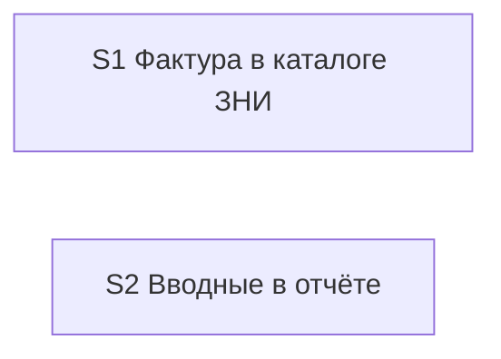

# Quality Controller — Slice Coherence

**Change:** `explore-reports-into-change`  
**Date:** 2026-09-02 (прогон 3)  
**Mode:** slice (`# Срез S1`, `# Срез S2`)  
**Артефакты:** `proposal.md`, `design.md` (`## Slices`), `tasks.md`, `specs/explore-report-promote/spec.md` (7 `#### Scenario:`), `specs/explore-report-intake/spec.md` (7 `#### Scenario:`)  
**Повод прогона:** уточнение контракта (путь файла передачи, allowlist имён, источник формулировки запроса, граница шапки, href журнала). Новых `#### Scenario:` нет — AND-клаузы добавлены к существующим.

**Вне объёма:** исполнимость приёмки на ИБ / тестовые данные / smoke вне `tasks.md`.

Mechanical (вход оркестратора): чекбоксы на месте; по одному `S<N>.accept` и одному `<!-- slice-gate -->` на срез; префиксы ID согласованы. User Task Contract pre-check: совпадений DENY нет. `form_mode: n/a`. Маркеров ручного конфигурирования нет.

---

### Verdict

`OK`

Два среза независимы и вертикальны. Первый — после создания задачи файл темы лежит в её каталоге `reports/`, в `temp` его нет. Второй — открытый отчёт обследования показывает шапку с объектом и понятной формулировкой запроса (ценно уже в `temp`). Обязательная приёмка каждого среза достижима задачами **этого** среза: дубля пользовательского пути нет, прямой зависимости приёмки от более позднего среза нет, в метаданных `**Зависимости:**` нет / нет. Условия «подготовка с отдельной точкой приёмки» не выполнены (оба accept — наблюдаемые исходы; второй срез не потребитель первого). Все 14 `#### Scenario:` покрыты. CRITICAL / WARNING нет.

---

### Slice Summary

| Slice | Scenario | Tasks | Acceptance | Dependencies | Gate |
|---|---|---|---|---|---|
| S1: Фактура в каталоге ЗНИ | После исследования с отчётом создали ЗНИ — файлы темы лежат в каталоге задачи | 9 impl (`S1.1`–`S1.9`) + accept | `S1.accept` (7/7) | нет | да (`<!-- slice-gate -->`) |
| S2: Вводные в отчёте | Открыл отчёт — видно объект и понятный исходный запрос | 10 impl (`S2.1`–`S2.10`) + accept | `S2.accept` (7/7; 2 сценария в Primary) | нет | да (`<!-- slice-gate -->`) |

Размер: 21 чекбокс (≥16, Full). Два среза оправданы двумя самостоятельными пользовательскими исходами (каталог после `/opsx:new` vs шапка в файле отчёта). Легаси `S<N>.T<M>` / `<!-- phase-gate -->` нет.

---

### Scenario Coverage

Правило: `#### Scenario:` покрыт, если есть в Primary, optional-буллете accept **или** в задаче `S<N>.<M>` (в т.ч. «верифицировать по тексту»). Покрытие только задачей агента допустимо. AND-клаузы к существующим сценариям отдельного заголовка не требуют.

| Scenario | Covered by | Status |
|---|---|---|
| Reports of this topic move into the change catalog | S1 Primary; `S1.1`, `S1.7`, `S1.8`, `S1.9` (AND href журнала: `S1.7` + сверка `S1.9`) | OK |
| Confirm message has no file list | S1 optional accept; `S1.6`, `S1.8` | OK |
| Handoff file moves only if it exists | S1 optional accept; `S1.1`, `S1.9` (корень `temp/`, не `temp/reports/`) | OK |
| New without research reports succeeds | S1 optional accept; `S1.2`, `S1.9` | OK |
| Parallel topics do not mix | S1 optional accept; `S1.1`, `S1.9` | OK |
| Extend from temp moves the file | S1 optional accept; `S1.4` | OK |
| Continuity finds reports after move | S1 optional accept; `S1.5`, `S1.9` (AND: не предлагать служебные отчёты проверки; тот же allowlist) | OK |
| Intake header names the object | S2 Primary; `S2.1`, `S2.2`, `S2.4`, `S2.9` (AND: служебные отчёты проверки постановки без пятипольной шапки — `S2.1`, `S2.4`, `S2.10`) | OK |
| Original request is a clear restatement | S2 Primary (тот же When: открыть отчёт); `S2.1`, `S2.5`, `S2.9`, `S2.10` | OK |
| Missing header is filled on save | S2 optional accept; `S2.1`, `S2.10` (AND: источник поля — слот «Вопрос» или сжатие 1–2 предложения) | OK |
| Trace customer section stays distinct | S2 optional accept; `S2.3`, `S2.6` | OK |
| Explain meta is not duplicated | S2 optional accept; `S2.7` | OK |
| Brief is not saved as a file | S2 optional accept; `S2.9`, `S2.10` | OK |
| Chat постановка has no reports list | S2 optional accept; `S2.8` (проверка каталога после new явно исключена — это первый срез) | OK |

Имена в ёлочках optional-буллетов совпадают с `#### Scenario:` буквально (включая «Chat постановка has no reports list»). Primary-сценарии не дублируются отдельной строкой `Scenario «…»` — канон формата `S<N>.accept`. Чужих сценариев в чеклистах нет: буллет второго среза про чат-постановку сужает AND из spec, не переносит сценарий переезда.

**Покрытие уточнённого контракта (AND, не новые Scenario):**

| Уточнение | Где в tasks |
|---|---|
| Файл передачи ищется в корне `temp/`, не в `temp/reports/` | `S1.1`, `S1.9`, optional «Handoff file moves only if it exists» |
| Положительный allowlist имён; не префикс `architecture-*`; deny служебных отчётов проверки | `S1.1`, `S1.5`, `S1.9`; зеркало Continuity в optional accept |
| «Исходный запрос» — понятная формулировка; источник при дописывании — слот «Вопрос» или сжатие, не цитата чата | S2 Primary; `S2.1`, `S2.5`, `S2.10`; optional «Missing header is filled on save» |
| Пятипольная шапка — у обследования / трассы / архитектурного отчёта исследования, не у служебных отчётов проверки постановки | `S2.1`, `S2.4`, `S2.10` |
| Href журнала `../../src/` → `../../../../src/` при переезде; label citation не менять | `S1.1`, `S1.7`, `S1.9`; второй срез href не дублирует (`S2.7`) |

Пропусков нет. `accept-bullets-missing-scenario` не срабатывает.

---

### Dependency Graph

- Между срезами: рёбер нет (оба `**Зависимости:** нет`). Циклов нет. Прямой зависимости приёмки нет.
- Внутри S1: `S1.2`, `S1.4` → `S1.1`; `S1.9` → `S1.1`–`S1.8`. Циклов нет.
- Внутри S2: `S2.2`–`S2.4` → `S2.1`; `S2.10` → `S2.1`–`S2.9`. Циклов нет.
- Объявленные зависимости существуют. Незадекларированных рёбер «срез → срез» нет.

Общие файлы с явной перегородкой (не ребро приёмки): правило сохранения (переезд vs шапка), шаблон журнала (href vs Мета), тест-кейс explore→new (каталог vs шапка). Комментарии «в этом шаге не писать / не дублировать» фиксируют раздел. Это координация правок, не зависимость accept.

---

### Criteria

1. **Scenario Coverage** — 14/14. Implementation-only AND (href, allowlist Continuity, граница шапки) закрыты задачами «добавить/уточнить» и «верифицировать по тексту», без user-spike на стенде.
2. **Slice Independence** — каждый срез принимаем без следующего. Шапка ценна в `temp`; переезд не требует шапки для своего Primary.
3. **Slice Completeness** — kit-markdown, не прикладной 1С. Слои для приёмки S1: правило переезда, new/extend/explore, стиль чата, href журнала, тест-кейс, сверка. Для S2: шаблон шапки, три агента, промпт explore, профиль дефекта, Мета журнала, чат-блок, тест-кейс, сверка. Пропусков слоя нет. Метаданные / формы / BSL не требуются.
4. **Slice Dependency Graph** — см. выше. Совпадает с `design.md` § Slices.
5. **Slice Gate Integrity** — ровно один `S1.accept` и один `S2.accept`; по одному `<!-- slice-gate -->`. Дублей нет.
5b. **Acceptance Checklist Coverage** — у обоих срезов есть `**Primary acceptance:**` и `**Primary (обязательно):**`. Тела accept не пустые. Сценарии spec покрыты. Чужих буллетов нет.
6. **Rework Risk** — сценарии не пересекаются. Общие файлы разделены секциями; острота низкая, отдельный алерт не требуется.
8. **Slice Verticality** — S1 Primary: команда создания задачи → файл в каталоге / отсутствие в `temp` (чёрный ящик). S2 Primary: открыть отчёт → шапка с объектом и формулировкой запроса (чёрный ящик). Не код-ревью контракта и не вызов функции в отладчике.
8b. **Self-Achievable Acceptance** — S1 Primary закрывается переездом в `S1.1`–`S1.8` (сверка `S1.9` не нужна для наблюдаемого пути). S2 Primary закрывается шаблоном и агентами `S2.1`–`S2.5`. Пользовательский путь не заимствован у соседнего среза.
9. **Foundation slice with gate** — не срабатывает: нет `**Зависимости:** S1` у второго среза; accept первого среза сам наблюдаемый, не programmatic-only.
10. **Acceptance Simplicity** — в каждом accept ровно один mandatory буллет. Остальные помечены «(опционально)». Два spec-сценария во втором Primary — один When (открыть отчёт) с составным Then, не два обязательных journey.
11. **User Task Contract** — mechanical DENY пуст. `S1.9` / `S2.10` — «верифицировать по тексту» / «без живого прогона команд» (агент, static). В `S<N>.<M>` нет ИБ, консоли, отладчика, условных цепочек «после verify». Приёмка на границе среза — открыть каталог / файл (kit), не runtime-spike пользователя в середине среза.

**Task readability:** формулировки non-accept следуют «глагол + файл + результат»; опорные Decision/Scenario в скобках. Голых «реализовать D<N>» нет. Задачи короче 8 слов нет. `S1.1` / `S2.1` длинные, потому что тело — сам протокол (SSOT в правиле), не голый идентификатор. `task-opaque-title` / `task-too-short` / `task-opaque-acceptance` не срабатывают.

---

### Alerts

Нет.

---

### Recommendations

**Automatic fix:** не требуется.

**Decision required:** нет.

Применять срезы по очереди на общих файлах, не переписывая чужую секцию: это уже записано в текстах `S1.1` / `S2.1` / `S1.7` / `S2.7` / `S1.8` / `S2.9`.
