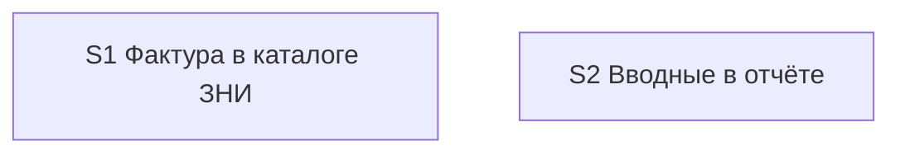
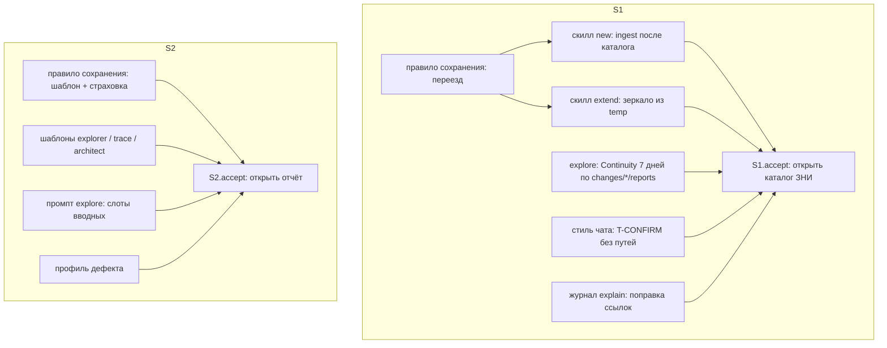

# Quality Control — Slice Coherence (Slice Generation Gate)

**Change:** `explore-reports-into-change`  
**Дата:** 2026-09-02  
**Прогон:** `quality-control-2026-09-02`  
**Режим:** proposed-slice (`design.md` `## Slices`; `tasks.md` **не существует**)  
**Артефакты:** `proposal.md`, `design.md` (`## Slices`), `specs/explore-report-promote/spec.md` (7 `#### Scenario:`), `specs/explore-report-intake/spec.md` (7 `#### Scenario:`)  
**Критерии (запрос):** 1, 3, 5, 5b, 8, 8b, 9–11 из `.cursor/rules/vertical-slices.mdc`; читаемость — `.cursor/rules/task-readability.mdc` (N/A без задач)  
**Линза:** kit-only (`form_mode: n/a`); apply mechanical (правила и скиллы markdown); прикладных `.bsl` / XML / форм 1С нет  
**Особый фокус:** S1 ∥ S2 (шапка ценна уже в `temp`, переезд — при создании ЗНИ); критерий 8b; не foundation-slice  
**Out of scope QC:** исполнимость приёмки «прямо сейчас» в Cursor / на ИБ; тестовые данные / эталон ИБ (transient); качество кода и выбор варианта реализации

Mechanical pre-check (prompt): none. Manual config checklist: none. User Task Contract pre-check: none (kit; приёмка — открыть каталог / открыть отчёт).

`no-slices` **не** эмитируется как блокер: оценивается предложенная декомпозиция в `## Slices`, не отсутствие `# Срез` в несуществующем `tasks.md`. Критерий 8 — смысловое суждение, **без** grep по спискам слов. Критерий 8b — ложная граница → сливать, не откладывать accept.

Discovery (Existing Knowledge): совпадений нет; на покрытие срезов не влияет.

---

## Verdict

`OK`

Два предложенных среза независимы и вертикальны. S1 — файл темы после `/opsx:new` лежит в `reports/` ЗНИ, в `temp` его нет. S2 — открытый отчёт обследования показывает шапку с объектом и понятным исходным запросом (ценно уже в `temp`). Mandatory Primary каждого среза достижим слоями **этого** среза: дубля journey нет, forward-зависимости приёмки нет, `**Зависимости:**` нет/нет. Условия `slice-foundation-with-gate` не выполнены (оба accept — black-box; S2 не consumer S1). Все 14 `#### Scenario:` размещены в матрице. CRITICAL / WARNING нет.

---

## Slice Summary

| Slice | Scenario | Tasks | Acceptance | Dependencies | Gate |
|---|---|---|---|---|---|
| S1: Фактура в каталоге ЗНИ | После исследования с отчётом создали ЗНИ — файлы темы лежат в каталоге задачи | ещё нет (`tasks.md` отсутствует); слои по design: правило сохранения (переезд), скиллы new/extend/explore (Continuity), стиль чата про путь отчётов, журнал пошагового разбора (ссылки) | S1.accept предложен: 1 mandatory Primary («открыть каталог… увидеть файл из превью»); матрица 7/7 Scenario promote (6 optional/агент + 1 Primary) | нет | предложен один accept на границе среза; маркер `<!-- slice-gate -->` в design нет (формат `tasks.md`; см. критерий 5) |
| S2: Вводные в отчёте | Открыл отчёт — видно объект и понятный исходный запрос | ещё нет; слои по design: правило сохранения (шаблон + страховка), три агента, промпт explore, профиль дефекта | S1.accept → S2.accept предложен: 1 mandatory Primary («открыть отчёт — шапка с объектом и формулировкой, не цитата»); матрица 7/7 Scenario intake (2 имени закрыты одним journey Primary + 5 optional/регресс) | нет | предложен один accept; маркер в design нет (как у S1) |

Notes:

- Порог: Standard (ожидаемо больше Lite-пяти, меньше Full-16 на срез; суммарно два контейнера kit-markdown). По `vertical-slices.mdc` § ТРИГГЕРЫ — **1 срез по умолчанию**; **второй срез обоснован**: два самостоятельных пользовательских outcome (каталог ЗНИ vs шапка файла). Это не «справка того же исхода».
- `form_mode: n/a`. Продуктовый BSL / Form / XML не требуется. `**Режим apply:** mechanical` — proposal § Decisions / design Decision 9.
- Имена в колонке «Scenarios из spec» таблицы Slices совпадают с `#### Scenario:` буквально (английские заголовки promote/intake). При генерации `tasks.md` поле `**Связь со spec:**` SHALL перечислить их так же.
- Матрица приёмки помечает **один** blocking journey на срез. Два имени spec у S2 Primary (`Intake header names the object`, `Original request is a clear restatement`) — два Then одного осмотра файла, не два mandatory journey.
- `design.md` § Граф: «полный критерий готовности постановки = оба среза» — критерий **архива / change-level**, не зависимость slice-gate. Не кодировать как `**Зависимости:** S1` у S2.

---

## Scenario Coverage

В дельте **14** заголовков `#### Scenario:` (7 promote + 7 intake).

Правило: `#### Scenario:` покрыт, если его можно положить в Primary, optional accept или агентскую `S<N>.<M>` предложенного среза. `tasks.md` нет — покрытие **предлагаемое**.

| Scenario (spec, буквально) | Covered by (design matrix / Primary) | Status |
|---|---|---|
| Reports of this topic move into the change catalog | S1 **Primary** | OK — covered-by-Primary |
| Confirm message has no file list | S1 optional / агент | OK (proposed) |
| Handoff file moves only if it exists | S1 optional | OK (proposed) |
| New without research reports succeeds | S1 optional / агент | OK (proposed) |
| Parallel topics do not mix | S1 optional / агент | OK (proposed) |
| Extend from temp moves the file | S1 optional / агент | OK (proposed) |
| Continuity finds reports after move | S1 optional / агент | OK (proposed) |
| Intake header names the object | S2 **Primary** (тот же осмотр файла, что restatement) | OK — covered-by-Primary |
| Original request is a clear restatement | S2 **Primary** (тот же Given→When→Then, второй Then) | OK — covered-by-Primary |
| Missing header is filled on save | S2 optional / агент static | OK (proposed) |
| Trace customer section stays distinct | S2 optional | OK (proposed) |
| Explain meta is not duplicated | S2 optional / агент static | OK (proposed) |
| Brief is not saved as a file | S2 регресс / агент static | OK (proposed) |
| Chat постановка has no reports list | S2 регресс (ADR-0001) | OK (proposed); см. SUGGESTION про второй THEN spec |

**Coverage:** 14/14 явных в матрице. Пропусков нет. `accept-bullets-missing-scenario` не эмитируется.

Implementation-only / регресс (Confirm без списка, New без отчётов, Parallel, Extend, Continuity, Handoff, Missing header, Trace distinct, Explain meta, Brief не файл, чат без списка) — путь агента «верифицировать по тексту правил/скилла» или optional accept. User IB/runtime spike в середине среза не заявлен. Живой прогон `/opsx:new` / открытие каталога — только на границе S1.accept (projected). Открытие файла отчёта — только на границе S2.accept (projected). Continuity как «новый чат» — optional accept S1, не user-spike `S1.<M>`.

Отдельный срез с accept — только у самостоятельных outcome: переезд фактуры (S1) и шапка вводных (S2). Не выделены срезы «фильтр темы», «rewrite `report:`», «страховка оркестратора» — верно (это слои тех же Primary).

---

## Dependency Graph

Межсрезовых рёбер нет. Циклов нет. Объявлено: S1 → нет; S2 → нет. Forward-зависимости приёмки нет: Primary S1 не требует шапки; Primary S2 не требует каталога ЗНИ.

Внутрисрезовый порядок (projected):

Незаявленных рёбер, ломающих Primary, нет. Общий файл правила сохранения правится **разными секциями** (переезд vs шаблон); это стык реализации, не `**Зависимости:**` и не forward-accept. Архитектурный Test Scenario 1 (happy path: файл в каталоге **и** шапка) — прогон **change-level**, не Primary ни одного среза.

---

## Criterion 8b — Primary достижим силами этого среза

Пара соседних срезов S1 / S2 есть. Проверка по алгоритму QC:

**Механически (дубль journey).** Primary S1: Given отчёт в превью → When `/opsx:new` → Then тот же файл в `reports/` ЗНИ, в `temp` нет (осмотр **каталога**). Primary S2: Given исследование с названным объектом → When открыть отчёт обследования → Then шапка после заголовка (осмотр **содержимого файла**). Существенного совпадения user-journey нет: разные действия, разные проверяемые поверхности.

**Механически (слой только в соседнем срезе).** Then S1 (файл на месте / нет в temp) закрывается правилом переезда + скиллом new — слои колонки «Файлы/модули» S1. Шапка S2 для этого Then **не** нужна: design Behavior Contract 17 — уже лежащие файлы без шапки задним числом не обязаны дописываться. Then S2 (шапка видна) закрывается шаблоном агентов + страховкой оркестратора при **сохранении отчёта** — слои S2. Переезд S1 для этого Then **не** нужен: граф явно «шапка ценна уже в `temp`».

**Семантика.** Пользователь может принять S1, не читая шапку (факт git/каталога). Может принять S2, не создавая ЗНИ (открыть `temp/reports/exploration-….md` после explore). Наблюдаемый исход S1 не заимствован у S2; исход S2 не заимствован у S1.

Предусловие S1 «отчёт уже есть в превью» — **фиксатура приёмки** (как «учебная ЗНИ» в других kit-прогонах), не слой S2 и не structural unreachability. Задача S2 «MAY prepend шапки при promote, если слоты ещё в чате» (architecture § риски) — доп. покрытие старых файлов, не включающий слой S2 Primary.

`slice-accept-not-self-achievable` **не** эмитируется. Объединение срезов **не** требуется. Запрещённое «процедурно не подписывать `S1.accept` до S2» / наоборот — не предлагается. «Полный критерий готовности постановки = оба» закрывается архивом change после двух независимых gate, не одним accept.

---

## Criterion 10 — один обязательный осмотр или несколько?

S1: колонка **Primary acceptance** — **один** Given→When→Then (превью → new → файл в каталоге). Матрица помечает Primary только у «Reports of this topic move into the change catalog». Остальные шесть promote — optional / агент.

S2: колонка **Primary acceptance** — **один** Given→When→Then (исследование → открыть отчёт → шапка: объект + понятный запрос, не цитата; «Для заказчика» в конце). Два имени spec в строке «S2 Primary» таблицы покрытия — два утверждения **одного** осмотра, не два blocking journey. Остальные пять intake — optional / регресс.

`acceptance-simplicity-overload` **не** эмитируется. Риск при генерации tasks — развернуть семь+ семь имён в несколько строк без пометки «опционально» или поставить два `**Primary (обязательно):**` у S2 (SUGGESTION).

---

## Checklist Results

| # | Criterion | Result |
|---|---|---|
| 1 | Scenario Coverage | **Pass** — 14/14 в матрице. S1 Primary: 1 имя promote. S2 Primary: 1 journey / 2 имени intake. Остальные — optional или агент static. User runtime только на границах `S<N>.accept` (projected). Алерт «Scenario "X" не покрыт» не срабатывает |
| 3 | Slice Completeness | **Pass** — слои kit, нужные для Primary S1 (переезд + new), названы в колонке файлов S1. Слои Primary S2 (шаблон агентов + страховка сохранения + слоты промпта) названы в S2. Метаданных/форм/BSL 1С нет и не требуется. Continuity / extend / Confirm / Explain href — не слой Then Primary S1 (optional/`S1.<M>`). Missing header / Trace / Explain meta / Brief / чат-блок — не слой Then Primary S2. Целевые классы файлов (правила, скиллы, агенты) в репозитории kit есть. Журнал explain для Scenario «Explain meta is not duplicated» закрывается негативным правилом в SSOT сохранения + optional `S2.<M>`; для Primary S2 не требуется |
| 5 | Slice Gate Integrity | **Pass (projected)** — предложен **ровно один** `S1.accept` и **ровно один** `S2.accept`. Дубля нет. Маркер `<!-- slice-gate -->` — артефакт `tasks.md`, в `## Slices` его нет по формату design; **не** эмитирован CRITICAL (нет `# Срез` в tasks). При генерации tasks — по одному accept + одному маркеру на срез (SUGGESTION). `legacy-acceptance-format` N/A |
| 5b | Acceptance Checklist Coverage | **Pass (projected)** — колонка `Primary acceptance` заполнена у S1 и S2 → `primary-acceptance-missing` не срабатывает. Тел `S<N>.accept` ещё нет → `accept-checklist-empty` N/A (hint: первый sub-bullet = `**Primary (обязательно):**` из колонки). `accept-bullet-foreign-scenario` не срабатывает: Scenario promote не числятся в S2, intake — не в S1. `accept-bullets-missing-scenario` — нет (14/14). Имена в матрице буквальные |
| 8 | Slice Verticality | **Pass** (смысловая оценка, без grep списков). Mandatory S1: создать ЗНИ по теме превью → открыть каталог задачи → увидеть тот же файл, в `temp` нет. Это black-box продукта kit (файловое дерево ЗНИ как поверхность), не вызов функции переезда в отладчике и не код-ревью контракта API. Mandatory S2: открыть отчёт обследования → после заголовка шапка с объектом и понятным запросом. Это чтение документа как чёрного ящика, не проверка возвращаемого типа шаблона. Programmatic (сверка glob 48 ч, rewrite `report:`, слоты промпта, «нет `temp/briefs`») вынесены из Primary — верно. Срез «только алгоритм отбора» / «только шаблон markdown» не выделен |
| 8b | Self-Achievable Acceptance | **Pass** — см. секцию выше. Пара S1/S2 не даёт дубля journey и не делает Primary недостижимым внутри среза. Не foundation-граница |
| 9 | Foundation slice with gate | **Pass** — условия антипаттерна (все сразу) не выполнены. (1) Gate предложены — да (projected). (2) `S2` с `**Зависимости:** S1` — **нет** (явное «нет»). Ссылок «вызвать API/функцию S1» в задачах нет (задач нет). (3) S1.accept semantic programmatic-only, S2.accept — user-journey — **нет**: S1 тоже black-box (каталог). S1 не «новая функция без UX». Лечение merge не требуется |
| 10 | Acceptance Simplicity | **Pass (projected)** — по одному mandatory black-box journey на срез. Optional матрицы не помечены обязательными. Риск двух `**Primary (обязательно):**` у S2 из-за двух имён spec — SUGGESTION, не алерт overload |
| 11 | User Task Contract | **Pass (projected)** — строк `S<N>.<M>` нет, DENY-grep не к чему применить. Prompt: mechanical / user-task pre-check = none. Приёмка «открыть каталог» / «открыть отчёт» стоит в колонке Primary — **допустимо** на границе среза (`S<N>.accept`). Правки markdown и сверка текста правил — при генерации **задачи агента**. CRITICAL не ставить до появления запрещённых формулировок в tasks |

Критерии 2, 4, 6, 7 (independence, graph, rework, readability) — не в запросе; кратко: независимость подтверждена (2) тем же разбором, что 8b; граф без рёбер и циклов (4); rework низкий — разные Then, общий файл правила правится секциями (6); задач нет → readability N/A (7).

Task readability: **N/A** — нет `- [ ] S<N>.<M>`. При генерации tasks действует `.cursor/rules/task-readability.mdc`.

---

## Alerts

CRITICAL / WARNING нет.

### 1. `slice-gate-pending-tasks`

- **Affected:** S1, S2 (generation of `tasks.md`)
- **Type:** informational for criterion 5 (not in the removed-alert list)
- **Severity:** `SUGGESTION`
- **Evidence:** `## Slices` задаёт Primary и по одному accept на срез; HTML-маркер конца среза в design не пишется.
- **Recommendation:** в `tasks.md` — `# Срез S1: Фактура в каталоге ЗНИ` и `# Срез S2: Вводные в отчёте`; блок метаданных с `**Primary acceptance:**` из таблицы; `**Связь со spec:**` с семью буквальными именами promote у S1 и семью intake у S2; `**Зависимости:** нет` у обоих; `**Режим apply:** mechanical`; ровно один `- [ ] S1.accept …` и один `- [ ] S2.accept …` с `**Primary (обязательно):**` из колонки; затем `<!-- slice-gate: файл из превью лежит в reports/ ЗНИ, в temp его нет -->` и `<!-- slice-gate: в шапке отчёта видны объект (или «не назван») и понятная формулировка запроса, не цитата чата -->`.

---

### 2. `acceptance-simplicity-guard`

- **Affected:** S1.accept, S2.accept (projected)
- **Type:** профилактика критерия 10 (`acceptance-simplicity-overload`)
- **Severity:** `SUGGESTION`
- **Evidence:** S1 Primary одним GWT закрывает переезд. S2 Primary одним GWT закрывает объект **и** restatement. Матрица несёт ещё 5+5 optional/регресс.
- **Recommendation:** в теле `S1.accept` оставить **один** mandatory sub-bullet: открыть каталог созданной ЗНИ → файл из превью в `reports/` → в `temp` его нет. Parallel / Extend / Continuity / Confirm / New без отчётов / Handoff — «(опционально)» или agent static. В теле `S2.accept` — **один** mandatory: открыть отчёт обследования → после заголовка шапка с объектом (или «не назван») **и** понятным запросом без дословной цитаты; «Для заказчика» в конце. Не ставить второй `**Primary (обязательно):**` на restatement. Missing header / Trace / Explain / Brief / чат-блок — optional или `S2.<M>` «верифицировать по тексту».

---

### 3. `user-task-contract-guard`

- **Affected:** будущие `S1.<M>`, `S2.<M>`
- **Type:** профилактика критерия 11
- **Severity:** `SUGGESTION`
- **Evidence:** приёмка S1 = открыть каталог; S2 = открыть файл. DENY-маркеров в `## Slices` нет. Prompt: User Task Contract pre-check = none.
- **Recommendation:** живой прогон `/opsx:new` / `/opsx:explore` и осмотр каталога/файла держать только в `S<N>.accept`. Правки markdown и «верифицировать по тексту правила сохранения / скилла new / шаблона агента» — агентские `S<N>.<M>` (ALLOW-agent). Continuity — optional accept или агентский glob по `openspec/changes/*/reports/`, не «пользователь в новом чате на стенде». Не писать в `S<N>.<M>` «на стенде», «на тестовой ИБ», «runtime-verify», «в консоли», условные «после verify».

---

### 4. `chat-postanovka-then-split`

- **Affected:** S2 optional / future `S2.accept` bullet Scenario «Chat постановка has no reports list»
- **Type:** профилактика `accept-bullet-foreign-scenario` / ложной зависимости от S1
- **Severity:** `SUGGESTION`
- **Evidence:** spec THEN: «в блоке нет обязательного перечня отчётов; фактура доступна в файлах `reports/` после создания ЗНИ». Вторая клауза — исход S1 Primary, не шапка.
- **Recommendation:** в optional S2 проверять только блок постановки (нет обязательного перечня отчётов). Наличие файлов в каталоге ЗНИ после new — S1, не буллет S2. Не добавлять `**Зависимости:** S1` из-за этого THEN.

---

### 5. `explain-layer-on-s2-optional`

- **Affected:** S2 optional Scenario «Explain meta is not duplicated»
- **Type:** hint критерия 3 (не дыра Primary)
- **Severity:** `SUGGESTION`
- **Evidence:** колонка файлов S2 называет «три агента, промпт explore, профиль дефекта»; журнал пошагового разбора в файлах S1 указан как «ссылки» (переезд). Scenario про отсутствие второй шапки «Вводные» при заполненной «Мета» — intake S2.
- **Recommendation:** при генерации tasks дать `S2.<M>` на шаблон/скилл explain (не дублировать `## Вводные`, при отсутствии объекта — строка в «Мета»). Не отдельный срез. Primary S2 не менять.

**Не эмитировано:** `no-slices`; `primary-acceptance-missing`; `accept-checklist-empty`; `accept-bullets-missing-scenario`; `accept-bullet-foreign-scenario`; `slice-not-vertical`; `slice-accept-not-self-achievable`; `slice-foundation-with-gate`; `acceptance-simplicity-overload`; `user-task-contract-violation`; `legacy-acceptance-format`; `deprecated-phase-gate`.

---

## Recommendations

**Automatic fix**

Нет (WARNING/CRITICAL отсутствуют). Матрицу `## Slices` и тексты Primary **не** менять.

**Tasks generation**

1. Два заголовка `# Срез`, по одному `S<N>.accept` с одним mandatory Primary, по одному `<!-- slice-gate -->`.
2. `**Зависимости:** нет` у S1 и S2. Не ставить зависимость из фразы «полный критерий = оба».
3. Optional / agent static для 6 promote не-Primary и 5 intake не-Primary (включая регресс Brief / чат-блок).
4. Глагол + файл + результат в `S<N>.<M>` (`.cursor/rules/task-readability.mdc`).
5. `**Режим apply:** mechanical`.
6. Правки общего правила сохранения — разные секции (переезд в S1, шаблон/страховка в S2), чтобы снизить конфликт патча.

**Decision required**

Нет. Критерий 8b / объединение срезов не требуется: у каждого среза свой наблюдаемый путь, достижимый своими слоями. Переписывать Primary не нужно. S1 не foundation-slice.

**Do not**

- Не сливать S1 и S2: оба outcome самостоятельны; merge не лечение 8b/9.
- Не объявлять `**Зависимости:** S1` у S2 и не откладывать `S1.accept` «пока не будет шапки» / `S2.accept` «пока файл не в каталоге ЗНИ».
- Не ставить два+ mandatory black-box journey в одном `S<N>.accept`.
- Не выделять третий срез «фильтр темы», «Continuity», «страховка оркестратора», «журнал explain».
- Не класть живой прогон new/explore и осмотр каталога/файла в `S<N>.<M>` как обязанность пользователя.
