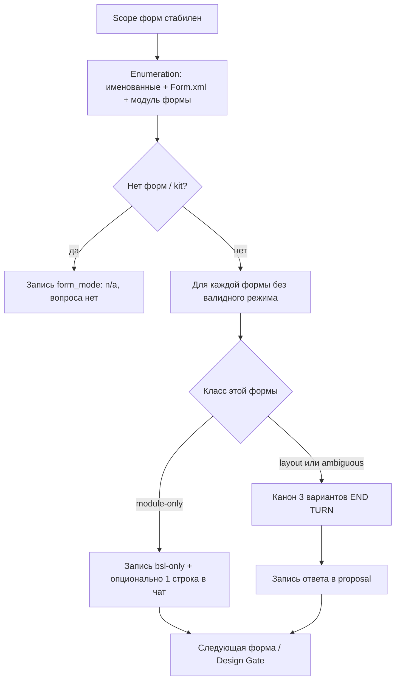
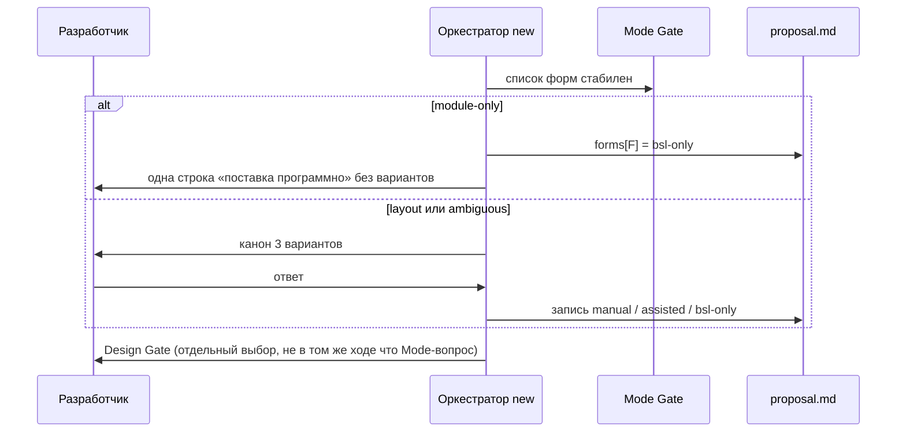

# Architecture: Idle Form Mode Question Skip

## KB references

- совпадений нет — `openspec/knowledge/_index.yaml` отсутствует, primary-фильтр по якорям пуст.

## Task

Зафиксировать один протокол `/opsx:new` (этап design): когда **не** задавать вопрос «Как поставляем форму … в этой ЗНИ?» и что тогда писать в `## Forms mode`. Симптом: ЗНИ трогает только модуль формы (заголовки колонок / UX в `Module.bsl`), оркестратор во внутреннем ходе уже выбирает «программно», но всё равно показывает три варианта; ответ «вручную» (default пропуска) затем на apply ждёт Конфигуратор без работы с разметкой.

## Complexity

Medium (протоколы kit: gate + шаг 5.d.1 + FAQ/quick-start; дельта spec в будущем change).

## Chosen Approach

**Approach**: Pragmatic balance — расширить существующий класс skip (как макет и `n/a` для kit), не новый гейт и не новое значение режима.

**Выбрано — вариант A (авто-запись `bsl-only` при доказанном module-only).**

После стабилизации списка форм (Decision 3a / enumeration) для **каждой** формы без записанного режима:

1. Классифицировать scope **этой** формы (таблица в Behavior Contract).
2. Если класс **module-only** — **не** задавать канон из трёх вариантов; записать `bsl-only` (скаляр при N=1 или ключ map `forms:`). В чат **допустима и рекомендуется** одна информирующая строка без нумерации; это не вопрос выбора и не END TURN.
3. Если класс **layout** или **ambiguous** — канонический вопрос остаётся; молчаливый `assisted` запрещён; пустой ответ на **заданный** вопрос по-прежнему → `manual`.
4. Форма остаётся в enumeration: дыра `n/a` / пустой режим при задаче на модуль формы **запрещена**.

**Rationale:**

- Единственный валидный режим при «разметку не трогаем, только модуль» — `bsl-only`. Это не выбор среди трёх равноправных путей, а вывод из постановки (тот же класс, что «нет форм → `n/a` без вопроса» и «макет → вопрос new не задаётся»).
- Enumeration **не** сужаем: иначе verify/apply увидят задачу на форму без режима (`n/a` = блокер). Пишем режим, не исключаем форму из списка.
- Запрет «не выбирать `assisted` молча» сохраняется: A записывает только `bsl-only` и только при положительных признаках модуля **и** отсутствии токенов разметки.
- Инвариант «один вопрос выбора за ход» не меняется: skip не создаёт второго выбора.
- ADR-0001: канон трёх русских вариантов — только когда вопрос **задаётся**; в чат не печатать enum `bsl-only` / `form_mode`.

**Trade-offs:** оркестратор может ошибочно счесть постановку module-only. Mitigation: сомнение = **ambiguous** = вопрос (не угадывать ни `assisted`, ни `bsl-only`).

## Simplicity Check

- **Viable alternatives:**
  1. **A — авто-запись `bsl-only` при module-only** — правка trigger/алгоритма в `forms-mxl-mode-gate.mdc` + шаг 5.d.1; FAQ/quick-start. Enumeration и набор значений режимов без изменений.
  2. **B — оставить вопрос, сменить default пропуска на «программно»** — те же файлы, строка mapping пустого ответа.
  3. **C — исключить форму из enumeration, если только модуль** — правка Decision 3a / списка форм; риск `form_mode: n/a` при реальной задаче на модуль.
- **Selected simplest viable design:** A. Добавляется одна ветка «доказанный module-only → записать и не спрашивать» рядом с уже существующими skip (kit/`n/a`, макет, resume). Нет нового гейта, нет нового enum, нет смены default ответа на вопрос.
- **Why not simpler:** ещё проще — «всегда спрашивать» (текущее поведение) — не закрывает Why: холостой выбор и вред default «вручную» на apply. B не убирает вопрос (критерий «Решено, когда» не выполнен) и ломает безопасный default `manual` для ЗНИ с разметкой. C проще в алгоритме вопроса, но создаёт дыру режима — запрещённый исход.
- **Complexity budget:**
  - Files touched: 4 протокола + 1 дельта spec (в будущем change)
  - Hooks/intercepts: 0 (не BSL)
  - New procedures/functions: 0
  - Conditional branches / feature flags: 1 классификатор на форму (3 класса) в существующем цикле 5.d.1

`Only one viable option` — нет: A/B/C сравнимы; B и C отвергнуты по контракту, не по вкусу.

## Found Patterns

### Pattern 1: Skip вопроса, когда ответ однозначен политикой

- **Where:** `.cursor/rules/forms-mxl-mode-gate.mdc:19` (макет вне Mode Gate new); `:91` (нет форм / kit → `n/a`, вопрос не задавать); `.cursor/skills/openspec-new-change/SKILL.md` шаг 5.d.1 п.2 и п.7
- **Usage:** вопрос не показывают, режим/политику записывают или применяют later (макет — default manual на apply без поля `layout_mode`)
- **Evidence:** архивный spec `No layout Mode question in new`; `Kit evolution without form modes`; design архива Option C «всегда вопросы даже без UI» **отклонено как шум**
- **Confidence:** high
- **Applicability:** module-only — тот же класс skip **с записью** `bsl-only` в proposal (у формы, в отличие от макета, пустой режим = блокер apply/verify)

### Pattern 2: Enumeration шире, чем trigger вопроса

- **Where:** gate § Enumeration + archive `design.md` Decision 3a (~строка 42); gate строки 21–25
- **Usage:** в список входят явно названные формы **и** задачи на Form.xml / модуль формы. Скобки trigger «не только Module.bsl как единственный артефакт без Form.xml» уже намекают не спрашивать module-only, но шаг 5.d.1 п.3 спрашивает **каждую** форму из списка — источник холостого вопроса
- **Evidence:** verified fact 2 + 5 (скрин: мысль «программно», вопрос всё равно задан)
- **Confidence:** high
- **Applicability:** enumeration **не** трогать; развязать «в списке» и «задать вопрос»

### Pattern 3: Запрет молчаливого выбора среди равноправных путей

- **Where:** gate строка 29 (`assisted` молча); строка 93 (дыра режима / не копировать соседа / не default молча на apply); spec `Empty form mode blocks`; FAQ пустой ответ → вручную
- **Usage:** когда у пользователя ещё есть выбор manual vs assisted vs bsl-only — спросить; пустой ответ на **заданный** вопрос = `manual`
- **Evidence:** archive Behavior Contract; ADR-0001 канон трёх вариантов
- **Confidence:** high
- **Applicability:** A не отменяет этот запрет. Запись `bsl-only` только если выбор вырожден (разметки нет). `assisted` по-прежнему только явным ответом «автоматически»/2

### Pattern 4: Apply различает тип задачи, а не только `form_mode`

- **Where:** `openspec-apply-change/SKILL.md` Task Dispatch: строка «Модуль формы (BSL)» vs «Форма / Form.xml / Конфигуратор»
- **Usage:** Module.bsl → writer pipeline; Form.xml+`manual` → pause-wait Конфигуратор
- **Evidence:** таблица apply ~строки 310–312
- **Confidence:** high
- **Applicability:** вред симптома — `manual` на ЗНИ без Form.xml-задач всё равно провоцирует ожидание Конфигуратора. Запись `bsl-only` направляет apply на ветку модуля

## Existing Mechanisms

Предпочтение иерархии (kit, не типовая 1С): расширить skip, не плодить гейт.

| Механизм | Контракт сегодня | Достаточен ли как есть | Как расширяем |
|----------|------------------|------------------------|---------------|
| Skip макета в new | Вопрос не задаётся; default manual на apply; поле в proposal не пишем | Частично: тот же UX «не шуметь», но у формы дыра режима недопустима | Тот же skip **вопроса**; для формы **обязательна запись** `bsl-only` |
| Skip kit / нет форм | `form_mode: n/a`, вопроса нет | Да для kit; **нельзя** ставить `n/a` на реальный модуль формы | Не использовать `n/a` для module-only |
| Resume | Валидный записанный режим не переспрашивать | Да | Без изменений: если уже `manual`/`assisted`/`bsl-only` — не перезаписывать skip-логикой |
| Цикл 5.d.1 «форма без режима → вопрос» | MUST ask | Нет — источник симптома | Вставить классификатор **перед** каноном вопроса |
| Default пустого ответа = `manual` | Только после заданного вопроса | Да для layout/ambiguous | **Не** менять (отклонение B) |
| Запрет silent `assisted` | Gate строка 29 | Да | Без исключений |

**Вывод Existing Mechanisms:** module-only → `bsl-only` без вопроса **того же класса**, что skip макета / kit `n/a` (ответ однозначен, вопрос — шум). Это **не** отмена запрета «не выбирать default среди трёх путей на apply» и **не** silent `assisted`. Отличие от макета: в proposal **должен появиться** валидный `form_mode`, иначе сработает `Empty form mode blocks`.

## Precedent coherence (архив 2026-08-18)

Архив: `openspec/changes/archive/2026-08-18-sequential-ui-mode-questions`. Capability: `split-form-layout-modes`. Связь с симптомом: **adjacent** (последовательные вопросы / skip макета); Decision 3a **включает** модуль формы в enumeration — это и есть механизм холостого вопроса, не «причина бага в BSL».

| Архивный контракт | Класс | Комментарий |
|-------------------|-------|-------------|
| (1) MUST задать вопрос для in-scope формы без записанного режима (spec scenario `Form Mode question on design for in-scope form`; 5.d.1 п.3) | **revokes** (сужение WHEN) | Форма по-прежнему in-scope и получает запись режима; вопрос обязателен только для layout и ambiguous. В будущем `design.md` — секция `## Blast Radius` |
| (2) Запрет молчаливого default (`assisted` из контекста; дыра `n/a`; копирование соседа; пустой ответ на вопрос → `manual`) | **extends** | A не заполняет дыру на apply и не выбирает `assisted`. Запись единственного валидного режима на new = sibling skip kit/`n/a`, не «default из трёх» |
| (3) Skip вопроса макета в new | **extends** | Без изменений; новый skip — сосед, не замена политики макета |

Option C архива («всегда вопросы даже без UI») остаётся **отклонено**. Один вопрос выбора за ход, per-form map, resume, kit → `n/a` — без отмены.

## Blast Radius

Обязательна в `design.md` будущего change (контракт (1) = revokes). Колонки для переноса:

| Контракт | Архивный источник | Бизнес-эффект | Альтернативы | Обоснование |
|----------|-------------------|---------------|--------------|-------------|
| На design для каждой in-scope формы без режима оркестратор **обязан** задать вопрос поставки | `archive/2026-08-18-sequential-ui-mode-questions/specs/split-form-layout-modes/spec.md` scenario «Form Mode question on design for in-scope form»; `design.md` Decision 3 / 3a; Behavior Contract «Mode Gate … при N формах — N вопросов» | Разработчик 1С на ЗНИ «поменять номера в заголовках колонок в модуле панели задач» отвечает на лишний выбор; пропуск = «вручную» → apply стопорит выгрузку из Конфигуратора, хотя разметку не трогают | B: оставить вопрос, default пропуска = программно (вопрос остаётся, ломает default для разметки). C: выкинуть форму из списка (дыра `n/a`, блокер apply) | Сужаем MUST-ask до случаев, где есть реальный выбор разметки. Форму не исключаем из списка: пишем `bsl-only`. `assisted` молча по-прежнему нельзя |

Спеки будущего change: **MODIFIED** scenario «Form Mode question…» (WHEN = layout **или** ambiguous, не любой in-scope); **ADDED** scenario «Module-only records bsl-only without question».

## Behavior Contract

### Когда вопрос исчезает (не канон из трёх)

После стабилизации scope, для формы **без** уже записанного валидного режима, если класс = **module-only**:

- В What Changes / tasks / design / handoff **есть** признаки работы в модуле формы: `Module.bsl`, «модуль формы», заголовки существующих колонок/элементов, обработчики, видимость/доступность уже существующих элементов, явная фраза «разметку не трогаем» / «только модуль».
- **Нет** токенов разметки для **этой** формы: `Form.xml`, реквизиты формы как метаданные, элементы в Конфигураторе, состав полей/кнопок без указания «в модуле», «колонки в Конфигураторе», правка разметки.
- Kit / отсутствие форм — по-прежнему отдельный skip: `n/a`, не `bsl-only`.
- Макет — по-прежнему не спрашивается (не `form_mode`).
- Resume: валидный режим уже в proposal — не переспрашивать и **не** перезаписывать skip-логикой.

Тогда: вопрос выбора **не** показывать. Записать `bsl-only`. Одна строка в чат (рекомендуется, не меню):

```text
Для формы «<ИмяФормы>» в этой ЗНИ меняется только модуль, разметку не трогаем — записываю поставку программно.
```

Строка chat-facing (ADR-0001): без `bsl-only` / `form_mode` / skill. Это не `AskQuestion` и не нумерованный выбор → END TURN из-за Mode Gate **не** требуется; можно сразу следующую форму цикла или Design Gate (в сообщении по-прежнему не больше **одного** вопроса выбора).

### Когда вопрос остаётся (канон без изменений)

- Класс **layout:** в scope этой формы есть Form.xml, реквизиты/элементы Конфигуратора, разметка, состав полей/кнопок как метаданные.
- Класс **ambiguous:** форма названа или попала в enumeration, но не доказано «только модуль» и не доказана разметка (в т.ч. «добавить кнопку/поле» без «в модуле» vs «в Конфигураторе»; «поменять заголовки» без указания модуля). **Не** угадывать `assisted`. **Не** угадывать `bsl-only`.
- Несколько форм: классификатор **по каждой**. Module-only записывается молча; layout/ambiguous — по одной в каноне с END TURN. Режим соседней формы не копировать.
- Пустой ответ / «да» / пропуск **на заданный вопрос** → `manual` (инвариант архива 4 и FAQ — не менять).

### Что писать в `## Forms mode`

| Ситуация | Запись |
|----------|--------|
| Нет форм / эволюция kit | `form_mode: n/a` |
| Одна форма, module-only | `form_mode: bsl-only` **или** map из одного ключа → `bsl-only` |
| Несколько форм, смесь | только map `forms:`; module-only ключ = `bsl-only`; остальные — ответ на вопрос |
| Одна форма, пользователь ответил на канон | как сейчас (`manual` / `assisted` / `bsl-only`) |
| Черновик scaffold до цикла 5.d.1 | допустим временный `n/a` / пустой map; к Design Gate финал **не** `n/a` при задаче на форму |
| Запрещено | `n/a` при задаче на модуль формы; silent `assisted`; новый enum |

Канон ключа map — без изменений (полное имя метаданных формы, не путь `src/.../Form.xml`).

### Что не меняется

- Один вопрос выбора за ход.
- Вопрос макета в new не задаётся.
- Per-form map `forms:`.
- Resume не переспрашивает записанный режим.
- Пустой/`n/a` при реальной задаче на разметку **или** на модуль формы без валидного режима — блокер apply/verify.
- Сырой Write Form.xml оркестратором запрещён.
- Metadata Gate не смешивать с Mode Gate.

## Assumptions

- **Assumption 1:** классификатор читает только стабилизированные What Changes / tasks / design / handoff, не «догадку Thought». Confidence: high. Verification: 5.d.1 после стабилизации списка (как сейчас).
- **Assumption 2:** apply при `bsl-only` и задачах только на `Module.bsl` не требует WAIT Конфигуратора. Confidence: high (Task Dispatch «Модуль формы (BSL)»). Verification: регрессия apply не входит в этот протокол; при регрессии — отдельный gap apply skill, не откат skip.

## Open Questions

Нет блокирующих. Информационная строка: **рекомендуется** (SHOULD), не MUST — чтобы skip не выглядел как забытый гейт, но не плодить процессный non-event.

## Clarifications

### Decision 1: A, не B и не C

- **Question:** тот же класс, что skip макета, или отмена «не выбирать default молча»?
- **Answer:** тот же класс skip вопроса при однозначном ответе; запись `bsl-only` обязательна, потому что у формы нет аналога «поля нет, политика на apply». Запрет silent default среди **равноправных** путей (особенно `assisted`) сохраняется.
- **Impact:** будущий spec MODIFIED + ADDED; Blast Radius в design.md.

### Decision 2: Не skip по одному лишь отсутствию пути Form.xml

- **Question:** достаточно ли «в файлах нет Form.xml»?
- **Answer:** нет. Нужны положительные признаки модуля **и** отсутствие токенов разметки. Голое имя формы без ясности = ambiguous = вопрос.
- **Impact:** ожидаемый подход оркестратора **подтверждён** с этим уточнением (не замена A).

### Decision 3: Программное создание элементов

- **Question:** «добавить кнопку в модуле» / `Элементы.Добавить` — вопрос или skip?
- **Answer:** если явно «в модуле» / программные элементы — module-only → `bsl-only` без вопроса (это определение режима «программно»). Если «добавить кнопку» без места поставки — ambiguous → вопрос.
- **Impact:** не трактовать любое изменение состава UI как layout.

## Architecture

### Components



#### Component 1: Forms Mode Gate (SSOT классификатора)

- **Path:** `.cursor/rules/forms-mxl-mode-gate.mdc`
- **Responsibility:** таблица классов; когда вопрос исчезает/остаётся; что писать; запрет silent `assisted`; сохранить канон чата
- **Dependencies:** ADR-0001 (язык вопроса); `1c-xml-write-guard.mdc` без изменений
- **Evidence:** текущий SSOT вопроса и записи; скобки строки 25 уже исключают «только Module.bsl» из trigger — довести до нормы, согласованной с 5.d.1
- **Interface:** секции «Триггеры вопроса», «Enumeration», «Запись в proposal», инвариант 4 (default ответа = manual **после вопроса**)

#### Component 2: new-change шаг 5.d.1 (исполнение)

- **Path:** `.cursor/skills/openspec-new-change/SKILL.md` (1.55 указатель, 5.d.1 алгоритм, 5.a Forms mode)
- **Responsibility:** цикл: классификатор → skip+запись **или** вопрос→END TURN→запись; kit `n/a`; макет не спрашивать
- **Dependencies:** gate как Read-first
- **Evidence:** текущий п.3 MUST ask — точка правки

#### Component 3: Потребители формулировки

- **Path:** `.cursor/docs/faq-kit.md`, `.cursor/docs/quick-start.md`
- **Responsibility:** одна фраза: вопрос не задаётся, если в ЗНИ только модуль формы без разметки; тогда в карточке ЗНИ сразу «программно»
- **Evidence:** сейчас оба текста говорят «с управляемой формой — спросит» без оговорки module-only

#### Component 4: Readers apply/verify (без смены протокола)

- **Path:** `openspec-apply-change/SKILL.md`, `openspec-verify-change/SKILL.md` — **не обязаны** меняться, если new всегда пишет валидный режим
- **Responsibility:** `bsl-only` уже запрещает compile Form.xml; дыра `n/a` по-прежнему блокер
- **Evidence:** verify `bsl-only-vs-xml-task`, `missing-form-mode`

### Data Flow



**Flow description:**

1. Metadata Gate как сейчас (без Mode в том же сообщении).
2. Scaffold: черновик `## Forms mode` допустим.
3. Design, список форм стабилен → цикл 5.d.1 с классификатором.
4. Все формы имеют валидный режим → Design Gate selection.
5. Apply читает записанный `bsl-only` и ведёт Module.bsl через writer, без WAIT разметки.

## Implementation Map

**Create:** ничего (метаданные 1С не создаём; `openspec/changes/` этот прогон не создаёт).

**Modify (будущий change kit):**

- `.cursor/rules/forms-mxl-mode-gate.mdc` — классификатор; явная ветка skip; поправить trigger vs enumeration; инвариант: default `manual` только как ответ на заданный вопрос
- `.cursor/skills/openspec-new-change/SKILL.md` — 1.55: вопрос может не задаваться при module-only; 5.d.1: шаг классификатора перед п.3; 5.a без смены enum
- `.cursor/docs/faq-kit.md`, `.cursor/docs/quick-start.md` — оговорка skip
- Дельта `openspec/specs/split-form-layout-modes/spec.md` (в change): MODIFIED + ADDED сценарии; `## Blast Radius` в `design.md`

**Не менять без отдельного Why:** apply/verify skills (readers уже корректны при заполненном режиме); набор значений `manual | assisted | bsl-only | n/a`; канон трёх вариантов; политика макета; ADR-0001.

## Implementation Phases

### Phase 1: SSOT классификатора в Mode Gate

- Files: `.cursor/rules/forms-mxl-mode-gate.mdc`
- Criteria:
  - Есть явные классы module-only / layout / ambiguous
  - module-only → запись `bsl-only`, вопроса нет
  - silent `assisted` по-прежнему запрещён
  - `n/a` не разрешён для задачи на модуль формы
- Dependencies: нет

### Phase 2: Алгоритм new 5.d.1 / указатель 1.55

- Files: `.cursor/skills/openspec-new-change/SKILL.md`
- Criteria:
  - Перед каноном вопроса вызывается классификатор
  - Skip не требует END TURN; канон — требует
  - Смесь форм: skip + вопрос другой формы в разных ходах; в одном сообщении не два выбора
- Dependencies: Phase 1

### Phase 3: FAQ и quick-start

- Files: `.cursor/docs/faq-kit.md`, `.cursor/docs/quick-start.md`
- Criteria: потребитель kit видит, что вопрос не всегда задаётся; пустой ответ по-прежнему «вручную», но только если вопрос был
- Dependencies: Phase 1 (формулировки из gate)

### Phase 4: Spec + Blast Radius (в `/opsx:new` этой эволюции kit)

- Files: delta spec, `design.md` § Blast Radius
- Criteria: scenario MUST-ask сужен; ADDED module-only; архивный skip макета не MODIFIED в сторону вопроса
- Dependencies: Phases 1–3 как план реализации

## Test Scenarios

### Scenario 1: Только модуль панели задач (симптом)

- **Actor:** разработчик на `/opsx:new`
- **Action:** постановка: номера в заголовках колонок, файлы только `.../Form/Module.bsl`, явно без Form.xml / Конфигуратора
- **Expected Result:** канона из трёх нет; в `## Forms mode` — `bsl-only` (скаляр или один ключ map); опционально одна строка «поставка программно»; apply не ждёт Конфигуратор

### Scenario 2: Разметка в scope — вопрос остаётся

- **Actor:** разработчик
- **Action:** What Changes включает Form.xml / реквизит / элемент Конфигуратора
- **Expected Result:** канон из трёх; `assisted` не записывается без явного «автоматически»; пустой ответ → `manual`

### Scenario 3: Форма названа, способ неясен

- **Actor:** разработчик
- **Action:** «доработать форму ПанельЗадач» без модуля vs разметки
- **Expected Result:** вопрос остаётся; `bsl-only` не угадывать

### Scenario 4: Две формы, смесь

- **Actor:** разработчик
- **Action:** форма A — только модуль; форма B — Form.xml
- **Expected Result:** A записана `bsl-only` без выбора; отдельным ходом канон про B; map `forms:` с разными значениями; режим A не копируется на B

### Scenario 5: Kit / нет форм

- **Actor:** разработчик эволюции kit
- **Action:** scope только `.cursor/**`
- **Expected Result:** `form_mode: n/a`, вопроса нет (не `bsl-only`)

### Scenario 6: Resume

- **Actor:** разработчик
- **Action:** в proposal уже `forms[F]: manual` при module-looking tasks
- **Expected Result:** не переспрашивать и не перезаписывать в `bsl-only`

### Scenario 7: Макет рядом с module-only формой

- **Actor:** разработчик
- **Action:** Module.bsl формы + Template.xml
- **Expected Result:** форма — skip+`bsl-only` (если module-only доказан); макет — вопроса new нет; политика макета на apply без изменений

### Scenario 8: Дыра режима по-прежнему блокер

- **Actor:** verify/apply
- **Action:** задача на модуль формы, `form_mode: n/a` / пусто, нет legacy
- **Expected Result:** блокер; не подставлять `bsl-only` молча **на apply** (запись — обязанность new/extend)

### Scenario 9: Один вопрос выбора за ход

- **Actor:** оркестратор
- **Action:** skip-строка про форму A и Design Gate в одном сообщении **или** канон про форму B
- **Expected Result:** не больше одного взаимоисключающего выбора; skip-строка выбором не считается; Metadata+Mode по-прежнему нельзя

### Scenario 10: «Добавить кнопку» без места

- **Actor:** разработчик
- **Action:** состав UI меняется, не сказано «в модуле» или «в Конфигураторе»
- **Expected Result:** ambiguous → канон; не silent `assisted` и не silent `bsl-only`

## Critical Details

### Error Handling

```yaml
Strategy:
  - Сомнение в классе → ambiguous → задать канон (безопасная сторона)
  - Никогда не записывать assisted без явного ответа 2 / «автоматически»
  - Никогда не оставлять n/a на форму с задачей модуля или разметки после цикла 5.d.1
  - Ошибка классификации module-only при фактической разметке: пользователь останавливает apply/verify (bsl-only-vs-xml-task) и /opsx:extend — не «тихий assisted»
```

### State Management

Черновик `n/a` до 5.d.1 допустим. После цикла — только валидные per-form режимы или kit `n/a`. Resume чтит записанное.

## Technical Debt

- Скобки gate строки 25 расходятся с 5.d.1 п.3 — закрывается этой ЗНИ, не оставлять как «комментарий».
- Follow-up вне scope: если apply всё же WAIT при `manual` **и** только Module.bsl-задачах — отдельная правка apply; A уже убирает типичный путь в этот WAIT.

## Next Steps

1. `/opsx:new` по блоку постановки ниже (change ещё нет, `scope.change: null`).
2. В `design.md` обязательно `## Blast Radius` (таблица выше).
3. Не просить оркестратора «проверить дифф» этого отчёта.

---

## Постановка ЗНИ

**Зачем:** на `/opsx:new` (design) не спрашивать поставку формы, если после стабилизации scope доказано: правится только модуль формы, разметка (Form.xml, реквизиты/элементы Конфигуратора) не в задачах; иначе apply после ответа «вручную» ждёт Конфигуратор вхолостую.

**Что менять:** `forms-mxl-mode-gate.mdc` (классификатор module-only / layout / ambiguous); `openspec-new-change` шаги 1.55 и 5.d.1; формулировки `faq-kit.md` и `quick-start.md`; дельта `split-form-layout-modes` — сузить MUST-ask, добавить сценарий записи `bsl-only` без вопроса.

**Как:** вариант A — форму оставить в enumeration, вопрос не показывать, записать `bsl-only` (скаляр или ключ `forms:`). Одна информирующая строка в чат допустима, меню из трёх — нет. Сомнение и любая разметка — канон остаётся. Не `assisted` молча, не `n/a` на модуль формы, enum не расширять.

**Приёмка:** сценарии 1–10 отчёта `temp/reports/architecture-2026-09-01-idle-form-mode-question.md`. Пустой ответ на **заданный** вопрос по-прежнему вручную. Макет в new не спрашивается. Resume не перетирает записанный режим.

**Архив:** `extends` запрет silent default и skip макета; **revokes** (сужение) MUST-вопроса для всякой in-scope формы без режима — в design обязателен Blast Radius относительно `2026-08-18-sequential-ui-mode-questions`.
