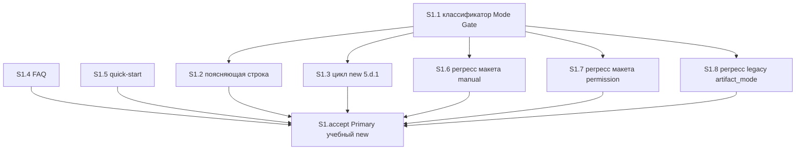

# Quality Control — Slice Coherence

**Change:** `skip-form-mode-module-only`  
**Дата:** 2026-09-01  
**Прогон:** `quality-control-2026-09-01-2` (повтор после repair-from-verify)  
**Режим:** slice (`tasks.md` содержит `# Срез S1`)  
**Артефакты:** `tasks.md`, `design.md`, `proposal.md`, `specs/split-form-layout-modes/spec.md` (12 `#### Scenario:`), `debug.md` (repair-from-verify 2026-09-01)  
**Линза:** kit-ЗНИ (`form_mode: n/a`); apply mechanical (правила / скиллы / FAQ / быстрый старт); прикладных `.bsl` / XML нет  
**Out of scope QC:** исполнимость приёмки «прямо сейчас» в Cursor / на ИБ; тестовые данные / эталон ИБ (transient); Blast Radius / качество кода / выбор варианта реализации

Mechanical pre-check (prompt): none expected. Чекбоксы на месте; один `<!-- slice-gate -->`; fences закрыты; `# Срез S1` + `S1.accept` с Primary; `form_mode: n/a` корректно.

Manual config checklist (prompt): маркеров ручной конфигурации этой ЗНИ нет. Подстроки «вручную» / «Конфигуратор» в задачах — токены классификатора и названия вариантов чата, не WAIT Конфигуратора.

User Task Contract pre-check (prompt + grep DENY по `^- \[[ x]\] S\d+\.\d+`): none. Совпадений `тестовой ИБ` / `на стенде` / `runtime-verify` / `спайк` / `в консоли` / `отладчик` / `вызвать API` / условных цепочек «после verify» нет. S1.6–S1.8 — «верифицировать по тексту» (ALLOW-agent static). Правки repair — те же S1.1–S1.3/accept, без runtime-spike.

Repair (debug.md): признаки «только модуль» сужены; Mixed = один ход (запись программно + один вопрос); поясняющая строка MAY. Постановка и задачи согласованы.

Не перезаписывает `reports/quality-control-2026-09-01.md` (первый прогон verify до repair).

---

## Verdict

`OK`

Один срез S1 «Пропуск холостого вопроса поставки» вертикален, независим и самодостаточен. Primary — наблюдаемый учебный прогон `/opsx:new`: постановка «только модуль панели, разметку не трогаем» → выбора из трёх нет → в карточке поставка программно. Все 12 Scenario spec покрыты (Primary, optional accept или агентская сверка по тексту). Парного среза нет — критерии 8b/9 не срабатывают. CRITICAL / WARNING нет.

Repair не размыл границу среза и не добавил второй mandatory journey: сужение токенов классификатора и правило «один вопрос выбора за ход» остаются внутри того же Primary.

---

## Slice Summary

| Slice | Scenario | Tasks | Acceptance | Dependencies | Gate |
|---|---|---|---|---|---|
| S1: Пропуск холостого вопроса поставки | На постановке «только модуль панели» выбора из трёх нет; в карточке сразу программно | S1.1–S1.8 (8) + S1.accept | S1.accept (5 bullets / 12 spec; 7 remainder via S1.1–S1.8) | нет | `<!-- slice-gate -->` present (1) |

Notes:

- Порог: Standard (9 пунктов включая accept; 6–15). По `vertical-slices.mdc` § ТРИГГЕРЫ — **1 срез по умолчанию**. Второй срез не нужен: один самостоятельный пользовательский исход.
- `**Режим apply:** mechanical` в metadata среза согласован с design § Decisions и proposal.
- `**Primary acceptance:**` в metadata совпадает с mandatory sub-bullet `S1.accept`.
- `**Связь со spec:**` перечисляет все 12 имён буквально (канон `#### Scenario:`). В теле accept — 1 Primary + 4 optional; остальные 7 закрыты задачами агента по правилу среза 6 (не дыра покрытия).
- Имена optional-буллетов совпадают со spec буквально (без перефразирования).
- После repair optional Mixed явно допускает в одном ходе запись программно по форме A и один вопрос из трёх по форме B; optional Informing line — отсутствие строки не дефект.

---

## Scenario Coverage

Дельта: 12 заголовков `#### Scenario:` в `specs/split-form-layout-modes/spec.md` (8 MODIFIED «Per-form delivery modes for managed forms», 4 ADDED «Module-only form records programmatic delivery without a question»).

Правило покрытия: Primary **или** optional sub-bullet accept **или** агентская `S<N>.<M>` (static / «по тексту»). User IB/runtime spike в `S<N>.<M>` запрещён.

| Scenario (spec, буквально) | Covered by | Status |
|---|---|---|
| Module-only records programmatic without question | **Primary** (`S1.accept` mandatory) + S1.1 / S1.3 | OK |
| Form Mode question on design for in-scope form | `S1.accept` optional + S1.3 | OK |
| Mixed forms sequential | `S1.accept` optional + S1.3 (после repair: один ход = запись A + один вопрос B) | OK |
| Multiple forms get sequential Mode questions | `S1.accept` optional + S1.3 | OK |
| Informing line is not a selection question | `S1.accept` optional + S1.2 (MAY; отсутствие не дефект) | OK |
| No layout Mode question in new | S1.3 («вопрос макета в new не возвращать»); доп. S1.5 | OK |
| Kit evolution without form modes | S1.3 (ветка kit без форм → `n/a` без вопроса не менять) | OK |
| Empty form mode blocks apply for in-scope form | S1.1 (пустой/`n/a` при задаче на модуль не ставить; дыру не ослаблять) | OK |
| Resume does not overwrite recorded mode | S1.1 (валидный записанный режим не переспрашивать и не перезаписывать) | OK |
| Layout stays manual unless apply permission | S1.6 верифицировать по тексту (регресс макета) | OK |
| Layout non-manual requires recorded apply permission | S1.7 верифицировать по тексту (регресс макета) | OK |
| Legacy single artifact_mode maps to form_mode | S1.8 верифицировать по тексту (регресс readers) | OK |

**Coverage:** 12/12. Пропусков нет. `accept-bullets-missing-scenario` не эмитируется: покрытие только в `S<N>.<M>` допустимо (критерий 5b / правило среза 6).

Матрица `design.md` `## Slices` согласована с `tasks.md`: Primary = module-only; layout/ambiguous, mixed, sequential questions, informing line — optional accept; kit / resume / hole / layout policy / mxl permission / legacy `artifact_mode` — agent static.

Implementation-only / регресс (макет apply, legacy `artifact_mode`, дыра режима, kit `n/a`, resume) — путь агента «верифицировать по тексту», без user-spike на ИБ. Живой прогон `/opsx:new` — только на границе среза (`S1.accept`).

Согласованность repair ↔ spec ↔ tasks:

- Токены module-only в spec (положительные признаки **в модуле**; «обработчики»/«видимость» без «в модуле» — не skip) зеркалятся в S1.1.
- Mixed THEN spec (запись A + необязательная строка + ровно один вопрос B в том же ходе) зеркалится в S1.3 и optional Mixed.
- Informing line MAY spec зеркалится в S1.2 и optional Informing line.

---

## Dependency Graph

Один срез. Межсрезовых рёбер нет. Циклов нет. Объявлено: `**Зависимости:** нет`. Forward-зависимости приёмки нет: следующего среза нет, дубля Primary нет.

Внутрисрезовые (явные «Зависимости: S1.1» в теле задач):

S1.4 и S1.5 не декларируют зависимость от S1.1: справка пишется по design, параллельно классификатору. Необъявленной межсрезовой зависимости нет. Циклов нет.

Primary достижим силами S1.1 + S1.3 (классификатор и цикл new). FAQ / быстрый старт / регрессии макета не являются слоем, без которого Primary структурно невыполним.

---

## Criteria evaluation

### 1. Scenario Coverage

Все 12 Scenario покрыты (таблица выше). Отдельный срез под implementation-only не создан — корректно (регресс макета / legacy / дыра / kit / resume не дают самостоятельного пользовательского outcome).

### 2. Slice Independence

Единственный срез принимаем без «следующих». Назад-зависимостей нет.

### 3. Slice Completeness

Для Primary нужны: классификатор в Mode Gate (S1.1, S1.2) и шаг цикла `/opsx:new` (S1.3). Справка kit (S1.4, S1.5) — Goal §4, тот же исход. Регрессии (S1.6–S1.8) — static. Дельта spec уже есть как артефакт new. Прикладной BSL / Form.xml / метаданные не требуются (`form_mode: n/a`, Non-Goals). Слоёв для приёмки не недостаёт.

### 4. Slice Dependency Graph

См. граф. Объявленные деды существуют (S1.1). Несоответствий нет.

### 5. Slice Gate Integrity

Ровно один `S1.accept`, ровно один `<!-- slice-gate -->`. Legacy `S1.T<M>` нет. CRITICAL не срабатывает.

### 5b. Acceptance Checklist Coverage

- `**Primary acceptance:**` в metadata — есть.
- Первый sub-bullet `**Primary (обязательно):**` — есть, текст совпадает с metadata.
- Тело accept непустое.
- Чужих Scenario нет (один срез).
- Все Scenario spec покрыты где-либо (Primary / optional / `S1.<M>`).

Алерты `primary-acceptance-missing`, `accept-checklist-empty`, `accept-bullets-missing-scenario`, `accept-bullet-foreign-scenario` не срабатывают.

### 6. Rework Risk

Низкий. Нет опоры на непринятый предыдущий срез. Сценарии не дублируются между срезами (среза один). S1.6–S1.8 не правят apply/verify (Non-Goal design): сверка, что S1.1 не ослабил политику макета и legacy-чтение. Повторной работы на границе срезов нет.

Repair не увеличил rework risk: правки классификатора и Mixed остаются в тех же задачах S1.1–S1.3, без нового среза и без второго gate.

### 8. Slice Verticality / Acceptance Observability

Mandatory Primary описывает black-box: пользователь создаёт учебную ЗНИ через `/opsx:new`, видит отсутствие выбора из трёх и запись «программно» в карточке. Это взаимодействие с kit как с системой, не вызов классификатора в отладчике и не код-ревью API. `slice-not-vertical` не срабатывает.

Optional-буллеты (вопрос при разметке, смесь форм, последовательность вопросов, поясняющая строка) — тоже наблюдаемый чат; они не blocking.

### 8b. Self-Achievable Acceptance

Пары S1/S2 нет. Primary не заимствован у более позднего среза. Наблюдаемый исход (пропуск вопроса + запись программно) производится задачами S1.1 и S1.3 этого же среза. `slice-accept-not-self-achievable` не срабатывает.

Transient «учебный прогон ещё нельзя выполнить, пока правила не применены» — вне scope QC.

### 9. Foundation slice with gate

Нет `S2` с `**Зависимости:** S1`. Единственный accept — UX-journey, не programmatic-only foundation. `slice-foundation-with-gate` не срабатывает.

### 10. Acceptance Simplicity

В теле `S1.accept` один mandatory black-box journey (`**Primary (обязательно):**`). Четыре остальных помечены «(опционально)». `acceptance-simplicity-overload` не срабатывает.

Repair не сделал Mixed/Informing line mandatory.

### 11. User Task Contract

Mechanical DENY по `S1.1`–`S1.8`: нет. Семантика: обязанности пользователя на runtime ИБ / консоль / отладчик / API в `S<N>.<M>` нет. Учебный прогон `/opsx:new` — только `S1.accept` (допустимая приёмка на границе среза). S1.6–S1.8 — ALLOW-agent «верифицировать по тексту». Условных цепочек «после verify / после стенда» нет. `user-task-contract-violation` не срабатывает.

---

## Task Readability

Паттерн «глагол + файл + что меняем + зачем + (опорная ссылка)» для non-accept:

| Task | Verb + file | Outcome | Notes |
|---|---|---|---|
| S1.1 | Добавить в `forms-mxl-mode-gate.mdc` | классификатор «только модуль» → запись программно без выбора | длинное тело, самодостаточно; Decision 1–3, ADR-0001; после repair — суженные токены |
| S1.2 | Добавить в `forms-mxl-mode-gate.mdc` | поясняющая строка не считается вопросом выбора | ADR-0001; Decision 9; Scenario informing line; MAY |
| S1.3 | Заменить в `openspec-new-change/SKILL.md` шаг 5.d.1 | классификатор до канона вопроса | ветки kit / макет / пустой ответ / соседняя форма; Mixed = один ход |
| S1.4 | Добавить в `faq-kit.md` | справка пропуска | Goals §4 |
| S1.5 | Заменить в `quick-start.md` (таблица и §5) | вопрос не всегда задаётся | макет на new не спрашивается |
| S1.6 | Верифицировать по тексту Mode Gate + apply | регресс: макет вручную без permission | ALLOW-agent |
| S1.7 | Верифицировать по тексту Mode Gate + apply | регресс: non-manual макета только с записью | ALLOW-agent |
| S1.8 | Верифицировать по тексту Mode Gate + apply + verify | регресс: lone `artifact_mode` | ALLOW-agent |

`S1.accept`: заголовок с бизнес-результатом («нет выбора из трёх, в карточке программно»). Исключение читаемости для accept соблюдено.

Алерты читаемости: `task-opaque-title` — нет (нет голых D/OQ); `task-too-short` — нет (все non-accept ≫ 8 слов); `task-opaque-acceptance` — N/A (не legacy T<M>).

Recipe vs outcome: S1.1/S1.3 кодируют признаки классификатора в правиле/скилле — это и есть наблюдаемый контракт kit (spec Behavior Contract), не частный рецепт поверх Primary.

---

## Alerts

Нет.

---

## Recommendations

### Automatic fix

Нет.

### Decision required

Нет.

Срез готов к apply (mechanical). Приёмка — учебный прогон `/opsx:new` на границе среза; optional-сценарии не блокируют `[x]` на `S1.accept`.
