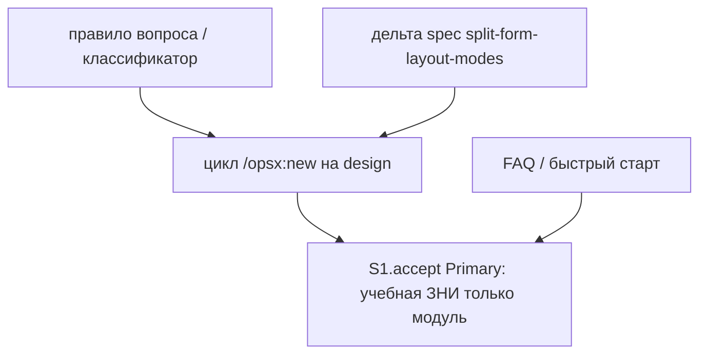

# Quality Control — Slice Coherence (Slice Generation Gate)

**Change:** `skip-form-mode-module-only`  
**Дата:** 2026-09-01  
**Прогон:** `quality-control-2026-09-01-slices`  
**Режим:** proposed-slice (`design.md` `## Slices`; `tasks.md` **не существует**)  
**Артефакты:** `proposal.md`, `design.md` (`## Slices`), `specs/split-form-layout-modes/spec.md` (12 `#### Scenario:`)  
**Критерии (запрос):** 1, 3, 5, 5b, 8, 8b, 9–11 из `.cursor/rules/vertical-slices.mdc`; читаемость — `.cursor/rules/task-readability.mdc` (N/A без задач)  
**Линза:** kit-ЗНИ (`form_mode: n/a`); apply mechanical (правила/скиллы/FAQ); прикладных `.bsl` / XML нет  
**Out of scope QC:** исполнимость приёмки «прямо сейчас» в Cursor / на ИБ; тестовые данные / эталон ИБ (transient); качество кода и выбор варианта A

Mechanical pre-check (prompt): none. Manual config checklist: none. User Task Contract pre-check: none.

`no-slices` **не** эмитируется как блокер: оценивается предложенная декомпозиция в `## Slices`, не отсутствие `# Срез` в несуществующем `tasks.md`. Критерий 8 — смысловое суждение, без grep по спискам слов. Критерий 8b — ложная граница → сливать, не откладывать.

Discovery (Existing Knowledge): совпадений нет; на покрытие срезов не влияет.

---

## Verdict

`WARNING`

Один предложенный срез S1 «Пропуск холостого вопроса поставки» вертикален, самодостаточен и не является foundation+gate. Primary — наблюдаемый прогон `/opsx:new` на постановке «только модуль панели, разметку не трогаем»: выбора из трёх нет, в карточке поставка программно. Пары S1/S2 нет — `slice-not-vertical`, `slice-accept-not-self-achievable`, `slice-foundation-with-gate` не срабатывают. В матрице `## Slices` явно размещены **8 из 12** заголовков `#### Scenario:`; не размещены четыре унаследованных/смежных имени из MODIFIED (см. Alerts). CRITICAL нет.

---

## Slice Summary

| Slice | Scenario | Tasks | Acceptance | Dependencies | Gate |
|---|---|---|---|---|---|
| S1: Пропуск холостого вопроса поставки | На постановке «только модуль» выбора из трёх нет; в карточке сразу программно. Вопрос остаётся при разметке/неясности; смесь форм — по одной; kit без форм — «не применимо» | ещё нет (`tasks.md` отсутствует); слои по design: правило вопроса, цикл `/opsx:new`, FAQ, быстрый старт, дельта spec | S1.accept предложен (1 mandatory Primary в колонке таблицы); матрица 8 строк vs 12 Scenario spec | нет | предложен один accept на границе среза; маркер `<!-- slice-gate -->` в design нет (формат `tasks.md`; см. критерий 5) |

Notes:

- Порог: Standard по смыслу (несколько файлов kit + дельта spec; ожидаемо больше Lite-пяти, меньше Full-16). По `vertical-slices.mdc` § ТРИГГЕРЫ — **1 срез по умолчанию**. Второй срез не обоснован: один самостоятельный исход (нет холостого вопроса, в карточке программно). FAQ/быстрый старт — справка того же исхода, не отдельная приёмка.
- `form_mode: n/a`. Продуктовый BSL / Form / XML не требуется. `**Режим apply:** mechanical` зафиксирован в design § Decisions.
- Имена в колонке «Сценарии» таблицы Slices — парафразы; канон — заголовки `#### Scenario:` в spec. При генерации `tasks.md` поле `**Связь со spec:**` SHALL перечислить имена буквально.
- Матрица помечает **один** Scenario как Primary (`Module-only records programmatic without question`). Остальные семь строк матрицы — роли (layout/ambiguous, mixed, kit, resume, hole, line, layout policy), не второй blocking journey.

---

## Scenario Coverage

В дельте **12** заголовков `#### Scenario:` в `specs/split-form-layout-modes/spec.md` (8 в MODIFIED «Per-form delivery modes…», 4 в ADDED «Module-only form records…»).

Правило: `#### Scenario:` покрыт, если его можно положить в Primary, optional accept или агентскую `S<N>.<M>` предложенного среза. `tasks.md` нет — покрытие **предлагаемое**.

| Scenario (spec, буквально) | Covered by (design matrix / Primary) | Status |
|---|---|---|
| Form Mode question on design for in-scope form | S1 матрица: «Form Mode question when layout or ambiguous» (layout/ambiguous); Behavior Contract §2 | OK (proposed, парафраз) |
| Multiple forms get sequential Mode questions | нет строки в матрице; Behavior Contract §3 описывает «по одной за ход», но заголовок spec не привязан | WARNING — не в матрице |
| No layout Mode question in new | S1 матрица: layout policy (без изменений, регресс) | OK (proposed) |
| Layout stays manual unless apply permission | нет строки в матрице; Non-Goals: политика макета без изменений | WARNING — не в матрице |
| Legacy single artifact_mode maps to form_mode | нет строки в матрице; Non-Goals: apply/verify не трогать, если new пишет валидный режим | WARNING — не в матрице |
| Kit evolution without form modes | S1 матрица: kit | OK (proposed) |
| Empty form mode still blocks apply for in-scope form | S1 матрица: hole («Empty form mode still blocks») | OK (proposed, усечённое имя) |
| Layout non-manual requires recorded apply permission | нет строки в матрице; Non-Goals: политика макета | WARNING — не в матрице |
| Module-only records programmatic without question | S1 **Primary** | OK — covered-by-Primary |
| Mixed forms sequential | S1 матрица: mixed | OK (proposed) |
| Resume does not overwrite recorded mode | S1 матрица: resume | OK (proposed) |
| Informing line is not a selection question | S1 матрица: line | OK (proposed) |

**Coverage:** 8/12 явных в матрице; 4 Scenario без строки (см. Alerts).

Смешение «Mixed forms sequential» (ADDED: форма A только модуль + форма B разметка) **не** заменяет MODIFIED «Multiple forms get sequential Mode questions» (N форм с разметкой/неясностью, вопросы только им, по одной за сообщение). Смешанный случай закрыт Mixed; два+ layout-only без module-only соседа в матрице не названы.

Implementation-only / регресс (макет apply, legacy `artifact_mode`, дыра режима, kit n/a, resume, informing line, вопрос при разметке) — путь агента «верифицировать по тексту правил/скилла» или optional accept. User IB/runtime spike в середине среза не заявлен. Живой прогон `/opsx:new` — только на границе среза (`S1.accept`, projected).

---

## Dependency Graph

Один срез. Межсрезовых рёбер нет. Циклов нет. Объявлено: колонка **Зависимости:** `нет`. Forward-зависимости приёмки нет: следующего среза нет, дубля Primary нет.


Внутрисрезовый порядок (projected, по design § Behavior Contract / файлы):



Незаявленных рёбер, ломающих Primary, нет: классификатор и цикл new входят в тот же контейнер, что и accept. FAQ — справка того же исхода, не S2.

---

## Criterion 8b — Primary достижим силами этого среза

Пары соседних срезов нет. Семантика: каждый элемент обязательного осмотра имеет включающий слой в заявленных файлах S1.

| Элемент Primary | Слой того же среза (design) | Достижимость |
|---|---|---|
| Создать учебную ЗНИ «только модуль панели, разметку не трогаем» | цикл `/opsx:new` | да, тот же S1 |
| Выбора из трёх нет | правило вопроса / классификатор module-only | да |
| В карточке поставка программно | запись режима в proposal на design (тот же цикл new) | да |

Наблюдаемый исход не заимствован у более позднего среза. Справка FAQ **не** входит в Then Primary: описывается вместе с пропуском вопроса (явный один срез). Вынос «классификатор» в S1 и «пропуск вопроса в чате» в S2 дал бы foundation+consumer и дубль journey — сейчас оба в S1. Верно.

Нужда в «учебной» ЗНИ как фикстуре прогона — **процедура приёмки** на границе среза, не structural unreachability и не отдельный срез. Не эмитируется как 8b.

`slice-accept-not-self-achievable` **не** эмитируется. Объединение срезов не требуется: декомпозиция уже один срез. Запрещённое «процедурно не подписывать accept до следующего среза» не предлагается.

---

## Criterion 10 — один обязательный осмотр или несколько?

В колонке **Primary acceptance** — **один** Given→When→Then: учебная ЗНИ «только модуль» → нет выбора из трёх → в карточке программно. Матрица помечает Primary только у «Module-only records programmatic without question».

Остальные строки матрицы (layout/ambiguous, mixed, kit, resume, hole, line, layout policy) **не** объявлены mandatory. Риск при генерации tasks — скопировать восемь строк матрицы и четыре недостающих имени в несколько обязательных буллетов (SUGGESTION).

`acceptance-simplicity-overload` **не** эмитируется. Разворачивать двенадцать имён в двенадцать обязательных буллетов **запрещено** remediation критерия 10.

---

## Checklist Results

| # | Criterion | Result |
|---|---|---|
| 1 | Scenario Coverage | **WARNING** — 8/12 в матрице. Primary (1 имя). Optional/роли матрицы (7). Четыре `#### Scenario:` без строки. User runtime только на границе `S1.accept` (projected). Алерт «Scenario "X" не покрыт» — см. Alerts |
| 3 | Slice Completeness | **Pass** — слои kit, нужные для Primary «учебная ЗНИ → нет выбора → программно в карточке», названы: правило вопроса, цикл `/opsx:new`. FAQ/быстрый старт — слой справки той же поставки, не дыра Primary. Дельта spec уже есть. Метаданных/форм 1С нет и не требуется. Apply/verify для hole/legacy/макета — не слой Then Primary (регресс → `S1.<M>` static). Целевые классы файлов в репозитории kit есть |
| 5 | Slice Gate Integrity | **Pass (projected)** — предложен **ровно один** `S1.accept`. Дубля нет. Маркер `<!-- slice-gate -->` — артефакт `tasks.md`, в `## Slices` его нет по формату design; **не** эмитирован CRITICAL (нет `# Срез` в tasks). При генерации tasks — ровно один accept + один маркер (SUGGESTION). `legacy-acceptance-format` N/A |
| 5b | Acceptance Checklist Coverage | **WARNING** — колонка `Primary acceptance` заполнена → `primary-acceptance-missing` не срабатывает. Тела `S1.accept` ещё нет → `accept-checklist-empty` N/A (hint: первый sub-bullet = `**Primary (обязательно):**` из колонки). `accept-bullet-foreign-scenario` N/A (один срез). `accept-bullets-missing-scenario` — четыре имени spec (критерий 1) |
| 8 | Slice Verticality | **Pass** — mandatory Primary: создать учебную ЗНИ с постановкой «только модуль, разметку не трогаем» → в чате нет выбора вручную/автоматически/программно → в карточке ЗНИ поставка программно. Это black-box (чат kit + карточка как продукт), не вызов функции в отладчике / код-ревью контракта API. Programmatic (сверка правил apply/макета/дыры) вынесены из Primary в роли матрицы — верно. Отдельный срез «только классификатор» был бы невертикален; он не выделен |
| 8b | Self-Achievable Acceptance | **Pass** — нет пары S1/S2. Наблюдаемый исход не заимствован у более позднего среза. Все включающие слои Primary (классификатор, цикл new, запись в карточку) заявлены в том же S1 |
| 9 | Foundation slice with gate | **Pass** — нет `S<K+1>` с `Зависимости: S1`. S1.accept не programmatic-only. Условия антипаттерна (все сразу) не выполнены. FAQ в том же срезе, не consumer-gate |
| 10 | Acceptance Simplicity | **Pass (projected)** — задуман **один** mandatory black-box journey. Optional/роли матрицы не помечены обязательными. Риск: восемь+ имён развернуть в несколько mandatory sub-bullet → тогда сработает overload (SUGGESTION) |
| 11 | User Task Contract | **Pass (projected)** — строк `S<N>.<M>` нет, DENY-grep не к чему применить. Prompt: mechanical / user-task pre-check = none. Приёмка «создать учебную ЗНИ» стоит в колонке Primary — **допустимо** в `S1.accept`. Правки markdown и сверка текста правил — при генерации **задачи агента**, не user-spike в середине среза. CRITICAL не ставить до появления запрещённых формулировок в tasks |

Критерии 2, 4, 6, 7 (independence, graph, rework, readability) — не в запросе; кратко: один срез, зависимостей нет, задач нет → N/A / pass без алертов.

Task readability: **N/A** — нет `- [ ] S1.<M>`. При генерации tasks действует `.cursor/rules/task-readability.mdc`.

---

## Alerts

### 1. `accept-bullets-missing-scenario`

- **Affected:** S1 (design.md `## Slices` матрица приёмки); четыре `#### Scenario:` в `specs/split-form-layout-modes/spec.md`
- **Type:** `accept-bullets-missing-scenario`
- **Severity:** `WARNING`
- **Evidence:** в spec есть, в матрице / колонке «Сценарии» таблицы Slices нет:
  1. `Multiple forms get sequential Mode questions` (MODIFIED; Mixed закрывает только A=модуль + B=разметка)
  2. `Layout stays manual unless apply permission` (MODIFIED, политика макета, Non-Goals)
  3. `Legacy single artifact_mode maps to form_mode` (MODIFIED, apply/verify)
  4. `Layout non-manual requires recorded apply permission` (MODIFIED, политика макета, Non-Goals)
- **Recommendation:** дописать четыре строки в матрицу S1 как optional accept **или** (предпочтительно для регресса apply/макета) агент `S1.<M>` «верифицировать по тексту» скилла apply / правила макета / маппинга `artifact_mode`. Не делать второй срез и не ставить их mandatory Primary.

### Remediation (auto-repair)

```markdown
### Remediation (auto-repair)
- alert: accept-bullets-missing-scenario
- target: design.md ## Slices (S1) + future tasks.md S1.accept / S1.<M>
- action: В матрицу приёмки добавить четыре строки на S1. «Multiple forms get sequential Mode questions» — optional (два+ форм с разметкой/неясностью, вопросы по одной; module-only уже записан). «Layout stays manual unless apply permission», «Layout non-manual requires recorded apply permission», «Legacy single artifact_mode maps to form_mode» — S1.<M> static «верифицировать по тексту, что политика макета и маппинг artifact_mode не меняются» (не user-spike, не второй срез). В **Связь со spec:** перечислить все 12 имён буквально.
```

---

### 2. `slice-gate-pending-tasks`

- **Affected:** S1 (generation of `tasks.md`)
- **Type:** (informational for criterion 5; not in the removed-alert list)
- **Severity:** `SUGGESTION`
- **Evidence:** `## Slices` задаёт один Primary; HTML-маркер конца среза в design не пишется.
- **Recommendation:** в `tasks.md` — `# Срез S1: Пропуск холостого вопроса поставки`, блок метаданных с `**Primary acceptance:**` из таблицы, `**Связь со spec:**` со всеми двенадцатью именами буквально, `**Зависимости:** нет`, `**Режим apply:** mechanical`, ровно один `- [ ] S1.accept …` с `**Primary (обязательно):**` из колонки, затем `<!-- slice-gate: на постановке «только модуль панели» выбора из трёх нет, в карточке поставка программно -->`.

---

### 3. `acceptance-simplicity-guard`

- **Affected:** S1.accept (projected)
- **Type:** профилактика критерия 10 (`acceptance-simplicity-overload`)
- **Severity:** `SUGGESTION`
- **Evidence:** Primary одним предложением закрывает module-only skip. Матрица несёт ещё семь ролей; spec — двенадцать имён.
- **Recommendation:** в теле `S1.accept` оставить **один** mandatory sub-bullet: постановка «только модуль панели, разметку не трогаем» → выбора вручную/автоматически/программно нет → в карточке поставка программно. «Form Mode question on design…», «Mixed forms sequential», «Informing line…», «Kit evolution…», «Resume…», «Empty form mode…», «No layout Mode question in new», «Multiple forms…» — «(опционально)» или agent static. Три apply/макет/legacy — только `S1.<M>` «верифицировать по тексту». Не превращать роли матрицы в несколько строк без пометки «опционально».

---

### 4. `user-task-contract-guard`

- **Affected:** будущие `S1.<M>`
- **Type:** профилактика критерия 11
- **Severity:** `SUGGESTION`
- **Evidence:** Primary = «Создать учебную ЗНИ». DENY-маркеров в `## Slices` нет.
- **Recommendation:** живой прогон `/opsx:new` (учебная постановка, наличие/отсутствие вопроса, запись в карточке, смесь форм, пустой ответ на **заданный** вопрос) держать только в `S1.accept`. Правки markdown и «верифицировать по тексту правила / скилла new / FAQ / apply» — агентские `S1.<M>` (ALLOW-agent). Не писать в `S1.<M>` «на стенде», «на тестовой ИБ», «runtime-verify», «в консоли», условные «после verify».

---

### 5. `spec-link-literal-names`

- **Affected:** metadata S1 в будущем `tasks.md`
- **Type:** профилактика 5b / читаемости accept
- **Severity:** `SUGGESTION`
- **Evidence:** колонка «Сценарии» и часть строк матрицы — парафразы («Form Mode question when layout or ambiguous», «Empty form mode still blocks», «Kit n/a», «Resume not overwritten»).
- **Recommendation:** в `**Связь со spec:**` и в optional-буллетах `S1.accept` имена в ёлочках — буквально как `#### Scenario:`.

**Не эмитировано:** `no-slices`; `primary-acceptance-missing`; `accept-checklist-empty`; `accept-bullet-foreign-scenario`; `slice-not-vertical`; `slice-accept-not-self-achievable`; `slice-foundation-with-gate`; `acceptance-simplicity-overload`; `user-task-contract-violation`; `legacy-acceptance-format`; `deprecated-phase-gate`.

---

## Recommendations

**Automatic fix**

Дописать в матрицу `## Slices` четыре отсутствующих Scenario (см. Remediation выше). Один срез и текст Primary **не** менять.

**Tasks generation**

1. Один `# Срез S1`, один `S1.accept` с одним mandatory Primary, `<!-- slice-gate -->`.
2. Optional / agent static для остальных одиннадцати Scenario (четыре новых строки матрицы + семь уже размещённых не-Primary).
3. Глагол + файл + результат в `S1.<M>` (`.cursor/rules/task-readability.mdc`).
4. `**Режим apply:** mechanical`.

**Decision required**

Нет. Критерий 8b / объединение срезов не требуется: декомпозиция уже один срез. Переписывать Primary на другой путь не нужно. Второй срез «справка» / «классификатор» / «регресс макета» не вводить.

**Do not**

- Не вводить второй срез «FAQ», «классификатор» или «дыра режима на apply» (критерии 8b и 9: тот же исход или регресс без самостоятельного UX).
- Не ставить два+ mandatory black-box journey в `S1.accept`.
- Не откладывать `S1.accept` «пока не будет S2».
- Не класть живой прогон `/opsx:new` в `S1.<M>` как обязанность пользователя.
