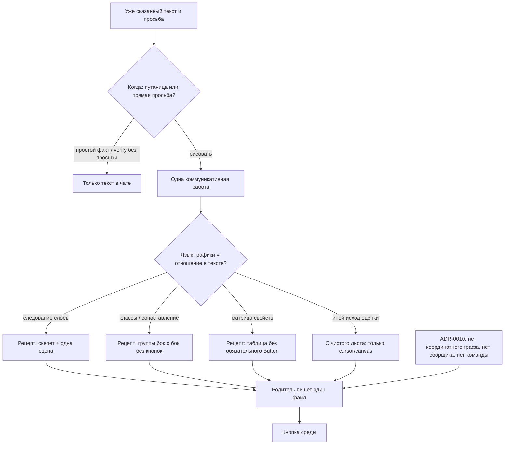

# Architecture: полотно как спутник уже сказанного текста

Исход: **не закрывать `S1.accept` в текущей формулировке** и **не заводить новую поставку / второй навык** — Chosen это `/opsx:extend visual-explanation-composition`: переписать контракт выбора и сборки носителя так, чтобы язык картинки совпадал с отношением в уже сказанном тексте; скелет со сценами остаётся рецептом для разбора механизма слоями, а не успехом всей панели.

Отчёт `reports/architecture-new-2026-08-31.md` остаётся источником по авто/намёку (путаница частей, слоёв или случаев) и по сохранению запрета графа. Этот отчёт **сменяет Chosen носителя**: «главная область = скелет + одна сцена» больше не является универсальным успехом поставки.

Kit-only. Нет `src/`, нет `.bsl`, нет объектов метаданных 1С. Context Gap из‑за отсутствия explorer по модулям 1С не применяется.

## KB references

Discovery выполнен, совпадений нет (таксономия KB в kit отсутствует). Конфликтов нет. Секция `## Knowledge conflicts` не требуется.

## Task

Закрепить, какой контракт навыка и шаблона менять, чтобы панель рядом с чатом усиливала уже сказанный текст, а не рассказывала устройство механизма чужим графическим языком. Закрыть вилку поставки (extend незакрытого среза vs новая ЗНИ vs закрыть приёмку как есть). Сохранить несущее решение про панель (запрет координатного графа, файл пишет родитель, нет сборщика, нет отдельной команды, нет авто на проверке постановки и ревью, простой факт без панели, успех — кнопка среды). Не хардкодить сюжет «слова совпадает → три колонки».

## Complexity

**Medium.** Точка правки — существующий навык, шаблон панели, дельта требований, уточнение инвариантов ADR-0010, перепись приёмки среза. Нет перехватов 1С, нет новых объектов метаданных, apply — mechanical markdown и шаблон панели. Затрагивается несущее решение и незакрытая поставка: нужен Blast Radius, не новый ADR.

## Existing Mechanisms

1. **Навык `.cursor/skills/visual-explanation/SKILL.md` и шаблон `fixtures/panel-shell.md` — единственная точка правки продукта.** Второй навык «карта vs объяснение» не заводить. Capability `scenario-map-canvas` в kit снята; живой провал 1 сентября в PavDO шёл на её копии и **не является причиной текущих файлов kit**. Текущий навык воспроизводит тот же *класс* ошибки другими правилами: закрытый набор из четырёх форм, умолчание скелета со сценами, запрет «все случаи сразу», таблица с кнопкой на имя.

2. **ADR-0010 уточняется in-place, не заменяется.** Сохраняются: прямая просьба открывает панель из текущего ответа; авто/намёк по путанице (уже уточнено composition); файл пишет родитель; сборщик не вызывается; нет `/opsx:*`; нет `computeDAGLayout` и графа с абсолютной раскладкой; простой факт и список без связей — текст; на `/opsx:verify` и `/review` авто нет; успех — кнопка среды; путь не в чат и не в git. Уточняются инварианты про форму (четыре значения как мир; таблица только как сравнение свойств; «форма следует за содержанием» = ближайшая из четырёх).

3. **Примитивы `cursor/canvas`, которые шаблон уже импортирует** (`Stack`, `Row`, `Table`, `Text`, `Card`, `Button`, `Pill`, `Divider`, `H1`, `H2`, заголовок/тело карточки, состояние, тема, действие) — достаточный носитель для рецепта классификации (ряд стопок = одновременные классы) **без** добавления `Grid` как зависимости поставки. `Grid` / `Callout` **не запрещать как продукт** (запрет виджета сделал удачную картину 1 сентября нелегальной) и **не требовать** (рецепты библиотеки на них не опираются). Самодельный HTML, водяной текст, координатная раскладка — по-прежнему запрещены.

4. **Слот «Дальше» исследования** уже выровнен с критерием *когда* открывать (путаница). Эту поставку слот **не** расширяет критерием *как* рисовать: сборка носителя живёт только в навыке визуального объяснения. Намёк в пошаговом разборе и обзоре — **закрытое решение `hint-slots-explain-overview`**, не открывать.

5. **Модель данных панели** (вопрос, вывод, элементы, связи только из сказанного, `confidence`, опциональное доказательство, стартовый фокус) **сохраняется** как сборка смысла. Поле `presentation.form` становится **необязательным указанием рецепта**, не закрытым миром. `scenes[]` остаётся для рецепта «механизм слоями», не обязателен для классификации.

Почему не новый механизм: Preference Hierarchy для kit — править существующий навык. Параллельный скилл повторит раскол «карта / объяснение», который уже снимали 31 августа.

## Chosen Approach

**Approach**: Minimal changes — **extend незакрытой поставки `visual-explanation-composition`**, переписать контракт носителя и приёмку до закрытия `S1.accept`.

**Rationale**:

- Исходный Why composition («панель объясняет тот же вопрос, что текст») уже про спутника текста. Реализация сузила успех до «скелет + одна сцена + не плакат + не сетка». Именно это сужение делает удачную картину сопоставления 1 сентября нелегальной. Чинить это *после* архивации среза — сразу отменять только что принятый контракт (худший Blast Radius).
- Рабочие задачи S1.1–S1.5 отмечены выполненными, **живая приёмка открыта**. Это естественная точка не поставлять универсальный запрет плаката и умолчание скелета.
- Новая ЗНИ при открытом `S1.accept` даёт два конкурирующих контракта на одних файлах. Закрыть приёмку «как есть» и вынести спутника в новую поставку — заархивировать «не плакат / не Grid / одна сцена» как успех, затем немедленно `revokes`.
- Preference: один навык. Несущие запреты ADR-0010 не откатывать.

**Вердикт по вилке поставки (вопрос 1):** **extend**. Не `/opsx:new`. Не закрывать `S1.accept` на текущем тексте чеклиста.

**Вердикт по контракту (вопрос 2)** — что менять, одним списком MUST:

| Элемент | Сейчас | Chosen |
|---------|--------|--------|
| Критерий выбора носителя | Ближайшая из четырёх форм; неизвестный жанр → не отказ, а ближайшая | Сначала **назвать одну коммуникативную работу** относительно уже сказанного текста. Затем выбрать язык графики, который **кодирует то же отношение**. Критерий: простота восприятия **и** информативность относительно этой работы. Форма источника (цепочки в отчёте) **не** основание. |
| Закрытый список форм | `flow` \| `table` \| `hierarchy` \| `card`; иначе ближайшая | Четыре значения — **необязательные рецепты**, не мир. Поле формы MAY остаться подсказкой рецепта. Родитель MAY собрать полотно с чистого листа из примитивов `cursor/canvas`. Правило «неизвестный жанр → ближайшая из четырёх» **снять**. |
| Умолчание скелета | Главная область по умолчанию — скелет слоёв + шаг; `flow`/`hierarchy` всегда в обёртке сцен | **Нет умолчания «скелет».** Рецепт «скелет + одна сцена» — когда работа = последовательный разбор механизма / слоёв (почему одного наивного шага мало). Не применять, когда работа = классификация уже сказанного. |
| Запрет «плакат случаев» | Случай = следующий шаг; не боковая колонка; не все случаи сразу | **Сузить.** Запрещено: несколько коммуникативных работ на одном полотне; каталог всех шагов *процесса* под видом одной сцены. **Разрешено:** все уже сказанные классы сразу, бок о бок, когда работа = классификация. Боковая колонка класса — законный язык сопоставления, не «плакат». |
| Поверхность таблицы | Колонки «Элемент / Пояснение / Связь»; имя = `Button`; выбор строки; `openFile` в деталях | Рецепт «матрица свойств» **не** обязан ни к кнопке на имени, ни к выбору строки, ни к фиксированным трём колонкам. Интерактив — только если без него нельзя схватить работу полотна. Доказательство: **одно на полотно** или **точечная цитата**; запрет N кнопок в один файл без перехода к месту. |
| Библиотека vs обязательный шелл | Один обязательный шелл: `ItemButton`, выбор, детали, степпер для потока | Шаблон — **библиотека необязательных рецептов** плюс протокол «с чистого листа». Регистрация без `Button`/`selectItem`/`openFile` — штатная. Обязательны только: импорт из `cursor/canvas`; запрет HTML/водяного текста/координатного графа; родитель пишет один файл. |
| Проверка «полотно самодостаточно без шапки» | Пока скелет: убрать текст вывода — по скелету и шагу всё ещё назвать вывод, иначе не публиковать | **Две разные проверки.** (1) Защита «смысл только в H1» сохраняется: каталог имён с выводом лишь в шапке не публиковать. (2) Спутник: закрыть заголовок и легенду — оставшийся графический язык всё ещё кодирует **то же отношение, что текст** (стрелки ≠ классы). Полотно **не** обязано заменять чат и отчёт. |

**Не хардкодить** правила вида «в тексте есть совпадает/сильнее/иначе → три колонки». Универсальность — в критерии работы и языка, не в сюжете.

**Не открывать** `hint-slots-explain-overview`.

## Simplicity Check

- **Viable alternatives**:
  1. **E1 — extend composition, переписать носитель и приёмку до `S1.accept` (выбран).** Те же файлы навыка/шаблона/spec/ADR; S1 сужается до рецепта «механизм слоями»; добавляется S2 «спутник / сопоставление»; скелет сохраняется как рецепт, не как мир.
  2. **E2 — закрыть `S1.accept` как есть, новая ЗНИ на спутника текста.** Архив фиксирует «одна сцена / не плакат / не Grid» как успех; следующая поставка вынуждена `revokes` в тот же день. Два контракта на одних файлах в промежутке.
  3. **E3 — новая ЗНИ, не закрывая `S1.accept`.** Конкуренция постановки и кода на тех же путях; приёмка composition остаётся «не плакат», а новый change учит колонки.
  4. **E4 — точечно вычистить `Button` из `TableView`, enum и умолчание скелета оставить.** Второй провал 1 сентября (кнопки) закрывается, первый (конвейер вместо классов) — нет: смешанный отчёт и «ближайшая из четырёх» снова дадут поток со стрелками вниз.
  5. **E5 — добавить пятую форму `grid` / «колонки» в закрытый enum.** Следующая работа (не три колонки и не скелет) снова мимо списка. Прямо запрещено принципами заказчика: формат не правило.
  6. **E6 — второй навык «сопоставление» рядом с визуальным объяснением.** Parallel Workflow; откат решения 31 августа «один продукт панели».
  7. **E7 — вернуть граф и `computeDAGLayout`.** Откат ADR-0010. Запрещено сохраняемым несущим решением.
- **Selected simplest viable design**: **E1**.
- **Why not simpler**: E4 не закрывает корневую причину (нет критерия «язык = отношение в тексте»). E5 снова закрывает мир форм. E2/E3 дороже по Blast Radius при том же наборе файлов. E6/E7 ломают сохранённые контракты. Ещё проще, чем E1, было бы «не трогать composition и только написать памятку оркестратору» — это не меняет навык, слепой прогон снова соберёт шелл.
- **Complexity budget**:
  - Files touched: 7 kit (навык, шаблон, proposal, design, tasks, delta spec, ADR-0010); главные `openspec/specs/visual-explanation/spec.md` — при archive/sync, не в этом ходе apply. Слот исследования и навыки разбора/обзора — **0**.
  - Hooks/intercepts: 0
  - New procedures/functions: 1 опциональный рецепт классификации в том же шаблоне (ряд стопок, имя + пометка, без кнопки); новых модулей 1С нет
  - Conditional branches / feature flags: 0 флагов; вместо переключателя четырёх форм — оценка работы (одна развилка «какое отношение в тексте»)

Only one viable option — **нет**: альтернативы E2–E7 разобраны выше.

## Blast Radius

Секцию **скопировать в `design.md` при extend** (колонки как здесь). Это не замена секции Blast Radius внутри ADR-0010 про 0008/0009 — ту секцию ADR **не** переписывать.

| Контракт | Архивный источник | Эффект для человека | Альтернативы | Обоснование |
|----------|-------------------|---------------------|--------------|-------------|
| На полотне вопрос, вывод, скелет и **одна** сцена; случай — следующий шаг, не боковая колонка; «плакат всех случаев» не публикуется | Активная `visual-explanation-composition`: Goals 2, Behavior 4–7, spec ADDED «Panel tells one scene…», Scenario «Плакат всех случаев не публикуется», `S1.accept` | Когда в чате уже собраны классы сопоставления, человек видит **все классы сразу** одним языком (группы одного ранга, имя + пометка). Когда работа — слои механизма, по-прежнему одна сцена на скелете, не каталог всех шагов процесса | Оставить универсальный запрет плаката; принять S1 как есть | Универсальный запрет — причина, по которой опорная картина 1 сентября нелегальна в kit |
| Не добавлять `Grid` и `Callout`; не опираться на них | composition Assumptions; S1.2; шаблон «не добавлять Grid» | Рецепты библиотеки остаются на `Row`/`Stack` (колонки классов без `Grid`). С чистого листа родитель **может** импортировать любой примитив `cursor/canvas`, если он есть в среде. Запрет виджета больше не запрещает язык «классы бок о бок» | Обязать `Grid`; сохранить жёсткий запрет | Запрет виджета ≠ запрет языка. Обязательный `Grid` — хардкод формата |
| Форма ∈ {поток, таблица, иерархия, карточка}; неизвестный жанр → ближайшая из четырёх; таблица **только** если вопрос — сравнение одних и тех же свойств | ADR-0010 Protects-invariants «Форма следует за содержанием…»; composition D3; SKILL шаг 3; spec «Form follows the content» (main и delta) | Человек получает картину под **работу над текстом**, а не ближайший виджет. Матрица свойств по-прежнему может быть таблицей. Классификация **не** обязана становиться сеткой «Элемент / Пояснение / Связь» | Оставить закрытый enum; добавить пятое значение | Enum и есть класс ошибки «не та картина». Пятое значение не масштабируется |
| Главная область **по умолчанию** — скелет слоёв и текущий шаг | `panel-shell.md` обязательные пункты; SKILL шаг 5 «пока главная область — скелет» как основная ветка смысла | После разбора слоями скелет остаётся уместным рецептом. После просьбы «отметь отличия» к уже сказанному сопоставлению **нет** стрелок «затем» по умолчанию | Оставить умолчание скелета | Умолчание заставляет смешанный отчёт (цепочки + список классов) рассказывать конвейер |
| Публикация: убрать текст вывода — по скелету и шагу всё ещё назвать вывод | SKILL шаг 5; spec ADDED «если убрать текст вывода…»; composition Behavior 3 | Шапка и чат могут нести заказ («не понял пункт 7»). Полотно усиливает текст. Не публикуется только полотно, чей **язык** чужой тексту, и полотно, где смысл есть лишь в H1 | Оставить экзамен самодостаточности скелета для всех форм | Экзамен толкает «историю механизма» вместо спутника текста |
| Выбор элемента обязателен; имя — кнопка; путь — `openFile` в деталях; в рецепте таблицы то же на каждой строке | ADR-0010 решение п.3–4 (детали выбором; файл не выбором); `panel-shell.md` `ItemButton` / `TableView`; spec «Panel opens with the environment button» (выбор показывает подробности) | Интерактив появляется, только если меняет понимание. Сопоставление читается без N кнопок в один отчёт. Запрет «выбор сам открывает файл» и запрет нового чата **сохраняются** | Оставить обязательный выбор как хром шелла | Второй живой провал 1 сентября: верный класс картины, неверная поверхность |
| Запрет графа с абсолютной раскладкой и `computeDAGLayout`; файл пишет родитель; нет сборщика манифеста; нет `/opsx:*`; авто нет на verify/review; простой факт без панели; успех — кнопка среды | ADR-0010 Load-Bearing; архив `2026-08-31-universal-visual-explanation` | **Сохраняется** | Вернуть граф / сборщика / команду | Это работало и было целью замены карты |
| Намёк в пошаговом разборе и обзоре вне composition | composition Decisions / «Решения verify»; closed `hint-slots-explain-overview` | **Сохраняется** (схему там по-прежнему запрашивают прямой просьбой) | Выровнять намёк в этой же extend | Не болит в RCA 1 сентября; не раздувать scope |
| Главный вид только граф или таблица колонок карты сценария; смешанное → граф | Архив `2026-08-28-scenario-map-canvas` / ADR-0008/0009 (уже superseded ADR-0010) | **Не возвращать.** В kit capability снята. Не ставить причиной текущих файлов | Восстановить карту | Adjacent; живой провал PavDO был на копии, не на kit 1.0 |

Классификация расхождений с активной composition: **`revokes` (сужение до условного)** для универсальных «одна сцена / не плакат / не Grid как продукт»; **`extends`** для авто по путанице, носителя `cursor/canvas`, запрета метатекста, запрета координатного графа; **`restructure`** для «форма следует за содержанием» (рецепты вместо enum без смены цели ясности).

Классификация относительно архива `2026-08-31-universal-visual-explanation`: **`extends`** цель «панель объясняет тот же вопрос, что текст»; **`restructure`** инварианта четырёх форм (рецепты, не мир); **не `revokes`** запрета графа и регистрации родителем.

## Found Patterns

### Pattern 1: Родитель пишет файл, сборщика нет

- **Where**: `SKILL.md` шаги 2 и 6; ADR-0010 Protects-invariants
- **Usage**: данные из текущего ответа; один `.canvas.tsx` в каталог панелей; путь не в чат
- **Evidence**: SKILL.md строки 57–69; ADR-0010 решение п.1
- **Confidence**: high
- **Applicability**: не менять. Протокол «с чистого листа» — тот же родитель, без сборщика манифеста

### Pattern 2: Закрытый переключатель четырёх форм в шелле

- **Where**: `panel-shell.md` тип `Form`, `Main()` ветви `table` / `card` / `hierarchy` / иначе поток
- **Usage**: любая публикация обязана попасть в одну ветку
- **Evidence**: `panel-shell.md` около объявления `type Form` и функции `Main`
- **Confidence**: high
- **Applicability**: ветки остаются **рецептами**. Добавить рецепт классификации (`Row` стопок). Не делать `Main()` единственным законным путём: SKILL разрешает файл без этого переключателя

### Pattern 3: Обязательный `ItemButton` и выбор

- **Where**: `panel-shell.md` `ItemButton`, `TableView` первая колонка, боковая карточка выбранного, `openFile`
- **Usage**: каждое имя — кнопка; выбор не открывает файл (это верно); доказательство — кнопка в деталях
- **Evidence**: RCA exploration факт 4; бриф PavDO §3.4
- **Confidence**: high
- **Applicability**: хром становится опцией рецепта «нужны детали по выбору». Рецепт сопоставления — `Text` имени и пометки, без кнопки

### Pattern 4: Умолчание скелета со сценами

- **Where**: SKILL шаг 3–5; `panel-shell.md` «главная область по умолчанию»; `skeletonScenes = form === flow \|\| hierarchy`
- **Usage**: поток и иерархия всегда получают степпер и проверку «вывод по скелету»
- **Evidence**: SKILL.md шаг 5; design Behavior 4
- **Confidence**: high
- **Applicability**: сохранить как рецепт S1 (механизм слоями). Снять как default для любой просьбы «дай схему»

### Pattern 5: Запрет плаката случаев как ADDED этой поставки

- **Where**: delta spec Requirement «Panel tells one scene on a stable skeleton», Scenario «Плакат всех случаев не публикуется»
- **Usage**: несколько случаев → не все сразу рядом с застывшим скелетом
- **Evidence**: `specs/visual-explanation/spec.md` дельты, ADDED
- **Confidence**: high
- **Applicability**: сузить предикат до работы «последовательный процесс». Для работы «классификация» сценарий **заменить**: все классы сразу — успех, конвейер — провал

### Pattern 6: Опорная картина сопоставления (PavDO, не kit)

- **Where**: бриф PavDO §4, файл идеала с чистого листа: три группы, имя + пометка, без `Table`/`Button`/`openFile`
- **Usage**: язык «класс = место группы», не «стрелка = затем»
- **Evidence**: бриф §3.6, §4, §9
- **Confidence**: high (verified живой приёмкой заказчика 1 сентября)
- **Applicability**: **ориентир удачи для пакета регрессии**, не предписанный формат навыка. В kit тот же язык собирается `Row`+`Stack`+`Text`

### Pattern 7: Авто по путанице уже в навыке

- **Where**: SKILL Entry Protocol «Авто»; composition D1; ADR-0010 второй инвариант
- **Usage**: когда открывать, не как рисовать
- **Evidence**: SKILL.md «Авто (без просьбы)»; ADR-0010
- **Confidence**: high
- **Applicability**: не переоткрывать. Прямая просьба **не** подменяет оценку носителя (урок карты: просьба «дай схему отличий» становилась цепочкой)

## Assumptions

- **Assumption 1**: В среде по-прежнему доступны `Stack`, `Row`, `Table`, `Text` из `cursor/canvas`.
  - **Confidence**: high
  - **Verification**: текущий импорт шаблона
- **Assumption 2**: Примитив `Grid` может отсутствовать в части сред — поэтому рецепты библиотеки на него не опираются.
  - **Confidence**: medium
  - **Verification**: не блокирует Chosen (ряд стопок)
- **Assumption 3**: Пакет регрессии бриф PavDO §9 можно принять в kit **описанием класса картины** (сопоставление без конвейера и без N кнопок), без копирования прикладных данных заказчика в git kit.
  - **Confidence**: high
  - **Verification**: сценарий приёмки S2 формулируется по §9; живые `.canvas.tsx` PavDO в kit не класть
- **Assumption 4**: Рабочая копия навыка в kit соответствует S1.1–S1.5 (скелет уже в файлах).
  - **Confidence**: high
  - **Verification**: прочитанные SKILL.md и panel-shell.md 2026-09-01

## Open Questions

- **Question 1**: Нужна ли в kit анонимизированная фикстура входа для слепого прогона (списки классов без прикладных имён PavDO), или достаточно текста сценария по бриф §9 в `tasks.md`?
  - **Addressed to**: User
  - **Blocker**: No. Пока Chosen — сценарий в постановке; фикстура MAY появиться в apply, не держит extend.

## Clarifications

### Decision E-D1: Поставка

- **Question**: extend vs новая ЗНИ vs закрыть приёмку как есть?
- **Answer**: extend `visual-explanation-composition`. `S1.accept` не закрывать на текущем тексте.
- **Impact**: оркестратор — `/opsx:extend visual-explanation-composition` после блока постановки в чате.

### Decision E-D2: Когда vs как

- **Question**: менять ли критерий авто?
- **Answer**: нет. Авто/намёк и слот «Дальше» остаются про путаницу. Меняется **сборка после решения рисовать**. Прямая просьба открывает панель, но шаг формы больше не «ближайшая из четырёх».
- **Impact**: меньше Blast Radius; RCA 1 сентября — про язык, не про молчание после слоёв (молчание уже закрыто D1).

### Decision E-D3: Скелет сохраняется как рецепт

- **Question**: выкидывать ли рассказ «механизм слоями — скелет»?
- **Answer**: нет. Это по-прежнему верный язык, когда работа — слои и шаги. Меняется область действия: не default и не единственный успех `S1.accept`.
- **Impact**: два обязательных сценария приёмки, не замена одного сюжета другим.

### Decision E-D4: Таблица свойств не удаляется

- **Question**: удалять ли ветку `Table`?
- **Answer**: нет. Матрица одинаковых свойств у вариантов остаётся рецептом. Меняется поверхность: нет обязательных кнопок и фиксированных колонок «Элемент / Пояснение / Связь» как единственной таблицы.
- **Impact**: D3 composition («таблица не сток упрощения») сохраняется.

### Decision E-D5: ADR-0010

- **Question**: новый ADR?
- **Answer**: нет. In-place уточнение инварианта формы (рецепты, не enum; таблица не единственный не-скелет; нет умолчания скелета). Статус Load-Bearing, запрет графа, родитель, команда, verify — без изменений. Секцию Blast Radius про 0008/0009 не трогать.
- **Impact**: тот же приём, что D5 composition.

### Decision E-D6: Identity / сюжетные литералы

- **Question**: кодировать ли «совпадает → три колонки»?
- **Answer**: нет. См. `## Hardcode Justification`.
- **Impact**: слепой тест на пакете §9 без подсказки вида.

## Hardcode Justification

Chosen **не** использует allow-list имён форм, метаданных или сюжетных слов.

1. **Кали уже фильтрует scope?** Да: коммуникативная работа выводится из уже сказанного текста и просьбы, не из списка сюжетов.
2. **Набор закрыт навсегда?** Закрытого набора сюжетов нет и не будет. Закрытый enum форм как раз снимается.
3. **План при N+1?** Появляется новая работа над текстом — оценка по тем же двум критериям (простота восприятия × информативность) и проверка языка. Новый виджет в enum не добавляется.

Формулировка «временно три колонки на первый релиз» **запрещена** как Chosen.

## Architecture

### Components



#### Component 1: Навык визуального объяснения

- **Path**: `.cursor/skills/visual-explanation/SKILL.md`
- **Responsibility**: когда открывать (без изменений по сути D1); **как** собрать носитель (новая оценка работы и языка); запреты HTML/координат; родитель пишет файл; одна строка в чат
- **Dependencies**: шаблон-библиотека; глобальный скилл Canvas среды (каталог); ADR-0010
- **Evidence**: текущие шаги 2–6; RCA корневая причина
- **Interface**:
  - Шаг «Работа» — одна фраза работы относительно указанного основного текста (не экзамен `question` из 12 слов)
  - Шаг «Язык» — что кодируют место, группа, стрелка, шаг; смена раскладки тех же рёбер «затем» ≠ новая картина
  - Шаг «Носитель» — рецепт или чистый лист; интерактив только если меняет понимание
  - Шаг «Проверки» — смысл не только в H1; язык не чужой тексту; не публиковать конвейер вместо уже сказанных классов

#### Component 2: Библиотека рецептов шаблона

- **Path**: `.cursor/skills/visual-explanation/fixtures/panel-shell.md`
- **Responsibility**: необязательные заготовки; пример скелета **остаётся** (приёмка механизма); пример классификации на `Row`/`Stack`/`Text`; пример таблицы без обязательного `Button`; общий каркас шапки (работа + вывод) MAY
- **Dependencies**: только `cursor/canvas`
- **Evidence**: текущий файл — обязательный шелл, это и есть дефект поверхности
- **Interface**: родитель копирует рецепт **или** не копирует и пишет файл сам, сохраняя запреты носителя

#### Component 3: Дельта требований и срезы

- **Path**: `openspec/changes/visual-explanation-composition/specs/visual-explanation/spec.md`, `tasks.md`, `design.md`, `proposal.md`
- **Responsibility**: сузить ADDED «одна сцена»; заменить Scenario «плакат»; добавить требование спутника и сценарий сопоставления; переписать `S1.accept`; добавить S2
- **Evidence**: текущая дельта; tasks S1.accept открыт

#### Component 4: ADR-0010

- **Path**: `openspec/adrs/ADR-0010-visual-explanation-panel.md`
- **Responsibility**: уточнить инвариант формы; не заменять файл; не трогать Blast Radius 0008/0009
- **Evidence**: D5 composition как прецедент уточнения

### Data Flow

```mermaid
sequenceDiagram
    participant U as Человек
    participant C as Чат уже сказанное
    participant S as Навык
    participant F as Рецепт или чистый лист
    participant E as Кнопка среды

    U->>C: Просьба «дай схему» к уже сказанному
    C->>S: Текст + просьба
    S->>S: Работа одна; язык = отношение
    alt работа = слои механизма
        S->>F: Рецепт скелета
    else работа = сопоставление классов
        S->>F: Группы без конвейера и без N кнопок
    else иное
        S->>F: Сборка с чистого листа
    end
    F->>E: Файл панели
    E->>U: Полотно рядом с чатом
```

**Flow description**:

1. Решение *рисовать* — прежнее (просьба или путаница).
2. Решение *что за картина* — новое: работа над текстом, не enum.
3. Если в сессии уже есть список классов, полотно **есть этот список**, а не новая история из цепочек отчёта.
4. Уточнение «не понял пункт 7» — акцент на элементе класса, не новая ветка конвейера.
5. Успех — кнопка среды; в чате одна строка без пути.

### Implementation Map

**Create (metadata 1С):** нет.

**Create (kit, опционально в apply):** не обязательно новый файл; предпочтительно секции рецептов внутри `panel-shell.md`. Отдельный второй скилл — запрещён.

**Modify:**

- `.cursor/skills/visual-explanation/SKILL.md` — шаги 3–6 (форма, смысл, носитель); description MAY: «усиливает уже сказанный текст», не только «скелет»
- `.cursor/skills/visual-explanation/fixtures/panel-shell.md` — обязательность хрома снять; рецепт классификации; таблица без обязательного Button; запрет Grid как продукт снять, в рецепты Grid не добавлять
- delta spec — сужение one-scene / poster; ADDED спутника
- `proposal.md` / `design.md` / `tasks.md` — Why дополнить спутником; Goals 2 не универсальный скелет; S2; Blast Radius как в этом отчёте
- `openspec/adrs/ADR-0010-visual-explanation-panel.md` — инвариант формы

**Не модифицировать в этом extend:** `.cursor/skills/openspec-explain/**`, `.cursor/skills/openspec-overview/SKILL.md`, прикладной `src/**`.

## Implementation Phases

### Phase 1: Контракт навыка (работа и язык)

- [ ] Переписать шаги 3–6 SKILL.md по таблице Chosen (критерий, нет enum-мира, нет умолчания скелета, суженный плакат, интерактив, две проверки шапки)
  - Files: `.cursor/skills/visual-explanation/SKILL.md`
  - Criteria:
    * Есть шаг «назвать работу относительно текста» до выбора виджетов
    * Нет правила «неизвестный жанр → ближайшая из четырёх» как обязательного мира
    * Нет умолчания скелета для любой публикации
    * Рецепт скелета явно привязан к работе «слои / последовательность»
    * Нет хардкода сюжета сопоставления
  - Dependencies: none (extend артефактов)

### Phase 2: Шаблон как библиотека

- [ ] Сделать хром `ItemButton` / степпер / детали необязательным; добавить рецепт групп на `Row`+`Stack`+`Text`; ослабить `TableView`
  - Files: `.cursor/skills/visual-explanation/fixtures/panel-shell.md`
  - Criteria:
    * Можно опубликовать классификацию без `Button` и без `openFile`
    * Пример скелета на месте (регресс механизма)
    * Ветка таблицы на месте для матрицы свойств, без обязательной кнопки на имени
    * Рецепты не импортируют `Grid` как зависимость; продукт не запрещает `Grid` в сборке с чистого листа
  - Dependencies: Phase 1 (чтобы шелл не спорил с навыком)

### Phase 3: Постановка, spec, срезы, ADR

- [ ] Extend proposal/design/tasks/spec; сузить S1; добавить S2; уточнить ADR-0010
  - Files: `openspec/changes/visual-explanation-composition/**`, `openspec/adrs/ADR-0010-visual-explanation-panel.md`
  - Criteria:
    * `S1.accept` не содержит универсального «не плакат / не таблица» как отказ классификации
    * S2 primary = пакет бриф §9 (класс картины, не формат)
    * В design есть `## Blast Radius` из этого отчёта
    * ADR не заменён, инвариант формы уточнён
  - Dependencies: согласованный Chosen (этот отчёт)

### Phase 4: Приёмка двух работ

- [ ] Ручная проверка в Cursor: механизм слоями — скелет; сопоставление — без конвейера и без N кнопок
  - Files: живые панели среды (не git)
  - Criteria: см. Test Scenarios
  - Dependencies: Phase 1–3, apply

Порядок apply: Phase 3 (артефакты extend) → Phase 1–2 (mechanical) → Phase 4. Оркестратор extend сам переписывает постановку до apply.

## Test Scenarios

### Scenario 1: Сопоставление уже сказанного (пакет бриф PavDO §9) — primary S2

- **Actor**: разработчик kit / заказчик на тексте со списками «совпадает / сильнее / иначе» и уточнением «не понял пункт 7; дай схему; отметь отличия функционала»
- **Action**: открыть панель по просьбе; в навык **не** подсказывать «три колонки»
- **Expected Result**: одно полотно **класса** сопоставление одноимённых эффектов; пункт 7 — элемент класса «иначе» (или эквивалент), не ветка конвейера; пометки одного ранга у элементов всех классов; интерактив не обязателен; если якорь доказательства есть — один или точечный, не десять кнопок в один файл. Заведомо неверно: DAG/стрелки «затем». Заведомо слабо: сетка с кнопкой на каждом имени.

### Scenario 2: Механизм слоями — скелет (сохранённый primary S1)

- **Actor**: человек после обычного ответа про механизм из нескольких слоёв (не verify, не review, не разбор, не обзор)
- **Action**: просьба «покажи схему» или авто по путанице слоёв
- **Expected Result**: вопрос, вывод, скелет именованных частей, одна сцена; части вне фокуса на месте; не сетка «элемент / пояснение / связь» *как сток*; в чате нет пути. Наивный одношаговый путь — видно, почему его мало, если он был в ответе.

### Scenario 3: Смешанный источник не имеет права на конвейер

- **Actor**: в чате уже есть список классов, в отчёте — цепочки вызовов
- **Action**: просьба о схеме отличий
- **Expected Result**: полотно = классы, не пересказ цепочек отчёта. Поворот того же потока с теми же рёбрами «затем» не засчитывается как сопоставление.

### Scenario 4: Матрица свойств без N кнопок

- **Actor**: вопрос — сравнить одни и те же свойства у нескольких вариантов
- **Action**: публикация рецепта таблицы
- **Expected Result**: таблица допустима; имена не обязаны быть кнопками; нет пачки `openFile` в один путь.

### Scenario 5: Простой факт и verify — без регресса ADR-0010

- **Actor**: одно имя поля; либо `/opsx:verify` без просьбы
- **Action**: ответ
- **Expected Result**: панели нет. Прямая просьба на verify — панель, в чате одна строка.

### Scenario 6: Слепой прогон без хардкода сюжета

- **Actor**: субагент только с принципами и пакетом §9, без «правильный вид = колонки»
- **Action**: выбрать работу, язык, `wrong_picture`, проверку закрытой шапки как проверку языка
- **Expected Result**: класс «сопоставление, не процесс»; регистрация **не** через обязательный Table+Button. Провал, если манифест верный, а шелл снова вешает кнопки.

## Critical Details

### Error Handling

```yaml
Strategy:
  - Не публиковать полотно, чей графический язык кодирует чужое отношение (стрелка «затем» вместо класса)
  - Не отказывать из‑за «формы нет в четырёх» — оценить работу и собрать рецепт или чистый лист
  - Нет среды панели — полный текст в чате, честно; markdown-таблица не панель
  - Не выдумывать рёбра и правила; недоказанная связь — не рисовать или пометить догадкой (сохраняется)
  - Не маскировать чужой язык «видом сравнение» при тех же рёбрах следования
  - Defensive cake на виджетах не нужен: это не BSL-контракт параметров
```

### State Management

Степпер сцен — только рецепт скелета. Выбор элемента — только если рецепт реально меняет понимание. Классификация MAY быть статическим полотном без `useCanvasState` на фокусе.

### Testing

Ручная приёмка в Cursor (кнопка среды). Слепой прогон по бриф §5.9 + проверка поверхности (не только класса). Живые `.canvas.tsx` не в git. Стенд 1С не нужен.

### Performance / Security / Access Rights

Не применимо к markdown-навыку kit. Код/SQL по-прежнему не главное содержимое панели (ADR-0010).

### Parameter Contracts

Не применимо: нет `&После` / `&Перед` по модулям 1С.

## Technical Debt

- S1.1–S1.5 уже записали в рабочую копию универсальный скелет и запрет плаката. Пока `S1.accept` открыт, это **не архивный контракт**, но это долг файлов: extend обязан переписать их до приёмки. Не считать S1.5 «сверкой навсегда» — сверка была против дельты 31 августа, не против RCA 1 сентября.
- `reports/architecture-new-2026-08-31.md` не помечается `superseded` целиком: авто по путанице там верно. Носитель (скелет как Chosen успеха) сменяется этим отчётом.

## Next Steps

1. Оркестратор кладёт в чат блок постановки ЗНИ (extend незакрытой поставки) по этому Chosen.
2. `/opsx:extend visual-explanation-composition` — внести Blast Radius, сужение S1, S2, уточнение ADR в артефакты.
3. Не запускать `S1.accept` и не `/opsx:archive` до переписи навыка и шаблона.
4. Apply mechanical по Phase 1–2, затем ручная приёмка Scenario 1 и Scenario 2.

## Рекомендация оркестратору

`/opsx:extend visual-explanation-composition` после блока постановки в чате.
