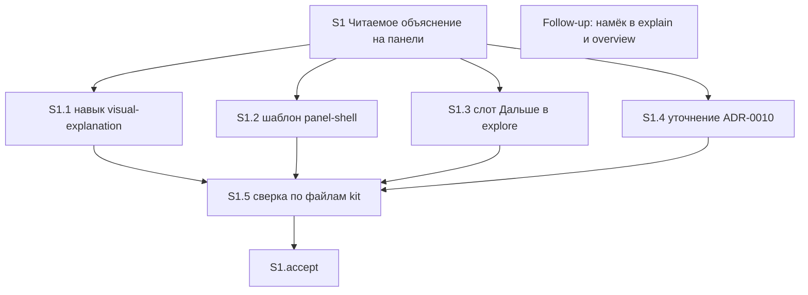

# Quality Control — Slice Coherence

**Change:** `visual-explanation-composition`  
**Дата:** 2026-08-31  
**Прогон:** `quality-control-2026-08-31-3`  
**Режим:** slice mode (`# Срез S1` в `tasks.md`)  
**Артефакты:** `proposal.md`, `design.md`, `tasks.md`, `specs/visual-explanation/spec.md`  
**Критерии:** 1–6, 8, 8b, 9–11 из `.cursor/rules/vertical-slices.mdc`; читаемость — `.cursor/rules/task-readability.mdc`  
**Линза:** kit-ЗНИ (`form_mode: n/a`); apply mechanical (навык, шаблон панели, слот исследования, уточнение ADR); прикладных `.bsl` / XML нет  
**Контекст прогона:** после user-extend намёк в пошаговом разборе и обзоре вынесен в `## Follow-up` / out of scope (не рабочие `S1.<M>`)  
**Out of scope QC:** исполнимость приёмки «прямо сейчас» в Cursor; тестовые данные / эталон ИБ (transient)

Pre-check оркестратора подтверждён независимым чтением `tasks.md`: маркеров ручной конфигурации 1С («вручную» / «в Конфигураторе» / реквизит / роль / элемент формы как обязанность пользователя) в рабочих задачах нет; чекбоксы на месте; закрывающий `<!-- slice-gate -->` есть; `<!-- phase-gate -->` нет; fences сбалансированы; ID с префиксом среза; DENY-маркеров User Task Contract в строках `^- \[[ x]\] S1\.\d+` нет. Файлы из задач существуют и непусты (навык визуального объяснения, шаблон панели, навык исследования, ADR-0010). Новых объектов метаданных нет.

---

## Verdict

`OK`

Один срез S1: пять рабочих задач и одна приёмка. Ровно один mandatory Primary (black-box: панель рядом с чатом после ответа про механизм слоями). Все 19 заголовков `#### Scenario:` покрыты Primary, optional accept или задачами агента. Межсрезовых зависимостей нет. Gate цел. Primary достижим силами `S1.1`–`S1.2` внутри того же среза. Пары foundation+consumer нет. Structural user-spike в `S1.<M>` нет. Блок `## Follow-up` не является рабочей задачей среза и не создаёт второй gate. CRITICAL и WARNING нет.

---

## Slice Summary

| Slice | Scenario | Tasks | Acceptance | Dependencies | Gate |
|---|---|---|---|---|---|
| S1: Читаемое объяснение на панели | После ответа про механизм из нескольких слоёв панель предлагается или открывается по просьбе; на полотне вопрос, вывод, скелет и одна сцена, не таблица и не плакат | 5 рабочих (`S1.1`–`S1.5`) + `S1.accept`; Follow-up вне среза (не чекбокс `S1.<M>`) | `S1.accept` (5 строк чеклиста: 1 Primary + 4 optional; покрытие spec 19/19 с `S1.<M>`) | нет | да (`<!-- slice-gate -->`) |

Метаданные среза полные: `**Сценарий:**`, `**Primary acceptance:**` (Given → When → Then), `**Приёмка:**`, `**Связь со spec:**` (все 19 Scenario дельты `visual-explanation`), `**Зависимости:** нет`, `**Режим apply:** mechanical`.

`form_mode: n/a`. Ручного конфигурирования 1С нет. Legacy `S1.T<M>` нет. Размер: 6 чекбоксов (граница Lite/Standard) — 1 срез по умолчанию, дробление не требуется.

Согласование с `design.md` `## Slices`: имя среза, Primary, «все Scenario дельты», файлы (навык, шаблон, слот «Дальше», ADR-0010) совпадают с `tasks.md`. Второй срез на указатель исследования не выделен — согласовано с постановкой («без навыка указатель не принимается отдельно»).

Согласование с `proposal.md` / `design.md` Non-Goals после extend: выравнивание намёка в пошаговом разборе и обзоре проекта — out of scope этой поставки; в `tasks.md` это `## Follow-up` без ID среза, не `S1.6`. Spec WHEN сценария «Разбор механизма слоями — панель или намёк» явно исключает пошаговый разбор и обзор — покрытие этих команд в рабочих задачах не требуется.

---

## Scenario Coverage

В дельте **19** заголовков `#### Scenario:` (все в `specs/visual-explanation/spec.md`). Имена в ёлочках `tasks.md` совпадают со spec буквально.

| Scenario | Covered by | Status |
|---|---|---|
| Разбор механизма слоями — панель или намёк | S1 Primary (Given/When/Then: обычный ответ про слои, не разбор/обзор → просьба или путаница слоёв → панель) + S1.1, S1.3 | OK |
| Ветвление в ответе | S1.5 (static по тексту навыка) | OK |
| Простой факт без панели | S1.5 | OK |
| Три буллета без связей | S1.5 | OK |
| Проверка постановки без автопанели | S1.5 | OK |
| Просьба на проверке постановки | S1.5 | OK |
| Отказ «без схемы» в сессии | S1.5 | OK |
| Правило о условиях — не всегда таблица | S1.5 + S1.1 (правило формы в навыке) | OK |
| Сравнение свойств — таблица допустима | S1.2, S1.5 | OK |
| Неизвестный жанр не даёт отказ | S1.5 | OK |
| Сложная схема упрощается | S1.2, S1.5 | OK |
| Много частей — скелет, не сетка | S1 Primary (Then: не сетка) + S1.2, S1.5 | OK |
| Нет среды панели | S1.5 | OK |
| Одна сцена на скелете | S1 Primary (Then: вопрос, вывод, скелет, текущий шаг истории) + S1.1 | OK |
| Почему одного наивного шага мало | S1.accept optional | OK |
| Плакат всех случаев не публикуется | S1 Primary (Then: не плакат) + S1.2, S1.5 | OK |
| Полотно без водяного текста | S1.accept optional + S1.5 | OK |
| Координатный граф не публикуется | S1.accept optional + S1.5 | OK |
| Нет метатекста про панель | S1.accept optional + S1.5 | OK |

**19/19.** Покрытие только в `S1.<M>` без буллета accept — допустимо (правило среза 6 / критерий 5b).

Два Scenario, свёрнутые в Primary Then («Разбор механизма слоями — панель или намёк», «Одна сцена на скелете»), плюс отрицания «не сетка» / «не плакат» — один осмотр панели после ответа про слои, не четыре mandatory journey (критерий 10).

**Критерий 1 (путь агента):** охранные и implementation-only сценарии закрыты сверкой по файлам kit (`S1.5`) и правками навыка/шаблона (`S1.1`, `S1.2`). User IB/runtime spike в `S1.<M>` нет. Живой осмотр панели — только на границе среза (`S1.accept`).

**Extend / Follow-up:** отдельного Scenario «намёк в пошаговом разборе / обзоре» в spec нет. Дельта MUST NOT менять эти указатели; `S1.5` явно не сверяет их выравнивание. Пропуск рабочих задач по explain/overview — не `accept-bullets-missing-scenario`.

---

## Dependency Graph

Один срез. Межсрезовых рёбер нет. Циклов нет. Объявлено: `**Зависимости:** нет`. Forward-зависимости приёмки нет: следующего среза нет, дубля Primary нет.

`## Follow-up` не узел графа срезов: нет `S2`, нет `Зависимости: S1`, нет второго `accept` / `slice-gate`.

Внутри среза (поле «Зависимости:» в теле `S1.5` и порядок групп):

`S1.1`–`S1.4` независимы по файлам (четыре разных пути) и могут идти параллельно. `S1.5` явно ждёт все четыре. Follow-up висит отдельно, без ребра к accept. Незаявленных рёбер, ломающих порядок Primary, нет: навык и шаблон входят в тот же срез, что и accept.

---

## Criteria

### 1. Scenario Coverage

Все 19 `#### Scenario:` покрыты одним из: Primary, optional accept, agent `S1.<M>` (static / правка навыка и шаблона). Отдельный срез с accept ни для одного Scenario не требуется: самостоятельный пользовательский исход один (читаемая панель). Пропусков нет. Алерт «Scenario "X" не покрыт» не ставится.

### 2. Slice Independence

S1 принимаем без следующих срезов: следующих нет. Циклов нет. Forward acceptance dependency нет. Follow-up не делает приёмку S1 зависимой от будущей дописки: Primary Given исключает пошаговый разбор и обзор.

### 3. Slice Completeness

Kit-слои, без которых Primary недостижим:

| Слой для Primary | Задача | Status |
|---|---|---|
| Навык (критерий авто/намёка, рассказ: вопрос / вывод / скелет / одна сцена, носитель среды) | S1.1 | OK |
| Шаблон панели (шаги истории, главная область скелет+сцена, пример не таблица) | S1.2 | OK |
| Слот «Дальше» исследования (тот же критерий путаницы) | S1.3 | OK (намёк в исследовании; для Primary «обычный ответ в чате» не обязателен, слой дельты в том же срезе) |
| Уточнение ADR-0010 in-place | S1.4 | OK (несущий документ, не отдельный UX) |
| Static-сверка файлов kit | S1.5 | OK |

Слоёв 1С (метаданные, форма, BSL) изменение не требует. Пропуска слоя, без которого нельзя получить обязательный Then (панель: вопрос, вывод, скелет, текущий шаг, не сетка, не плакат), нет. Срез не foundation-only: навык и шаблон входят в тот же контейнер, что и `S1.accept`.

Файлы пошагового разбора и обзора **не** слой Primary: spec и proposal исключают их из этой поставки.

Исполнимость «откроется ли панель Cursor прямо сейчас» — transient, вне scope.

### 4. Slice Dependency Graph

Метаданные: `нет`. Соседей нет. Внутрисрезовые зависимости ацикличны (`S1.5` ← `S1.1`–`S1.4`). Несоответствия «объявлено / существует» нет. Follow-up не объявлен как зависимость среза — корректно.

### 5. Slice Gate Integrity

Ровно один `- [ ] S1.accept`. Ровно один маркер `<!-- slice-gate: по ответу про механизм слоями панель предлагается или открывается по просьбе; на полотне вопрос, вывод, скелет и одна сцена, не таблица и не плакат -->`. Дубля accept нет. Legacy `S1.T<M>` нет. `legacy-acceptance-format` не ставится. Follow-up не содержит второго gate.

### 5b. Acceptance Checklist Coverage

- `**Primary acceptance:**` в metadata есть. Первый sub-bullet `S1.accept` — `**Primary (обязательно):**` с тем же Given-When-Then. `primary-acceptance-missing` не ставится.
- Тело accept не пустое. `accept-checklist-empty` не ставится.
- Каждый Scenario spec покрыт (таблица выше). `accept-bullets-missing-scenario` не ставится: покрытие только в `S1.<M>` допустимо (критерий 5b / правило среза 6).
- Чужого среза нет → `accept-bullet-foreign-scenario` не применим.

`**Связь со spec:**` перечисляет те же 19 имён, что и spec. Охранные Scenario (факт без панели, verify/review, отказ «без схемы», неизвестный жанр, нет среды и т.д.) сознательно вынесены в `S1.5` (agent static), не в optional accept — согласовано с картой non-scenario правила 6.

### 6. Rework Risk

Предыдущего непринятого среза нет. Сценарии не повторяются в другом срезе. Повторной нарезки (навык как S1 / шаблон как S2) в `tasks.md` нет. Вынос намёка explain/overview в Follow-up **снижает** риск раздуть срез чужим контуром, а не оставляет висящую рабочую задачу без слоя. WARNING/SUGGESTION по rework не ставится.

### 8. Slice Verticality

Обязательный пункт — чёрный ящик: в чате есть обычный ответ про механизм слоями → попросить «покажи схему» или дочитать ответ, где путаются слои → рядом кнопка среды, на панели видны вопрос, вывод, скелет и текущий шаг истории; это не сетка и не плакат; в чате нет пути к файлу. Это действие читателя и проверяемый вид панели, не вызов функции в отладчике и не ревью контракта API. Сверка файлов kit — `S1.5` (agent static), не mandatory Primary. `slice-not-vertical` не ставится.

### 8b. Self-Achievable Acceptance

Соседнего среза нет. Дубля user-journey нет. Primary достижим силами задач этого среза: протокол авто/рассказа (`S1.1`) и шаблон скелета со сценами (`S1.2`) — оба внутри S1. Слой, нужный для Then, не отложен в S2 и не отложен в Follow-up (Given Primary — свободный чат, не разбор/обзор). `slice-accept-not-self-achievable` не ставится.

Отсутствие живого файла панели в git — среда (файл не коммитится, `design.md` § Assumptions), не структурная недостижимость.

### 9. Foundation slice with gate

Второго среза с `Зависимости: S1` нет. Условия `slice-foundation-with-gate` не выполнены (нет пары foundation programmatic-only + consumer UX). S1 сам несёт UX-приёмку. Follow-up не создаёт consumer-срез внутри этой ЗНИ.

### 10. Acceptance Simplicity

В теле `S1.accept` ровно один mandatory black-box journey (`**Primary (обязательно):**`). Остальные 4 sub-bullets помечены «(опционально)». Составной Then (вопрос + вывод + скелет + шаг; не сетка; не плакат; нет пути) — тот же осмотр, не вторая обязательная проверка. Альтернатива When («покажи схему» либо дочитать путаницу слоёв) — два входа одного journey. `acceptance-simplicity-overload` не ставится.

### 11. User Task Contract

Строки `^- \[[ x]\] S1\.\d+`: DENY-маркеров нет (`тестовой ИБ`, `на ИБ вериф`, `на стенде`, `runtime-verify`, `спайк`, `в консоли`, `отладчик`, `эмулировать вызов`, `вызвать API`). Условных цепочек `При успешном verify S` / `после verify S` / `после стенда` нет.

Упоминания `/opsx:verify` и `/review` в `S1.1` / `S1.5` — текст протокола навыка (агент пишет правило), не обязанность пользователя гонять стенд.

S1.5 — сверка по файлам kit (ALLOW-agent: static, не user-spike на ИБ). Живой осмотр панели — только `S1.accept` (граница среза, допустимо пользователю). Follow-up исключён из mechanical grep (не `S<N>.<M>`). Семантических перифраз runtime-spike в `S1.<M>` нет. `user-task-contract-violation` не ставится.

`design.md` § Assumptions: приёмка — открыть панель в чате kit, без стенда 1С. Согласовано с tasks.

---

## Task readability

Паттерн «глагол + файл + результат + (D1–D7 / Scenario)» выполнен для `S1.1`–`S1.5`:

| ID | Глагол | Объект | Результат | Опора |
|---|---|---|---|---|
| S1.1 | Заменить | `.cursor/skills/visual-explanation/SKILL.md` | панель после разбора слоями; на полотне вопрос, вывод, скелет, одна сцена | D1–D4, D7 |
| S1.2 | Заменить | `.cursor/skills/visual-explanation/fixtures/panel-shell.md` | шаблон учит скелет с фокусом, не сетку | D2, D3, D4, D7 |
| S1.3 | Заменить | `.cursor/skills/openspec-explore/SKILL.md` | намёк в исследовании не молчит после разбора слоями | D1, D6 |
| S1.4 | Уточнить | `openspec/adrs/ADR-0010-visual-explanation-panel.md` | два инварианта in-place, без нового ADR | D5 |
| S1.5 | Верифицировать | навык, шаблон, слот, ADR (пути в теле) | файлы совпадают с дельтой; explain/overview не сверять | D1–D7 |

Голых «Реализовать D7» нет. Описания длиннее 8 слов. Рецепт в `S1.4` (точные строки инвариантов) — сам контракт D5, не скрытый HOW поверх наблюдаемого поведения.

`S1.accept`: заголовок с бизнес-результатом среза («рядом с чатом читаемое объяснение механизма, не таблица и не плакат»); первый sub-bullet — mandatory Primary = текст metadata; optional — `Scenario «<имя>»` буквально со spec.

Follow-up: префикс `Follow-up:` + суть и пути файлов — соответствует исключению 3 `task-readability.mdc`. Не оценивается как `S<N>.<M>`.

`task-opaque-title`, `task-too-short`, `task-opaque-acceptance` не ставятся.

Замечание без алерта: `S1.1` и `S1.5` — длинные тела (весь протокол навыка / вся сверка дельты в одной задаче). Для mechanical apply одного среза это допустимо: объект файла у `S1.1` один, у `S1.5` — static-сверка, не user-spike. Дробить в отдельный срез нельзя.

---

## Alerts

Нет.

---

## Recommendations

### Automatic fix

Нет. Repairable-алерты (`primary-acceptance-missing`, `accept-bullets-missing-scenario`, `acceptance-simplicity-overload`, `slice-not-vertical`, `slice-foundation-with-gate`, `user-task-contract-violation`) не сработали.

### Decision required

Нет. Объединять срезы не нужно: срез уже один, Primary самодостаточен. Дробить S1 (навык / шаблон / указатель исследования) нельзя — получится `slice-foundation-with-gate` или `slice-accept-not-self-achievable`. Поднимать Follow-up (explain/overview) в рабочие задачи этого среза нельзя без смены spec/proposal: дельта явно исключает эти указатели из поставки.
