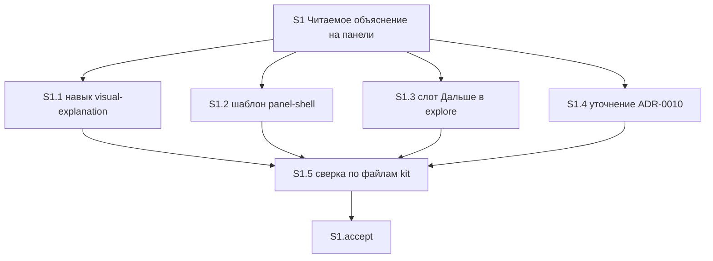

# Quality Control — Slice Coherence

**Change:** `visual-explanation-composition`  
**Дата:** 2026-08-31  
**Прогон:** `quality-control-2026-08-31`  
**Режим:** slice mode (`# Срез S1` в `tasks.md`)  
**Артефакты:** `proposal.md`, `design.md`, `tasks.md`, `specs/visual-explanation/spec.md`  
**Критерии (запрос прогона):** 1, 3, 5, 5b, 8, 8b, 9–11 из `.cursor/rules/vertical-slices.mdc`; читаемость задач — `.cursor/rules/task-readability.mdc`. Критерии 2, 4, 6 заполнены для полноты формата (один срез — вакуумно выполнены).  
**Линза:** kit-only (`form_mode: n/a`); apply mechanical (markdown/шаблон панели); приёмка — открыть панель в Cursor рядом с чатом, не стенд 1С  
**Out of scope:** исполнимость осмотра панели в Cursor прямо сейчас; тестовые данные / эталон ИБ (transient)

Pre-check оркестратора: маркеров ручной конфигурации 1С нет; mechanical issues нет; DENY-маркеров User Task Contract в строках `S1.1`–`S1.5` нет. QC подтверждает.

Репозиторий (контекст оркестратора, не критерий QC): kit-only; перечисленные файлы навыка, шаблона, ADR существуют; объектов `src/` нет.

---

## Verdict

`OK`

Один срез S1, один mandatory Primary (black-box в Cursor), 19/19 заголовков `#### Scenario:` покрыты Primary / optional accept / задачами агента. Межсрезовых зависимостей нет. Gate цел. S1 не foundation-срез: следующего среза нет, Primary наблюдаем и достижим задачами `S1.1`–`S1.2` (навык + шаблон). Structural spike отсутствует. CRITICAL и WARNING нет.

---

## Slice Summary

| Slice | Scenario | Tasks | Acceptance | Dependencies | Gate |
|---|---|---|---|---|---|
| S1: Читаемое объяснение на панели | После ответа про механизм из нескольких слоёв панель предлагается или открывается по просьбе; на полотне вопрос, вывод, скелет и одна сцена, не таблица и не плакат | 5 `S1.1`–`S1.5` + `S1.accept` (граница Lite/Standard, 1 срез по умолчанию) | `S1.accept` (5 имён в чеклисте: 1 Primary + 4 optional; 19/19 с `S1.<M>`) | нет | да (`<!-- slice-gate -->`) |

Метаданные среза полные: `**Сценарий:**`, `**Primary acceptance:**` (Given → When → Then), `**Приёмка:**`, `**Связь со spec:**` (все 19 Scenario дельты), `**Зависимости:** нет`, `**Режим apply:** mechanical`.

`form_mode: n/a`. Ручного конфигурирования 1С нет. `<!-- phase-gate -->` нет. Legacy `S1.T<M>` нет.

Согласование с `design.md` `## Slices`: имя среза, Primary, «все Scenario дельты `visual-explanation`», файлы (навык, шаблон, слот исследования, ADR-0010) совпадают с `tasks.md`. Второй срез на указатель исследования не выделен — согласовано с постановкой («без навыка указатель не принимается отдельно»).

---

## Scenario Coverage

В дельте **19** заголовков `#### Scenario:` (все в `specs/visual-explanation/spec.md`).

| Scenario | Covered by | Status |
|---|---|---|
| Разбор механизма слоями — панель или намёк | S1 Primary (Given/When/Then: ответ про слои → просьба или путаница слоёв → панель) + S1.1, S1.3 | OK |
| Ветвление в ответе | S1.5 (static по тексту навыка) | OK |
| Простой факт без панели | S1.5 | OK |
| Три буллета без связей | S1.5 | OK |
| Проверка постановки без автопанели | S1.5 | OK |
| Просьба на проверке постановки | S1.5 | OK |
| Отказ «без схемы» в сессии | S1.5 | OK |
| Правило о условиях — не всегда таблица | S1.5 + S1.1 (правило формы в навыке) | OK |
| Сравнение свойств — таблица допустима | S1.2, S1.5 | OK |
| Неизвестный жанр не даёт отказ | S1.5 | OK |
| Сложная схема упрощается | S1.5 | OK |
| Много частей — скелет, не сетка | S1 Primary (Then: не сетка) + S1.2, S1.5 | OK |
| Нет среды панели | S1.5 | OK |
| Одна сцена на скелете | S1 Primary (Then: вопрос, вывод, скелет, текущий шаг истории) + S1.1 | OK |
| Почему одного наивного шага мало | S1.accept optional | OK |
| Плакат всех случаев не публикуется | S1 Primary (Then: не плакат) + S1.2, S1.5 | OK |
| Полотно без водяного текста | S1.accept optional + S1.5 | OK |
| Координатный граф не публикуется | S1.accept optional + S1.5 | OK |
| Нет метатекста про панель | S1.accept optional + S1.5 | OK |

**19/19.** Имена в ёлочках `S1.accept` и в телах `S1.<M>` совпадают с `#### Scenario:` буквально. Покрытие только `S1.<M>` без буллета accept — допустимо (правило среза 6 / критерий 5b).

Два Scenario, свёрнутые в Primary Then («Разбор механизма слоями — панель или намёк», «Одна сцена на скелете»), плюс отрицания «не сетка» / «не плакат» — **не** четыре mandatory journey: один осмотр панели после ответа про слои. См. критерий 10.

**Критерий 1 (путь агента):** охранные и implementation-only сценарии закрыты сверкой по файлам kit (`S1.5`) и правками навыка/шаблона (`S1.1`, `S1.2`). User IB/runtime spike в `S1.<M>` нет. Живой осмотр панели — только на границе среза (`S1.accept`).

---

## Dependency Graph

Один срез. Межсрезовых рёбер нет. Циклов нет. Объявлено: `**Зависимости:** нет`. Forward-зависимости приёмки нет: следующего среза нет, дубля Primary нет.

Внутри среза (из поля «Зависимости:» в теле `S1.5` и порядка групп):

`S1.1`–`S1.4` независимы по файлам (четыре разных пути) и могут идти параллельно. `S1.5` явно ждёт все четыре. Незаявленных рёбер, ломающих порядок Primary, нет: навык и шаблон входят в тот же срез, что и accept.

---

## Criteria

### 1. Scenario Coverage

Все 19 `#### Scenario:` покрыты одним из: Primary, optional accept, agent `S1.<M>` (static / правка навыка и шаблона). Отдельный срез с accept ни для одного Scenario не требуется: самостоятельный пользовательский исход один (читаемая панель). Пропусков нет. Алерт «Scenario "X" не покрыт» не ставится.

### 2. Slice Independence

S1 принимаем без следующих срезов: следующих нет. Циклов нет. Forward acceptance dependency нет.

### 3. Slice Completeness

Kit-слои, без которых Primary недостижим:

| Слой для Primary | Задача | Status |
|---|---|---|
| Навык (критерий авто/намёка, рассказ: вопрос / вывод / скелет / одна сцена, носитель среды) | S1.1 | OK |
| Шаблон панели (шаги истории, главная область скелет+сцена, пример не таблица) | S1.2 | OK |
| Слот «Дальше» исследования (тот же критерий путаницы) | S1.3 | OK (намёк в исследовании; для Primary «обычный ответ в чате» не обязателен, но слой дельты в том же срезе) |
| Уточнение ADR-0010 in-place | S1.4 | OK (несущий документ, не отдельный UX) |
| Static-сверка файлов kit | S1.5 | OK |

Слоёв 1С (метаданные, форма, BSL) изменение не требует. Пропуска слоя, без которого нельзя получить обязательный Then (панель: вопрос, вывод, скелет, текущий шаг, не сетка, не плакат), нет. Срез не foundation-only: навык и шаблон входят в тот же контейнер, что и `S1.accept`.

Исполнимость «откроется ли панель Cursor прямо сейчас» — transient, вне scope.

### 4. Slice Dependency Graph

Метаданные: `нет`. Соседей нет. Внутрисрезовые зависимости ацикличны (`S1.5` ← `S1.1`–`S1.4`). Несоответствия «объявлено / существует» нет.

### 5. Slice Gate Integrity

Ровно один `- [ ] S1.accept`. Ровно один маркер `<!-- slice-gate: по ответу про механизм слоями панель предлагается или открывается по просьбе; на полотне вопрос, вывод, скелет и одна сцена, не таблица и не плакат -->`. Дубля accept нет. Legacy `S1.T<M>` нет. `legacy-acceptance-format` не ставится.

### 5b. Acceptance Checklist Coverage

- `**Primary acceptance:**` в metadata есть. Первый sub-bullet `S1.accept` — `**Primary (обязательно):**` с тем же Given-When-Then. `primary-acceptance-missing` не ставится.
- Тело accept не пустое. `accept-checklist-empty` не ставится.
- Каждый Scenario spec покрыт (таблица выше). `accept-bullets-missing-scenario` не ставится (покрытие только в `S1.<M>` допустимо).
- Чужого среза нет → `accept-bullet-foreign-scenario` не применим.

`**Связь со spec:**` перечисляет те же 19 имён, что и spec. Охранные Scenario (факт без панели, verify/review, отказ «без схемы», неизвестный жанр, нет среды и т.д.) сознательно вынесены в `S1.5` (agent static), не в optional accept — согласовано с картой non-scenario правила 6.

### 6. Rework Risk

Предыдущего непринятого среза нет. Сценарии не повторяются в другом срезе. Повторной нарезки (навык как S1 / шаблон как S2) в `tasks.md` нет. WARNING/SUGGESTION по rework не ставится.

### 8. Slice Verticality

Обязательный пункт — чёрный ящик: в чате есть ответ про механизм слоями → попросить «покажи схему» или дочитать ответ, где путаются слои → рядом кнопка среды, на панели видны вопрос, вывод, скелет и текущий шаг истории; это не сетка и не плакат; в чате нет пути к файлу. Это действие читателя и проверяемый вид панели, не вызов функции в отладчике и не ревью контракта API. Сверка файлов kit — `S1.5` (agent static), не mandatory Primary. `slice-not-vertical` не ставится.

### 8b. Self-Achievable Acceptance

Соседнего среза нет. Дубля user-journey нет. Primary достижим силами задач этого среза: протокол авто/рассказа (S1.1) и шаблон скелета со сценами (S1.2) — оба внутри S1. Слой, нужный для Then, не отложен в S2. `slice-accept-not-self-achievable` не ставится.

Отсутствие живого файла панели в git — среда (файл не коммитится), не структурная недостижимость.

### 9. Foundation slice with gate

Второго среза с `Зависимости: S1` нет. Условия `slice-foundation-with-gate` не выполнены (нет пары foundation programmatic-only + consumer UX). S1 сам несёт UX-приёмку. Пользовательский контекст прогона: один срез S1 — не foundation-slice. Подтверждено.

### 10. Acceptance Simplicity

В теле `S1.accept` ровно один mandatory black-box journey (`**Primary (обязательно):**`). Остальные 4 sub-bullets помечены «(опционально)». Составной Then (вопрос + вывод + скелет + шаг; не сетка; не плакат; нет пути) — тот же осмотр, не вторая обязательная проверка. Альтернатива When («покажи схему» либо дочитать путаницу слоёв) — два входа одного journey. `acceptance-simplicity-overload` не ставится.

### 11. User Task Contract

Строки `^- \[[ x]\] S1\.\d+`: DENY-маркеров нет (`тестовой ИБ`, `на ИБ вериф`, `на стенде`, `runtime-verify`, `спайк`, `в консоли`, `отладчик`, `эмулировать вызов`, `вызвать API`). Условных цепочек `При успешном verify S` / `после verify S` / `после стенда` нет.

Упоминания `/opsx:verify` и `/review` в `S1.1` / `S1.5` — текст протокола навыка (агент пишет правило), не обязанность пользователя гонять стенд.

S1.5 — сверка по файлам kit (ALLOW-agent: static, не user-spike на ИБ). Живой осмотр панели — только `S1.accept` (граница среза, допустимо пользователю). Семантических перифраз runtime-spike в `S1.<M>` нет. `user-task-contract-violation` не ставится.

`design.md` § Assumptions: приёмка — открыть панель в чате kit, без стенда 1С. Согласовано с tasks.

---

## Task readability

Паттерн «глагол + файл + результат + (D1–D7 / Scenario)» выполнен для `S1.1`–`S1.5`. Голых «Реализовать D7» нет. Описания длиннее 8 слов.

`S1.accept`: заголовок с бизнес-результатом среза («рядом с чатом читаемое объяснение механизма, не таблица и не плакат»); первый sub-bullet — mandatory Primary = текст metadata; optional — `Scenario «<имя>»` буквально со spec.

`task-opaque-title`, `task-too-short`, `task-opaque-acceptance` не ставятся.

Замечание без алерта: `S1.1` и `S1.5` — длинные тела (весь протокол навыка / вся сверка дельты в одной задаче). Для mechanical apply одного среза это допустимо: объект файла у `S1.1` один, у `S1.5` — static-сверка, не user-spike. Дробить в отдельный срез нельзя.

---

## Alerts

Нет.

---

## Recommendations

### Automatic fix

Нет. Repairable-алерты (`primary-acceptance-missing`, `accept-bullets-missing-scenario`, `acceptance-simplicity-overload`, `slice-not-vertical`, `slice-foundation-with-gate`, `user-task-contract-violation`) не сработали.

### Decision required

Нет. Объединять срезы не нужно: срез уже один, Primary самодостаточен. Дробить S1 (навык / шаблон / указатель исследования) нельзя — получится `slice-foundation-with-gate` или `slice-accept-not-self-achievable`.
