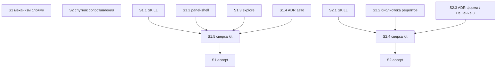

# Quality Control — visual-explanation-composition

- date: 2026-09-01
- file: `reports/quality-control-2026-09-01-3.md`
- mode: slice (`# Срез S1`, `# Срез S2`)
- sources: `tasks.md`, `design.md`, `proposal.md`, `specs/visual-explanation/spec.md`
- closed decision (не развилка QC): две отдельные приёмки; срезы не сливать
- контекст прогона: после repair уточнены умолчание шаблона (хвост копии не падает в скелет), смешанный источник (цепочки отчёта не выбирают конвейер), пункт ADR «Решение» 3 (перечень формы — подсказка рецепта). Критерии 5b / 8 / 8b / 10 пересчитаны по текущему `tasks.md`, не скопированы из `quality-control-2026-09-01-2.md`

Mechanical pre-checks приняты как вход: чекбоксы на месте; по одному `S<N>.accept` и `<!-- slice-gate -->`; `form_mode: n/a`; DENY-маркеров User Task Contract в `S<N>.<M>` нет; маркеров ручной конфигурации 1С в `S<N>.<M>` нет. Целевые файлы S2 существуют (навык, шаблон, ADR-0010).

## Verdict

`OK`

## Slice Summary

| Slice | Scenario | Tasks | Acceptance | Dependencies | Gate |
|---|---|---|---|---|---|
| S1 Читаемое объяснение механизма слоями | После ответа про механизм из нескольких слоёв панель предлагается или открывается по просьбе; на полотне вопрос, вывод, скелет и одна сцена | S1.1–S1.5 `[x]`; S1.accept `[ ]` | S1.accept (16/16 Scenario из Связь + 1 mandatory Primary) | нет | `<!-- slice-gate -->` есть |
| S2 Полотно как спутник сопоставления | По просьбе отметить отличия уже сказанного сопоставления полотно показывает классы сразу, без конвейера и без пачки кнопок | S2.1–S2.4 `[ ]`; S2.accept `[ ]` | S2.accept (6/6 Scenario из Связь + 1 mandatory Primary) | нет | `<!-- slice-gate -->` есть |

Размер ЗНИ: 11 чекбокс-задач (Standard 6–15). Второй срез допустим: у каждого свой наблюдаемый исход (скелет + одна сцена vs классы сразу). `## Follow-up` вне срезов — не в подсчёте приёмки.

Метаданные обоих срезов полные: `**Сценарий:**`, `**Primary acceptance:**` (Given → When → Then), `**Приёмка:**`, `**Связь со spec:**`, `**Зависимости:** нет`, `**Режим apply:** mechanical`. Согласование с `design.md` `## Slices` и с `proposal.md` Acceptance Criteria 1–2 → S1, 3 и часть 4–5 → S2.

## Scenario Coverage

Spec: 7 требований, 22 `#### Scenario:` в `specs/visual-explanation/spec.md`. Покрытие = Primary, optional-буллет accept **или** `S<N>.<M>` (покрытие только задачей агента — допустимо).

| Scenario | Covered by | Status |
|---|---|---|
| Разбор механизма слоями — панель или намёк | S1 Primary; S1.accept optional; S1.1, S1.3, S1.5 | covered |
| Ветвление в ответе | S1.accept optional; S1.1, S1.5 | covered |
| Простой факт без панели | S1.accept optional; S1.1, S1.5 | covered |
| Три буллета без связей | S1.accept optional; S1.1, S1.5 | covered |
| Проверка постановки без автопанели | S1.accept optional; S1.1, S1.5 | covered |
| Просьба на проверке постановки | S1.accept optional; S1.1, S1.5 | covered |
| Отказ «без схемы» в сессии | S1.accept optional; S1.1, S1.5 | covered |
| Правило о условиях — не всегда таблица | S1.accept optional; S1.1, S1.5 | covered |
| Сравнение свойств — таблица допустима | S2.accept optional; S1.2, S1.5, S2.2 | covered (срез-хозяин S2) |
| Таблица свойств без обязательных кнопок | S2.accept optional; S2.2, S2.4 | covered |
| Неизвестный жанр не даёт отказ | S2.accept optional; S2.1, S2.4 (упоминание в S1.5 — сверка правила S1, не хозяин сценария) | covered (срез-хозяин S2) |
| Сложная схема упрощается | S1.accept optional; S1.1, S1.2, S1.5 | covered |
| Много частей — скелет, не сетка | S1.accept optional; S1.2, S1.5 | covered |
| Нет среды панели | S1.accept optional; S1.5 | covered |
| Одна сцена на скелете | S1 Primary; S1.accept optional; S1.1 | covered |
| Почему одного наивного шага мало | S1.accept optional; S1.1 | covered |
| Плакат всех случаев не публикуется | S2.accept optional; S1.2, S1.5, S2.2 | covered (срез-хозяин S2) |
| Сопоставление уже сказанных классов | S2 Primary; S2.accept optional; S2.1, S2.4 | covered |
| Смешанный источник не даёт конвейер | S2.accept optional; S2.1, S2.4 | covered |
| Полотно без водяного текста | S1.accept optional; S1.1, S1.5 | covered |
| Координатный граф не публикуется | S1.accept optional; S1.1, S1.5 | covered |
| Нет метатекста про панель | S1.accept optional; S1.1, S1.5 | covered |

Имена в ёлочках `S<N>.accept` совпадают с заголовками `#### Scenario:` буквально. Чужих Scenario в чеклистах accept нет: S1.accept держит только 16 из своей Связь; S2.accept — только 6 из своей Связь. Сценарии S2, упомянутые в телах S1.2/S1.5, в `S1.accept` не входят — `accept-bullet-foreign-scenario` не срабатывает.

Repair смешанного источника закрыт в хозяине S2: S2.1 (голая «покажи схему» при уже сказанных классах не выбирает поток из-за цепочек в отчёте), S2.4 (сверка того же), S2.accept optional «Смешанный источник не даёт конвейер».

## Dependency Graph

- Циклов нет.
- Forward-зависимости приёмки нет: `**Зависимости:**` у обоих срезов — `нет`.
- Объявленных мёртвых зависимостей нет.
- Общие файлы (навык, шаблон, ADR-0010): S2 переписывает те же пути после `[x]` на S1.1–S1.5. Это порядок работ на пересекающихся markdown, не «приёмка S1 требует S2» и не незадекларированная зависимость *приёмки*. Граф design: «S2 → нет». Слияние по этому факту не предлагается (closed decision; 8b/9 не сработали).

## Criteria evaluation

### 1. Scenario Coverage

Все 22 Scenario покрыты. Implementation-only нет: все сценарии — наблюдаемое поведение панели; агентский путь S1.5 / S2.4 — static «по файлам kit» (ALLOW-agent), не user-spike.

### 2. Slice Independence

Каждый срез принимаем без следующего. Primary различны (скелет + одна сцена ≠ классы сразу). Циклов нет. Forward acceptance dependency нет → критерий 8b не дублирует здесь падение.

### 3. Slice Completeness

Kit-поставка, `form_mode: n/a`, слоёв 1С (метаданные / форма / BSL) нет. Для S1 Primary достаточны навык, шаблон-скелет, слот исследования, ADR-авто, сверка. Для S2 Primary достаточны навык (работа / язык, снятие умолчания скелета, смешанный источник), библиотека рецептов (хвост копии не падает в поток), ADR-форма (пункт «Решение» 3), сверка. Пропусков слоя, нужного для приёмки, нет. Фикстура слепого прогона S2 — Open Question design, вне scope QC (тестовые данные).

### 4. Slice Dependency Graph

Совпадает с метаданными. См. граф выше.

### 5. Slice Gate Integrity

Ровно один `S1.accept`, ровно один `S2.accept`, по одному `<!-- slice-gate -->`. Legacy `T<M>` нет.

### 5b. Acceptance Checklist Coverage (пересчёт)

Алгоритм: (a) 22 Scenario из spec; (b) каждый покрыт Primary / optional accept / `S<N>.<M>`; (c) `**Primary acceptance:**` и mandatory Primary sub-bullet на месте; (d) алерты.

| Проверка | S1 | S2 |
|---|---|---|
| `**Primary acceptance:**` в metadata | есть (GWT: слои → просьба/путаница → вопрос, вывод, скелет, текущий шаг; не сетка-сток; не каталог шагов процесса; нет пути в чате) | есть (GWT: уже сказанные классы + просьба об отличиях → одно полотно сопоставления; не ветка процесса; без пачки кнопок; нет пути в чате) |
| `**Primary (обязательно):**` в accept | есть, текст совпадает с metadata | есть, текст совпадает с metadata |
| mandatory sub-bullet пуст | нет | нет |
| Scenario из spec нигде | нет | нет |
| Scenario чужого среза в accept | нет (16 optional = Связь S1) | нет (6 optional = Связь S2; «Смешанный источник не даёт конвейер» — optional хозяина S2, не чужой буллет) |

Семь буллетов S1 с пометкой «(опционально, покрыто S1.1)» **не** blocking: по правилу среза 6 `[x]` на accept = только Primary. Дубль «optional + S1.1» допустим.

Repair не добавил второй mandatory буллет и не вынес Scenario из покрытия: смешанный источник остаётся optional S2 + S2.1/S2.4; умолчание шаблона и пункт ADR «Решение» 3 — задачи агента S2.2/S2.3/S2.4, не дыры spec.

`primary-acceptance-missing` / `accept-checklist-empty` / `accept-bullets-missing-scenario` / `accept-bullet-foreign-scenario` — не эмитируются.

### 6. Rework Risk

Пересечение файлов S1/S2 осознано extend (E-D1, design Slices). S2.1 явно сохраняет рецепт скелета для разбора механизма; S2.2 оставляет рецепт скелета и снимает только хвост «всё остальное → поток со скелетом». Повтор Primary нет. Алерт не эмитируется: риск повторного осмотра S1 после правки тех же файлов — операционный порядок apply, не дефект нарезки. Слияние не рекомендуется (closed decision).

### 8. Slice Verticality (пересчёт)

Семантика, не grep. Собраны mandatory пункты тел accept (не optional).

- S1 mandatory Primary: человек просит схему или дочитывает ответ про слои → рядом с чатом панель с вопросом, выводом, скелетом и текущим шагом; не сетка-сток и не каталог шагов процесса; путь к файлу в чате отсутствует. Это black-box (кнопка среды, вид полотна, отсутствие пути), не вызов функции / тип возврата / код-ревью API.
- S2 mandatory Primary: человек открывает панель по просьбе к уже сказанному сопоставлению (без подсказки «три колонки») → видит одно полотно классов, не ветку процесса и не пачку кнопок. Тоже black-box.

Умолчание шаблона, смешанный источник и пункт ADR «Решение» 3 **не** стоят mandatory в accept: первое и третье — агентские правки файлов; смешанный источник — optional Scenario. На наблюдаемость Primary это не влияет.

`slice-not-vertical` не срабатывает: у обоих срезов mandatory Primary наблюдаем.

### 8b. Self-Achievable Acceptance (пересчёт)

Пара S1 / S2. Closed decision «срезы не сливать» действует **только если** 8b не сработал; ниже — независимый пересчёт.

- Механически GWT: user-journey не совпадают. S1 Then — вопрос / вывод / скелет / текущий шаг истории. S2 Then — полотно класса сопоставление, элемент класса, пометки одного ранга, без пачки кнопок. Разные Given, разные Then, не один экран «сформировать → видно дерево».
- Слой S1 Primary (навык авто/рассказ, шаблон скелета со сценами) есть в S1.1 и S1.2, не только в S2.
- Слой S2 Primary после repair тоже внутри S2: работа над текстом и смешанный источник — S2.1; библиотека без обязательных кнопок и запрет хвоста «копия → скелет» — S2.2; пункт ADR «Решение» 3 — S2.3 (согласованность kit, не единственный носитель UX). `**Зависимости:**` у S2 не `S1`.
- Семантика: S1 Primary достижим задачами S1 без S2 (рецепт скелета для работы «слои» остаётся в S1.1/S1.2). Снятие *универсального* умолчания скелета в S2.2 не отбирает у S1 слой «механизм слоями → скелет»: S2.1 привязывает скелет к работе «слои / последовательность», не заимствует Primary S1. S2 Primary (классы сразу, в том числе при смешанном источнике и голой просьбе) достижим S2.1+S2.2 в одиночку.

`slice-accept-not-self-achievable` не срабатывает. Remediation «объединить срезы» **не** предлагается (8b не сработал; closed decision).

### 9. Foundation slice with gate

Условия критерия — **все** сразу. S1 имеет accept и gate. S2 **не** объявляет `Зависимости: S1`. S1.accept — user-journey, не programmatic-only. Условие «S1 programmatic / S2 UX» ложно.

`slice-foundation-with-gate` не срабатывает. Слияние не предлагается.

### 10. Acceptance Simplicity (пересчёт)

Mandatory (без пометки «опционально») black-box journey в теле accept:

- S1: один — `**Primary (обязательно):**`. Остальные 16 помечены «(опционально)» (включая семь «покрыто S1.1»). When Primary содержит «попросить схему **либо** дочитать ответ» — два входа в **тот же** Then, не два mandatory journey.
- S2: один — `**Primary (обязательно):**`. Шесть Scenario, включая «Смешанный источник не даёт конвейер», помечены «(опционально)». Repair не поднял смешанный источник и не ADR/умолчание шаблона в второй mandatory буллет.

`acceptance-simplicity-overload` не срабатывает.

### 11. User Task Contract

Строки `^- \[[ x]\] S\d+\.\d+`: DENY-маркеров нет (вход verify 2.1a; независимый grep: `тестовой ИБ` / `на стенде` / `runtime-verify` / `спайк` / `в консоли` / `отладчик` / `вызвать API` / `после verify` / `после стенда` — совпадений нет). Семантика: S1.1–S1.4 / S2.1–S2.3 — правки файлов kit агентом; S1.5 / S2.4 — «верифицировать по файлам kit» (ALLOW-agent). Ручной осмотр панели и слепой прогон — только `S<N>.accept` и поле `**Приёмка:**`. Условных цепочек «после verify/стенда» нет. `user-task-contract-violation` не срабатывает.

### Task readability

Не-accept задачи: глагол + путь файла + изменение + зачем + опорные D/Scenario. Исключения: `S<N>.accept` (бизнес-результат в заголовке есть); Follow-up с префиксом. `task-opaque-title` / `task-too-short` / `task-opaque-acceptance` не эмитируются. Тела accept: по одной строке на каждый Scenario из Связь данного среза.

## Alerts

Нет.

## Recommendations

### Automatic fix

Нет.

### Decision required

Нет. Две отдельные приёмки остаются; 8b и 9 не сработали — слияние срезов не предлагается.
