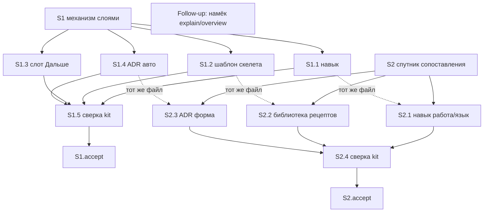

# Quality Control — Slice Coherence

**Change:** `visual-explanation-composition`  
**Дата:** 2026-09-01  
**Прогон:** `quality-control-2026-09-01`  
**Режим:** slice mode (`# Срез S1`, `# Срез S2` в `tasks.md`)  
**Артефакты:** `proposal.md`, `design.md`, `tasks.md`, `specs/visual-explanation/spec.md`  
**Критерии:** 1–6, 8, 8b, 9–11 из `.cursor/rules/vertical-slices.mdc`; читаемость — `.cursor/rules/task-readability.mdc`  
**Линза:** kit-ЗНИ (`form_mode: n/a`); apply mechanical (навык, шаблон панели, слот исследования, уточнение ADR); прикладных `.bsl` / XML нет  
**Контекст прогона:** после user-extend 2026-09-01: рабочие `S1.1`–`S1.5` = `[x]`, `S1.accept` = `[ ]`; добавлен срез S2 (механическая перепись тех же навыка/шаблона/ADR). Design: два исхода одной цели; `S2 → нет`. Primary S1 сужен (нет универсального «не плакат»).  
**Out of scope QC:** исполнимость приёмки «прямо сейчас» в Cursor; тестовые данные / эталон ИБ (transient)

Pre-check оркестратора подтверждён независимым чтением `tasks.md`: маркеров ручной конфигурации 1С («вручную» / «Конфигуратор» / реквизит / роль / элемент формы как обязанность пользователя) в рабочих задачах нет; чекбоксы на месте; по одному закрывающему `<!-- slice-gate -->` на срез; `<!-- phase-gate -->` нет; fences сбалансированы; ID с префиксом среза; DENY-маркеров User Task Contract в строках `^- \[[ x]\] S\d+\.\d+` нет. Файлы из задач существуют и непусты (навык визуального объяснения, шаблон панели, навык исследования, ADR-0010). Новых объектов метаданных нет. Legacy `S<N>.T<M>` нет.

---

## Verdict

`CRITICAL`

Два среза с разными black-box Primary (механизм слоями → скелет и одна сцена; сопоставление классов → классы сразу без конвейера и пачки кнопок). Все 22 заголовка `#### Scenario:` покрыты. Gate цел. Primary каждого среза достижим своими `S<N>.<M>`. Пары foundation+consumer нет: оба accept — пользовательский осмотр панели, `Зависимости:` у обоих `нет`. Structural user-spike в `S<N>.<M>` нет.

Блокер: в `S1.accept` кроме Primary стоят ещё семь Scenario-буллетов **без** пометки «(опционально)» (только «покрыто S1.1»). Это шесть отдельных user-journey плюс повтор Primary — `acceptance-simplicity-overload`. Рядом WARNING: S2 переписывает те же три файла при незакрытом `S1.accept`; в теле уже отмеченных `S1.2`/`S1.5` остались Scenario, которые в метаданных отданы S2.

Объединять срезы **нельзя**: Primaries не дублируются, критерий 8b не срабатывает. Сначала починить чеклист S1, затем принимать S1 на текущих файлах, затем apply S2.

---

## Slice Summary

| Slice | Scenario | Tasks | Acceptance | Dependencies | Gate |
|---|---|---|---|---|---|
| S1: Читаемое объяснение механизма слоями | После ответа про механизм из нескольких слоёв панель предлагается или открывается по просьбе; на полотне вопрос, вывод, скелет и одна сцена | 5 рабочих (`S1.1`–`S1.5` все `[x]`) + `S1.accept` `[ ]` | `S1.accept` (16/16 по Связь со spec: 1 Primary + 7 без «опционально» + 8 optional) | нет | да (`<!-- slice-gate -->`) |
| S2: Полотно как спутник сопоставления | По просьбе отметить отличия уже сказанного сопоставления полотно показывает классы сразу, без конвейера и без пачки кнопок | 4 рабочих (`S2.1`–`S2.4` все `[ ]`) + `S2.accept` `[ ]` | `S2.accept` (6/6: 1 Primary + 1 одноимённый Scenario без «опционально» + 5 optional) | нет | да (`<!-- slice-gate -->`) |

Метаданные обоих срезов полные: `**Сценарий:**`, `**Primary acceptance:**` (Given → When → Then), `**Приёмка:**`, `**Связь со spec:**`, `**Зависимости:** нет`, `**Режим apply:** mechanical`.

`form_mode: n/a`. Ручного конфигурирования 1С нет. Размер: 11 чекбоксов (Standard 6–15). Второй срез допустим: два самостоятельных пользовательских исхода (порог «ТРИГГЕРЫ И ПОРОГИ»). `## Follow-up` вне срезов, без ID, без второго gate.

Согласование с `design.md` `## Slices`: имена, Primary, списки Scenario, файлы и граф `S1 → нет` / `S2 → нет` совпадают с `tasks.md`. Согласование с `proposal.md` Acceptance Criteria 1–2 → S1, 3 и часть 4–5 → S2.

Разбиение Связь со spec без дыр: 16 Scenario у S1 + 6 у S2 = 22 заголовка дельты. Пересечения имён в полях `**Связь со spec:**` нет.

---

## Scenario Coverage

В дельте **22** заголовка `#### Scenario:` (все в `specs/visual-explanation/spec.md`). Имена в ёлочках `tasks.md` совпадают со spec буквально (включая `Отказ «без схемы» в сессии`).

| Scenario | Covered by | Status |
|---|---|---|
| Разбор механизма слоями — панель или намёк | S1 Primary + S1.accept + S1.1, S1.3 | OK |
| Ветвление в ответе | S1.accept (покрыто S1.1) + S1.1, S1.5 | OK |
| Простой факт без панели | S1.accept (покрыто S1.1) + S1.1, S1.5 | OK |
| Три буллета без связей | S1.accept (покрыто S1.1) + S1.1, S1.5 | OK |
| Проверка постановки без автопанели | S1.accept (покрыто S1.1) + S1.1, S1.5 | OK |
| Просьба на проверке постановки | S1.accept (покрыто S1.1) + S1.1, S1.5 | OK |
| Отказ «без схемы» в сессии | S1.accept (покрыто S1.1) + S1.1, S1.5 | OK |
| Правило о условиях — не всегда таблица | S1.accept optional + S1.1 | OK |
| Сравнение свойств — таблица допустима | S2.accept optional + S2.2, S2.4; также тело S1.2/S1.5 (чужой срез, не accept) | OK (перекрытие задач — критерий 6) |
| Таблица свойств без обязательных кнопок | S2.accept optional + S2.2, S2.4 | OK |
| Неизвестный жанр не даёт отказ | S2.accept optional + S2.1, S2.4; также тело S1.5 (чужой срез, не accept) | OK (перекрытие задач — критерий 6) |
| Сложная схема упрощается | S1.accept optional + S1.2, S1.5 | OK |
| Много частей — скелет, не сетка | S1 Primary (Then: не сетка-сток) + S1.accept optional + S1.2, S1.5 | OK |
| Нет среды панели | S1.accept optional + S1.5 | OK |
| Одна сцена на скелете | S1 Primary + S1.accept optional + S1.1, S1.2 | OK |
| Почему одного наивного шага мало | S1.accept optional | OK |
| Плакат всех случаев не публикуется | S2.accept optional + S2.2, S2.4; также тело S1.2/S1.5 (чужой срез, не accept) | OK (перекрытие задач — критерий 6) |
| Сопоставление уже сказанных классов | S2 Primary + S2.accept + S2.1 | OK |
| Смешанный источник не даёт конвейер | S2.accept optional + S2.1 | OK |
| Полотно без водяного текста | S1.accept optional + S1.5 | OK |
| Координатный граф не публикуется | S1.accept optional + S1.5 | OK |
| Нет метатекста про панель | S1.accept optional + S1.5 | OK |

**22/22.** Покрытие только в `S<N>.<M>` без буллета accept — допустимо; здесь все Scenario своего среза ещё и в соответствующем accept.

`accept-bullets-missing-scenario` не ставится. `accept-bullet-foreign-scenario` не ставится: в телах `S1.accept` / `S2.accept` нет Scenario из `**Связь со spec:**` другого среза. Чужие имена есть только в уже отмеченных рабочих `S1.2`/`S1.5` (не accept).

**Критерий 1 (путь агента):** охранные и implementation-only сценарии закрыты сверкой по файлам kit (`S1.5`, `S2.4`) и правками навыка/шаблона. User IB/runtime spike в `S<N>.<M>` нет. Живой осмотр панели — только `S1.accept` / `S2.accept`.

**Follow-up:** отдельного Scenario «намёк в пошаговом разборе / обзоре» в spec нет. Пропуск рабочих задач по explain/overview — не дыра покрытия.

---

## Dependency Graph

Объявлено:

- S1 → нет
- S2 → нет

Циклов нет. Объявленные деды существуют (пустое множество). Forward-зависимости **приёмки** нет: Primary S1 не требует рецепта классификации; Primary S2 — прямая просьба о схеме отличий, не авто S1 и не `S1.accept = [x]`.

Фактическое пересечение файлов (не ребро приёмки, не объявлено как `Зависимости:`):

```text
S1.1 SKILL.md  →  S2.1 переписывает тот же файл
S1.2 panel-shell.md  →  S2.2 переписывает тот же файл
S1.4 ADR-0010  →  S2.3 уточняет тот же файл
S1.5 сверка  ≠  S2.4 (S2.4 явно: галочки S1.5 не закрывают спутника)
```

`design.md` это раскрывает: «рабочие задачи S1 отмечены выполненными; S2 переписывает те же файлы навыка/шаблона». Это не скрытая `Зависимости: S1`: S2.1 говорит «авто не менять» (не-регресс на уже сделанном S1.1), Primary S2 от авто не зависит. Несоответствия объявленного графа приёмки нет. Риск повторной работы — критерий 6, не критерий 4.



Внутри срезов: `S1.5` ждёт `S1.1`–`S1.4`; `S2.4` ждёт `S2.1`–`S2.3`. Follow-up висит отдельно. Незаявленных рёбер, из-за которых Primary S1 был бы недостижим без S2, нет.

---

## Criteria

### 1. Scenario Coverage

Все 22 `#### Scenario:` покрыты Primary, optional accept или agent `S<N>.<M>`. Отдельный accept у S2 оправдан: «Сопоставление уже сказанных классов» / «Смешанный источник не даёт конвейер» — самостоятельный исход, не тот же осмотр скелета. Пропусков нет.

### 2. Slice Independence

S1 принимаем без S2: After extend Then S1 = вопрос, вывод, скелет, текущий шаг; «не сетка-сток и не каталог шагов процесса» — не запрет «все классы сразу». S2 принимаем без подписанного S1: Given S2 — уже сказанное сопоставление и прямая просьба. Циклов нет. Forward acceptance dependency нет. `slice-accept-not-self-achievable` из этого критерия не дублируется (см. 8b).

### 3. Slice Completeness

Kit-слои для Primary S1:

| Слой для Primary | Задача | Status |
|---|---|---|
| Навык: авто/намёк, рассказ скелета, одна сцена | S1.1 `[x]` | OK |
| Шаблон: скелет со сценами, шаги истории | S1.2 `[x]` | OK |
| Слот «Дальше» (намёк после слоёв в исследовании) | S1.3 `[x]` | OK |
| ADR: инвариант авто | S1.4 `[x]` | OK |

Kit-слои для Primary S2:

| Слой для Primary | Задача | Status |
|---|---|---|
| Навык: работа над текстом → язык = отношение; сопоставление ≠ конвейер | S2.1 | OK |
| Шаблон: рецепт классификации без обязательного Button; таблица без пачки кнопок | S2.2 | OK |
| ADR: инвариант формы (рецепты, не enum-мир, нет умолчания скелета) | S2.3 | OK |

Слоя, без которого Then не собрать, в более позднем срезе нет. Слот исследования в S2 сознательно не трогается (D6 / E-D2).

### 4. Slice Dependency Graph

Объявления `нет` / `нет` согласованы с метаданными. Циклов нет. Ложного `Зависимости: S3` нет. Пересечение файлов задокументировано в design, не как slice-to-slice accept edge. WARNING критерия 4 не ставится.

### 5. Slice Gate Integrity

Ровно один `S1.accept`, ровно один `S2.accept`, по одному `<!-- slice-gate -->`. Дублей нет. Legacy `T<M>` нет. `legacy-acceptance-format` не ставится.

### 5b. Acceptance Checklist Coverage

- `**Primary acceptance:**` есть у S1 и S2. Mandatory sub-bullet `**Primary (обязательно):**` есть у обоих. `primary-acceptance-missing` / `accept-checklist-empty` не ставятся.
- Каждый Scenario своего среза есть в accept или в `S<N>.<M>`. `accept-bullets-missing-scenario` не ставится.
- Чужого Scenario в accept нет. `accept-bullet-foreign-scenario` не ставится.
- Текст Primary в metadata = текст mandatory sub-bullet (буквально).

### 6. Rework Risk

**WARNING.** S2 — mechanical rewrite тех же `SKILL.md`, `panel-shell.md`, `ADR-0010`, что уже отмечены `[x]` в S1, при `S1.accept` всё ещё `[ ]`.

Острота средняя, не 8b:

- Primaries разные; S2.1 сохраняет рецепт скелета и не меняет авто.
- S2.4 прямо запрещает считать `S1.5` закрытием спутника.
- В `**Связь со spec:**` Scenario не дублируются.

Но в телах **уже закрытых** `S1.2` и `S1.5` остались имена Scenario S2 («Плакат всех случаев не публикуется», «Сравнение свойств — таблица допустима», «Неизвестный жанр не даёт отказ»). S1.5 ещё сверяет «неизвестный жанр → ближайшая реализованная форма» — это как раз то правило, которое S2.1 снимает как мир. После apply S2 сверка S1.5 по этим трём именам устареет по постановке, не по дефекту S1.

S2 не опирается на непринятый S1 как на consumer API; это повторная правка незакрытого контура. Merge срезов лечение **не** является (см. 8b/9).

### 8. Slice Verticality

S1 Primary — чёрный ящик: обычный ответ про слои → просьба или путаница слоёв → кнопка среды, на панели вопрос / вывод / скелет / текущий шаг; не сетка-сток; не каталог шагов процесса; нет пути в чате.

S2 Primary — чёрный ящик: уже сказанное сопоставление классов + просьба о схеме отличий → одно полотно класса сопоставление; пункт — элемент класса; пометки одного ранга; интерактив не обязателен; якорь один или точечный; нет пути в чате.

Сверка файлов kit — `S1.5` / `S2.4`, не mandatory Primary. «Слепой прогон» — в `**Приёмка:**` S2 и на границе `S2.accept`, не в `S2.<M>`. `slice-not-vertical` не ставится.

### 8b. Self-Achievable Acceptance

Механическое сравнение Primary S1 vs S2: разные Given (слои механизма vs уже сказанные классы), разные Then (скелет + одна сцена vs классы сразу). Дубля journey нет.

Слой Then S1 (протокол скелета, `scenes[]`) — в `S1.1`/`S1.2`, не только в S2. Слой Then S2 (работа/язык, рецепт классификации без обязательных кнопок) — в `S2.1`/`S2.2`, не отложен дальше. Follow-up не нужен ни одному Primary.

`slice-accept-not-self-achievable` не ставится. Запрещённое «не подписывать S1.accept до S2» в постановке нет; наоборот, design требует суженный S1, чтобы его можно было принять отдельно.

Отсутствие живого файла панели в git — среда (`design.md` § Assumptions), не структурная недостижимость.

### 9. Foundation slice with gate

Условия (все обязательны):

1. У S1 есть accept и slice-gate — да.
2. У S2 `**Зависимости:** S1` или явная ссылка на API/функцию S1 — **нет** (`Зависимости: нет`; S2 переписывает файлы, не вызывает символ S1).
3. S2.accept = user-journey, а S1.accept = только programmatic — **нет** (оба UX).

`slice-foundation-with-gate` не ставится. Навык/шаблон в S1 — не foundation-only срез: у S1 свой наблюдаемый исход.

### 10. Acceptance Simplicity

**S1 — CRITICAL `acceptance-simplicity-overload`.**

В теле `S1.accept` mandatory (без пометки «опционально»):

1. `**Primary (обязательно):**` — осмотр панели после ответа про слои (один journey).
2. Scenario «Разбор механизма слоями — панель или намёк» (покрыто S1.1) — тот же journey, повтор.
3. Scenario «Ветвление в ответе» (покрыто S1.1) — другой journey.
4. Scenario «Простой факт без панели» (покрыто S1.1) — другой (отрицательный).
5. Scenario «Три буллета без связей» (покрыто S1.1) — другой.
6. Scenario «Проверка постановки без автопанели» (покрыто S1.1) — другой.
7. Scenario «Просьба на проверке постановки» (покрыто S1.1) — другой.
8. Scenario «Отказ «без схемы» в сессии» (покрыто S1.1) — другой.

Канон знает только Primary (blocking) и «(опционально)». Помета «покрыто S1.1» **не** снимает mandatory. Восемь unmarked буллетов, из них шесть отдельных black-box journey сверх Primary. Составной Then Primary (скелет + не сетка + не каталог шагов + нет пути) по-прежнему один осмотр — это не спасает пункты 3–8.

Прогон `quality-control-2026-08-31-3` проходил при «1 Primary + 4 optional». Extend добавил строки Связь со spec в accept без «(опционально)».

**S2 — не overload.** Unmarked Scenario «Сопоставление уже сказанных классов» — то же Given/When/Then, что Primary (design: S2 Primary = этот Scenario). Один journey, два ярлыка. Пять остальных помечены «(опционально)». SUGGESTION: пометить одноимённый Scenario «(опционально)», чтобы не путать со вторым blocking.

### 11. User Task Contract

Строки `^- \[[ x]\] S\d+\.\d+`: DENY-маркеров нет (`тестовой ИБ`, `на ИБ вериф`, `на стенде`, `runtime-verify`, `спайк`, `в консоли`, `отладчик`, `эмулировать вызов`, `вызвать API`). Условных цепочек `При успешном verify S` / `после verify S` / `после стенда` нет.

`S1.5` / `S2.4` — сверка по файлам kit (ALLOW-agent). Упоминания `/opsx:verify` и `/review` в `S1.1`/`S1.5` — текст протокола навыка, не обязанность пользователя на стенде. «Слепой прогон без хардкода сюжета» — `**Приёмка:**` S2 и граница `S2.accept`, допустимо пользователю. Follow-up исключён из mechanical grep. Семантических перифраз runtime-spike в `S<N>.<M>` нет. `user-task-contract-violation` не ставится.

---

## Task readability

Паттерн «глагол + файл + результат + (D… / Scenario)» выполнен.

| ID | Глагол | Объект | Результат | Опора |
|---|---|---|---|---|
| S1.1 `[x]` | Заменить | `.cursor/skills/visual-explanation/SKILL.md` | панель после разбора слоями; вопрос, вывод, скелет, одна сцена | D1–D4, D7 |
| S1.2 `[x]` | Заменить | `…/fixtures/panel-shell.md` | шаблон учит скелет с фокусом, не сетку | D2, D3, D4, D7 |
| S1.3 `[x]` | Заменить | `.cursor/skills/openspec-explore/SKILL.md` | намёк в исследовании не молчит после слоёв | D1, D6 |
| S1.4 `[x]` | Уточнить | `openspec/adrs/ADR-0010-visual-explanation-panel.md` | инварианты авто in-place | D5 |
| S1.5 `[x]` | Верифицировать | навык, шаблон, слот, ADR | файлы совпадают с дельтой S1 | D1–D7 |
| S2.1 | Заменить | тот же `SKILL.md` | сопоставление не конвейер; скелет остаётся рецептом механизма | D2, D8, D9 |
| S2.2 | Заменить | тот же `panel-shell.md` | библиотека рецептов; классификация без обязательных кнопок | D3, D4, D9 |
| S2.3 | Уточнить | тот же ADR-0010 | инвариант формы: рецепты, не enum-мир | D5, E-D5 |
| S2.4 | Верифицировать | навык, шаблон, ADR | дельта S2; S1.5 не считать закрытием спутника | D2, D5, D8, D9 |

Голых «Реализовать D8» нет. Описания длиннее 8 слов. `task-opaque-title`, `task-too-short`, `task-opaque-acceptance` не ставятся.

`S1.accept` / `S2.accept`: заголовок с бизнес-результатом среза; имена Scenario в ёлочках буквально со spec; по строке на каждый Scenario из `**Связь со spec:**` своего среза. Follow-up: префикс `Follow-up:` + пути — исключение 3.

Замечание без отдельного алерта читаемости: тела `S1.1`, `S1.5`, `S2.1`, `S2.4` очень длинные (весь протокол в одной задаче). Для mechanical kit-change допустимо; дробить в третий срез нельзя.

---

## Alerts

### 1. `acceptance-simplicity-overload`

- **affected:** S1 / `S1.accept`
- **alert type:** `acceptance-simplicity-overload`
- **severity:** CRITICAL
- **evidence:** В `S1.accept` восемь sub-bullets без «(опционально)»: Primary плюс семь Scenario, из них шесть — отдельные journey (ветка, простой факт, три буллета, verify без авто, просьба на verify, отказ «без схемы»). Помета «покрыто S1.1» каноном не определена и mandatory не снимает. Optional-хвост из восьми Scenario с пометкой «(опционально)» формату не противоречит.
- **recommendation:** Оставить **один** unmarked mandatory — `**Primary (обязательно):**`. Все Scenario-строки, включая повтор «Разбор механизма слоями» и «покрыто S1.1», пометить «(опционально)». Coverage 3–8 уже есть в `S1.1`/`S1.5`; в accept они не должны быть blocking. Не разворачивать их в отдельные чекбоксы и не требовать семи прогонов панели для `[x]` на S1.

### 2. Rework risk (unsigned S1 × same-file S2)

- **affected:** S1 (`S1.accept` `[ ]`, рабочие `[x]`) / S2.1–S2.3
- **alert type:** `rework-risk` (критерий 6)
- **severity:** WARNING
- **evidence:** S2.1–S2.3 переписывают те же три файла, что закрыты `S1.1`/`S1.2`/`S1.4`/`S1.5`. В S1.2/S1.5 до сих пор названы Scenario, которые в `**Связь со spec:**` принадлежат S2. S1.5 фиксирует «ближайшая реализованная форма» для неизвестного жанра — S2.1 это снимает. `Зависимости: нет` при этом для **приёмки** верно.
- **recommendation:** Срезы **не** сливать. Сначала auto-repair чеклиста S1, подписать `S1.accept` на текущих файлах (скелет после слоёв), затем apply S2. После S2 не переоткрывать S1.5 ради Scenario S2; закрытие спутника — только `S2.4` + `S2.accept`. Тела S1.2/S1.5 можно не переписывать (`[x]` не трогать) — достаточно не трактовать их как покрытие S2.

### 3. S2 Primary restatement unmarked

- **affected:** S2 / `S2.accept` буллет Scenario «Сопоставление уже сказанных классов»
- **alert type:** format hygiene (критерий 10, тот же journey)
- **severity:** SUGGESTION
- **evidence:** Второй unmarked буллет семантически совпадает с Primary; overload не ставится. Без «(опционально)» его легко спутать со вторым blocking.
- **recommendation:** Пометить «(опционально)» или явно «тот же Primary».

---

## Recommendations

### Automatic fix

#### Remediation (auto-repair)

- alert: `acceptance-simplicity-overload`
- target: `openspec/changes/visual-explanation-composition/tasks.md` — срез S1, задача `S1.accept`
- action: В теле `S1.accept` единственный буллет без «(опционально)» — `**Primary (обязательно):**` (текст как в `**Primary acceptance:**`). Строки Scenario «Разбор механизма слоями — панель или намёк» … «Отказ «без схемы» в сессии» с суффиксом «(покрыто S1.1)» переписать как `Scenario «…» (опционально, покрыто S1.1): …`. Восемь уже optional буллетов не трогать. Родительский чекбокс `S1.accept` оставить `[ ]`. Рабочие `[x]` не перенумеровать и не открывать.

#### Remediation (auto-repair)

- alert: S2 Primary restatement (SUGGESTION, тот же патч уместен сразу)
- target: тот же `tasks.md` — срез S2, `S2.accept`
- action: Буллет `Scenario «Сопоставление уже сказанных классов»` пометить «(опционально)». Primary не менять.

Repairable-алерты `primary-acceptance-missing`, `accept-bullets-missing-scenario`, `slice-not-vertical`, `slice-foundation-with-gate`, `user-task-contract-violation` не сработали.

### Decision required

Нет объединения срезов. `slice-accept-not-self-achievable` и `slice-foundation-with-gate` не сработали: два исхода, оба вертикальные, оба самодостаточны. Переписывать Primary S1/S2 не нужно.

Операционно после auto-repair чеклиста: slice-gate S1 на **текущих** файлах, затем mechanical S2. Не закрывать `S1.accept` текстом «скелет и не плакат» (уже снято). Не запускать archive, пока оба Primary не приняты (`design.md` / architecture-extend-coherence).
