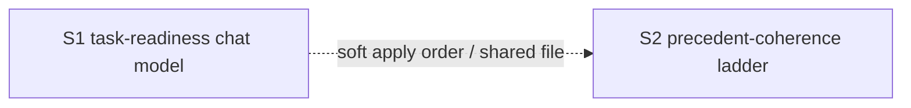

# Quality Control — model-tier-by-step

Date: 2026-09-22  
Mode: slice (full current control; cache miss — `tasks.md` first present)  
Scope: changed_slices = all; reused_checks = none  
Previous report `quality-control-2026-09-22.md` (pre-tasks) — not reused

Domain note: kit-rules change; observable Primary = text of rules/skills, not IB runtime.

## Verdict

`WARNING`

## Reused vs new

| Scope | Status |
|---|---|
| All criteria 1–6, 8, 8b, 9–11 | **new** (full run) |
| Scenario coverage matrix | **new** (rebuilt from `tasks.md`) |
| Dependency graph | **new** |
| `reused_checks` | none |

## Slice Summary

| Slice | Scenario | Tasks | Acceptance | Dependencies | Gate |
|---|---|---|---|---|---|
| S1 Готовность задач на модели чата | Готовность на модели чата; обычный architect — тяжёлая | S1.1–S1.7 (7) | S1.accept (Primary + 1 optional; 5/5 via accept+S1.7) | нет | `<!-- slice-gate -->` present |
| S2 Сверка с прошлым договором на лестнице | Сверка на лестнице независимого разбора | S2.1–S2.6 (6) | S2.accept (Primary + 1 optional; 5/5 via accept+S2.6) | нет (text: preserve S1 edits) | `<!-- slice-gate -->` present |

## Scenario Coverage

| Scenario | Covered by | Status |
|---|---|---|
| Готовность задач на модели чата | S1 Primary / S1.accept Primary | OK |
| Сбой единственного вызова готовности задач | S1.6 + S1.accept optional | OK |
| Вызов архитектора без ошибки enum | S1.7 (agent static «по тексту») | OK |
| Команда на Grok 4 без смены чата | S1.7 | OK |
| Рантайм свободен от мёртвых слагов | S1.7 | OK |
| Сверка с прошлым договором идёт по лестнице независимого разбора | S2 Primary / S2.accept Primary (+ optional on verified-cause-gate) | OK |
| Декомпозиция срезов не идёт на Fable | S2.6 | OK |
| Независимый разбор постановки идёт на Fable | S2.6 | OK |
| Нет слага сильной модели — строка про Opus 5 | S2.6 | OK |
| Сбой Opus не включает Fable | S2.6 | OK |

All 10 `#### Scenario:` from `specs/subagent-model-mapping/spec.md` covered.

## Dependency Graph



- Declared edges: none (`**Зависимости:** нет` on both).
- Cycles: none.
- Forward acceptance dependency: none (S1 Primary ≠ S2 Primary; each Primary reachable inside its own tasks).
- Soft coupling: both edit `.cursor/rules/model-selection.mdc` (different sections); S2.1/S2.2 require not rolling back S1 — undeclared sequential apply constraint.

## Criteria checklist

| # | Criterion | Result |
|---|---|---|
| 1 | Scenario Coverage | PASS |
| 2 | Slice Independence (acceptance) | PASS — each Primary acceptible without later slice |
| 3 | Slice Completeness | PASS — kit text layers sufficient for Primary (no 1C metadata/forms) |
| 4 | Slice Dependency Graph | WARNING — declared «нет», soft S1→S2 apply order undeclared |
| 5 | Slice Gate Integrity | PASS — exactly one `S<N>.accept` + gate per slice |
| 5b | Acceptance Checklist Coverage | PASS — Primary metadata + mandatory Primary bullet; no foreign Scenario |
| 6 | Rework Risk | WARNING — shared `model-selection.mdc`; apply out of order risks overwrite |
| 8 | Slice Verticality | PASS — Primary = open rule text / observe wording (kit black-box) |
| 8b | Self-Achievable Acceptance | PASS — S1 via S1.1–S1.3(+); S2 via S2.1–S2.3(+); no Primary duplicate |
| 9 | Foundation slice with gate | PASS — no `Зависимости: S1` on S2; both Primaries observational, not foundation→UX split |
| 10 | Acceptance Simplicity | PASS — one mandatory journey per accept |
| 11 | User Task Contract | PASS — no DENY markers in `S<N>.<M>`; S1.7/S2.6 agent text verify; manual text check only in accept/metadata |

## Task Readability

| Task | Assessment |
|---|---|
| S1.1–S1.6 | OK — verb + file/section + outcome + (D1/D4) |
| S1.7 | OK — agent verify with files + named Scenarios |
| S1.accept | OK — business result + Primary + optional Scenario |
| S2.1–S2.5 | OK — verb + file/section + outcome + (D2/D4) |
| S2.6 | OK — agent verify with files + named Scenarios |
| S2.accept | OK — business result + Primary + optional Scenario |

No `task-opaque-title` / `task-too-short` / `accept-checklist-empty`.

## Alerts

### 1. `undeclared-slice-dependency` — WARNING

- **Affected:** S2 (relative to S1)
- **Evidence:** `**Зависимости:** нет` on S2, but S2.1 «не откатывая оговорку про готовность задач из S1», S2.2 «правку S1 в этой же строке сохранить»; design.md: срезы правят один файл «по очереди».
- **Recommendation:** declare `**Зависимости:** S1` **or** keep «нет» and document apply-order only in design (already present) — if independence of acceptance stays true, prefer explicit `S1` dependency for apply ordering.

### 2. `rework-risk-shared-artifact` — WARNING

- **Affected:** S1 + S2, file `.cursor/rules/model-selection.mdc`
- **Evidence:** S1.1–S1.3 and S2.1–S2.3 edit the same rule in different sections; mechanical apply without section discipline can clobber sibling slice.
- **Recommendation:** apply S1 fully (through gate) before S2; in apply prompts pin exact sections; do not merge both slices’ edits in one writer pass without section locks.

### 3. `slice-decomposition-justified` — SUGGESTION (informational, not blocking)

- **Affected:** change tier Standard (13 work tasks + 2 accept)
- **Evidence:** two independent Primaries (task-readiness vs precedent ladder) — second slice allowed by vertical-slices threshold.
- **Recommendation:** no change required; keep two gates.

## Recommendations

### Automatic fix

- Alert 1 remediation (optional edit): in `tasks.md` S2 metadata set `**Зависимости:** S1` to match S2.1/S2.2 wording.

```markdown
### Remediation (auto-repair)
- alert: undeclared-slice-dependency
- target: openspec/changes/model-tier-by-step/tasks.md — Срез S2
- action: Replace `**Зависимости:** нет. Срез правит...` with `**Зависимости:** S1.` Keep the note that S2 edits other sections of `model-selection.mdc` and must not roll back S1.
```

### Decision required

- None for CRITICAL criteria 8b/9. Shared-file ordering is operational; merging S1+S2 not required (independent outcomes, self-achievable Primaries).

## Summary for orchestrator

Slice plan is coherent for a kit-rules change: full scenario coverage, valid gates, vertical text Primaries, no User Task Contract spikes, no foundation-with-gate. Verdict WARNING solely due to undeclared soft dependency / shared-file rework risk between S1 and S2 on `model-selection.mdc`.
