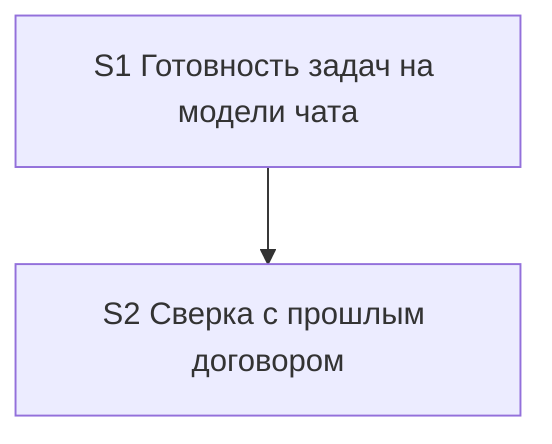

# Quality Control — Slice Coherence

**Change:** `model-tier-by-step`  
**Date:** 2026-09-22  
**Report:** `quality-control-2026-09-22-3.md`  
**Mode:** slice (`# Срез S1`, `# Срез S2`)  
**Scope:** полный пересчёт S1 + S2; `reused_checks: none`; прошлые QC этого дня не использованы как вердикт  
**Delta:** `changed_slices: S1, S2`; `deterministic_results: none` (матрицы перестроены); `affected_contract_ids: none`

## Verdict

`OK`

## Reused vs new

| Scope | Status |
|---|---|
| S1, S2 | **new findings** — полный пересчёт |
| reused_checks | none |
| prior QC `quality-control-2026-09-22.md` / `-2.md` | не переиспользованы |

## Slice Summary

| Slice | Scenario | Tasks | Acceptance | Dependencies | Gate |
|---|---|---|---|---|---|
| S1 | Готовность задач на модели чата; обычный arch-шаг остаётся на тяжёлой | S1.1–S1.10 (10) | S1.accept (Primary + 1 optional; coverage 5/5 via Primary / optional / S1.10) | нет | `<!-- slice-gate -->` present |
| S2 | Сверка с прошлым договором на лестнице независимого разбора | S2.1–S2.7 (7) | S2.accept (Primary + 1 optional; coverage 5/5 via Primary / optional / S2.7) | S1 (declared) | `<!-- slice-gate -->` present |

## Scenario Coverage

Источник: `specs/subagent-model-mapping/spec.md` — все `#### Scenario:`.

| Scenario | Covered by | Status |
|---|---|---|
| Вызов архитектора без ошибки enum | S1.10 (agent static / по тексту) | OK |
| Команда на Grok 4 без смены чата | S1.10 | OK |
| Рантайм свободен от мёртвых слагов | S1.10 | OK |
| Готовность задач на модели чата | S1 Primary + S1.accept Primary | OK |
| Сбой единственного вызова готовности задач | S1.6 + S1.accept optional | OK |
| Декомпозиция срезов не идёт на Fable | S2.7 | OK |
| Независимый разбор постановки идёт на Fable | S2.7 | OK |
| Нет слага сильной модели — строка про Opus 5 | S2.7 | OK |
| Сбой Opus не включает Fable | S2.7 | OK |
| Сверка с прошлым договором идёт по лестнице независимого разбора | S2 Primary + S2.accept Primary + optional; S2.1–S2.4 | OK |

**Criterion 1 (Scenario Coverage):** PASS. Implementation-only / regression scenarios покрыты agent-задачами «верифицировать по тексту» (static), без user IB/runtime spike. Отдельные срезы с accept — только для самостоятельных user outcomes (S1: готовность на модели чата; S2: лестница сверки с прошлым договором).

## Dependency Graph

| Edge | Declared? | Notes |
|---|---|---|
| S2 → S1 | yes (`**Зависимости:** S1`) | S2 добавляет строку в таблицу шагов, заведённую S1; откат правок S1 запрещён текстом задач |
| S1 → S2 | none | нет forward-зависимости приёмки |
| Cycles | none | — |
| Undeclared deps | none | общий файл `model-selection.mdc` и правка `architect-gate.mdc` в обоих срезах согласованы явной зависимостью S2→S1 |

**Criterion 4 (Dependency Graph):** PASS.

## Checklist evaluation

### 1. Scenario Coverage — PASS
См. матрицу выше. Пропусков нет.

### 2. Slice Independence — PASS
- S1 принимаем без S2: Primary смотрит на строку готовности задач и соседний обычный шаг / ссылку роли.
- S2 принимаем после S1 (зависимость назад), без будущих срезов.
- Циклов нет. Forward acceptance dependency нет (см. 8b).

### 3. Slice Completeness — PASS
Change — kit rules/skills (не 1С-метаданные/формы/BSL). Для приёмки S1 нужны таблица шагов, правки verify/tool-name-guard/architect-gate/architect.md и регрессия по тексту — задачи S1.1–S1.10 закрывают слои. Для S2 — строка таблицы + verified-cause-gate + отсылки architect-gate / patterns SKILL + регрессия S2.7. Пропусков слоя для Primary нет. Объектов метаданных нет (`form_mode: n/a`).

### 4. Slice Dependency Graph — PASS
См. выше.

### 5. Slice Gate Integrity — PASS
- S1: ровно один `S1.accept`, один `<!-- slice-gate -->`.
- S2: ровно один `S2.accept`, один `<!-- slice-gate -->`.
- Legacy `S<N>.T<M>` нет.

### 5b. Acceptance Checklist Coverage — PASS
| Check | S1 | S2 |
|---|---|---|
| `**Primary acceptance:**` in metadata | present | present |
| `**Primary (обязательно):**` in accept | present | present |
| accept body empty | no | no |
| Scenario nowhere covered | no | no |
| foreign Scenario in accept | no (optional = «Сбой…» из Связи S1) | no (optional = Scenario Primary S2) |

Покрытие остальных Scenario из `**Связь со spec:**` через `S1.10` / `S2.7` — допустимо (правило 6 / 5b: coverage in `S<N>.<M>` OK).

### 6. Rework Risk — PASS (low residual)
- S2 явно зависит от S1 — нет опоры на непринятый срез без зависимости.
- Primary journeys не дублируются между срезами.
- Оба среза правят `model-selection.mdc` и (S1.8 / S2.5) `architect-gate.mdc`: риск локального конфликта при apply снят текстом «не откатывать» и порядком S1→S2; отдельный alert не требуется.

### 8. Slice Verticality / Acceptance Observability — PASS
- S1 Primary: открыть таблицу шагов → увидеть вызов без явной модели / ссылку роли / соседний тяжёлый шаг — наблюдаемый black-box исход продукта kit (текст правил), не debugger / API / code-review контракта.
- S2 Primary: открыть ту же таблицу → увидеть лестницу сверки с прошлым договором = лестнице независимого разбора + та же строка в чат — тоже black-box по тексту правил.
- Mandatory Primary в обоих срезах не programmatic-only → `slice-not-vertical` не срабатывает.

### 8b. Self-Achievable Acceptance — PASS
- S1 Primary достижим задачами S1.1–S1.9 (таблица + отсылки); S1.10 — регрессия, не единственный путь Primary.
- S2 Primary достижим S2.1–S2.3 (+ отсылки S2.4–S2.6) после принятого S1; слой «строка сверки в таблице» живёт в задачах S2, не только в S1.
- Primary S1 и S2 не дублируют один user-journey.
- Нет forward-зависимости приёмки S1 от S2 → `slice-accept-not-self-achievable` не срабатывает.

### 9. Foundation slice with gate — PASS
Условия `slice-foundation-with-gate` (все обязательны):
1. S1 имеет accept + slice-gate — да;
2. S2 depends on S1 — да;
3. S1.accept programmatic-only при UX-journey у S2 — **нет** (S1 Primary наблюдаем).

Антипаттерн foundation+gate не подтверждён.

### 10. Acceptance Simplicity — PASS
В каждом `S<N>.accept` ровно один mandatory black-box journey (`**Primary (обязательно):**`); второй буллет помечен «(опционально)». `acceptance-simplicity-overload` не срабатывает.

### 11. User Task Contract — PASS
- Mechanical DENY в строках `S<N>.<M>`: не найдено (согласовано с verify 2.1a pre-check).
- Repair-цепочки «после verify/стенда»: нет.
- S1.10 / S2.7: «Верифицировать по тексту» — ALLOW-agent static, не user runtime-spike.
- Ручная сверка текста правил отнесена к `S<N>.accept` / metadata `**Приёмка:**`, не к рабочим задачам как обязанность пользователя на ИБ.
→ `user-task-contract-violation` не срабатывает.

## Task Readability (criterion 7)

| Task | Assessment |
|---|---|
| S1.1–S1.9 | глагол + путь файла + изменение + (D1/D4) — OK |
| S1.10 | static verify + файлы + имена Scenario — OK (agent path) |
| S2.1–S2.6 | глагол + файл + результат + (D2/D4) — OK |
| S2.7 | static verify + файл + Scenario — OK |
| S1.accept / S2.accept | бизнес-результат в заголовке; Primary mandatory — OK |

Alerts `task-opaque-title` / `task-too-short` / `task-opaque-acceptance`: нет.

## Alerts

*(нет CRITICAL / WARNING)*

### SUGGESTION (non-blocking)

1. **design/tasks Связь drift (documentation)**  
   - affected: `design.md` § Slices S1 vs `tasks.md` S1  
   - evidence: в `design.md` у S1 в «Связь со spec» названы 2 Scenario; в `tasks.md` — 5 (включая регрессии через S1.10). Coverage в tasks/spec согласовано.  
   - recommendation: при следующем extend выровнять блок `## Slices` в design под полный перечень Связи из tasks (не блокирует apply).

## Recommendations

### Automatic fix
Нет repairable CRITICAL/WARNING.

### Decision required
Нет. Объединение срезов не требуется (8b/9 PASS; два независимых user outcome подтверждены Primary S1 vs S2).

## Summary for orchestrator

| Criterion | Result |
|---|---|
| 1 Scenario Coverage | PASS |
| 2 Slice Independence | PASS |
| 3 Slice Completeness | PASS |
| 4 Dependency Graph | PASS |
| 5 Gate Integrity | PASS |
| 5b Acceptance Checklist | PASS |
| 6 Rework Risk | PASS |
| 8 Verticality | PASS |
| 8b Self-Achievable | PASS |
| 9 Foundation+gate | PASS |
| 10 Acceptance Simplicity | PASS |
| 11 User Task Contract | PASS |
| Task readability | PASS |

**Overall:** `OK`
