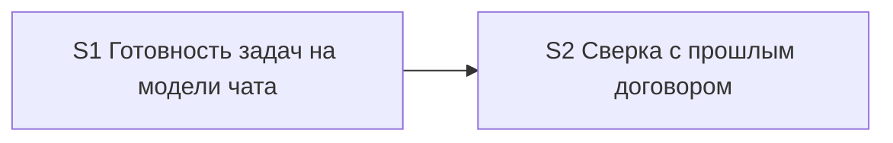

# Quality Control — model-tier-by-step — 2026-09-22-4

## Meta

- Mode: slice
- Scope: S1, S2 (full; cache not reused)
- linked_scenarios: all `#### Scenario` from `specs/subagent-model-mapping/spec.md`
- deterministic_results: none
- reused_checks: none
- Previous report `quality-control-2026-09-22-3.md`: not reused (tasks changed)

## Verdict

`OK`

## Reused vs new

- Reused scope: none
- New findings: full evaluation of S1 and S2 against criteria 1–6, 8, 8b, 9–11 + task readability

## Slice Summary

| Slice | Scenario | Tasks | Acceptance | Dependencies | Gate |
|---|---|---|---|---|---|
| S1 | Готовность задач на модели чата; обычный шаг — тяжёлая | S1.1–S1.11 (11) | S1.accept (Primary + 1 optional; 5/5 scenarios covered via Primary/optional/S1.10) | нет | `<!-- slice-gate -->` present |
| S2 | Сверка с прошлым договором на лестнице независимого разбора | S2.1–S2.7 (7) | S2.accept (Primary + 1 optional; 5/5 scenarios covered via Primary/optional/S2.7) | S1 (declared) | `<!-- slice-gate -->` present |

## Scenario Coverage

| Scenario | Covered by | Status |
|---|---|---|
| Готовность задач на модели чата | S1 Primary / S1.accept Primary | OK |
| Сбой единственного вызова готовности задач | S1.6 + S1.accept optional | OK |
| Вызов архитектора без ошибки enum | S1.10 (верифицировать по тексту) | OK |
| Команда на Grok 4 без смены чата | S1.10 | OK |
| Рантайм свободен от мёртвых слагов | S1.10 | OK |
| Сверка с прошлым договором идёт по лестнице независимого разбора | S2 Primary / S2.accept Primary (+ optional) | OK |
| Декомпозиция срезов не идёт на Fable | S2.7 | OK |
| Независимый разбор постановки идёт на Fable | S2.7 | OK |
| Нет слага сильной модели — строка про Opus 5 | S2.7 | OK |
| Сбой Opus не включает Fable | S2.7 | OK |

## Dependency Graph

- Edges: S2 → depends on S1 (metadata: «Зависимости: S1»; table created in S1, extended in S2).
- Cycles: none.
- Forward acceptance dependency: none — S1 Primary does not require S2; S2 Primary reachable after S1 + S2 tasks.
- Undeclared dependencies: none. Shared file `.cursor/rules/model-selection.mdc` is covered by declared S1→S2 edge; S2 tasks explicitly forbid rolling back S1 rows.

## Criteria evaluation

### 1. Scenario Coverage — PASS

All 10 `#### Scenario` from delta specs are bound to S1 or S2 via Primary, optional accept, or agent static verification (`S1.10`, `S2.7`). Implementation-only / regression scenarios use agent «верифицировать по тексту» path; no user IB/runtime spike.

### 2. Slice Independence — PASS

S1 acceptible without S2. S2 depends only backward on S1. Distinct user outcomes: (S1) task-readiness without explicit model vs heavy default; (S2) precedent-coherence on same ladder as design-challenge.

### 3. Slice Completeness — PASS

Change is kit documentation (rules / skills / `AGENTS.md`). Layers required for Primary are text edits listed in slice tasks; no metadata/form/BSL layers needed. Both slices include verification + accept.

### 4. Slice Dependency Graph — PASS

Declared dependencies exist; no cycles; S1 referenced by S2 exists.

### 5. Slice Gate Integrity — PASS

Exactly one `S1.accept` and one `S2.accept`; each has `<!-- slice-gate: … -->`.

### 5b. Acceptance Checklist Coverage — PASS

- Both slices have `**Primary acceptance:**` in metadata and `**Primary (обязательно):**` in accept body.
- No empty accept checklist.
- No foreign-scenario bullets across slices.
- Spec scenarios not in accept bullets are covered by `S1.10` / `S2.7` (allowed).

### 6. Rework Risk — PASS (residual SUGGESTION only)

No undeclared reliance on unaccepted next slice. Scenarios are not duplicated as Primary journeys across slices. Residual risk of concurrent edits to the same step table is mitigated by S2 wording («не откатывая строку готовности задач…») and explicit dependency — see Suggestions.

### 8. Slice Verticality / Acceptance Observability — PASS

Mandatory Primary for S1 and S2 describe black-box observation of kit rules: open the step table / related rule text and see the documented model ladder or call mode. Not programmatic-only (no debugger, API call, or return-type inspection as accept). Appropriate for a documentation/kit change where the product surface is the rule text.

### 8b. Self-Achievable Acceptance — PASS

- S1 Primary is produced by S1.1–S1.3 (table + role row) and supporting referral tasks; no need for S2 layers.
- S2 Primary is produced by S2.1–S2.3 (row + split + under-table rules) after S1; journey differs from S1 Primary (no duplicate «task-readiness without model» accept).
- No forward-acceptance dependency on a later slice.

### 9. Foundation slice with gate — PASS

S1 has accept + gate and S2 depends on S1, but S1.accept is itself a black-box user journey (not programmatic-only foundation). Criterion 9 does not fire.

### 10. Acceptance Simplicity — PASS

Each accept has exactly one mandatory Primary journey; remaining bullets are marked optional.

### 11. User Task Contract — PASS

Mechanical/semantic scan of `S1.1`–`S1.11` and `S2.1`–`S2.7`:

- No DENY phrases (`тестовой ИБ`, `на стенде`, `runtime-verify`, `спайк`, `в консоли`, `отладчик`, `вызвать API`, conditional «после verify/стенда»).
- `S1.10` / `S2.7`: agent static «верифицировать по тексту» — ALLOW-agent.
- `S1.11`: agent edit of `AGENTS.md` — not a user runtime spike.
- Manual config checklist: none. User work remains only on `S<N>.accept` (ручная сверка текста) — allowed at slice gate.

## Task readability

| Task | Verdict |
|---|---|
| S1.1–S1.9, S1.11 | OK — verb + path + result + (D*) |
| S1.10 | OK — agent verify-by-text + files + business regression list |
| S2.1–S2.6 | OK |
| S2.7 | OK — agent verify-by-text |
| S1.accept / S2.accept | OK — business result in title; Primary + optional checklist |

No `task-opaque-title`, `task-too-short`, or opaque-acceptance alerts.

## Alerts

_(none CRITICAL / WARNING)_

### Suggestions

| Alert | Severity | Evidence | Recommendation |
|---|---|---|---|
| shared-file-edit-discipline | SUGGESTION | S1 and S2 both edit `.cursor/rules/model-selection.mdc` and `architect-gate.mdc` | On apply S2, keep S1 rows/referrals intact (already stated in S2.1/S2.2/S2.5). No structural merge required. |

## Recommendations

### Automatic fix

_(none — no CRITICAL/WARNING repairable alerts)_

### Decision required

_(none)_

## Remediation (auto-repair)

_(none)_
