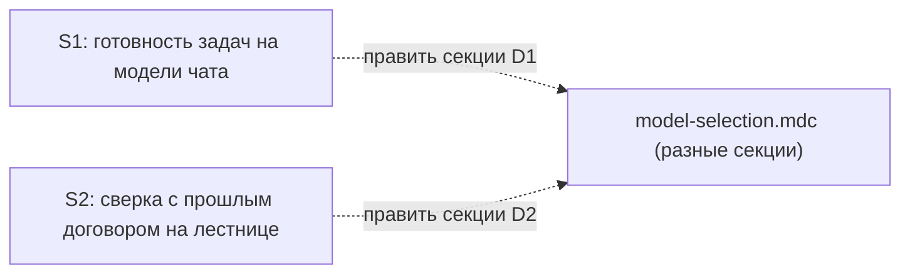

# Quality Control — Slice Coherence: `model-tier-by-step`

Дата: 2026-09-22  
Агент: openspec-quality-controller  
Режим: pre-tasks (cache miss, `changed_slices: all`)  
Источники: `design.md` § Slices, `proposal.md`, `specs/subagent-model-mapping/spec.md`  
`tasks.md`: отсутствует — критерии 5 / 11 по чекбоксам и телу `S<N>.accept` оценены на уровне проекта срезов; `S<N>.accept` / `<!-- slice-gate -->` ещё не материализованы.

Reused scope: none (`reused_checks: none`).  
New findings: полный прогон критериев 1, 3, 5, 5b, 8, 8b, 9–11.

## Verdict

**WARNING**

Критического разрыва декомпозиции нет:

| Вопрос | Ответ |
|---|---|
| Срез нельзя принять отдельно? | Нет — у S1 и S2 разные Primary, `**Зависимости:** нет` |
| Фундамент без видимого результата? | Нет — оба среза заявляют самостоятельный наблюдаемый исход |
| Приёмка одного среза зависит от другого? | Нет — нет forward-зависимости приёмки и нет дубля Primary |

WARNING из‑за дыр покрытия Scenario в плане срезов (критерий 1 / 5b) и отложенной материализации gate в `tasks.md` (критерий 5). Критерии 8 / 8b / 9 / 10 на проекте срезов — PASS.

## Slice Summary

| Slice | Scenario (design) | Tasks | Acceptance (проект) | Dependencies | Gate |
|---|---|---|---|---|---|
| S1: Готовность задач на модели чата | «Готовность задач на модели чата» (+ файлы SKILL для сбоя, но Scenario сбоя не в Связи) | ещё нет | Primary в design: открыть правило → готовность без явной модели; соседний шаг — тяжёлая | нет | ещё нет (`S1.accept` + `<!-- slice-gate -->` ожидать при нарезке) |
| S2: Сверка с прошлым договором на лестнице | «Сверка с прошлым договором идёт по лестнице независимого разбора» | ещё нет | Primary в design: открыть правило → та же лестница, что у независимого разбора, + одна строка в чат | нет (очередь apply из‑за общего файла) | ещё нет |

## Scenario Coverage

| Scenario | Covered by | Status |
|---|---|---|
| Готовность задач на модели чата | S1 Primary / Связь со spec | OK |
| Сбой единственного вызова готовности задач | Файлы S1 (`openspec-verify-change/SKILL.md`), D1; **не** в `**Связь со spec:**` S1 | WARNING — `accept-bullets-missing-scenario` (риск при нарезке) |
| Сверка с прошлым договором идёт по лестнице независимого разбора | S2 Primary / Связь со spec | OK |
| Вызов архитектора без ошибки enum | ни один срез | WARNING — не покрыт планом |
| Команда на Grok 4 без смены чата | ни один срез | WARNING — не покрыт планом |
| Рантайм свободен от мёртвых слагов | ни один срез | WARNING — не покрыт планом |
| Декомпозиция срезов не идёт на Fable | ни один срез | WARNING — не покрыт планом |
| Независимый разбор постановки идёт на Fable | ни один срез | WARNING — не покрыт планом |
| Нет слага сильной модели — строка про Opus 5 | ни один срез | WARNING — не покрыт планом |
| Сбой Opus не включает Fable | ни один срез | WARNING — не покрыт планом |

Linked (delta): «Готовность задач…», «Сбой единственного вызова…», «Сверка с прошлым договором…» — два из трёх явно в срезах; сбой — только косвенно через файлы S1.

## Dependency Graph

- Циклов нет.
- Объявленных slice-зависимостей нет (`Зависимости: нет` у обоих).
- Очередь apply «по очереди» — координация общего файла, не зависимость приёмки: Primary S1 не требует текстов лестницы S2; Primary S2 не требует исключения readiness S1.
- Forward acceptance dependency: нет.
- Дубль Primary / одного user-journey на двух срезах: нет.

## Критерии (запрошенные)

### 1. Scenario Coverage — WARNING

Новые сценарии цели ЗНИ частично покрыты. Scenario «Сбой единственного вызова готовности задач» входит в linked_scenarios и в охват файлов S1, но не заявлен в `**Связь со spec:**` S1 — при генерации `tasks.md` легко выпасть из accept / agent-verify.

Семь регрессионных Scenario из MODIFIED-требований не привязаны ни к одному срезу. Для kit-delta это допустимо закрыть агентскими задачами «верифицировать по правилам» внутри S1/S2 или optional-пунктами — но в текущем плане срезов места покрытия нет → WARNING до нарезки задач.

### 3. Slice Completeness — PASS (с оговоркой kit)

Слои 1С (метаданные / форма / BSL) не применимы (kit-only). Полнота = файлы, нужные для Primary:

- S1: `model-selection.mdc` (три места D1) + `openspec-verify-change/SKILL.md` (запуск без `model` + сбой) — достаточно для заявленного Primary и для Scenario сбоя, если его включат в покрытие.
- S2: `model-selection.mdc` (лестница + расщепление coherence) + `verified-cause-gate.mdc` + `architect-gate.mdc` — достаточно для Primary лестницы.

Пропусков слоя для приёмки не видно.

### 5. Slice Gate Integrity — SUGGESTION (отложено)

В `tasks.md` ещё нет `# Срез` / `S<N>.accept` / `<!-- slice-gate -->`. CRITICAL `missing accept/gate` не эмитируется на стадии design. При нарезке: ровно один `S1.accept` и один `S2.accept`, каждый с `<!-- slice-gate -->`.

### 5b. Acceptance Checklist Coverage — WARNING

- `**Primary acceptance:**` есть у S1 и S2 в design → `primary-acceptance-missing` не срабатывает на проекте.
- Тела `S<N>.accept` нет → `accept-checklist-empty` не применим до tasks; при генерации первый sub-bullet MUST = Primary.
- Scenario без покрытия — см. таблицу Coverage (`accept-bullets-missing-scenario`).
- Чужих Scenario в accept чужого среза нет (`accept-bullet-foreign-scenario` не срабатывает).

### 8. Slice Verticality — PASS (смысловое суждение)

Оба Primary сформулированы как «открыть правило назначения и увидеть …». Это не вызов функции в отладчике и не проверка типа API.

Для kit-only продукт — сами правила и поведение оркестратора по ним. Delta spec для лестницы Fable прямо допускает: «Наблюдаемая приёмка среза — текст правил». Design Risks: приёмка S2 смотрит на текст лестницы, не на смену модели на экране (в сборке нет слага самой сильной модели).

Итог: mandatory Primary описывает наблюдаемый исход на поверхности продукта (текст SSOT-правила / контракт назначения), а не implementation leak. `slice-not-vertical` не эмитируется.

SUGGESTION (не блокер): при желании усилить black-box — Primary S1 как «запуск проверки → вызов готовности без явной модели»; Primary S2 как «запуск сверки → та же одна строка / та же лестница, что у независимого разбора». Текст правила тогда — agent `S<N>.<M>` «верифицировать по файлу».

### 8b. Self-Achievable Acceptance — PASS

- Primary S1 достижим файлами/секциями S1; слой S2 не нужен.
- Primary S2 достижим файлами/секциями S2; слой S1 не нужен.
- Нет дубля journey между S1 и S2.
- `slice-accept-not-self-achievable` не срабатывает.

### 9. Foundation slice with gate — PASS

Нет пары foundation (programmatic-only accept) → consumer (UX accept) с зависимостью. Оба среза с самостоятельным исходом; зависимости между срезами не объявлены. `slice-foundation-with-gate` не срабатывает.

Общий файл `model-selection.mdc` ≠ foundation API: это координация правок, не «сначала API без UX».

### 10. Acceptance Simplicity — PASS

У каждого среза один mandatory Primary journey. `acceptance-simplicity-overload` не срабатывает.

### 11. User Task Contract — N/A → PASS на стадии

Задач `S<N>.<M>` нет; DENY-паттернов user-spike нет. При нарезке: runtime-spike пользователю в `S<N>.<M>` запрещён; Scenario сбоя — agent static / optional accept, не «на стенде эмулировать Task».

## Alerts

### 1. `accept-bullets-missing-scenario` — Scenario «Сбой единственного вызова готовности задач»

- **Affected:** S1 / delta Scenario
- **Severity:** WARNING
- **Evidence:** linked_scenarios и D1 + файлы S1 включают поведение сбоя; `design.md` S1 `**Связь со spec:**` называет только «Готовность задач на модели чата».
- **Recommendation:** добавить Scenario в Связь S1; в будущем `S1.accept` — optional sub-bullet или agent `S1.<M>` «верифицировать по SKILL: при сбое единственного вызова шаг не считается пройденным / прошлый отчёт не подставляется».

### Remediation (auto-repair)
- alert: accept-bullets-missing-scenario
- target: `design.md`, slice S1 (затем `tasks.md` при нарезке)
- action: расширить `**Связь со spec:**` Requirement «Мэппинг ролей…» — Scenario «Готовность задач на модели чата», Scenario «Сбой единственного вызова готовности задач»; в `S1.accept` покрыть сбой optional-пунктом или agent-задачей static по SKILL.

### 2. `accept-bullets-missing-scenario` — регрессионные Scenario MODIFIED-требований

- **Affected:** change-wide (не привязаны к S1/S2)
- **Severity:** WARNING
- **Evidence:** в delta spec остаются Scenario: «Вызов архитектора без ошибки enum», «Команда на Grok 4…», «Рантайм свободен…», «Декомпозиция срезов не идёт на Fable», «Независимый разбор…», «Нет слага…», «Сбой Opus не включает Fable» — ни в Связи срезов, ни в плане agent-verify.
- **Recommendation:** при нарезке `tasks.md` распределить agent «верифицировать по правилам / grep слагов» в S1 (мэппинг) и S2 (лестница Fable) либо optional accept; не плодить отдельные срезы.

### Remediation (auto-repair)
- alert: accept-bullets-missing-scenario
- target: будущий `tasks.md`, S1 и S2
- action: добавить в S1 agent-задачи static на Scenario мэппинга (enum / Grok / мёртвые слаги); в S2 — static на Scenario лестницы Fable (декомпозиция не Fable, независимый разбор, строка Opus, сбой Opus); не делать их mandatory Primary.

### 3. `slice-gate-deferred` (pre-tasks)

- **Affected:** S1, S2
- **Severity:** SUGGESTION
- **Evidence:** нет `tasks.md` с `S<N>.accept` и `<!-- slice-gate -->`.
- **Recommendation:** при генерации tasks — по одному accept + gate на срез; blocking sub-bullet = Primary из design.

### Remediation (auto-repair)
- alert: slice-gate-deferred
- target: будущий `tasks.md`, S1 и S2
- action: создать `# Срез S1` / `# Срез S2` с metadata из design, ровно один `- [ ] S<N>.accept` с `**Primary (обязательно):**` и `<!-- slice-gate: … -->`.

### 4. `shared-file-apply-coordination` (Rework Risk)

- **Affected:** S1 ↔ S2
- **Severity:** SUGGESTION
- **Evidence:** оба правят `model-selection.mdc` в разных секциях; design: «применяются по очереди».
- **Recommendation:** в tasks явно развести секции/якоря строк; не смешивать правки D1 и D2 в одной задаче. Не трактовать как зависимость приёмки.

## Recommendations

### Automatic fix (при правке design / нарезке tasks)

1. Включить Scenario «Сбой единственного вызова…» в Связь S1 и в покрытие accept/agent.
2. Закрыть семь регрессионных Scenario agent static внутри S1/S2.
3. Материализовать `S1.accept` / `S2.accept` + slice-gate из текущих Primary.

### Decision required

Нет. Объединять S1 и S2 не требуется: два независимых пользовательских исхода (готовность на модели чата vs сверка на лестнице разбора), 8b/9 чистые. Дробление на два среза для Standard-размера kit-change оправдано независимыми outcomes.

## Critical-gap summary (для оркестратора)

**Критического разрыва нет.** Срезы принимаемы по отдельности; фундамент без видимого результата отсутствует; приёмка одного среза не зависит от другого. До нарезки задач закрыть WARNING по покрытию Scenario «Сбой…» и регрессионных Scenario.
