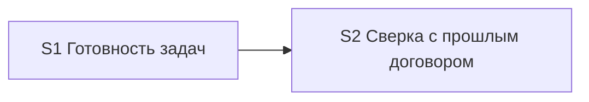

# Quality Control — model-tier-by-step — 2026-09-23

## Scope

- Mode: slice
- changed_slices: S1, S2
- reused_checks: none (full re-eval; `quality-control-2026-09-22-4.md` not reused)
- linked_scenarios: all `#### Scenario` from delta `specs/subagent-model-mapping/spec.md` plus live-spec regressions named in S1.10 («Слаг таблицы отсутствует в enum сборки», «Согласованность описаний цепочки»)
- Out of scope: test data / IB readiness (transient)
- In scope: structural user-spike in `S<N>.<M>` (criterion 11); S1.10 / S2.7 text-verify wording; S2.8 as launch-text edit

## Verdict

`OK`

## Reused vs new

| Scope | Status |
|---|---|
| S1 | **new findings** (full) |
| S2 | **new findings** (full) |
| reused_checks | none |

## Slice Summary

| Slice | Scenario | Tasks | Acceptance | Dependencies | Gate |
|---|---|---|---|---|---|
| S1 | Готовность задач на модели чата; обычный шаг — тяжёлая | S1.1–S1.11 (11) | S1.accept (2/2 blocking+optional; Primary + 1 optional; 5 more Scenarios via S1.10) | нет | `<!-- slice-gate -->` present |
| S2 | Сверка с прошлым договором на лестнице независимого разбора | S2.1–S2.6, S2.8, S2.7 (8) | S2.accept (2/2; Primary + 1 optional; 4 more Scenarios via S2.7) | S1 | `<!-- slice-gate -->` present |

## Scenario Coverage

| Scenario | Covered by | Status |
|---|---|---|
| Готовность задач на модели чата | S1 Primary / S1.accept Primary | OK |
| Сбой единственного вызова готовности задач | S1.6; S1.accept optional | OK |
| Вызов архитектора без ошибки enum | S1.10 (agent static «по тексту») | OK |
| Команда на Grok 4 без смены чата | S1.10 | OK |
| Рантайм свободен от мёртвых слагов | S1.10 | OK |
| Слаг таблицы отсутствует в enum сборки (live) | S1.10 | OK |
| Согласованность описаний цепочки (live) | S1.10 | OK |
| Сверка с прошлым договором идёт по лестнице независимого разбора | S2 Primary / S2.accept Primary + optional | OK |
| Декомпозиция срезов не идёт на Fable | S2.7 | OK |
| Независимый разбор постановки идёт на Fable | S2.7 | OK |
| Нет слага сильной модели — строка про Opus 5 | S2.7 | OK |
| Сбой Opus не включает Fable | S2.7 | OK |

Примечание: live Scenario «Сбой Primary» не входит в `linked_scenarios` этого прогона — не оценивался.

## Dependency Graph

- Cycles: none
- Forward acceptance dependency: none (S1 Primary ≠ S2 Primary; S2 accepts after S1 by declared backward dep only)
- Undeclared deps: none (S2 metadata: `**Зависимости:** S1`)

## Criteria Evaluation (1–6, 8, 8b, 9–11)

### 1. Scenario Coverage — PASS

Все linked Scenarios покрыты Primary, optional accept или agent `S<N>.<M>` «верифицировать по тексту» (static kit-text path, аналог «по коду»). User IB/runtime spike отсутствует.

### 2. Slice Independence — PASS

S1 принимаем без S2. S2 зависит только назад от S1. Циклов нет. Дубля Primary между срезами нет.

### 3. Slice Completeness — PASS

Change — правка правил/скиллов kit (не 1С UI). Слои, нужные для Primary (таблица шагов, отсылки, тексты запуска), присутствуют в задачах каждого среза. Пропусков слоёв для приёмки нет.

### 4. Slice Dependency Graph — PASS

Объявленная зависимость S2→S1 существует; циклов нет; соответствие metadata/design § Slices.

### 5. Slice Gate Integrity — PASS

Ровно один `S1.accept` / `S2.accept`; у каждого среза один `<!-- slice-gate -->`. Legacy `T<M>` нет.

### 5b. Acceptance Checklist Coverage — PASS

- `**Primary acceptance:**` и mandatory `**Primary (обязательно):**` — есть в S1 и S2.
- `accept-checklist-empty` — нет.
- Scenarios только в `S1.10` / `S2.7` — допустимо (coverage via `S<N>.<M>`).
- Foreign Scenario в accept — нет.

### 6. Rework Risk — PASS (low)

Оба среза правят `model-selection.mdc`, но порядок и «не откатывать S1» зафиксированы в S2.1/S2.2/S2.5. Сценарии не дублируются. Явная зависимость снижает риск скрытой переделки.

### 8. Slice Verticality / Acceptance Observability — PASS

Primary S1/S2: открыть таблицу шагов в правиле назначения и увидеть наблюдаемый текст (black-box для продукта kit). Не debugger / не return-type / не код-ревью контракта API как mandatory accept. Programmatic-only Primary отсутствует → `slice-not-vertical` не срабатывает.

### 8b. Self-Achievable Acceptance — PASS

- S1 Primary достижим задачами S1.1–S1.3 (таблица + строка роли) + соседние отсылки.
- S2 Primary достижим S2.1 (строка сверки в той же таблице) при принятом S1; слой не «только в S3+».
- Дубля journey S1/S2 нет → `slice-accept-not-self-achievable` не срабатывает.

### 9. Foundation slice with gate — PASS

Условия foundation+gate (все): (a) S1 имеет accept+gate — да; (b) S2 зависит от S1 — да; (c) S1.accept programmatic-only, а S2 — UX journey — **нет**: S1.accept сам black-box outcome (готовность задач без явной модели). Независимый пользовательский исход S1 есть → `slice-foundation-with-gate` не срабатывает.

### 10. Acceptance Simplicity — PASS

В каждом `S<N>.accept` ровно один mandatory black-box journey; второй буллет помечен «(опционально)».

### 11. User Task Contract — PASS

Mechanical DENY (`тестовой ИБ`, `на стенде`, `runtime-verify`, `спайк`, `в консоли`, `отладчик`, `вызвать API`, условные «после verify/стенда») в `S1.*` / `S2.*` (кроме accept) — **не найдены**.

Семантика:

| Task | Wording | Verdict |
|---|---|---|
| S1.10 | «Верифицировать по тексту» файлов правил/скилла — agent static review | ALLOW-agent; не user-spike |
| S2.7 | «Верифицировать по тексту» `model-selection.mdc` — agent static regression | ALLOW-agent |
| S2.8 | правка `openspec-verify-change/SKILL.md`: заменить пересказ лестницы отсылкой | agent edit; не user runtime |
| `S<N>.accept` / metadata «ручная сверка» | приёмка на границе среза | ALLOW user |

`user-task-contract-violation` — не эмитируется.

## Task Readability (criterion 7 adjunct)

| Check | Result |
|---|---|
| Opaque titles (`task-opaque-title`) | none |
| Too short (`task-too-short`) | none |
| Accept opaque / empty | none |
| Note | Нумерация S2: в файле S2.8 стоит в §2 до S2.7 в §3 — не алерт QC; на согласованность срезов не влияет |

## Alerts

_(none)_

## Recommendations

### Automatic fix

_(none)_

### Decision required

_(none)_

## Summary for orchestrator

Срезы S1 и S2 согласованы: покрытие linked Scenarios полное, gate/Primary/simplicity в порядке, оба Primary наблюдаемы и самодостижимы, foundation+gate нет, user-spike в рабочих задачах нет. Verdict: **OK**.
