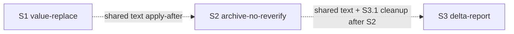

# Quality Control — Slice Coherence

- change: `pipeline-light-route`
- date: 2026-09-30
- mode: slice
- scope: full (cache miss; first verify; `reused_checks: none`)
- linked_scenarios: 19 (all in `specs/pipeline-light-route/spec.md`)
- affected_contract_ids: EC-1 (context only; not evaluated as code)
- sources: `tasks.md`, `design.md` § Slices, `proposal.md`, `specs/pipeline-light-route/spec.md`
- canon: `.cursor/rules/vertical-slices.mdc` (criteria 1, 2, 3, 4, 5, 5b, 6, 8, 8b, 9, 10, 11), `.cursor/rules/task-readability.mdc`

## Verdict

`OK`

## Scope note

- Invalidated / evaluated: all slices S1–S3, all 19 scenarios.
- Reused: none (explicit; prior `reports/quality-control-new-2026-09-30.md` not reused).
- Out of scope (per prompt): IB executability now; test-data presence; absence of fixture changes on disk.

## Slice Summary

| Slice | Scenario | Tasks | Acceptance | Dependencies | Gate |
|---|---|---|---|---|---|
| S1 Замена значения без проверки | Замена цвета → «проверка не требуется»; точечный проход после замены | S1.1–S1.25 (25) + S1.accept | S1.accept (Primary + 5 optional + agent map; 12/12 scenarios) | нет (внутри ЗНИ); снаружи — архив `value-efficient-verify`, `verify-stop-repeat` | `<!-- slice-gate -->` present |
| S2 Архив без повторного прогона | Архив после приёмки без нового отчёта; silent_ok | S2.1–S2.13 (13) + S2.accept | S2.accept (Primary + 3 optional; 5/5; 2 covered by Primary) | по поведению нет; общий текст с S1 — после приёмки S1 | `<!-- slice-gate -->` present |
| S3 Отчёт повторного прогона без копий | Дельта-отчёт без копий журналов | S3.1–S3.10 (10) + S3.accept | S3.accept (Primary + agent S3.7; 2/2) | по поведению нет; S3.1 после S2; общий текст после S1/S2 | `<!-- slice-gate -->` present |

## Scenario Coverage

| Scenario | Covered by | Status |
|---|---|---|
| Замена утверждённого цвета | S1 Primary (`S1.accept` mandatory) | OK |
| Замена до первой полной проверки | S1.20 (agent, static/text) | OK |
| Замена в принятом срезе | S1.accept optional | OK |
| Повторная замена того же значения до приёмки | S1.20 | OK |
| Новое значение занято другим состоянием | S1.20 | OK |
| Смена порога не считается заменой значения | S1.accept optional | OK |
| Воздействие замены неочевидно | S1.21 | OK |
| Смена сути правила ведёт к проверке | S1.22 | OK |
| Короткая сверка изменённого | S1.accept optional | OK |
| Проверка вызвана после замены цвета | S1.accept optional | OK |
| Граница среза после замены цвета | S1.accept optional | OK |
| Старое значение осталось в требованиях | S1.23 | OK |
| Архив после отметки приёмки | S2 Primary | OK |
| Правка текста задачи после проверки | S2.accept optional | OK |
| Архив после приёмки без правок постановки | S2 Primary | OK |
| Повторная проверка сразу после финальной | S2.accept optional | OK |
| Постановка менялась после приёмки | S2.accept optional | OK |
| Отчёт повторного прогона | S3 Primary | OK |
| Отчёт полного прогона | S3.7 (agent, static/text) | OK |

Coverage: **19/19**. No `accept-bullets-missing-scenario`. No `accept-bullet-foreign-scenario`.

## Dependency Graph

- Cycles: none.
- Forward acceptance dependency (S[N] Primary needs S[N+1]): none.
- Declared soft edges: sequential apply on shared surfaces (`SKILL.md` §1c, `report-header.md`); behavioral independence of Primaries preserved.
- Undeclared hard deps: none (ordering disclosed in metadata / header comment).

## Criteria evaluation

### 1. Scenario Coverage — PASS

Every `#### Scenario:` is bound to Primary, optional accept bullet, or agent `S<N>.<M>` «сверить по тексту». Implementation-only refusals (S1.20–S1.23, S3.7) use static verification tasks — compliant with User Task Contract.

### 2. Slice Independence — PASS

Each Primary is acceptable without later slices. S2/S3 do not block S1. Soft shared-file ordering is backward-only.

### 3. Slice Completeness — PASS

Kit-only change (no 1C metadata/forms/BSL). Layers required for each Primary (skill/rule edits, fixture prep by agent, accept journey) are present inside the same slice. Cross-slice regression checks S2.9 / S3.8 guard shared surfaces.

### 4. Slice Dependency Graph — PASS

Metadata `**Зависимости:**` consistent with design § Slices. No cycles; declared predecessors exist where named.

### 5. Slice Gate Integrity — PASS

Exactly one `S<N>.accept` and one closing `<!-- slice-gate -->` per slice. No `<!-- phase-gate -->`. No legacy `S<N>.T<M>`.

### 5b. Acceptance Checklist Coverage — PASS

| Check | S1 | S2 | S3 |
|---|---|---|---|
| `**Primary acceptance:**` metadata | yes | yes | yes |
| `**Primary (обязательно):**` in accept | yes | yes | yes |
| Spec scenarios covered | 12/12 | 5/5 | 2/2 |
| Foreign scenario in accept | no | no | no |

### 6. Rework Risk — PASS (mitigated)

Shared surfaces (§1c, `report-header.md`) create sequential rework risk; mitigated by explicit apply-after comment, non-overlapping section ownership in design, and agent text-guard tasks S2.9 / S3.8. No duplicate Primary journeys across slices.

### 8. Slice Verticality — PASS

All mandatory Primaries are black-box kit journeys (extend/archive handoff or open verification report), not programmatic-only API/debug accepts.

### 8b. Self-Achievable Acceptance — PASS

| Slice | Reachability |
|---|---|
| S1 | Skills + fixture `fixture-light-route-color` + verify prep (S1.24–S1.25) enable Primary extend A→B inside S1 |
| S2 | Hash keys + archive §2a + fixtures S2.10–S2.12 enable Primary archive without new report |
| S3 | Report/snapshot/executive-summary edits + own fixture S3.9–S3.10 enable Primary; S3.1 cleanup not required for Primary |

No duplicated Primary across adjacent slices. No structural forward dependency of acceptance.

### 9. Foundation slice with gate — PASS

No foundation+consumer pair: S1/S2/S3 each have observable black-box Primary (not programmatic-only gate before UX consumer).

### 10. Acceptance Simplicity — PASS

One mandatory black-box journey per `S<N>.accept`. Remaining bullets marked optional or agent-covered.

### 11. User Task Contract — PASS

Working lines `S<N>.<M>`: no DENY terms (mechanical pre-check confirmed); no «после verify S» / «после стенда» chains. Runtime/command spikes for customers appear only in `S<N>.accept` (allowed). Fixture prepare/verify/apply/mark tasks are agent-owned.

## Task readability

- Pattern «глагол + файл/скилл + результат + (D#/Assumption)» holds for implementation tasks.
- Accept titles carry business outcome.
- No `task-opaque-title` / `task-too-short` / `task-opaque-acceptance` alerts.
- SUGGESTION only: S1.accept Primary covers «Замена утверждённого цвета» without a named `Scenario «…»` line — readable enough; optional clarity improvement only.

## Alerts

None at CRITICAL or WARNING.

### SUGGESTION (non-blocking)

1. **alert:** `accept-primary-scenario-label` (informational)
   - **affected:** S1.accept
   - **severity:** SUGGESTION
   - **evidence:** Primary journey matches Scenario «Замена утверждённого цвета» but the checklist does not name that Scenario in ёлочках (unlike optional bullets).
   - **recommendation:** Optionally add an explicit note under Primary or a one-line `Scenario «Замена утверждённого цвета» — покрыт Primary` for checklist scanability. Not required by criterion 5b (Primary coverage = OK).

2. **alert:** `shared-surface-apply-order`
   - **affected:** S1→S2→S3
   - **severity:** SUGGESTION
   - **evidence:** Header comment and metadata already forbid parallel apply on shared text; S2.9/S3.8 exist.
   - **recommendation:** Keep S2.9/S3.8 as blocking agent checks before accept; no structural change needed.

## Recommendations

### Automatic fix

None required for CRITICAL/WARNING. No remediation blocks.

### Decision required

None. Slice merge / Primary rewrite not indicated.

## Alignment with design § Slices

tasks.md matches design table: three slices, Primary texts, scenario split (mandatory / optional / agent), shared-file order, fixture ownership. Spec gain «Воздействие замены неочевидно» is covered by S1.21 and design bullet under S1 agent verification.

## Summary

Full control on current `tasks.md`: slice mode coherent; 19/19 scenarios covered; gates intact; Primaries vertical and self-achievable; User Task Contract clean. Verdict **OK**.
