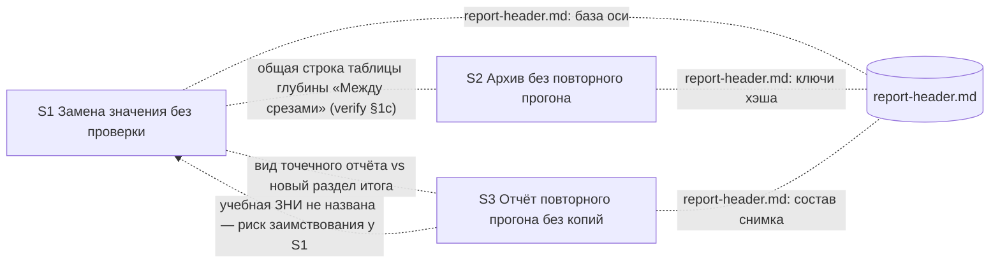

# Контроль декомпозиции на срезы — pipeline-light-route

## Verdict

**CRITICAL** — три замечания надо закрыть до генерации `tasks.md`, все три правятся в `design.md` § Slices без смены подхода:

1. В приёмке среза S1 «Замена значения без проверки» два обязательных пути: замена цвета и замена порога.
2. В приёмке среза S2 «Архив без повторного прогона» тоже два обязательных пути: архив после приёмки и повторная проверка.
3. Приёмка S2 требует «остановить архив до переноса каталога», но у архива нет такой точки остановки, и ни одна работа среза её не создаёт. В текущей формулировке приёмка среза недостижима.

Границы срезов верные: у каждого среза свой видимый результат, подготовительного среза без пользы нет, объединять срезы не нужно. Главный скрытый риск — общий текст: все три среза правят `templates/report-header.md` и `openspec-verify-change/SKILL.md`, а S1 и S2 — одну и ту же строку таблицы глубины «Между срезами».

Охват и повторное использование: первый прогон, повторно используемых результатов нет. Весь анализ ниже — новые находки.

## Slice Summary

| Slice | Scenario | Tasks | Acceptance | Dependencies | Gate |
|---|---|---|---|---|---|
| S1 «Замена значения без проверки» | Заказчик меняет утверждённый цвет через дополнение и получает «проверка не требуется»; проверка вручную или на границе среза не уходит в полный разбор | ещё нет (оценка ≈ 8–10 работ: дополнение — три исхода, поиск старого значения, оговорка для вызова архитектора; таблица глубины — строка и оговорки; база оси в `report-header.md`; маршрут в двух правилах; дельта спецификации; учебная ЗНИ) | Primary есть, но **два обязательных пути** (цвет → «не требуется», порог → проверка). Связь со spec не указана; по смыслу — 11 сценариев | объявлено: нет | будет при генерации |
| S2 «Архив без повторного прогона» | После приёмки последнего среза архив не вызывает проверку, если постановка не менялась; второй финальный прогон не создаётся | ещё нет (≈ 5–7: архив §2a, ключи хэша, быстрый путь проверки с учётом режима, строка «Между срезами», учебная ЗНИ и её уборка) | Primary есть, но **два обязательных пути** (архив и повторная проверка); условие «остановка архива до переноса» недостижимо. Связь со spec не указана; по смыслу — 5 сценариев | объявлено: нет; скрыто — общая строка таблицы глубины с S1 | будет при генерации |
| S3 «Отчёт повторного прогона без копий» | Повторный прогон пишет отчёт со ссылкой на предыдущий, без копий журналов и пересказа постановки | ещё нет (≈ 4–5: состав снимка, сохранение отчёта, раздел итога, при необходимости итог в чат, учебный прогон) | Primary один, наблюдаемый (сформулирован через имена полей). Связь со spec не указана; по смыслу — 2 сценария | объявлено: нет; скрыто — учебная ЗНИ не названа, возможно заимствование у S1 | будет при генерации |

Размер ЗНИ по оценке — 17–22 задачи, то есть крупная ЗНИ. Три независимых результата для заказчика есть, поэтому три среза обоснованы.

## Scenario Coverage

В `design.md` § Slices у срезов нет поля «Связь со spec». Привязка ниже восстановлена по смыслу, в колонке «Предлагаемое место» — куда положить сценарий при генерации `tasks.md`.

| # | Scenario (spec) | Срез по смыслу | Предлагаемое место | Status |
|---|---|---|---|---|
| 1 | «Замена утверждённого цвета» | S1 | Primary S1 | covered (Primary) |
| 2 | «Замена до первой полной проверки» | S1 | необязательный пункт приёмки S1 или задача агента «сверить по тексту дополнения условие о первой проверке» | не привязан явно |
| 3 | «Замена в принятом срезе» | S1 | необязательный пункт приёмки S1 (учебная ЗНИ с принятым срезом) | не привязан явно |
| 4 | «Повторная замена того же значения до приёмки» | S1 | необязательный пункт приёмки S1 или задача агента | не привязан явно |
| 5 | «Новое значение занято другим состоянием» | S1 | необязательный пункт приёмки S1 или задача агента | не привязан явно |
| 6 | «Смена порога не считается заменой значения» | S1 | **перенести из Primary в необязательный пункт** приёмки S1 | покрыт Primary, но перегружает его |
| 7 | «Смена сути правила ведёт к проверке» | S1 | задача агента: сверить, что прежний путь «нужна проверка» в дополнении не изменился | не привязан явно |
| 8 | «Короткая сверка изменённого» | S1 | необязательный пункт приёмки S1 | не привязан явно |
| 9 | «Проверка вызвана после замены цвета» | S1 | необязательный пункт приёмки S1 | покрыт описанием среза, в приёмке нет |
| 10 | «Граница среза после замены цвета» | S1 | необязательный пункт приёмки S1 | покрыт описанием среза, в приёмке нет |
| 11 | «Старое значение осталось в требованиях» | S1 | необязательный пункт приёмки S1 или задача агента | не привязан явно |
| 12 | «Архив после отметки приёмки» | S2 | Primary S2 | covered (Primary) |
| 13 | «Правка текста задачи после проверки» | S2 | необязательный пункт приёмки S2 | не привязан явно |
| 14 | «Архив после приёмки без правок постановки» | S2 | Primary S2 (по сути тот же путь, что сценарий 12) | covered (Primary) |
| 15 | «Повторная проверка сразу после финальной» | S2 | **перенести из Primary в необязательный пункт** приёмки S2 | покрыт Primary, но перегружает его |
| 16 | «Постановка менялась после приёмки» | S2 | необязательный пункт приёмки S2 | не привязан явно |
| 17 | «Отчёт повторного прогона» | S3 | Primary S3 | covered (Primary) |
| 18 | «Отчёт полного прогона» | S3 | необязательный пункт приёмки S3 или задача агента «сверить по тексту шаблона, что полный состав не изменился» | не привязан явно |

Итог: все 18 сценариев ложатся ровно в один срез, чужих сценариев в приёмках нет. Явно привязаны только 5 (через Primary). Остальные 13 надо записать в поле «Связь со spec» и разложить по местам при генерации задач, иначе на проверке всплывут непокрытые сценарии.

Отдельно: в предложении заявлено изменение требования «Ответ не перезапускает всё» из `verify-stop-repeat`, а в дельте спецификаций его пока нет (реализация после архивации соседней ЗНИ, допущение 1). Когда эта дельта появится, её сценарии тоже надо привязать к S1. Сейчас их покрытие проверить нельзя.

## Dependency Graph

- Циклов нет. Зависимостей вперёд по приёмке нет: ни одному срезу для своей приёмки не нужен более поздний срез.
- Объявленных зависимостей нет («срезы независимы по поведению»). По поведению это так. **Необъявленные связи по тексту файлов** (пунктир) — см. раздел «Скрытая зависимость через общие файлы» ниже.

## Alerts

### CRITICAL

**1. `acceptance-simplicity-overload` — S1 «Замена значения без проверки»**

- Evidence: Primary: «дополнение „цвет A → цвет B“ даёт исход „проверка не требуется“ и шаг `/opsx:apply`; дополнение „порог 3 → 5 дней“ даёт `/opsx:verify`». Это два отдельных вызова дополнения с разными исходами, то есть два обязательных пути.
- Recommendation: обязательным оставить путь с цветом: он и есть прямое указание заказчика (EC-1). Путь с порогом сделать необязательным пунктом «Смена порога не считается заменой значения».

### Remediation (auto-repair)
- alert: acceptance-simplicity-overload
- target: `design.md` § Slices, строка S1, колонка Primary acceptance
- action: оставить одно обязательное действие: «На учебной ЗНИ с пройденной полной проверкой дополнение „цвет A → цвет B“ даёт итог с „было → стало“, фразой „проверка постановки не требуется“ и шагом `/opsx:apply`; в требованиях и дизайне учебной ЗНИ — цвет B, цвета A нет». Замену порога перенести в необязательный пункт приёмки S1.

**2. `acceptance-simplicity-overload` — S2 «Архив без повторного прогона»**

- Evidence: Primary: «отметка последнего `S<N>.accept` → архив не создаёт новый отчёт проверки; повторный `/opsx:verify` без изменений не создаёт файл». Это два отдельных пути, архив и проверка, и оба обязательные.
- Recommendation: обязательным оставить архив (сценарии 12 и 14), повторную проверку сделать необязательным пунктом (сценарий 15).

### Remediation (auto-repair)
- alert: acceptance-simplicity-overload
- target: `design.md` § Slices, строка S2, колонка Primary acceptance
- action: в Primary оставить только путь «отметка приёмки последнего среза → архив → в каталоге ЗНИ нет нового отчёта проверки»; «повторный `/opsx:verify` сразу после финального не создаёт файл» перенести в необязательный пункт приёмки S2.

**3. `slice-accept-not-self-achievable` — S2 «Архив без повторного прогона» (решение нужно; объединение не помогает)**

- Evidence: Primary: «На копии учебной ЗНИ, **с остановкой архива до переноса каталога**…». В абзаце после таблицы срезов добавлено: «копия, на которой архив останавливается до переноса каталога и изменения спецификаций kit». В архиве такой остановки нет:
  - `openspec-archive-change/SKILL.md` строка 16, auto-yes: синхронизация спецификаций без вопроса.
  - Вопрос пользователю до синхронизации и переноса задаётся только на шаге 3.5, и только если какая-то приёмка ещё не отмечена. Это противоречит условию Primary «приёмка отмечена до архива».
  - Вопрос о фактах базы знаний (шаг 5.5) идёт уже после синхронизации спецификаций на шаге 4.
  - Работы S2 по дизайну (архив §2a, ключи хэша, проверка §4) точку остановки не вводят. Задачи «подготовить учебную ЗНИ» её тоже дать не могут: останавливается сам архив kit.
- Почему не объединение: ни один другой срез остановку не даёт, значит граница срезов тут ни при чём. Лечится исключением из правила: переписать Primary на собственный видимый путь среза. Решение «отложить подпись приёмки» запрещено.
- Recommendation (decision-required; варианты формулировки, выбирает автор постановки или заказчик):
  - **А.** Учебная ЗНИ без дельты спецификаций, поэтому синхронизация на шаге 4 ничего не меняет. Архив проходит до конца. Приёмка смотрит в перенесённый каталог учебной ЗНИ: нового отчёта проверки нет. Затем отдельная задача агента удаляет учебную ЗНИ из архива kit.
  - **Б.** Прогон в отдельной ветке git. После приёмки ветку откатывает задача агента.
  - **В.** Ввести в архив явную точку остановки. Это расширение объёма ЗНИ (новая ветка поведения архива), не рекомендуется.
  - В любом варианте уборка после приёмки — задача агента в S2, а не действие пользователя (см. предупреждение 7).

### WARNING

**4. Нет поля «Связь со spec» у срезов (риск `accept-bullets-missing-scenario` на проверке) — все срезы**

- Evidence: таблица § Slices без привязки к сценариям. 13 из 18 сценариев явно не привязаны (см. таблицу покрытия).
- Recommendation: добавить в § Slices колонку или абзац «Связь со spec» по таблице покрытия выше. При генерации задач разложить сценарии по местам: Primary, необязательный пункт приёмки или задача агента со сверкой по тексту.

### Remediation (auto-repair)
- alert: accept-bullets-missing-scenario
- target: `design.md` § Slices (все три строки)
- action: добавить привязку: S1 — требования «Замена значения проходит без проверки» (7 сценариев), «Три исхода дополнения» (1), «Проверка после замены значения не уходит в полный разбор» (3); S2 — «Отметка приёмки не делает проверку устаревшей» (2), «Архив без повторного прогона» (3); S3 — «Отчёт повторного прогона без копий» (2).

**5. Полнота среза — S2: не назван правящийся текст строки «Между срезами» и итога проверки в чат**

- Evidence: решение D4 — нормализованный ключ `tasks.md` читает «строка таблицы глубины „между срезами“». Эта строка — таблица `openspec-verify-change/SKILL.md` §1c (строка «**Между срезами** … и хэш архитектурной оси не менялся»). В файлах S2 указан только §4. Быстрый путь по D4 должен сравнивать режим проверки. Выбор следующего шага при быстром пути сейчас читает режим из снимка (`SKILL.md` строка 451, раздел «Output to chat»; архитектор ссылался и на `templates/chat-summary.md`). В файлах S2 нет ни того, ни другого.
- Recommendation: добавить в файлы S2 строку «Между срезами» из §1c и абзац про следующий шаг при быстром пути. `templates/chat-summary.md` добавить, если там правка нужна. Эта же строка — общий текст с S1 (см. раздел «Скрытая зависимость через общие файлы»).

**6. Полнота среза — S1: возможна строка в применении ЗНИ на границе среза; S3: нет своей учебной ЗНИ**

- Evidence S1: разбор дизайна рекомендовал одну строку-ссылку в `openspec-apply-change/SKILL.md` на границе среза. Там сказано: «Расширять до `full` … при … профильном триггере Layer 4/5», строка 374. В файлах S1 этого файла нет. Если после правки базы оси в `report-header.md` отдельная строка не нужна, так и записать. Иначе сценарий 10 «Граница среза после замены цвета» в S1 не закрыть.
- Evidence S3: «Учебные ЗНИ для приёмки готовит агент задачами срезов: для S1 — …, для S2 — …». Про S3 ничего не сказано. Если S3 возьмёт учебную ЗНИ S1 и точечный проход после замены цвета, появится необъявленная зависимость S3 от S1.
- Recommendation: S1 — при разбиении на задачи решить, нужна ли строка в применении ЗНИ; если нужна, добавить её задачей. S3 — отдельная учебная ЗНИ, на которой не полный прогон получается уже существующими правилами (дописка внутри подхода или повтор без изменений), либо явная зависимость «S3 требует S1 принятым».

**7. User Task Contract — предварительная проверка по дизайну (нарушений пока нет, есть риск формулировки)**

- Evidence: подготовка учебных ЗНИ отдана агенту (абзац после таблицы срезов). Слабые места: S1 — «ЗНИ с пройденной полной проверкой» (кто-то должен прогнать полную проверку на учебной ЗНИ); S2 — остановка или уборка архива.
- Recommendation: при генерации задач формулировать так: «агент готовит учебную ЗНИ и прогоняет на ней полную проверку»; «агент удаляет учебную ЗНИ из архива kit и откатывает ветку». Пользователю остаются только действия приёмки: вызвать дополнение или архив и посмотреть итог. Без задач вида «пользователь прогоняет проверку на учебной ЗНИ» или «после проверки S1 …» внутри среза.

**8. Контракт заказчика EC-1 покрыт Primary S1 не полностью**

- Evidence: EC-1 в `debug.md`: «ожидается **правка требований ЗНИ** и оценка „проверка не требуется“». Primary S1 проверяет только исход и следующий шаг, но не то, что дополнение само заменило значение в требованиях (D2, п. 1).
- Recommendation: добавить в тот же обязательный путь проверку результата: «в требованиях и дизайне учебной ЗНИ — новый цвет, старого нет». Это уточнение ожидаемого итога того же пути, второго пути оно не добавляет (учтено в правке замечания 1).

**9. Скрытая зависимость через общие файлы — риск тихой поломки уже принятого среза** — подробно в отдельном разделе ниже.

### SUGGESTION

**10. Primary S3 сформулирован через имена служебных полей**

- Evidence: «даёт отчёт с `parent_verification`, без `accepted_tasks`, `closed_decisions` и раздела…». Результат наблюдаем (читатель открывает файл отчёта), поэтому отдельный алерт `slice-not-vertical` не нужен. Но формулировка ближе к сверке внутренностей, чем к взгляду читателя.
- Recommendation: «открыть отчёт повторного прогона: в начале ссылка на предыдущий отчёт, раздел „Что изменилось с прошлого прогона“, нет списка принятых задач, журнала решений и раздела „Что меняется в постановке“». Имена полей перенести в задачу агента со сверкой по тексту.

**11. Сценарии 12 и 14 почти совпадают**

- Evidence: оба про архив после приёмки без правок и отсутствие нового отчёта. Отличаются только вторым «тогда»: «сверка с кодом выполняется» и «контроль срезов не повторяется».
- Recommendation: оба покрыть одним Primary S2, в спецификации ничего не менять. Решение за автором спецификации.

**12. Риск переделки из-за открытого продуктового вопроса** (сам вопрос не решается)

- Evidence: design § «Открытые вопросы», вопрос 1: какие атрибуты считать заменой значения. Primary S1 на цвете от ответа не зависит: цвет — подтверждённый минимум. Если заказчик включит тексты, в S1 добавятся условия для текстов (параметры подстановки, текст как ключ сравнения), которых сейчас нет в D1.
- Recommendation: ответ получить до генерации задач S1. Тогда переделка останется внутри ещё не начатого среза. Primary менять не придётся.

**13. Риск переделки из-за соседних ЗНИ**

- Evidence: допущение 1 — реализация после архивации `value-efficient-verify` и `verify-stop-repeat`. Обе ещё правят ту же таблицу глубины: у первой открыта приёмка последнего среза, у второй — всех пяти. Формулировки строк, на которые ссылается D3 («ответ заказчика, меняющий правило», «Стык глубины»), могут измениться.
- Recommendation: первой задачей S1 перечитать итоговую редакцию §1c. В задачах ссылаться на строки по смыслу, а не по цитате.

## Скрытая зависимость через общие файлы (по запросу)

| Файл | S1 | S2 | S3 | Характер связи |
|---|---|---|---|---|
| `templates/report-header.md` | база оси после точечного прохода | новые ключи хэша (`tasks.md` без флажков, `debug.md` без записей приёмки) | состав снимка не полного прогона, ссылка на предыдущий | разные разделы; связь через смысл снимка |
| `openspec-verify-change/SKILL.md` §1c | новая строка «замена значения», оговорки к «ответ, меняющий правило», «Стык глубины», условие по оси в абзаце про границу среза | строка «Между срезами» (нормализованный ключ, D4) | — | **общий текст**: условие по оси в строке «Между срезами» и абзаце про границу среза правят оба среза |
| `openspec-verify-change/SKILL.md` §4 и «Output to chat» | — | быстрый путь с учётом режима | — | — |
| `openspec-verify-change/SKILL.md` «Save report» / «Update snapshot» | вид точечного отчёта («видно, что сверено только значение», сценарий 9) | — | отчёт не полного прогона | S1 и S3 задают вид одного и того же отчёта |
| `templates/executive-summary.md` | возможно, для сценария 9 | — | новый раздел «Что изменилось с прошлого прогона» | то же |

Что может сломаться:

1. **S1 и S2 правят одну строку таблицы глубины.** S1 делает так, чтобы замена значения не уводила границу среза в полный прогон (сценарий 10). S2 переводит ту же строку на нормализованный ключ `tasks.md`. Если S2 перепишет строку после приёмки S1, поведение S1 на границе среза может сломаться без повторной приёмки. В D4 к тому же сказано, что на границе среза сырой ключ читает сверка, а нормализованный — строка выбора глубины. Эту двойственность стоит закрепить в одном месте, а не разносить по двум срезам.
2. **S1 и S3 задают вид одного отчёта.** Если S1 реализует «в отчёте видно, что сверено только значение» своим разделом, S3 затем заменяет раздел «Что меняется в постановке» новым разделом для всех не полных прогонов. Отчёт точечного прохода из S1 переделается уже после его приёмки.
3. **S3 и ключи S2.** S3 убирает из снимка только два поля (D6.1 — перечень исключений, а не перечень разрешённых). Пока так, новые ключи S2 и база оси S1 сохраняются. Если при реализации S3 перечень исключений превратится в перечень разрешённых полей, S2 сломается молча.

Рекомендации (решения не требуют):

- Правку строки «Между срезами» и абзаца про границу среза в §1c целиком отдать одному срезу, S1. S2 ссылается на нормализованный ключ из `report-header.md` и строку не переписывает. Второй вариант — объявить у S2 зависимость от S1 и добавить задачу агента «сверить по тексту, что условие S1 о замене значения в строке „Между срезами“ сохранено».
- В S1 показать точечный проход через уже существующие поля: глубина прохода и список пересчитанных контролей, без нового раздела отчёта. Либо поставить S3 перед S1 — у S3 нет связей, которые мешали бы идти первым, и тогда S1 опирается на готовый раздел «Что изменилось с прошлого прогона».
- В S2 и S3 добавить по задаче агента: «сверить по тексту `report-header.md`, что разделы, введённые предыдущими срезами, не изменены». Это сверка по коду, а не пункт приёмки: чужой сценарий в приёмку класть нельзя.
- В S3 записать инвариант задачи: «из снимка не полного прогона убираются только два поля, остальные сохраняются».

## Прочие критерии

- **Полнота среза (кроме замечаний 5–6):** в каждом срезе есть правка поведения команды, нужная для его Primary, и подготовка учебной ЗНИ (у S3 её нет — замечание 6). Слоёв, которые есть только в другом срезе, нет.
- **Одна приёмка и маркер конца среза на срез:** проверить сейчас нельзя, файла задач ещё нет. У каждого среза в дизайне ровно одна строка Primary, при генерации это даст по одной приёмочной задаче.
- **Вертикальность:** у всех трёх срезов обязательная приёмка описывает видимый результат команды kit: итог дополнения в чате, наличие или отсутствие файла отчёта, содержимое отчёта. Срезов, где приёмка заглядывает только внутрь, нет.
- **Достижимость приёмки внутри среза (кроме замечания 3):** Primary S1 и S3 достижимы работами своих срезов, заимствования пути у следующего среза и дублей Primary между срезами нет. Для S2 без проблемы с остановкой архива путь тоже свой: оба нужных ключа хэша вводит сам S2. Условие: отчёт границы последнего среза учебной ЗНИ должен быть записан **после** правок S2 (с новыми ключами). Иначе по риску 6 дизайна это промах кэша, архив запустит проверку и Primary не пройдёт. Записать это в задачу подготовки учебной ЗНИ S2.
- **Подготовительный срез с отдельной приёмкой:** нет. Ни один срез не является заготовкой для следующего.
- **Читаемость задач:** задач ещё нет. При генерации — по схеме «глагол + файл/раздел + результат для заказчика + (ссылка на решение D1–D6)».

## Recommendations

### Автоматическая правка design.md § Slices (до генерации tasks.md)

1. S1: одно обязательное действие приёмки (цвет плюс проверка, что требования учебной ЗНИ исправлены); порог — в необязательные (замечания 1, 8).
2. S2: одно обязательное действие приёмки (архив); повторная проверка — в необязательные (замечание 2).
3. Добавить привязку к сценариям спецификации по таблице покрытия (замечание 4).
4. S2: добавить в файлы строку «Между срезами» из §1c и абзац про следующий шаг при быстром пути; `chat-summary.md` — при необходимости (замечание 5).
5. S3: назвать собственную учебную ЗНИ (замечание 6). Primary переписать словами читателя отчёта (замечание 10).
6. В абзаце о зависимостях перечислить все три среза с разделами `report-header.md` и `SKILL.md`. Правку строки «Между срезами» отдать S1. В S2 и S3 добавить сверку по тексту разделов предыдущих срезов (раздел «Скрытая зависимость»).

### Нужно решение

1. **Как принимать S2 без остановки архива** (замечание 3): вариант А (учебная ЗНИ без дельты спецификаций плюс уборка агентом), Б (отдельная ветка git плюс откат агентом) или В (новая точка остановки в архиве — расширение объёма, не рекомендуется).
2. **Порядок срезов** (раздел «Скрытая зависимость»): оставить S1 → S2 → S3 и показывать точечный проход S1 через существующие поля, или поставить S3 первым.
3. Продуктовый вопрос об атрибутах замены значения — вне оценки. Ответ нужен до задач S1, чтобы переделка не вышла за пределы среза (замечание 12).
