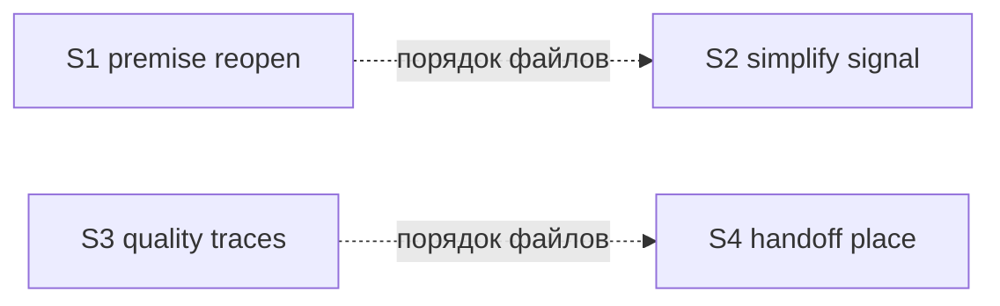

# Quality Control — decision-evidence-reopen — 2026-10-01

Режим: slice (`# Срез S1`–`S4` в `tasks.md`).
Охват: полный текущий план. `changed_slices: all`, `reused_checks: none`, `deterministic_results: none`.
Прошлый `reports/qc-slices-2026-10-01.md` не переиспользован (сделан до текущего `tasks.md` и до S4).
Образец `openspec/changes/fixture-ec-unclassified-axis/` существует (`.openspec.yaml`, `proposal.md`, `design.md`, `specs/`, `tasks.md`, `debug.md`, `reports/`). Фикстуры срезов задачами ещё не созданы — это ожидаемое исходное состояние, не дефект плана.

### Verdict

OK

### Slice Summary

| Slice | Scenario | Tasks | Acceptance | Dependencies | Gate |
|---|---|---|---|---|---|
| S1 Возврат решения по опровергнутой предпосылке | Прогон проверки: отдельный отчёт опровергает предпосылку одного закрытого решения → вопрос о подтверждении с исправленным фактом и `путь:строка` | S1.1–S1.27 (27) | S1.accept (6 буллетов / 17 связанных Scenario; остальные 11 — в S1.23–S1.27) | нет | `<!-- slice-gate -->` |
| S2 Сигнал упрощения не теряется | Прогон проверки: замечание готовности об избыточности к концу прогона учтено причиной или правкой задач, итог в чате прежний | S2.1–S2.13 (13) | S2.accept (6/6) | нет (порядок реализации после S1 — общие файлы, не приёмка) | `<!-- slice-gate -->` |
| S3 Замечания качества видны до архива | Архив ЗНИ с открытым следом качества: до переноса список и вопрос `ревью` / `архив без ревью` / `стоп` | S3.1–S3.17 (17) | S3.accept (5 буллетов / 18 связанных Scenario; остальные 13 — в S3.13–S3.17) | нет | `<!-- slice-gate -->` |
| S4 Карточка приёмки показывает место среза | Передача на приёмку: место среза и остаток без списка задач; «принято без проверки» видно на последнем срезе | S4.1–S4.10 (10) | S4.accept (3 буллета, в них 5/5 Scenario) | нет (порядок реализации после S3 — общие файлы, не приёмка) | `<!-- slice-gate -->` |

Ровно один `S<N>.accept` на срез. Legacy `S<N>.T<M>` нет. `<!-- phase-gate -->` нет.

### Scenario Coverage

46 `#### Scenario:` в четырёх delta specs. Все покрыты Primary, optional-буллетом или задачей «верифицировать по тексту».

| Scenario | Covered by | Status |
|---|---|---|
| Вопросы пакетом при создании задачи | S1.24 | covered |
| Непроверенный факт в пакете | S1.23 | covered |
| Все решения прогона одной карточкой | S1.24 | covered |
| Вторая тема остаётся на карточке | S1.24 | covered |
| Утверждение в варианте с доказательством | S1.accept optional; S1.23 | covered |
| Утверждение без доказательства | S1.23 | covered |
| Оценка вместо факта | S1.23 | covered |
| Стоп по теме | S1.25 | covered |
| Здоровая конвергенция не стопится | S1.25 | covered |
| Опровержение не подменяется стопом | S1.accept optional | covered |
| Опровержение из отдельного отчёта | S1 Primary | covered |
| Повтор опровержения без нового факта | S1.accept optional | covered |
| Остальные решения не трогаются | S1.accept optional | covered |
| Подтверждение и смена выбора | S1.27 | covered |
| Опровергнутое решение не довод | S1.27 | covered |
| Второй уникальный сигнал | S1.26 | covered |
| Опровергнута предпосылка закрытого внешнего условия | S1.accept optional | covered |
| Замечание об избыточности учтено | S2.accept optional | covered |
| Переиспользованный отчёт не теряет замечание | S2 Primary | covered |
| Учтённое замечание не возвращается | S2.accept optional | covered |
| Простой вариант отклонён без доказательства | S2.accept optional | covered |
| Отчёт готовности не даёт ложной строки | S2.accept optional | covered |
| Исправленный отчёт снимает строку | S2.accept optional | covered |
| Apply speed preserved | S3.13 | covered |
| Weak not silently waived in apply | S3.13 | covered |
| Решение ревью видно в следе | S3.14 | covered |
| Архив со следами | S3 Primary | covered |
| Архив без ревью не закрывает замечание | S3.accept optional | covered |
| Ответ ревью | S3.accept optional | covered |
| Без следов архив прежний | S3.15 | covered |
| Последний срез — развилка из трёх слов | S3.16 | covered |
| Ответ ревью даёт команду предрелиза | S3.16 | covered |
| Ответ архив без изменений | S3.16 | covered |
| Ответ стоп без изменений | S3.16 | covered |
| Без кода расширения слова ревью нет | S3.16 | covered |
| Возврат в сессию — та же развилка | S3.17 | covered |
| Карточка завершения — та же развилка | S3.17 | covered |
| Проверка постановки после apply не меняется | S3.17 | covered |
| Детектор смотрит сегмент пути, не имя выгрузки | S3.16 | covered |
| Развилка сообщает об открытых замечаниях качества | S3.accept optional | covered |
| Ответ архив при открытых замечаниях | S3.accept optional | covered |
| Передача называет место среза | S4 Primary (один прогон) | covered |
| Последний срез можно принять позже | S4 Primary (один прогон) | covered |
| Принято без проверки видно на последнем срезе | S4 Primary (один прогон) | covered |
| Перед архивом видны срезы без проверки | S4.accept optional | covered |
| Обычное принято пометки не ставит | S4.accept optional | covered |

Чужих Scenario в `S<N>.accept` нет: каждый буллет называет Scenario из `**Связь со spec:**` того же среза.

### Dependency Graph

Приёмка независима. Объявленные зависимости — «нет». Циклов и рёбер «приёмка S<N> ждёт S<N+1>» нет.

Пунктир — порядок правок общих файлов, записанный в строке `**Зависимости:**` и в `design.md` § Граф зависимостей. На `[x]` приёмки не влияет: Primary S2 не требует карточки опровержения, Primary S4 не требует вопроса архива о следах.

Внутри срезов рёбра только назад (`S1.2`→`S1.1` … `S1.22`→`S1.14`+`S1.21`; `S2.2`→`S2.1` … `S2.13`→`S2.6`+`S2.12`; `S3.2`→`S3.1` … `S3.17`→`S3.5`; `S4.2`→`S4.1` … `S4.10`→`S4.5`+`S4.6`+`S4.9`). Циклов нет. `S4.6` ссылается на шаг S3.6 и сразу задаёт запасной вид строки, если вопроса о следах нет.

### Checklist

1. Scenario Coverage — 46/46. Отдельный срез у каждого самостоятельного исхода (карточка опровержения, учтённое замечание готовности, вопрос архива о следе, место среза в передаче).
2. Slice Independence — приёмка каждого среза не требует следующих. Вперёд зависимостей приёмки нет.
3. Slice Completeness — для kit-изменений слои приёмки на месте: скиллы и шаблоны, которые производят наблюдаемый исход, плюс фикстура в том же срезе. Пропусков слоя под Primary нет.
4. Slice Dependency Graph — объявленные зависимости существуют как «нет»; порядок файлов не спрятан. Несоответствия нет.
5. Slice Gate Integrity — один `S<N>.accept` и один `<!-- slice-gate -->` на S1–S4.
5b. Acceptance Checklist — у каждого среза есть `**Primary acceptance:**` и обязательный sub-bullet `**Primary (обязательно):**`. Пустых чеклистов нет.
6. Rework Risk — сценарии срезов не повторяют друг друга. Общие файлы S1/S2 и S3/S4 названы как порядок реализации, не как скрытая приёмка.
8. Slice Verticality — Primary каждого среза наблюдаем снаружи команды (`/opsx:verify`, `/opsx:archive`, `/opsx:apply`), без отладчика и без ревью контракта как приёмки. Итог S2 в `design.md` / `tasks.md` фикстуры — записанный результат прогона, не заглядывание в код скилла.
8b. Self-Achievable — Primary S1 закрывается фикстурой и правками проверки этого среза; S2 — фикстурой и ремонтом готовности этого среза; S3 — фикстурой и шагом архива этого среза; S4 — фикстурой из двух срезов и передачей apply этого среза. Дубля journey с соседним срезом нет.
9. Foundation slice with gate — ни один срез не является только программной заготовкой с gate перед пользовательским срезом.
10. Acceptance Simplicity — в каждом `S<N>.accept` один обязательный black-box путь. Три имени Scenario в Primary S4 — контрольные точки одного прогона `/opsx:apply` и одной фразы «принято без проверки», не второй обязательный путь. В S2 обязателен один Scenario; «Замечание об избыточности учтено» помечено опционально.
11. User Task Contract — в `S<N>.<M>` нет обязанностей пользователя на ИБ, стенде, в консоли или отладчике и нет цепочек «после verify / после стенда». Задачи «Верифицировать по тексту» — сверка агента. Ручной прогон команды стоит только в `S<N>.accept`.

### Task Readability

Задачи `S<N>.<M>` называют файл, изменение и зачем. Голых «реализовать D<N>» и формулировок короче контекста нет. Заголовки `S<N>.accept` содержат бизнес-результат среза. Имена процедур в задачах — поля журнала из решений постановки (`premise`, `refuted_premises`, `fingerprint`), не частный рецепт формы.

Алертов `task-opaque-title`, `task-too-short`, `task-opaque-acceptance` нет.

### Alerts

Нет.

### Recommendations

Автоправка не требуется.

Порядок реализации S1 → S2 и S3 → S4 уже стоит в `**Зависимости:**`. Применять срезы в этом порядке, чтобы правки одних и тех же скиллов не расходились. На вердикт приёмки это не влияет.

В `design.md` § Slices строка S2 перечисляет два Scenario как Primary, а `tasks.md` оставляет обязательным один («Переиспользованный отчёт не теряет замечание»). Исполняемый план — `tasks.md`. Таблицу design при случае выровнять, задачи не дробить.

Строка design «40 из 40» устарела: в текущих specs 46 Scenario, и все 46 покрыты этим `tasks.md`.
