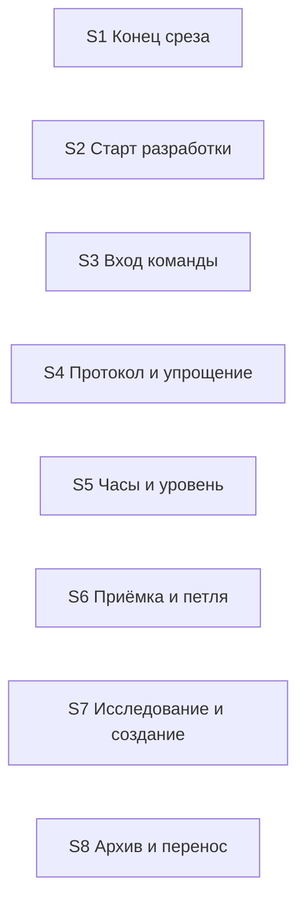

# Quality Control — Slice Coherence

- change: `kit-protocol-coherence`
- date: 2026-10-04
- mode: slice (`tasks.md` содержит `# Срез S1`…`# Срез S8`)
- delta: cache miss — `changed_slices: all`; `linked_scenarios`: все `#### Scenario:` из `specs/kit-protocol-coherence/spec.md`; `deterministic_results: none`; `affected_contract_ids: none`; `reused_checks: none`
- criteria evaluated: 1, 2, 3, 4, 5, 5b, 6, 7, 8, 8b, 9, 10, 11
- new findings: полный прогон текущего текста. Прошлый `reports/quality-control-2026-10-04.md` как результат не использован
- out of scope: исполнимость приёмки прямо сейчас на информационной базе; тестовые данные

Источники: `tasks.md`, `design.md` § Slices и карта стыков, `proposal.md`, `specs/kit-protocol-coherence/spec.md` (7 требований, 25 `#### Scenario:`). Механическая сверка из промпта перепроверена чтением `tasks.md`. Ручной чеклист конфигуратора: нет. Репозиторий: правка только текстов кита. Файлы из задач на месте, в том числе `proportional-surface.md`, `labor_standards.md`, `handoff-block.md`, `reviewer-checks.md`.

`no-slices` не выпускается. `deprecated-phase-gate` не выпускается: маркера фаз нет.

## Verdict

`OK`

Восемь срезов принимаются порознь. У каждого один обязательный ход, остальные сценарии того же среза стоят необязательными пунктами или проверкой по тексту. Объединять срезы не нужно. Покрытие сценариев, ворота, зависимости и поручения пользователю посередине среза в порядке.

## Slice Summary

| Slice | Scenario | Tasks | Acceptance | Dependencies | Gate |
|---|---|---|---|---|---|
| S1: Конец среза | Разработка дошла до открытой приёмки | S1.1–S1.4 | `S1.accept` (2/2): 1 обязательный + 1 необязательный | нет | есть |
| S2: Старт разработки | После проверки решить, можно ли начинать | S2.1–S2.3 | `S2.accept` (3/3): 1 обязательный + 2 необязательных | нет | есть |
| S3: Вход команды | Вызов так, как написано в команде | S3.1–S3.8 | `S3.accept` (6/6): 1 обязательный + 5 необязательных | нет | есть |
| S4: Постоянный протокол и якорь упрощения | Ход сессии читает протокол и якорь | S4.1–S4.4 | `S4.accept` (2/2): 1 обязательный + 1 необязательный | нет | есть |
| S5: Часы и уровень дефекта | Часы или уровень скрытого частичного результата | S5.1–S5.3 | `S5.accept` (2/2): 1 обязательный + 1 необязательный | нет | есть |
| S6: Приёмка и петля | Повтор темы, сценарий в задаче, дефект двух срезов, имя не из кода | S6.1–S6.10 | `S6.accept` (4/4): 1 обязательный + 3 необязательных | нет | есть |
| S7: Исследование и создание заявки | Постановка и сборка артефактов | S7.1–S7.8 | `S7.accept` (4/4): 1 обязательный + 3 необязательных | нет | есть |
| S8: Архив и перенос требований | Перенос требований или их отсутствие | S8.1–S8.4 | `S8.accept` (2/2): 1 обязательный + 1 необязательный | нет | есть |

Порог: 44 рабочие задачи и 8 приёмок. Это полный объём. Восемь срезов уместны: у каждого свой наблюдаемый исход, и он не ждёт следующего среза. Число задач само по себе срез не дробит и не склеивает.

Метаданные `**Primary acceptance:**` и подпункт `**Primary (обязательно):**` в каждом срезе совпадают. В `design.md` § Slices те же формулировки.

Дробь в колонке Acceptance — сценарии из `**Связь со spec:**`, закрытые обязательным пунктом или необязательным. Отдельной строки `Scenario «…»` у обязательного хода нет: его текст и есть этот сценарий. Так задан формат приёмки.

## Scenario Coverage

Все 25 сценариев закрыты в своём срезе. Дыр нет.

| Scenario | Covered by | Status |
|---|---|---|
| Передача без вопроса | S1, обязательный пункт | OK |
| Пакет прогоняет срезы, приёмка в конце | S1, необязательный пункт | OK |
| Проверка останавливает | S2, обязательный пункт | OK |
| Проверка разрешает | S2, необязательный пункт | OK |
| Дополнение новее проверки | S2, необязательный пункт | OK |
| Ревью без аргументов | S3, обязательный пункт | OK |
| Предрелиз без аргумента | S3, необязательный пункт | OK |
| Дописывание без имени | S3, необязательный пункт | OK |
| Флаг отчёта дописывания | S3, необязательный пункт | OK |
| Пустой автор при дозавершении | S3, необязательный пункт | OK |
| Пакетный архив | S3, необязательный пункт | OK |
| Протокол сессии | S4, обязательный пункт | OK |
| Упрощение | S4, необязательный пункт | OK |
| Часы | S5, обязательный пункт | OK |
| Уровень дефекта | S5, необязательный пункт | OK |
| Петля | S6, обязательный пункт | OK |
| Покрытие задачей | S6, необязательный пункт | OK |
| Дефект на два среза | S6, необязательный пункт | OK |
| Имя на закрытой задаче | S6, необязательный пункт | OK |
| Баг в открытой заявке | S7, обязательный пункт | OK |
| Поле архитектора | S7, необязательный пункт | OK |
| Порядок артефактов | S7, необязательный пункт | OK |
| Нарезка до задач | S7, необязательный пункт | OK |
| Перенос из архива | S8, обязательный пункт | OK |
| Нет требований | S8, необязательный пункт | OK |

Имена в необязательных пунктах совпадают с заголовками `#### Scenario:` буквально. Чужого сценария в чеклисте нет.

Обязательный пункт S2 держит и оговорку обзора маршрута. Это тот же запрещающий итог проверки, не второй отчёт. Обязательный пункт S5 держит обе стороны сценария «Часы»: техпроект называет часы, в другой команде оценка не норма и запрет находится по указателю. Обязательный пункт S6 держит обе стороны сценария «Петля»: стоп на втором переоткрытии и отсутствие стопа на трёх передачах без переоткрытия. Обязательный пункт S8 держит перенос из архива и границу того же хода: отдельный перенос по-прежнему кончается предложением проверки. Это не вторые сценарии требования.

## Dependency Graph

- Рёбер между срезами нет. Циклов нет. Приёмка более раннего среза не ссылается на задачи более позднего.
- В метаданных у всех восьми: **Зависимости:** нет. Необъявленного предшественника, без которого срез нельзя принять, нет.
- Внутри срезов рёбра только назад и все цели существуют: S1.3 от S1.1 и S1.2; S3.4 от S3.3; S3.7 от S3.6; S5.2 от S5.1; S6.6 от S6.3; S6.8 от S6.2; S6.10 от S6.9 и S6.6; S7.2, S7.3 и S7.8 от S7.1; S7.5 и S7.6 от S7.4; S8.3 и S8.4 от S8.2.

Один и тот же файл правят разные срезы. Это не ребро приёмки: скилл разработки — S1 и S2; обзор маршрута — S2, S6 и S7; скилл создания — S6 и S7; правило архитектора — S6 и S7. Карта стыков разводит правки по разным абзацам. `design.md` разрешает любой порядок срезов. Принимать один срез, чтобы начать другой, не требуется.

## Checklist Results

| # | Criterion | Result |
|---|---|---|
| 1 | Scenario Coverage | Pass — 25/25 закрыты обязательным пунктом, необязательным пунктом или рабочей задачей своего среза |
| 2 | Slice Independence | Pass — зависимости только «нет», приёмка не смотрит вперёд |
| 3 | Slice Completeness | Pass — для каждого хода в срезе есть правка того файла, который карта стыков называет копией. Хозяин, который уже совпадает с нужным исходом, отдельной задачей не дублируется. Метаданные, формы и код 1С не требуются. Замер объёма протокола — S4.4, поиск «Отложить» и запрета пакета — S1.4 |
| 4 | Slice Dependency Graph | Pass — объявленных межсрезовых рёбер нет, внутренние рёбра существуют и не зациклены |
| 5 | Slice Gate Integrity | Pass — у каждого среза ровно один `S<N>.accept` и ровно один маркер конца среза. `legacy-acceptance-format` неприменим |
| 5b | Acceptance Checklist Coverage | Pass — колонка Primary и обязательный подпункт есть у всех восьми, пустого чеклиста нет, сценарий требования нигде не потерян, чужого сценария в чеклисте нет |
| 6 | Rework Risk | Pass — срез не опирается на непринятый предыдущий; один и тот же сценарий двум срезам не отдан |
| 7 | Task Readability | Pass — рабочие задачи называют глагол, файл и зачем. Заголовки приёмки называют итог среза. Коротких и глухих заголовков нет. S1.4 и S4.4 читаются как проверка по тексту конкретного файла |
| 8 | Slice Verticality | Pass — обязательный пункт каждого среза описывает ход в чате или в команде. У S4 это очередной ход командной сессии: агент соблюдает запреты полного протокола. Сверка двух файлов и замер 34 КБ в обязательном пункте не стоят; замер вынесен в S4.4 |
| 8b | Self-Achievable Acceptance | Pass — ни один обязательный ход не появляется только в следующем срезе и не повторяет ход соседа. Объединять нечего |
| 9 | Foundation slice with gate | Pass — ни один следующий срез не объявлен потребителем предыдущего, и ни одна приёмка не сводится к сверке контракта без хода |
| 10 | Acceptance Simplicity | Pass — в теле каждой приёмки один обязательный ход. Остальные сценарии помечены «опционально» |
| 11 | User Task Contract | Pass — в рабочих задачах `S<N>.<M>` нет поручения пользователю на информационную базу, консоль, отладчик, стенд или цепочку «после проверки». S1.4 и S4.4 — сверка текста кита агентом. Живой прогон команды стоит на границе приёмки |

## Alerts

Нет.

## Recommendations

**Автоправка**

Не требуется.

**Решение о структуре срезов**

Не требуется. Объединять нечего.

Проверены соседние пары. S1 не нужен, чтобы принять старт разработки. S2 не нужен входу команд. S3 не кормит протокол. S4 не кормит часы: техпроект и уровень дефекта не читают добранные запреты сессии. S5 не нужен петле приёмки. S6 и S7 правят разные абзацы общих файлов, и ход одного виден без задач другого. S7 не нужен, чтобы архив продолжил перенос. Запрещённый обход «не подписывать приёмку, пока не готов следующий срез» не предлагается.

Делить S3, S6 или S7 по одному сценарию не требуется. Обязательный ход один, остальные сценарии уже необязательны. Отдельные ворота увеличили бы число остановок, не новый видимый итог.

**Общие файлы**

При исполнении не править параллельно один файл из двух срезов: скилл разработки (S1 и S2), обзор маршрута (S2, S6, S7), скилл создания (S6 и S7), правило архитектора (S6 и S7). На приёмку это не влияет.

**Не выпущено**

`primary-acceptance-missing`, `accept-checklist-empty`, `accept-bullets-missing-scenario`, `accept-bullet-foreign-scenario`, `slice-not-vertical`, `slice-accept-not-self-achievable`, `slice-foundation-with-gate`, `acceptance-simplicity-overload`, `user-task-contract-violation`, `task-opaque-title`, `task-too-short`, `task-opaque-acceptance`, `legacy-acceptance-format`, `no-slices`, `deprecated-phase-gate`.

Поле `**Приёмка:**` в метаданных срезов нет. На критерии 1–11 это не влияет: вид приёмки уже задан обязательным пунктом. Отдельный алерт под это поле не заведён.

## Reused vs new

- reused: none
- new: полный прогон срезов S1–S8 и всех 25 сценариев по текущему тексту `tasks.md`
