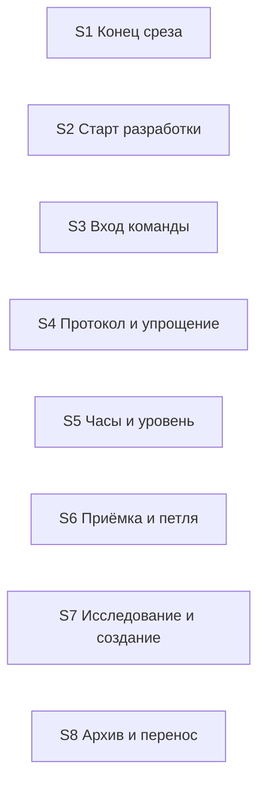

# Quality Control — Slice Coherence

- change: `kit-protocol-coherence`
- date: 2026-10-04
- mode: slice (`tasks.md` содержит `# Срез S1`…`# Срез S8`)
- delta: cache miss — `changed_slices: all`; `linked_scenarios`: все сценарии `specs/kit-protocol-coherence/spec.md`; `deterministic_results: none`; `affected_contract_ids: none`; `reused_checks: none`
- criteria evaluated: 1, 2, 3, 4, 5, 5b, 6, 7, 8, 8b, 9, 10, 11
- new findings: полный прогон ниже
- out of scope: исполнимость приёмки прямо сейчас на информационной базе; тестовые данные; выбор хозяина стыка

Источники: `tasks.md`, `design.md` § Slices и карта стыков, `proposal.md`, `specs/kit-protocol-coherence/spec.md` (7 требований, 25 `#### Scenario:`). Предварительная механическая сверка из промпта перепроверена чтением `tasks.md`, не взята как готовый кэш. Ручной чеклист конфигуратора: нет. Репозиторий: правка только текстов кита, объекты метаданных 1С не нужны, файлы из задач уже есть.

`no-slices` не выпускается. `deprecated-phase-gate` не выпускается: маркера фаз нет.

## Verdict

`CRITICAL`

Восемь срезов независимы друг от друга: ни один не принимает чужой ход и ни одну пару объединять не нужно. Блокер в тексте приёмки. В семи срезах единственный обязательный пункт требует сразу несколько разных ходов. В срезе про постоянный протокол обязательный пункт смотрит в файлы и в замер объёма, а не в поведение сессии.

Покрытие сценариев, ворота среза, зависимости и поручения пользователю посередине среза в порядке.

## Slice Summary

| Slice | Scenario | Tasks | Acceptance | Dependencies | Gate |
|---|---|---|---|---|---|
| S1: Конец среза | Разработка дошла до открытой приёмки | S1.1–S1.3 | `S1.accept` — 1 обязательный пункт на 2 сценария, необязательных нет | нет | есть |
| S2: Старт разработки | После проверки решить, можно ли начинать | S2.1–S2.3 | `S2.accept` — 1 обязательный пункт на 2 сценария + 1 необязательный | нет | есть |
| S3: Вход команды | Вызов ревью, предрелиза, дописывания или архива | S3.1–S3.8 | `S3.accept` — 1 обязательный пункт на 6 ходов + 2 необязательных, которые тот же пункт уже включает | нет | есть |
| S4: Постоянный протокол и якорь упрощения | Агент на ходе сессии читает протокол и якорь | S4.1–S4.3 | `S4.accept` — 1 обязательный пункт: сверка двух файлов, отсутствие второй формулы, замер объёма | нет | есть |
| S5: Часы и уровень дефекта | Часы или уровень скрытого частичного результата | S5.1–S5.3 | `S5.accept` — 1 обязательный пункт на 2 сценария | нет | есть |
| S6: Приёмка и петля | Повтор темы, сценарий в задаче, дефект двух срезов, имя не из кода | S6.1–S6.10 | `S6.accept` — 1 обязательный пункт на 4 сценария | нет | есть |
| S7: Исследование и создание заявки | Постановка и сборка артефактов | S7.1–S7.8 | `S7.accept` — 1 обязательный пункт на 4 сценария | нет | есть |
| S8: Архив и перенос требований | Перенос требований или их отсутствие | S8.1–S8.4 | `S8.accept` — 1 обязательный пункт на 2 сценария | нет | есть |

Порог: 42 рабочие задачи и 8 приёмок. Это полный объём. Восемь срезов уместны: у каждого свой наблюдаемый исход, и он не ждёт следующего среза. Число задач само по себе срез не дробит и не склеивает. Сжимать восемь срезов в один не следует.

Метаданные и текст `**Primary (обязательно):**` в каждом срезе совпадают. В `design.md` § Slices те же формулировки.

## Scenario Coverage

Все 25 сценариев названы в приёмке своего среза. Дыр покрытия нет.

| Scenario | Covered by | Status |
|---|---|---|
| Передача без вопроса | S1, обязательный пункт | OK — внутри перегруженного пункта |
| Пакет прогоняет срезы, приёмка в конце | S1, тот же обязательный пункт | OK — внутри перегруженного пункта |
| Проверка останавливает | S2, обязательный пункт | OK — внутри перегруженного пункта |
| Проверка разрешает | S2, тот же обязательный пункт | OK — внутри перегруженного пункта |
| Дополнение новее проверки | S2, необязательный пункт | OK |
| Ревью без аргументов | S3, обязательный пункт | OK — внутри перегруженного пункта |
| Предрелиз без аргумента | S3, тот же обязательный пункт | OK — внутри перегруженного пункта |
| Дописывание без имени | S3, тот же обязательный пункт | OK — внутри перегруженного пункта |
| Флаг отчёта дописывания | S3, обязательный пункт и отдельный необязательный | OK — помечен необязательным, но обязательный пункт его тоже требует |
| Пустой автор при дозавершении | S3, обязательный пункт и отдельный необязательный | OK — та же двойная запись |
| Пакетный архив | S3, обязательный пункт | OK — внутри перегруженного пункта |
| Протокол сессии | S4, обязательный пункт | OK по имени; сам пункт — сверка файлов, см. алерт вертикальности |
| Упрощение | S4, тот же обязательный пункт | OK по имени; видимый ход ревью в пункте не описан |
| Часы | S5, обязательный пункт | OK — внутри перегруженного пункта |
| Уровень дефекта | S5, тот же обязательный пункт | OK — внутри перегруженного пункта |
| Петля | S6, обязательный пункт | OK — внутри перегруженного пункта |
| Покрытие задачей | S6, тот же обязательный пункт | OK — внутри перегруженного пункта |
| Дефект на два среза | S6, тот же обязательный пункт | OK — внутри перегруженного пункта |
| Имя на закрытой задаче | S6, тот же обязательный пункт | OK — внутри перегруженного пункта |
| Баг в открытой заявке | S7, обязательный пункт | OK — внутри перегруженного пункта |
| Поле архитектора | S7, тот же обязательный пункт | OK — внутри перегруженного пункта |
| Порядок артефактов | S7, тот же обязательный пункт | OK — внутри перегруженного пункта |
| Нарезка до задач | S7, тот же обязательный пункт | OK — внутри перегруженного пункта |
| Перенос из архива | S8, обязательный пункт | OK — внутри перегруженного пункта |
| Нет требований | S8, тот же обязательный пункт | OK — внутри перегруженного пункта |

`accept-bullet-foreign-scenario` не выпускается: необязательные пункты S2 и S3 называют сценарии своего требования, не чужого среза.

В связи S3 со spec нет «Флаг отчёта дописывания» и «Пустой автор при дозавершении», хотя оба есть в требовании и в теле приёмки. На покрытие это не влияет.

## Dependency Graph

- Рёбер между срезами нет. Циклов нет. Приёмка более раннего среза не ссылается на задачи более позднего.
- В метаданных у всех восьми: **Зависимости:** нет. Необъявленного предшественника, без которого срез нельзя принять, нет.
- Внутри срезов рёбра только назад: S1.3 от S1.1 и S1.2; S3.4 от S3.3; S3.7 от S3.6; S5.2 от S5.1; S6.6 от S6.3; S6.8 от S6.2; S6.10 от S6.9 и S6.6; S7.2, S7.3 и S7.8 от S7.1; S7.5 и S7.6 от S7.4; S8.3 и S8.4 от S8.2.

Один и тот же файл правят разные срезы, это не ребро приёмки: скилл разработки — S1 и S2; обзор маршрута — S2, S6 и S7; скилл создания — S6 и S7; правило архитектора — S6 и S7. Карта стыков разводит эти правки по разным абзацам. Принимать один срез, чтобы начать другой, не требуется.

## Checklist Results

| # | Criterion | Result |
|---|---|---|
| 1 | Scenario Coverage | Pass — 25/25 названы в приёмке своего среза |
| 2 | Slice Independence | Pass — зависимости только «нет», приёмка не смотрит вперёд |
| 3 | Slice Completeness | Pass — для каждого хода в срезе есть правка того файла, который карта стыков называет копией. Хозяин, который уже совпадает с нужным исходом, отдельной задачей не дублируется. Метаданные, формы и код 1С не требуются |
| 4 | Slice Dependency Graph | Pass — объявленных межсрезовых рёбер нет, внутренние рёбра существуют и не зациклены |
| 5 | Slice Gate Integrity | Pass — у каждого среза ровно один `S<N>.accept` и ровно один маркер конца среза. `legacy-acceptance-format` неприменим |
| 5b | Acceptance Checklist Coverage | Pass — колонка Primary и обязательный подпункт есть у всех восьми, пустого чеклиста нет, сценарий требования нигде не потерян, чужого сценария в чеклисте нет |
| 6 | Rework Risk | Pass — срез не опирается на непринятый предыдущий; один и тот же сценарий двум срезам не отдан |
| 7 | Task Readability | Pass — рабочие задачи называют глагол, файл и зачем. Заголовки приёмки называют итог среза. Коротких и глухих заголовков нет |
| 8 | Slice Verticality | CRITICAL на S4. S1–S3 и S5–S8 в обязательном пункте описывают ход в чате или в команде |
| 8b | Self-Achievable Acceptance | Pass — ни один обязательный ход не появляется только в следующем срезе. Объединять нечего |
| 9 | Foundation slice with gate | Pass — ни один следующий срез не объявлен потребителем предыдущего. S4 не заготовка для S5: часы и уровень дефекта не вызывают добранный протокол |
| 10 | Acceptance Simplicity | CRITICAL на S1, S2, S3, S5, S6, S7, S8 |
| 11 | User Task Contract | Pass — в рабочих задачах нет поручения пользователю на информационную базу, консоль, отладчик или условную цепочку «после проверки». Живой прогон команды стоит на границе приёмки |

## Alerts

### 1. `slice-not-vertical`

- affected: S4
- severity: `CRITICAL`
- evidence: обязательный пункт S4 — три сверки текста, не ход сессии. (1) В всегда включённом протоколе есть все запреты полного файла, фраза «тело уже здесь» правдива. (2) Правило утилитарных агентов и справочник поверхности не содержат второй формулы упрощения. (3) Замер постоянного контекста после правки не больше 34 КБ. Чтобы поставить приёмку, нужно открыть файлы и измерить объём. Сценарий «Упрощение» в требовании — другое: полное ревью модуля с замечанием по поверхности не закрывает задачу без упрощения или явного отказа. Этого хода в обязательном пункте нет. Замер объёма в требовании не назван; он уже стоит ограничением в S4.1. Задачи S4.1–S4.3 как раз делают текст, который пункт сверяет, поэтому дело не в дыре слоя, а в форме приёмки.
- recommendation: обязательный пункт переписать на один ход сессии. Вторую формулу упрощения вынести в необязательный пункт с именем сценария. Замер объёма оставить рабочей проверкой по тексту, не пунктом приёмки. Со следующим срезом не склеивать.

### Remediation (auto-repair)

- alert: slice-not-vertical
- target: `openspec/changes/kit-protocol-coherence/tasks.md` срез S4; тот же абзац в `design.md` § Slices
- action: Заменить `**Primary acceptance:**` и подпункт `**Primary (обязательно):**` на: «На очередном ходе командной сессии агент соблюдает те же запреты, что полный протокол сессии, включая любую команду из каталога команд, и фраза, что тело протокола уже в всегда включённом файле, этому соответствует.» Добавить необязательный пункт: `Scenario «Упрощение» (опционально): полное ревью нового или переписанного модуля с замечанием по поверхности не закрывает задачу без упрощения или явного отказа, и правило утилитарных агентов со справочником поверхности не задают вторую формулу этой обязанности.` Перед `S4.accept` добавить задачу: «Верифицировать по тексту объём всегда включённых правил после добора в `.cursor/rules/session-discipline.mdc`: постоянный контекст не больше 34 КБ, полный файл сессии в всегда включённый протокол не копируется.» Маркер конца среза сузить до хода сессии, без замера объёма и без второй формулы.

### 2. `acceptance-simplicity-overload` — S1

- affected: S1
- severity: `CRITICAL`
- evidence: один обязательный пункт без пометки «опционально» держит два хода и ещё поиск по файлу. (1) Без флага пакета закрыть рабочие задачи → карточка передачи, конец сессии, вопроса с тремя ответами нет. (2) Запуск с явным флагом пакета прогоняет оставшиеся срезы без паузы и отдаёт одну приёмку в конце. (3) Поиск по скиллу разработки не находит «Отложить» и не находит запрета пакета для заявки со срезами. Пункты 1 и 2 — разные запуски. Пункт 3 — чтение скилла; его место в рабочей задаче. Оба сценария требования названы в связи со spec и оба зашиты в обязательный пункт. Необязательного пункта нет.
- recommendation: обязательным оставить передачу без вопроса. Пакетный запуск — необязательный пункт. Поиск по скиллу — задача «проверить по тексту» перед приёмкой.

### Remediation (auto-repair)

- alert: acceptance-simplicity-overload
- target: `openspec/changes/kit-protocol-coherence/tasks.md` срез S1; тот же абзац в `design.md` § Slices
- action: Заменить `**Primary acceptance:**` и `**Primary (обязательно):**` на: «На учебной заявке со срезами, без флага пакета, закрыть рабочие задачи и оставить приёмку открытой → в чате карточка передачи, сессия заканчивается, вопроса с тремя ответами нет.» Добавить: `Scenario «Пакет прогоняет срезы, приёмка в конце» (опционально): запуск разработки с явным флагом пакета прогоняет оставшиеся срезы без паузы на каждом и отдаёт одну приёмку в конце.` Перед приёмкой добавить задачу: «Верифицировать по тексту `.cursor/skills/openspec-apply-change/SKILL.md`: в шаблоне конца среза нет ответа «Отложить» и нет запрета пакета для заявки со срезами.» Маркер конца среза оставить про карточку передачи без вопроса с тремя ответами.

### 3. `acceptance-simplicity-overload` — S2

- affected: S2
- severity: `CRITICAL`
- evidence: обязательный пункт требует два противоположных итога проверки. После отрицательного итога или открытой развилки снимок и вход разработки не ведут в разработку. После разрешающего итога оба ведут в разработку. Это два разных отчёта проверки. Третье предложение («обзор маршрута не обещает, что проверка никогда не мешает начать») — оговорка того же запрещающего хода, само по себе вторым запуском не является. «Дополнение новее проверки» уже вынесено в необязательный пункт. «Проверка разрешает» — нет.
- recommendation: обязательным оставить запрещающий итог вместе с оговоркой обзора. Разрешающий итог — необязательный пункт.

### Remediation (auto-repair)

- alert: acceptance-simplicity-overload
- target: `openspec/changes/kit-protocol-coherence/tasks.md` срез S2; тот же абзац в `design.md` § Slices
- action: Заменить `**Primary acceptance:**` и `**Primary (обязательно):**` на: «На учебной заявке после проверки с отрицательным итогом или открытой развилкой, если постановку после неё не дополняли, снимок состояния и вход разработки предлагают шаг, которым закончилась проверка, а не разработку; обзор маршрута не обещает, что проверка никогда не мешает начать.» Добавить: `Scenario «Проверка разрешает» (опционально): после проверки с разрешающим итогом и без дополнения постановки снимок состояния и вход разработки ведут к разработке.` Существующий необязательный пункт «Дополнение новее проверки» не трогать. Маркер конца среза сузить до запрещающего итога.

### 4. `acceptance-simplicity-overload` — S3

- affected: S3
- severity: `CRITICAL`
- evidence: один обязательный пункт перечисляет шесть независимых вызовов. Пустое ревью берёт объём заявки. Предрелиз без аргумента показывает три формы. Дописывание без имени берёт единственную открытую заявку. Флаг отчёта принимает пути из скилла. Дозавершение с пустым автором спрашивает автора. Пакетный архив не пропускает заявку из-за обычных незакрытых задач. Два последних хода ниже помечены «(опционально)», но из обязательного пункта не убраны: пока пункт не выполнен целиком, пометка не снимает блок. Связь со spec называет только четыре сценария и молчит про флаг отчёта и пустого автора, хотя оба входят в то же требование.
- recommendation: обязательным оставить пустое ревью. Остальные пять — необязательные пункты с буквальными именами. Срез не делить: задачи уже лежат в одном срезе, отдельные ворота на каждую команду не нужны.

### Remediation (auto-repair)

- alert: acceptance-simplicity-overload
- target: `openspec/changes/kit-protocol-coherence/tasks.md` срез S3; тот же абзац в `design.md` § Slices
- action: Заменить `**Primary acceptance:**` и `**Primary (обязательно):**` на: «Ревью без аргументов при живой заявке и незакоммиченных модулях берёт модули заявки, а не все незакоммиченные.» В связь со spec дописать Scenario «Флаг отчёта дописывания» и Scenario «Пустой автор при дозавершении». В теле приёмки оставить и добавить необязательные пункты, по одному на сценарий: «Предрелиз без аргумента», «Дописывание без имени», «Флаг отчёта дописывания», «Пустой автор при дозавершении», «Пакетный архив». Из обязательного пункта эти пять предложений убрать. Маркер конца среза сузить до объёма пустого ревью.

### 5. `acceptance-simplicity-overload` — S5

- affected: S5
- severity: `CRITICAL`
- evidence: обязательный пункт склеивает два сценария одного требования, но разных мест. Техпроект называет часы, в другой команде оценка не норма, запрет находится по указателю диспетчера. Отдельным предложением чеклист ревью и реестр ставят скрытому частичному результату один уровень. Второй ход не нужен, чтобы увидеть первый: часы проверяются вызовом техпроекта, уровень — встречей ревью со скрытым частичным результатом.
- recommendation: обязательным оставить часы. Уровень дефекта — необязательный пункт.

### Remediation (auto-repair)

- alert: acceptance-simplicity-overload
- target: `openspec/changes/kit-protocol-coherence/tasks.md` срез S5; тот же абзац в `design.md` § Slices
- action: Заменить `**Primary acceptance:**` и `**Primary (обязательно):**` на: «Техпроект называет часы; в другой команде спонтанная оценка нормой не считается, и запрет находится по указателю диспетчера.» Добавить: `Scenario «Уровень дефекта» (опционально): ревью встречает скрытый частичный результат → чеклист и реестр требуют одного и того же уровня.` Маркер конца среза оставить про часы и указатель, без уровня дефекта.

### 6. `acceptance-simplicity-overload` — S6

- affected: S6
- severity: `CRITICAL`
- evidence: обязательный пункт держит четыре хода, каждый со своим запуском. Второе переоткрытие темы останавливает правки в трёх местах, три передачи без переоткрытия стоп не дают. Сценарий, покрытый задачей, не сирота. Дефект двух непринятых срезов получает новый срез. Имя не из кода на закрытой задаче критично и до разработки, и в архиве. Задачи S6.1–S6.10 эти ходы уже производят внутри среза, поэтому перегруз — в чеклисте, не в недостающем слое. Необязательных пунктов нет.
- recommendation: обязательным оставить петлю. Три остальных сценария — необязательные пункты. Срез не дробить и не склеивать с соседями.

### Remediation (auto-repair)

- alert: acceptance-simplicity-overload
- target: `openspec/changes/kit-protocol-coherence/tasks.md` срез S6; тот же абзац в `design.md` § Slices
- action: Заменить `**Primary acceptance:**` и `**Primary (обязательно):**` на: «Второе переоткрытие одной темы останавливает правки одинаково в проверке, в дописывании и в правиле архитектора; три передачи на приёмку без переоткрытия темы стоп не дают.» Добавить необязательные пункты: `Scenario «Покрытие задачей» (опционально): сценарий закрыт задачей среза и не стоит отдельной строкой приёмки → ни правило читаемости, ни проверка не считают его сиротой.` `Scenario «Дефект на два среза» (опционально): исправление задевает два среза с неподписанной приёмкой → появляется новый срез, а не задача внутри одного из них.` `Scenario «Имя на закрытой задаче» (опционально): на уже закрытой задаче осталось имя, которого нет в коде → и проверка до разработки, и архив не дают закрыть заявку.` Маркер конца среза сузить до остановки по второму переоткрытию темы.

### 7. `acceptance-simplicity-overload` — S7

- affected: S7
- severity: `CRITICAL`
- evidence: обязательный пункт держит четыре хода. Баг при открытой заявке той же области ведёт только в дописывание. Поле архитектора — одно из трёх значений, отказ только флагом пропуска. Обзор маршрута, правило срезов и скилл создания дают один порядок артефактов. Контролёр срезов при создании вызывается после списка задач. Это разные моменты: финал исследования, поле постановки, порядок сборки и момент вызова контролёра. Задачи S7.1–S7.8 закрывают все четыре внутри среза.
- recommendation: обязательным оставить баг в открытой заявке. Остальные три — необязательные пункты.

### Remediation (auto-repair)

- alert: acceptance-simplicity-overload
- target: `openspec/changes/kit-protocol-coherence/tasks.md` срез S7; тот же абзац в `design.md` § Slices
- action: Заменить `**Primary acceptance:**` и `**Primary (обязательно):**` на: «Исследование заканчивается багом, и заявка той же области уже открыта → следующий шаг только дописать эту заявку, вторую не заводить.» Добавить: `Scenario «Поле архитектора» (опционально): в постановке поле архитектора одно из трёх значений шаблона передачи, создание заявки его читает, отказ возможен только флагом пропуска.` `Scenario «Порядок артефактов» (опционально): заявка с нуля собирается в одном порядке — постановка, решение без срезов, проверка решения, требования, срезы, задачи — и этот порядок совпадает в обзоре маршрута, правиле срезов и скилле создания.` `Scenario «Нарезка до задач» (опционально): пока списка задач нет, проверка нарезки не запускается; после записи списка она запускается полным шаблоном.` Маркер конца среза сузить до шага «дописать открытую заявку».

### 8. `acceptance-simplicity-overload` — S8

- affected: S8
- severity: `CRITICAL`
- evidence: обязательный пункт держит два сценария. Архив, который сам вызвал перенос, продолжает шаги в том же ходе и не печатает «дальше — проверка»; отдельный перенос по-прежнему заканчивается предложением проверки. Вторым предложением архив без требований задаёт один вопрос «создать сейчас». Оговорка про одиночный перенос — граница первого сценария, не третий запуск. Вопрос «создать сейчас» — другой вход: требований нет. Задачи S8.1–S8.4 оба хода уже делают.
- recommendation: обязательным оставить перенос из архива вместе с оговоркой про одиночный перенос. Отсутствие требований — необязательный пункт.

### Remediation (auto-repair)

- alert: acceptance-simplicity-overload
- target: `openspec/changes/kit-protocol-coherence/tasks.md` срез S8; тот же абзац в `design.md` § Slices
- action: Заменить `**Primary acceptance:**` и `**Primary (обязательно):**` на: «Архив сам запускает перенос требований → в том же ходе продолжает свои шаги и не предлагает вместо этого новую проверку; отдельный перенос по-прежнему заканчивается предложением проверки.» Добавить: `Scenario «Нет требований» (опционально): архив не находит требований заявки → один вопрос «создать требования сейчас», не предупреждение о незакрытых задачах.` Маркер конца среза оставить про продолжение архива после переноса.

## Recommendations

**Автоправка**

Сузить обязательный пункт в S1, S2, S3, S5, S6, S7 и S8 до одного хода. В S4 заменить сверку файлов и замер объёма на ход сессии. Текст замен — в блоках Remediation выше. Правка нужна и в `tasks.md`, и в колонке Primary в `design.md` § Slices, иначе постановка и список задач снова разъедутся. Рабочие задачи S1.1–S8.4 не удалять: они производят ходы, которые станут необязательными пунктами.

**Решение о структуре срезов**

Не требуется. Объединять нечего.

Проверены соседние пары. S1 не нужен, чтобы принять старт разработки. S2 не нужен входу команд. S3 не кормит протокол. S4 не кормит часы: уровень дефекта и техпроект не читают добранные запреты сессии. S5 не нужен петле приёмки. S6 и S7 правят разные абзацы общих файлов, и ход одного виден без задач другого. S7 не нужен, чтобы архив продолжил перенос. Запрещённый обход «не подписывать приёмку, пока не готов следующий срез» не предлагается.

Делить S3, S6 или S7 на срезы по одному сценарию тоже не требуется. Достаточно одного обязательного хода и необязательных пунктов. Отдельные ворота увеличили бы число остановок, не новый видимый итог.

**Общие файлы**

При исполнении не править параллельно один файл из двух срезов: скилл разработки (S1 и S2), обзор маршрута (S2, S6, S7), скилл создания (S6 и S7), правило архитектора (S6 и S7). На приёмку это не влияет.

**Не выпущено**

`primary-acceptance-missing`, `accept-checklist-empty`, `accept-bullets-missing-scenario`, `accept-bullet-foreign-scenario`, `slice-accept-not-self-achievable`, `slice-foundation-with-gate`, `user-task-contract-violation`, `task-opaque-title`, `task-too-short`, `task-opaque-acceptance`, `legacy-acceptance-format`, `no-slices`, `deprecated-phase-gate`.

## Reused vs new

- reused: none
- new: полный прогон срезов S1–S8 и всех 25 сценариев требования связности протокола кита
