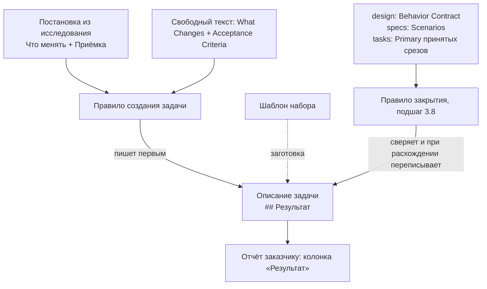

# Architecture: абзац «Результат» в описании задачи (proposal-result)

## KB references

- Фактов базы знаний по теме нет (discovery без совпадений). Конфликтов нет.

## Task

Проверить план: даёт ли он абзац «Результат» первым разделом описания задачи при создании и обновляет ли его при закрытии, если видимое поведение разошлось. Закрытые решения заказчика (имя «Результат», место — описание задачи, обновление при закрытии, без заполнения старых задач) не переоткрываются.

## Complexity

Medium (три файла правил, без кода 1С, без новых команд).

## Итог для оркестратора

**План годен по выбору и по срезу; до требований и задач внести четыре правки в `design.md`** (раздел «Правки design.md» ниже). Правки не меняют выбранный вариант, число срезов и список файлов. Они уточняют: куда именно в правиле создания встаёт раздел и как он проверяется; где и по каким источникам закрытие сверяет абзац; что происходит с задачами, созданными до правки, при продолжении создания; что видно в чате при перезаписи абзаца (одна открытая продуктовая развилка, не блокирует).

## Chosen Approach

**Approach:** Minimal changes — дописать раздел тем же приёмом, каким правило создания уже дописывает блок автора и режим форм; закрытие получает одну условную сверку; шаблон набора получает заголовок.

**Rationale:**
- Правило создания уже содержит два «ALWAYS add» поверх шаблона внешней схемы (`openspec-new-change/SKILL.md:261–262`). Третий пункт того же вида — ноль новых механизмов.
- Шаблон внешней схемы (`openspec instructions proposal`, `temp/proposal-instructions.json`) начинается с `## Why` и не форкается; набор и раньше дописывал разделы правилом. Решение design § Decisions 4 верное.
- Проверено: CLI принимает описание, где первым стоит `## Результат`. `openspec validate proposal-result` выдал единственную ошибку — отсутствие дельт требований (ожидаемо на этапе design); на порядок разделов замечаний нет.

## Simplicity Check

- **Viable alternatives:**
  1. **Выбранный:** раздел в описании; пишется при создании; при закрытии переписывается при расхождении. Три файла, ноль новых команд.
  2. **Только при создании.** Два файла. Не выполняет закрытое решение «при закрытии абзац обновляется» — не годится.
  3. **Только при закрытии (писать абзац по сданному поведению).** Один файл. Не выполняет закрытое решение «пишется при создании» и не даёт текста для отчёта до сдачи — не годится.
  4. **Отдельный файл итога рядом с описанием.** Не выполняет «лежит в описании задачи, чтобы копировать» — не годится.
  5. **Писать абзац в обзоре для согласования.** Запрещено ограничением «обзор не трогать»; обзор не меняет описание (`openspec-overview/SKILL.md:12,16`) — не годится.
- **Selected simplest viable design:** вариант 1 — минимальный из тех, что выполняют все четыре закрытых решения.
- **Why not simpler:** варианты 2 и 3 проще на один файл, но каждый нарушает одно закрытое решение.
- **Complexity budget:**
  - Files touched: 3
  - Hooks/intercepts: 0
  - New procedures/functions: 0
  - Conditional branches: 2 (при закрытии: «раздел есть?» и «поведение разошлось?»)

## Found Patterns

### Pattern 1: обязательные разделы поверх шаблона схемы

- **Where:** `.cursor/skills/openspec-new-change/SKILL.md:261–262`
- **Usage:** «When creating `proposal.md`, ALWAYS add `## Metadata (comment markers)` … immediately after `## Why`» и «ALWAYS add `## Forms mode` …».
- **Evidence:** файл, строки 261–262.
- **Confidence:** high
- **Applicability:** третий пункт того же списка — «ALWAYS add `## Результат` first, before `## Why`». Пункт про автора «сразу после `## Why`» остаётся верным и не меняется.

### Pattern 2: список разделов для заказчика, где запрещены внутренние номера

- **Where:** `.cursor/skills/openspec-new-change/SKILL.md:19`; `.cursor/docs/opsx-output-style.md:208`
- **Usage:** в правиле создания список UX-разделов — `Why`, `What Changes`, `Scope`, `Scenarios`, `Requirements`. В стиле вывода «Результат» уже числится пользовательским полем.
- **Evidence:** строки выше.
- **Confidence:** high
- **Applicability:** в строку 19 добавить `Результат`, иначе запрет внутренних номеров для нового раздела в правиле создания не действует явно.

### Pattern 3: финальная самопроверка описания перед итогом создания

- **Where:** `.cursor/skills/openspec-new-change/SKILL.md:436`
- **Usage:** перед финальной сводкой правило проверяет `proposal.md` на плейсхолдеры автора.
- **Confidence:** high
- **Applicability:** то же место — проверка, что описание начинается с `## Результат` и в нём 2–4 предложения. Это и есть смягчение риска 2 из design («пропустили правило создания»), сейчас оно описано словами, но точки проверки нет.

### Pattern 4: порядок шагов закрытия и ключ свежести по хэшу описания

- **Where:** `.cursor/skills/openspec-archive-change/SKILL.md:44–55` (2a), `:93–156` (3.5), `:188–196` (3.7), `:198` (4), `:262–270` (5.5.b)
- **Usage:** шаг 2a сравнивает хэш `proposal.md` с последним отчётом проверки; расхождение запускает внутреннюю повторную проверку. Шаг 3.5 может отметить приёмку при закрытии (вариант A) — поведение окончательно только после него. Шаг 5.5.b читает описание для кандидатов инвариантов.
- **Confidence:** high
- **Applicability:** сверка абзаца должна стоять **после 2a и 3.5–3.7, до 4** (новый подшаг 3.8). Если поставить её раньше 2a — правка абзаца меняет хэш и сама запускает повторную проверку. Если после 6 — описание уже перенесено в архив.

### Pattern 5: что закрытие сейчас делает с описанием

- **Where:** `.cursor/skills/openspec-archive-change/SKILL.md:79–80, 228, 266`
- **Usage:** только читает (блок автора для баланса маркеров, тема для области ADR, кандидаты инвариантов). Записи в описание нет.
- **Confidence:** high
- **Applicability:** подшаг 3.8 — первая запись в описание на закрытии. Это не отменяет ни одного существующего контракта закрытия.

### Pattern 6: шаблон набора

- **Where:** `.cursor/templates/seed/changes/_template/proposal.md`; копируется в проект один раз при `/init-project` (`.cursor/docs/init-project-protocol.md:65`).
- **Usage:** заготовка для человека; правило создания строит описание по шаблону внешней схемы, а не по этому файлу.
- **Confidence:** high
- **Applicability:** заголовок добавляется первым для единообразия. В уже инициализированных проектах копия шаблона не обновится — на поведение это не влияет, раздел пишет правило создания.

## Assumptions

- **A1:** абзац при создании не выводится в чат сам по себе (design § Context). Совместимо с ADR-0001: текст живёт в файле, написан продуктовым языком.
  - **Confidence:** high
  - **Verification:** при приёмке — итоговая сводка создания не содержит абзаца целиком.
- **A2:** сверка при закрытии опирается на артефакты задачи, без нового обследования кода.
  - **Confidence:** high
  - **Verification:** в тексте подшага 3.8 источники — только `design.md`, `specs/**`, `tasks.md`.

## Open Questions

- **Q1:** при перезаписи абзаца на закрытии — сообщать ли об этом одной строкой в итоге закрытия (например «Абзац «Результат» обновлён по сданному поведению»), или молча?
  - **Addressed to:** User
  - **Blocker:** No
  - **Класс:** `продуктовая развилка` — от ответа зависит, узнает ли заказчик, что ранее скопированный в отчёт текст устарел.
  - До ответа действует текущее правило итога закрытия: строки нет (непредметные события в итог не пишутся).

## Clarifications

### Decision 1: место раздела

- **Question:** раздел первым или после «зачем»?
- **Answer:** первым (закрыто заказчиком через design § Decisions 1). CLI порядок не проверяет — подтверждено прогоном.
- **Impact:** правило автора «сразу после `## Why`» не меняется.

### Decision 2: задачи, созданные до правки

- **Question:** что с задачей, которая создана до правки, а закрывается или продолжает создаваться после?
- **Answer:** подпадает под закрытое решение «старые задачи не заполняются задним числом». В design это покрыто только для закрытия (Decisions 3), для продолжения создания — нет.
- **Impact:** правка 3 ниже.

## Architecture

### Components



#### Component 1: правило создания задачи

- **Path:** `.cursor/skills/openspec-new-change/SKILL.md`
- **Responsibility:** при создании описания всегда ставить раздел «Результат» первым; проверять его перед итогом.
- **Точки правки:** строка 19 (список UX-разделов), список 5.a рядом со строками 261–262 (новый пункт), строка 216 (сопоставление полей постановки — добавить «Что менять + Приёмка → `## Результат`»), guardrail рядом со строкой 436 (самопроверка).
- **Evidence:** Pattern 1–3.

#### Component 2: правило закрытия задачи

- **Path:** `.cursor/skills/openspec-archive-change/SKILL.md`
- **Responsibility:** подшаг 3.8 между 3.7 и 4: если раздел есть — сверить со сданным поведением; при расхождении переписать на месте; если раздела нет — ничего не делать. В предупреждения не попадает.
- **Evidence:** Pattern 4–5.

#### Component 3: шаблон набора

- **Path:** `.cursor/templates/seed/changes/_template/proposal.md`
- **Responsibility:** первой строкой — `## Результат` и заготовка «<2–4 предложения: что можно сделать и где это видно>».
- **Evidence:** Pattern 6.

### Data Flow

1. Создание: поля постановки «Что менять» и «Приёмка» (без постановки — `## What Changes` и `## Acceptance Criteria`) → абзац 2–4 предложения → первый раздел описания → самопроверка перед итогом.
2. Работа над задачей: абзац не трогается (расширение и реализация его не правят — сверка одна, на закрытии).
3. Закрытие: после свежести и приёмки → сверка абзаца с итоговым контрактом поведения, сценариями и обязательной приёмкой принятых срезов → переписать на месте или оставить → синхронизация требований → перенос в архив.

## Precedent / ADR

- ADR-0001 (граница чата и внутренних текстов): не отменяется. Абзац — продуктовый текст в файле, без имён команд, агентов и внутренних номеров; в чат сам не выводится. Строка из Q1, если заказчик её выберет, — тоже продуктовым языком. Классификация: `extends`.
- Архивные контракты описания задачи: требование «блок автора сразу после `## Why`» сохраняется. Ни одна спека в `openspec/specs/` не требует, чтобы описание начиналось с «зачем» (поиск без совпадений). Секция `## Blast Radius` не требуется.

## Правки design.md

Ниже — конкретный текст. Остальные разделы design.md (Goals, Non-Goals, Options, Rationale, Risks, Migration, Slices) не меняются, кроме указанного.

### Правка 1 — заменить пункт 2 в `## Decisions`

```markdown
2. Абзац дописывается тем же правилом, которым при создании задачи дописываются автор и режим форм. Раздел «Результат» ставится первым, до раздела «зачем»; место блока автора сразу после «зачем» не меняется. Источник — поля постановки «Что менять» и «Приёмка». Если постановки нет — уже написанные «что меняется» и критерии приёмки. Тон: 2–4 предложения о том, что можно сделать и где это видно. Без путей к файлам, номеров внутренних шагов и срезов, имён команд и агентов. В том же правиле раздел «Результат» добавляется в список разделов для заказчика, где внутренние номера запрещены. Перед итогом создания правило проверяет: описание начинается с раздела «Результат», в нём 2–4 предложения.
```

### Правка 2 — заменить пункт 3 в `## Decisions`

```markdown
3. При закрытии задачи абзац сверяется со сданным поведением: итоговым контрактом поведения в design, сценариями требований и обязательной приёмкой принятых срезов. Сверка идёт после внутренней проверки свежести и после приёмки срезов, до синхронизации требований: так правка абзаца не запускает повторную проверку, а поведение к этому моменту окончательное. Если абзац обещает то, чего в сданном поведении нет, или не называет видимый итог, появившийся по ходу работы, абзац переписывается на месте по тем же правилам тона; старый текст рядом не остаётся. Разница только в формулировке переписывания не вызывает. Если раздела нет, закрытие его не добавляет.
```

### Правка 3 — `## Behavior Contract`: заменить пункт 5 и добавить пункт 7

```markdown
5. У задачи, описание которой создано до этой правки, раздел сам не появляется — ни при продолжении создания, ни при закрытии.
7. Если к закрытию видимое поведение не изменилось, абзац остаётся таким, каким был на старте.
```

Связь со spec: пункт 7 — отдельный сценарий того же требования («поведение не разошлось → абзац прежний»); в `## Slices` в колонку Primary acceptance дописать в конец: «Если поведение не разошлось — абзац после закрытия прежний».

### Правка 4 — заменить `## Open Questions`

```markdown
## Open Questions

1. Сообщать ли в итоге закрытия одной строкой, что абзац «Результат» переписан по сданному поведению? От ответа зависит, узнает ли заказчик, что ранее скопированный в отчёт текст устарел. Класс: продуктовая развилка. Не блокирует: до ответа итог закрытия строку не добавляет, как сейчас.

Имя раздела и отказ дописывать его в уже сданные задачи зафиксированы.
```

### Необязательное уточнение к пункту 4 `## Decisions`

```markdown
В шаблоне набора заголовок «Результат» стоит первым, под ним заготовка «<2–4 предложения: что можно сделать и где это видно>». Расхождение шаблона с текущими названиями блока режима форм в этой задаче не правится.
```

## Implementation Phases

### Phase 1 (срез S1, один заход)

- [ ] **Правило создания:** строка 19 — `Результат` в списке UX-разделов; пункт 5.a — «ALWAYS add `## Результат` first, before `## Why`» с источниками и тоном; строка 216 — сопоставление «Что менять + Приёмка → `## Результат`»; guardrail у строки 436 — самопроверка первого раздела и 2–4 предложений.
- [ ] **Правило закрытия:** подшаг 3.8 между 3.7 и 4 с источниками сверки, порогом расхождения, перезаписью на месте и отказом добавлять отсутствующий раздел; не в предупреждения; строка итога — по ответу на Q1.
- [ ] **Шаблон набора:** первый раздел `## Результат` с заготовкой.
  - **Criteria:** проверяются сценариями среза S1 (создание; расхождение; без расхождения; без раздела).
  - **Dependencies:** правки 1–4 в design.md внесены.

## Test Scenarios

1. **Создание.** Создать задачу по постановке из исследования → описание начинается с «Результат», 2–4 предложения, без путей и внутренних номеров; текст копируется в отчёт как есть.
2. **Создание без постановки.** Создать задачу по свободному тексту → то же; источник — «что меняется» и критерии приёмки.
3. **Расхождение.** Задача, где по ходу работы видимое поведение изменилось → после закрытия в том же разделе новый абзац, старого текста нет.
4. **Без расхождения.** Поведение не изменилось → после закрытия абзац прежний.
5. **Старая задача.** Описание без раздела, созданное до правки → ни продолжение создания, ни закрытие раздел не добавляют.
6. **Повторной проверки нет.** Закрытие со свежим финальным отчётом проверки и перезаписью абзаца → внутренняя повторная проверка не запускается.

## Risks (дополнение к design)

- Сверка на закрытии — суждение по тексту. Без порога («формулировка не считается расхождением») абзац будут переписывать каждый раз. Порог включён в правку 2.
- Самопроверка при создании — единственная страховка от пропуска раздела. Проверка на следующем шаге (pre-apply verify) этот раздел отдельно не смотрит; в эту задачу её не добавлять — вне трёх файлов и не требуется закрытыми решениями.

## Technical Debt

- Шаблон набора расходится с правилом создания в блоке режима форм (`## Forms & layouts mode` / `artifact_mode` против `## Forms mode` / `form_mode`) и в `marker_style` по умолчанию. Существовало до этой задачи; в эту задачу не включать, вынести отдельной правкой.

## Источники

- `openspec/changes/proposal-result/proposal.md`, `design.md` — полностью.
- `.cursor/skills/openspec-new-change/SKILL.md:19, 63, 216, 261–262, 436`
- `.cursor/skills/openspec-archive-change/SKILL.md:44–55, 79–80, 93–156, 188–198, 228, 262–270, 293–321`
- `.cursor/templates/seed/changes/_template/proposal.md`
- `.cursor/docs/opsx-output-style.md:208`; `.cursor/docs/init-project-protocol.md:65`
- `.cursor/skills/openspec-overview/SKILL.md:12, 16`
- `openspec/adrs/ADR-0001-chat-facing-vs-agent-facing.md`
- `temp/proposal-instructions.json` (шаблон внешней схемы); прогон `openspec validate proposal-result` (2026-10-04).
