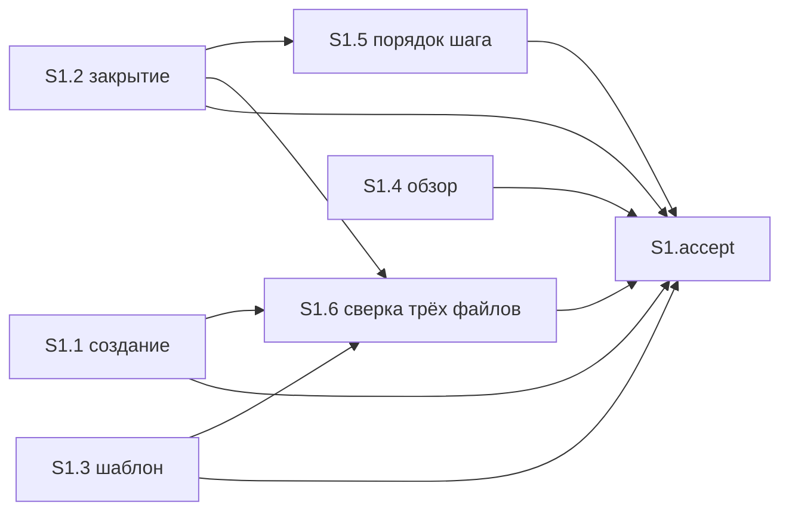

# Quality Control — proposal-result

Дата: 2026-10-04. Режим: **slice** (`# Срез S1` в `tasks.md`).

Охват: весь текущий план. Cache miss, первый прогон по текущим `tasks.md` / `design.md` / `spec.md`. `reused_checks: none`. `affected_contract_ids: none`. Файл `reports/quality-control-2026-10-04.md` как результат не использовался и не изменялся.

Матрица покрытия и граф зависимостей построены заново. Критерии 1–6, 8, 8b, 9–11 и читаемость задач.

## Verdict

OK

## Slice Summary

| Slice | Scenario | Tasks | Acceptance | Dependencies | Gate |
|---|---|---|---|---|---|
| S1 | Абзац в описании задачи | S1.1–S1.6 | S1.accept (1 Primary + 4 optional; сценарии 6/6) | нет | есть |

Один срез, семь чекбоксов (шесть задач и один `S1.accept`). Дубля `S1.accept` нет. Маркер `<!-- slice-gate: … -->` один. Признаков старой приёмки `S1.T*` и фазовых маркеров нет.

## Scenario Coverage

| Scenario | Covered by | Status |
|---|---|---|
| Абзац появляется при создании задачи | **Primary acceptance** и обязательный пункт `S1.accept` (текст совпадает со сценарием); правило создания — S1.1 | покрыт |
| Абзац при создании без готовой постановки | optional в `S1.accept`; источник без постановки — S1.1 | покрыт |
| Абзац обновляется, если поведение изменилось | optional в `S1.accept` (новый абзац, старого текста рядом нет); шаг закрытия — S1.2; оговорка «закрытие не просит проверку заново» — S1.5 по тексту | покрыт |
| Абзац остаётся, если поведение не изменилось | optional в `S1.accept`; S1.2 (переписывание только из-за формулировки не делается) | покрыт |
| Старое описание раздел не получает | optional в `S1.accept`; S1.1, S1.2, S1.6 | покрыт |
| Обзор не подставляет абзац | S1.4 «Верифицировать по тексту» навыка обзора; в чеклист приёмки не входит | покрыт |

Имена четырёх optional-сценариев в `S1.accept` совпадают с `#### Scenario:` в `specs/proposal-result/spec.md` буквально. Чужих сценариев в приёмке нет.

Сценарий создания без отдельной строки `Scenario «…»` в теле accept закрыт обязательным пунктом: это и есть Primary, формат `S<N>.accept` не требует второй строки с тем же путём. Сценарий обзора закрыт агентской проверкой по тексту, без обязательного пункта приёмки — так и задано в `design.md` (файл обзора в правки не входит).

## Dependency Graph

Срез один. В метаданных `**Зависимости:** нет`. Входящих рёбер от другого среза нет. Циклов нет. Опережающей зависимости приёмки нет.

Объявленные рёбра задач: S1.5 от S1.2; S1.6 от S1.1, S1.2 и S1.3. S1.4 ни от кого не зависит — файл обзора другие задачи не правят. Необъявленных зависимостей между срезами нет.

## Criteria

| Критерий | Итог |
|---|---|
| 1. Покрытие сценариев | все 6 сценариев spec закрыты Primary, optional или задачей «по тексту» |
| 2. Независимость среза | один срез, приёмка не ждёт следующего |
| 3. Полнота среза | для обязательного пути есть правило создания (S1.1) и шаблон (S1.3); для закрытия — S1.2; для обзора — статическая сверка S1.4. Слоёв конфигурации 1С в этом изменении нет |
| 4. Граф зависимостей | рёбра только назад, циклов нет, объявленные зависимости существуют |
| 5. Целостность гейта | ровно один `S1.accept` и один `<!-- slice-gate -->` |
| 5b. Чеклист приёмки | `**Primary acceptance:**` есть; в accept есть `**Primary (обязательно):**`; пустого чеклиста нет |
| 6. Риск переделки | нет опоры на непринятый предыдущий срез и нет повторённого сценария другого среза |
| 7. Читаемость | замечаний нет (ниже) |
| 8. Наблюдаемость | обязательный путь — создать задачу и прочитать начало описания; это внешний результат, не просмотр кода |
| 8b. Приёмка внутри среза | обязательный путь даёт S1.1 в том же срезе; второго среза нет |
| 9. Подготовка с отдельным гейтом | второго среза с зависимостью от S1 нет |
| 10. Простота приёмки | обязательных путей в `S1.accept` — один; остальные четыре помечены «опционально» |
| 11. Контракт задач | S1.1–S1.6 — правки и чтение файлов агентом; поручения пользователю на стенд, консоль, отладчик или «после проверки» нет |

Читаемость S1.1–S1.3: глагол, путь к файлу, что меняется и зачем. S1.4–S1.6: «Верифицировать по тексту» с путём и проверяемым исходом — статическая сверка навыка, не голая команда. Заголовки короче восьми слов отсутствуют. `S1.accept` называет бизнес-результат среза. Скобки `D1`–`D4` читаются как пункты `## Decisions` 1–4; тело задач от этих меток не зависит.

Семантика критерия 11, сверх механического предчека: «Верифицировать по тексту» — чтение markdown агентом, аналог сверки по коду для файлов навыков. Запись расхождения в `debug.md` (S1.4) — шаг агента, не прогон на стенде. «Зависимости: S1.2» — порядок задач, не условие «после успешной проверки».

## Alerts

Нет.

Блок автоисправления не требуется: срабатываний нет.

## Recommendations

Автоправка не требуется.

Решение по объединению срезов или переписыванию обязательной приёмки не требуется.

## Scope

- Переиспользованные проверки: нет.
- Новые выводы: полный прогон S1; алертов нет, вердикт OK.
- Контракты `EC-*`: в объёме нет.
