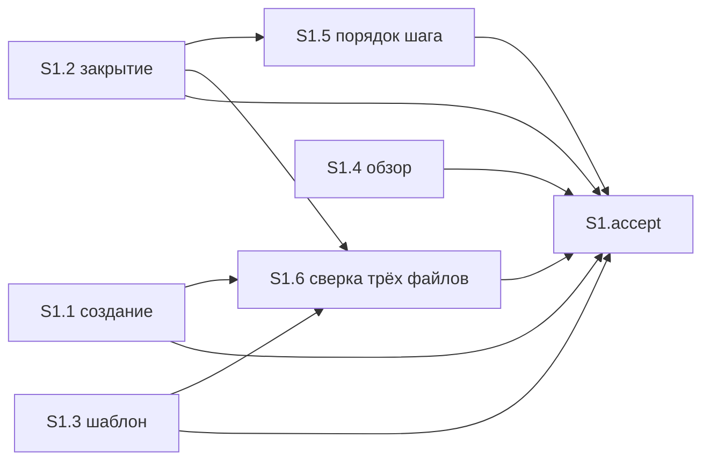

# Quality Control — proposal-result

Дата: 2026-10-04. Режим: **slice** (`# Срез S1` в `tasks.md`).

Охват: срез S1 целиком. `changed_slices: S1`. `linked_scenarios`: те же шесть заголовков, новых сценариев нет. `deterministic_results: none` — матрица покрытия и граф зависимостей построены заново по текущим `tasks.md`, `design.md` § Slices, `specs/proposal-result/spec.md`. `reused_checks: none`. `affected_contract_ids: none`.

Прошлый отчёт `reports/quality-control-2026-10-04-2.md` (вердикт OK) **не переиспользован**: обязательный пункт приёмки и текст задач создания/закрытия изменились. Файлы `quality-control-2026-10-04.md` и `quality-control-2026-10-04-2.md` не изменялись.

Механическая проверка задач: замечаний нет. Маркеров ручной конфигурации нет. Предчек контракта задач: в S1.1–S1.6 нет запрещённых подстрок и нет «после verify / после стенда».

Критерии 1–6, 8, 8b, 9–11 и читаемость. Архитектурный выбор не оценивался. Исполнимость приёмки на информационной базе и наличие тестовых данных не оценивались.

## Verdict

OK

## Slice Summary

| Slice | Scenario | Tasks | Acceptance | Dependencies | Gate |
|---|---|---|---|---|---|
| S1 | Абзац в описании задачи | S1.1–S1.6 | S1.accept (1 Primary + 4 optional; сценарии 6/6) | нет | есть |

Один срез, семь чекбоксов (шесть задач и один `S1.accept`). Второго `S1.accept` нет. Маркер `<!-- slice-gate: … -->` один. Признаков `S1.T*` и фазовых маркеров нет.

Обязательный пункт в метаданных и в теле `S1.accept` совпадают дословно:

«Создать задачу по постановке, где сказано, что меняется и как это принять → описание начинается с раздела «Результат», в нём 2–4 предложения о видимом поведении без путей к файлам, номеров шагов и имён команд, и этот текст можно скопировать в колонку «Результат» отчёта.»

Уточнение «без путей к файлам, номеров шагов и имён команд» — свойства того же абзаца в том же ходе «создать задачу → прочитать начало описания». Второго обязательного осмотра это не добавляет.

## Scenario Coverage

| Scenario | Covered by | Status |
|---|---|---|
| Абзац появляется при создании задачи | **Primary acceptance** и `**Primary (обязательно):**` в `S1.accept`; правило создания — S1.1; заголовок в шаблоне — S1.3 | покрыт |
| Абзац при создании без готовой постановки | optional в `S1.accept`; источник без постановки — S1.1 | покрыт |
| Абзац обновляется, если поведение изменилось | optional в `S1.accept` (новый абзац, старого текста рядом нет); шаг закрытия — S1.2; оговорка «закрытие не просит проверку заново» — S1.5 по тексту | покрыт |
| Абзац остаётся, если поведение не изменилось | optional в `S1.accept`; S1.2 (переписывание только из-за формулировки не делается) | покрыт |
| Старое описание раздел не получает | optional в `S1.accept`; S1.1, S1.2, S1.6 | покрыт |
| Обзор не подставляет абзац | S1.4 «Верифицировать по тексту» навыка обзора; в чеклист приёмки не входит | покрыт |

Имена четырёх optional-сценариев в `S1.accept` совпадают с `#### Scenario:` в `specs/proposal-result/spec.md` буквально. Чужих сценариев в приёмке нет.

Сценарий создания закрыт обязательным пунктом и отдельной строки `Scenario «Абзац появляется при создании задачи»` не требует: это и есть Primary. Сценарий обзора закрыт агентской проверкой по тексту — покрытие только задачей `S1.4` допустимо. В `design.md` § Slices этот сценарий тоже вынесен в проверку по тексту, файл обзора в список правок не входит.

THEN сценария создания в spec дополнительно запрещает номера срезов и имена агентов. В обязательном пункте приёмки этой пары нет; тот же запрет записан в теле S1.1. Ход приёмки от этого не дробится: наблюдаемый результат по-прежнему один абзац в начале описания.

## Dependency Graph

Срез один. В метаданных `**Зависимости:** нет`. Входящих рёбер от другого среза нет. Циклов нет. Опережающей зависимости приёмки нет: второго среза нет, обязательный ход не ссылается на задачи вне S1.

Объявленные рёбра задач: S1.5 от S1.2; S1.6 от S1.1, S1.2 и S1.3. S1.4 ни от кого не зависит — файл обзора другие задачи не правят. Необъявленных зависимостей между срезами нет.

## Criteria

| Критерий | Итог |
|---|---|
| 1. Покрытие сценариев | все 6 сценариев spec закрыты Primary, optional или задачей «по тексту» |
| 2. Независимость среза | один срез, приёмка не ждёт следующего |
| 3. Полнота среза | для обязательного пути есть правило создания (S1.1) и шаблон (S1.3); для закрытия — S1.2; для обзора — статическая сверка S1.4. Слоёв конфигурации 1С в этом изменении нет |
| 4. Граф зависимостей | рёбра только назад, циклов нет, объявленные зависимости существуют |
| 5. Целостность гейта | ровно один `S1.accept` и один `<!-- slice-gate -->` |
| 5b. Чеклист приёмки | `**Primary acceptance:**` есть; в accept есть `**Primary (обязательно):**` с тем же текстом; пустого чеклиста нет; чужих сценариев нет |
| 6. Риск переделки | нет опоры на непринятый предыдущий срез и нет повторённого сценария другого среза. S1.6 правит те же три файла только при расхождении уже внутри S1, до приёмки |
| 7. Читаемость | замечаний нет (ниже) |
| 8. Наблюдаемость | обязательный путь — создать задачу и прочитать начало описания, включая отсутствие путей, номеров шагов и имён команд в абзаце. Это внешний текст описания, не просмотр кода навыка |
| 8b. Приёмка внутри среза | обязательный путь дают S1.1 и S1.3 в том же срезе; второго среза нет, дубля Primary нет |
| 9. Подготовка с отдельным гейтом | второго среза с зависимостью от S1 нет |
| 10. Простота приёмки | обязательных путей в `S1.accept` — один; остальные четыре помечены «опционально». Уточнение про пути, номера шагов и имена команд остаётся внутри этого пути |
| 11. Контракт задач | S1.1–S1.6 — правки и чтение файлов агентом; поручения пользователю на стенд, консоль, отладчик или «после проверки» нет |

Читаемость S1.1–S1.3: глагол, путь к файлу, что меняется и зачем. Тело S1.1 и S1.2 самодостаточно: правила тона и момент сверки написаны в задаче, скобки `Behavior Contract` / `D1`–`D4` — опорные метки, без них задачу можно выполнить. S1.4–S1.6: «Верифицировать по тексту» с путём и проверяемым исходом. Заголовков короче восьми слов нет. `S1.accept` называет бизнес-результат среза: в начале описания новой задачи есть абзац, который можно скопировать в отчёт.

Семантика критерия 11, сверх механического предчека: «Верифицировать по тексту» — чтение markdown агентом, для файлов навыков это та же статическая сверка, что «по коду» для выгрузки. Запись расхождения в `debug.md` (S1.4) и правка расхождений в трёх файлах (S1.6) — шаги агента. «Зависимости: S1.2» и «Зависимости: S1.1, S1.2, S1.3» — порядок задач внутри среза, не условие «после успешной проверки» и не «после стенда».

## Alerts

Нет.

Блок автоисправления не требуется: срабатываний нет.

## Recommendations

Автоправка не требуется.

Решение по объединению срезов или переписыванию обязательной приёмки не требуется.

## Scope

- Переиспользованные проверки: нет.
- Новые выводы: полный прогон S1 по текущим файлам после уточнения обязательного пункта и текста задач создания/закрытия. Алертов нет, вердикт OK.
- Контракты `EC-*`: в объёме нет.
