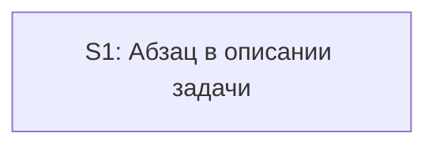

# Quality Control — Slice Coherence (design pre-tasks)

- change: `proposal-result`
- date: 2026-10-04
- mode: design-pre-tasks (`tasks.md` отсутствует; оценка единственного среза по `design.md` § Slices)
- delta: cache miss — `changed_slices: all`; `linked_scenarios`: все сценарии требования «Абзац результата в описании задачи»; `deterministic_results: none`; `affected_contract_ids: none`; `reused_checks: none`
- criteria evaluated: 1, 3, 5, 5b, 8, 8b, 9, 10, 11
- criteria skipped this run: 2 и 4 как многосрезовые (один срез — кратко в графе), 6 rework между срезами, 7 читаемость задач (нет `tasks.md`)
- new findings: полный прогон ниже
- out of scope: исполнимость приёмки прямо сейчас; тестовые данные; информационная база; выбор варианта реализации; открытый вопрос про одну строку в итоге закрытия

`no-slices` не выпускается: оценивается предложенный срез в `## Slices`, а не отсутствие заголовка среза в ещё не созданном `tasks.md`.

Источники: `proposal.md`, `design.md` § Slices, `specs/proposal-result/spec.md` (6 `#### Scenario:` одного требования). Mechanical check: none. Manual config checklist: none. User Task Contract pre-check: none. Репозиторий (промпт): три файла среза существуют и не пустые — `.cursor/skills/openspec-new-change/SKILL.md`, `.cursor/skills/openspec-archive-change/SKILL.md`, `.cursor/templates/seed/changes/_template/proposal.md`.

## Verdict

`CRITICAL`

Один срез уместен: появление абзаца и его правка при закрытии — один и тот же текст в описании задачи, отдельный второй срез не нужен. Блокер нарезки задач: в колонке **Primary acceptance** четыре самостоятельных осмотра на разных заготовках, без пометки «опционально». Пока колонка не сужена до одного осмотра «создать задачу → в начале описания абзац, который можно скопировать», нарезка скопирует перегруз в обязательную приёмку.

Три сценария требования в срезе не размещены целиком (создание без постановки, продолжение создания старого описания, обзор для согласования). Это предупреждения покрытия, не повод дробить срез.

## Slice Summary

| Slice | Scenario | Tasks | Acceptance | Dependencies | Gate |
|---|---|---|---|---|---|
| S1: Абзац в описании задачи | В колонке «Сценарий» два хода: абзац появляется при создании; при расхождении к закрытию в том же месте лежит новый абзац | ещё нет | Колонка Primary заполнена и содержит 4 осмотра. Связь со spec сужает обязательное до появления абзаца при создании, остальные ходы оставляет «пунктами той же приёмки» без «опционально». `S1.accept` ещё нет | нет | маркер конца среза ещё нет (его место — `tasks.md`) |

Порог: три файла правил и шаблона, без конфигурации 1С (`form_mode: n/a` в описании задачи). Ожидаемый объём — около Lite / нижняя граница обычного размера. По умолчанию один срез. Второй срез не обоснован: пользовательский итог один — в описании лежит абзац для колонки отчёта.

В `## Slices` нет колонки «Scenarios из spec», матрицы покрытия и чеклиста «обязательный / необязательный». Имена `#### Scenario:` в связи со spec не перечислены: названо только требование.

## Scenario Coverage

Требование: «Абзац результата в описании задачи». Шесть сценариев в `specs/proposal-result/spec.md`.

| Scenario | Covered by | Status |
|---|---|---|
| Абзац появляется при создании задачи | S1 Primary, первое предложение; связь: «обязательная приёмка — появление абзаца при создании» | OK — covered-by-Primary |
| Абзац при создании без готовой постановки | Общий ход «создать задачу» в Primary совпадает с видимым итогом, ветка «без блока постановки» и сборка из «что меняется» и критериев приёмки в срезе не названы | WARNING |
| Абзац обновляется, если поведение изменилось | S1 Primary, второе предложение (новый абзац после закрытия). Оговорка spec «закрытие не просит пройти проверку заново» в срезе не названа | OK по видимому абзацу; оговорка — см. рекомендацию |
| Абзац остаётся, если поведение не изменилось | S1 Primary, четвёртое предложение | OK — в колонке Primary (и этим же входит в перегруз) |
| Старое описание раздел не получает | S1 Primary и связь: закрытие не добавляет раздел. Ветка spec «продолжают создавать» в срезе не названа | WARNING — закрытие есть, продолжение создания нет |
| Обзор не подставляет абзац | В § Slices нет. Поведение есть в целях «не делаем» и в контракте поведения, это не карта среза | WARNING |

Покрытие по срезу: 3 сценария размещены в Primary целиком по видимому итогу (создание по постановке, обновление при расхождении, абзац без расхождения), 2 частично, 1 не размещён. `accept-bullet-foreign-scenario` неприменим: срез один, тела приёмки ещё нет.

## Dependency Graph

- Циклов нет.
- Следующего среза нет, прямой зависимости приёмки от более позднего среза нет.
- В метаданных: **Зависимости:** нет. Необъявленных предшественников нет.
- Внутри среза (по файлам колонки, не по задачам): правило создания пишет абзац; правило закрытия сверяет его, если раздел уже есть; шаблон описания держит тот же заголовок. Цикла нет.

## Checklist Results

| # | Criterion | Result |
|---|---|---|
| 1 | Scenario Coverage | WARNING — 3/6 размещены по видимому итогу; «без постановки» и «продолжение создания» только частично; «обзор не подставляет абзац» в срезе отсутствует |
| 3 | Slice Completeness | Pass — для обязательного осмотра «создать задачу → абзац в описании» достаточно правила создания. Правило закрытия и шаблон — слои того же среза для остальных ходов того же абзаца. Метаданные, формы и код 1С не требуются. Навык обзора в список файлов не входит: его не меняют; дыра — в размещении проверки, не в отсутствующем слое |
| 5 | Slice Gate Integrity | Pass (projected) — задуман один срез и одна приёмка. Дубля нет. `S1.accept` и маркер конца среза появляются в `tasks.md`; на этой стадии их отсутствие не блокер. `legacy-acceptance-format` неприменим |
| 5b | Acceptance Checklist Coverage | WARNING — колонка Primary заполнена, поэтому пустой обязательный осмотр не ставится. Тела `S1.accept` нет, пустой чеклист на этой стадии не ставится. Три сценария не покрыты целиком — алерты ниже |
| 8 | Slice Verticality | Pass — обязательный осмотр смотрит на описание задачи как на текст, который открывают и копируют: раздел в начале, 2–4 предложения о видимом поведении. Это не вызов процедуры и не сверка контракта в отладчике. Ходы закрытия в той же колонке тоже про текст описания |
| 8b | Self-Achievable Acceptance | Pass — пара соседних срезов отсутствует. Появление абзаца делается правилом создания из колонки файлов этого среза. Правка абзаца при закрытии делается правилом закрытия того же среза. Исход не заимствован у более позднего среза |
| 9 | Foundation slice with gate | Pass — второго среза нет. У этого среза есть видимый итог (абзац в описании), это не заготовка без приёмки. Отдельный срез «только правило» с воротами не предлагается |
| 10 | Acceptance Simplicity | CRITICAL — в колонке Primary четыре самостоятельных осмотра |
| 11 | User Task Contract | Pass (projected) — строк задач среза нет, запрещённых поручений пользователю посередине среза нет. Создать задачу, закрыть задачу и прочитать описание — граница приёмки среза, когда она будет записана. Предварительная проверка контракта: none |

Читаемость задач: не оценивалась. `tasks.md` ещё нет.

## Alerts

### 1. `acceptance-simplicity-overload`

- affected: S1, `design.md` § Slices, колонка Primary acceptance
- severity: `CRITICAL`
- evidence: ячейка Primary — четыре предложения и четыре разные заготовки. (1) Создать задачу → в начале описания раздел «Результат» из 2–4 предложений, его можно скопировать в отчёт. (2) На задаче, где поведение к сдаче изменилось, после закрытия в том же разделе новый абзац. (3) У описания без этого раздела закрытие раздел не добавляет. (4) Если поведение не разошлось — абзац после закрытия прежний. Это не цепочка одного осмотра «открыл → сделал → увидел». Пункты 2–4 требуют закрытия и другой исходной заготовки, чем пункт 1. Пометки «опционально» в ячейке нет. Связь со spec пишет: «Обязательная приёмка — появление абзаца при создании. Обновление при расхождении и отказ дописывать раздел в старое описание — пункты той же приёмки.» Сужение намерения есть, три остальных хода из колонки Primary не вынесены. Колонка «Сценарий» тоже держит создание и обновление при закрытии как один ряд. Нарезка, которая копирует колонку Primary в единственный обязательный пункт, получит четыре блокирующих осмотра.
- recommendation: в колонке Primary оставить один осмотр — создание задачи по постановке и абзац, который можно скопировать. Остальные ходы — необязательные пункты той же приёмки или проверка по тексту. Срез не делить.

### Remediation (auto-repair)

- alert: acceptance-simplicity-overload
- target: `openspec/changes/proposal-result/design.md` § Slices, срез S1
- action: Заменить текст колонки Primary acceptance на одно предложение: «Создать задачу по постановке, где сказано, что меняется и как это принять → описание начинается с раздела «Результат», в нём 2–4 предложения о видимом поведении, и этот текст можно скопировать в колонку «Результат» отчёта.» Колонку «Сценарий» сузить до этого же хода. Предложения про закрытие при расхождении, закрытие без расхождения и старое описание без раздела убрать из Primary и записать ниже как необязательные, с буквальными именами сценариев (см. алерты 2–4). В будущем `tasks.md`: в `S1.accept` ровно один подпункт `**Primary (обязательно):**` с этим текстом. Второй срез не создавать.

### 2. `accept-bullets-missing-scenario` — «Абзац при создании без готовой постановки»

- affected: S1 / этот сценарий
- severity: `WARNING`
- evidence: WHEN в spec — новая задача по свободному описанию, без отдельного блока постановки; THEN — раздел всё равно первый, 2–4 предложения собраны из того, что меняется, и из критериев приёмки. В § Slices названо только «создать задачу» / «появление абзаца при создании». Ветка без постановки в колонках среза и в связи со spec не названа. Источник абзаца для этой ветки описан в решениях постановки, это не размещение сценария в срезе.
- recommendation: необязательный пункт той же приёмки с буквальным именем сценария. В обязательный осмотр не поднимать.

### Remediation (auto-repair)

- alert: accept-bullets-missing-scenario
- target: `openspec/changes/proposal-result/design.md` § Slices, срез S1 (затем тело `S1.accept`)
- action: В связи со spec и в чеклисте приёмки добавить `Scenario «Абзац при создании без готовой постановки» (опционально): создать задачу по свободному описанию, без блока постановки → описание всё равно начинается с раздела «Результат» из 2–4 предложений, собранных из того, что меняется, и из критериев приёмки.`

### 3. `accept-bullets-missing-scenario` — «Старое описание раздел не получает» (ветка продолжения создания)

- affected: S1 / этот сценарий
- severity: `WARNING`
- evidence: WHEN в spec — продолжают создавать или закрывают задачу, в описании которой нет раздела «Результат». Primary и связь покрывают только закрытие: «У описания без этого раздела закрытие раздел не добавляет» и «отказ дописывать раздел в старое описание». Продолжение создания в § Slices не названо. Оба хода есть в контракте поведения постановки, в срезе — только закрытие.
- recommendation: один необязательный пункт на оба хода сценария, имя в ёлочках буквально.

### Remediation (auto-repair)

- alert: accept-bullets-missing-scenario
- target: `openspec/changes/proposal-result/design.md` § Slices, срез S1 (затем тело `S1.accept`)
- action: Вынести из Primary в необязательный пункт: `Scenario «Старое описание раздел не получает» (опционально): продолжить создание или закрыть задачу, в описании которой нет раздела «Результат» → раздел сам не появляется.`

### 4. `accept-bullets-missing-scenario` — «Обзор не подставляет абзац»

- affected: S1 / этот сценарий
- severity: `WARNING`
- evidence: WHEN/THEN spec — обзор для согласования остаётся отдельным текстом и не записывает раздел «Результат» в описание задачи. В § Slices сценарий не назван, навык обзора не в колонке файлов. Запрет менять обзор есть в целях «не делаем» и в контракте поведения — это граница задачи, не покрытие сценария приёмкой или проверкой по тексту.
- recommendation: не отдельный срез и не второй обязательный осмотр. Проверка по тексту навыка обзора: он не пишет раздел в описание. Либо необязательный пункт «собрать обзор → описание задачи без нового раздела».

### Remediation (auto-repair)

- alert: accept-bullets-missing-scenario
- target: `openspec/changes/proposal-result/design.md` § Slices, срез S1 (затем задача среза или необязательный пункт)
- action: В покрытие среза добавить `Scenario «Обзор не подставляет абзац»` как проверку по тексту навыка обзора (раздел в описание не пишется) или как необязательный пункт приёмки с тем же именем. Файл обзора в список правок не добавлять.

### 5. `slice-gate-deferred`

- affected: S1
- severity: `SUGGESTION`
- evidence: `tasks.md` нет, чекбокса приёмки и маркера конца среза нет. В постановке один срез и заполненная колонка Primary.
- recommendation: при нарезке — один заголовок среза, один чекбокс приёмки, один маркер конца. Обязательный подпункт равен суженному Primary из алерта 1.

## Recommendations

**Автоправка до нарезки задач**

Сузить колонку Primary до одного осмотра создания и дописать в § Slices размещение всех шести имён сценариев (обязательный — один, остальные необязательные или проверка по тексту). Текст правок — в блоках Remediation выше.

Чтобы сужение Primary не потеряло уже названные ходы, рядом с необязательными пунктами оставить:

- `Scenario «Абзац обновляется, если поведение изменилось» (опционально):` закрыть задачу, у которой видимое поведение разошлось с абзацем на старте → в том же разделе новый абзац, старого текста рядом нет.
- `Scenario «Абзац остаётся, если поведение не изменилось» (опционально):` закрыть задачу, поведение совпало → абзац тот же.
- Оговорку «закрытие не просит пройти проверку заново только из-за правки абзаца» не делать вторым обязательным осмотром. Её место — задача среза: по тексту правила закрытия сверка абзаца стоит после проверки свежести и после приёмки срезов, до синхронизации требований.

**Решение о структуре срезов**

Не требуется. Срез один. Объединять не с чем. Делить создание и закрытие на два среза не следует: закрытие правит тот же абзац, а не отдельный видимый итог. Запрещённый обход «не подписывать приёмку, пока не готов следующий срез» здесь не предлагается.

**При нарезке `tasks.md`**

1. `# Срез S1: Абзац в описании задачи`, зависимости нет.
2. `**Primary acceptance:**` — одно предложение из алерта 1.
3. `**Связь со spec:**` требование «Абзац результата в описании задачи» и все шесть имён сценариев буквально, с ролью (обязательный / необязательный / проверка по тексту).
4. Ровно один `- [ ] S1.accept` с одним подпунктом `**Primary (обязательно):**`. Остальные пять имён — «(опционально)» или задачи «проверить по тексту», не обязательные подпункты без этой пометки.
5. Маркер: `<!-- slice-gate: у новой задачи описание начинается с раздела «Результат» из 2–4 предложений, текст можно скопировать в колонку отчёта -->`.
6. Задачи правок: глагол, файл, зачем. Живой прогон создания и закрытия — только в приёмке среза. В задачи среза не писать проверку на стенде, в консоли и в отладчике.

**Не выпущено**

`primary-acceptance-missing`, `accept-checklist-empty`, `accept-bullet-foreign-scenario`, `slice-not-vertical`, `slice-accept-not-self-achievable`, `slice-foundation-with-gate`, `user-task-contract-violation`, `no-slices`, `legacy-acceptance-format`, `deprecated-phase-gate`.

## Reused vs new

- reused: none
- new: полный прогон единственного среза S1 и шести сценариев требования «Абзац результата в описании задачи»
