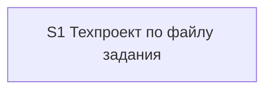

# Quality Control — Slice Coherence: tz-tech-project

- **Date:** 2026-09-23
- **Scope:** delta — только срез **S1** (изменился)
- **Mode:** slice (`# Срез S1` present)
- **Artifacts:** `tasks.md`, `design.md` (§ Slices + чеклист приёмки), `specs/tz-tech-project/spec.md`
- **User Task Contract pre-check:** mechanical grep S1.* — совпадений нет (evidence from orchestrator)
- **Customer themes (не дефект среза):** второй файл техпроекта только после подтверждения в листе; часы = (нижняя граница × коэффициент) + надбавка; дробь вверх до целого часа — уже в тексте постановки

## Verdict

**OK**

Блокирующих критериев нет. CRITICAL-алертов нет.

---

## Scope note (delta)

| | |
|---|---|
| **changed_slices** | S1 |
| **reused_checks** | нет (полная оценка S1 по текущим артефактам) |
| **Other slices** | нет (единственный срез в change) |

---

## Slice Summary

| Slice | Scenario | Tasks | Acceptance | Dependencies | Gate |
|---|---|---|---|---|---|
| S1: Техпроект по файлу задания | Сначала согласование часов, после подтверждения в листе — техпроект таблицами | S1.1–S1.9 (9) | S1.accept (Primary + 7 optional Scenario; Primary закрывает «Согласование часов» → 8/8) | нет | `<!-- slice-gate -->` present |

---

## Scenario Coverage

Spec содержит **8** сценариев (проверены по `specs/tz-tech-project/spec.md`, не по памяти).

| Scenario | Covered by | Status |
|---|---|---|
| Согласование часов | S1 metadata Primary + S1.accept **Primary (обязательно)**; реализация S1.1–S1.4, S1.6 | OK |
| Техпроект для технического задания | S1.accept optional bullet; S1.2, S1.9 | OK |
| В задании нет дыр | S1.accept optional; S1.4, S1.5 | OK |
| Повторный запуск с ответами | S1.accept optional; S1.2 | OK |
| Часы собраны из прозы задания | S1.accept optional; S1.6 | OK |
| Папка шаблонов не меняет запуск | S1.accept optional; S1.5 | OK |
| В выгрузке нет названного объекта | S1.accept optional; S1.8 | OK |
| Обзор остаётся компилятором готовой задачи | S1.accept optional; S1.3 (файлы overview не менять) | OK |

Критерий 1: каждый Scenario покрыт Primary, optional accept или agent `S<N>.<M>`. Пропусков нет.

---

## Dependency Graph

- Объявлено: `**Зависимости:** нет`
- design.md: `S1 → нет`
- Циклов нет; forward-зависимостей нет; незаявленных рёбер нет.

---

## Criteria evaluation (S1)

### 1. Scenario Coverage — PASS

Все 8 `#### Scenario:` из spec привязаны к S1 (metadata `**Связь со spec:**`, design § Покрытие Scenarios, accept/Primary/tasks). Отдельный срез для implementation-only не требуется: «Техпроект…» — optional user-journey того же среза после подтверждения в листе.

### 2. Slice Independence — PASS

Единственный срез; принятие S1 не требует следующего среза. Зависимости только «назад» — отсутствуют (корень).

### 3. Slice Completeness — PASS

Для приёмки нужны: команда-обёртка (S1.1), навык/протокол (S1.2), каркас согласования и лист (S1.3–S1.4), перенос правил/нормативов/карты/сверки/техпроекта (S1.5–S1.9). Слои 1С Form/BSL не применимы (change = Cursor command/skill). Пробелов слоёв для Primary нет.

### 4. Slice Dependency Graph — PASS

См. граф выше. Объявление согласовано с design.

### 5. Slice Gate Integrity — PASS

- Ровно один `S1.accept`
- Ровно один маркер `<!-- slice-gate: … -->`
- Legacy `S1.T*` отсутствует

### 5b. Acceptance Checklist Coverage — PASS

| Check | Result |
|---|---|
| `**Primary acceptance:**` в metadata | есть |
| `**Primary (обязательно):**` в S1.accept | есть |
| `primary-acceptance-missing` | не сработал |
| `accept-checklist-empty` | не сработал |
| `accept-bullets-missing-scenario` | не сработал (все 8 покрыты) |
| `accept-bullet-foreign-scenario` | не сработал (чужих срезов нет) |

Primary по смыслу = Scenario «Согласование часов» (лист + согласование, без техпроекта). Отдельный optional-буллет с именем этого Scenario не обязателен при покрытии через Primary.

### 6. Rework Risk — PASS

Нет опоры на непринятый предыдущий срез; дублей Scenario между срезами нет (один срез). Риск переделки из-за границ срезов низкий.

### 8. Slice Verticality — PASS

Mandatory Primary — black-box: открыть `<имя>-вопросы.md` и `<имя>-согласование.md`, проверить наблюдаемое содержимое (вопросы/«вопросов нет», сюжет и часы, нет таблицы нормативов, строка подтверждения, нет файла техпроекта). Не programmatic-only (нет «вызвать функцию / код-ревью контракта» как Primary).

`slice-not-vertical` — не сработал.

### 8b. Self-Achievable Acceptance — PASS

Primary (первый запуск → лист + согласование) достижим задачами S1.1–S1.8 того же среза; S1.9 обслуживает optional Scenario «Техпроект…», не блокируя Primary. Нет соседнего S2 с дублем journey / forward-зависимостью приёмки.

`slice-accept-not-self-achievable` — не сработал.

### 9. Foundation slice with gate — PASS / N/A structural

Условий критерия 9 нет: нет `S2` с `**Зависимости:** S1`. Gate у S1 легитимен (самостоятельный user outcome: согласование часов).

`slice-foundation-with-gate` — не сработал.

### 10. Acceptance Simplicity — PASS

В S1.accept ровно **один** mandatory black-box journey (`**Primary (обязательно):**`). Остальные семь Scenario помечены `(опционально)`.

`acceptance-simplicity-overload` — не сработал.

### 11. User Task Contract — PASS

- Mechanical grep (orchestrator): DENY-формулировок в `S1.*` нет.
- Семантика: S1.1–S1.9 — агентские задачи (создать/описать команду и навык); runtime-приёмка — только `S1.accept`. Условных цепочек «после verify/стенда» нет.

`user-task-contract-violation` — не сработал.

---

## Task Readability (criterion 7 adjunct)

| Task | Assessment |
|---|---|
| S1.1–S1.9 | Глагол + путь/артефакт + бизнес-результат + (D#) — OK |
| S1.accept | Заголовок с бизнес-результатом; Primary + Scenario-буллеты — OK |
| Opaque / too-short | не найдены |

Алертов `task-opaque-title` / `task-too-short` / `task-opaque-acceptance` нет.

---

## Alerts

*Нет алертов CRITICAL / WARNING / SUGGESTION по критериям 1–6, 8, 8b, 9–11 и readability для S1.*

---

## Recommendations

### Automatic fix

*Нет.*

### Decision required

*Нет.*

---

## Blocking criteria (for orchestrator)

**Вердикт: OK**

Список блокирующих критериев с именами алертов: *(пусто)*.
