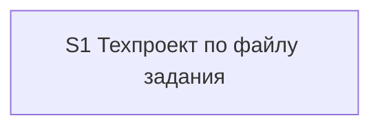

# Quality Control — tz-tech-project — 2026-09-24

**Scope:** delta — `changed_slices: S1` (полный контроль с нуля).  
**Reused checks:** none (кэш прошлого контроля недействителен).  
**Affected contracts:** EC-4, EC-5 (учтены как контекст постановки; оценка — только slice coherence).  
**Mode:** slice (`# Срез S1` присутствует).

---

### Verdict

`OK`

---

### Reused vs new findings

| Scope | Status |
|---|---|
| S1 (все критерии 1–6, 8, 8b, 9–11 + readability) | **new** — полный пересчёт |
| Прочие срезы | n/a — один срез |
| `reused_checks` | none |

---

### Slice Summary

| Slice | Scenario | Tasks | Acceptance | Dependencies | Gate |
|---|---|---|---|---|---|
| S1: Техпроект по файлу задания | 10 сценариев (1 Primary + 9 optional) | S1.1–S1.10 (10) | S1.accept (10/10: Primary + 9 Scenario) | нет | `<!-- slice-gate -->` есть |

---

### Scenario Coverage

| Scenario | Covered by | Status |
|---|---|---|
| Согласование часов | Primary (`**Primary acceptance:**` + mandatory sub-bullet S1.accept); задачи S1.1–S1.4 | OK |
| Техпроект для технического задания | S1.accept optional; S1.9 | OK |
| Постановка для задачи на разработку | S1.accept optional; S1.10 | OK |
| В задании нет дыр | S1.accept optional; S1.4, S1.5 | OK |
| Повторный запуск с ответами | S1.accept optional; S1.2 | OK |
| Часы собраны из прозы задания | S1.accept optional; S1.6 (частично Primary: часы в согласовании) | OK |
| Несколько факторов надбавки | S1.accept optional; S1.6 | OK |
| Папка шаблонов не меняет запуск | S1.accept optional; S1.5 | OK |
| В конфигурации нет названного объекта | S1.accept optional; S1.8 | OK |
| Обзор остаётся компилятором готовой задачи | S1.accept optional; S1.3 (запрет правок overview) | OK |

Покрытие пересчитано по `specs/tz-tech-project/spec.md` и `tasks.md`; расхождений с `linked_scenarios` нет.

---

### Dependency Graph

```text
S1 (Зависимости: нет)
```

Циклов нет. Forward-зависимостей нет (единственный срез). Необъявленных рёбер нет.



---

### Checklist evaluation (S1)

| # | Criterion | Result | Notes |
|---|---|---|---|
| 1 | Scenario Coverage | PASS | Все 10 `#### Scenario:` покрыты Primary / optional accept / `S1.<M>` |
| 2 | Slice Independence | PASS | Один срез; приёмка не требует «следующего» среза |
| 3 | Slice Completeness | PASS | Команда, Entry Protocol, каркас согласования, лист, нормативы/часы, исследование дыр, техпроект, постановка — слои для Primary и optional на месте (kit: `.cursor/commands` + `.cursor/skills/openspec-techproject/`) |
| 4 | Slice Dependency Graph | PASS | `Зависимости: нет`; граф согласован с design `## Slices` |
| 5 | Slice Gate Integrity | PASS | Ровно один `S1.accept`; маркер `<!-- slice-gate -->` после приёмки |
| 5b | Acceptance Checklist Coverage | PASS | Есть `**Primary acceptance:**` и `**Primary (обязательно):**`; чеклист не пуст; foreign-scenario нет; пропусков Scenario нет |
| 6 | Rework Risk | PASS | Нет опоры на непринятый соседний срез; дублей Primary между срезами нет |
| 8 | Slice Verticality | PASS | Mandatory Primary — black-box: открыть выходные md, проверить состав листа/согласования (не код-ревью / не вызов API в отладчике) |
| 8b | Self-Achievable Acceptance | PASS | Primary достижим задачами S1.1–S1.4 (и поддержкой S1.3); нет S2 с дублем journey; техпроект/постановка — optional, не blocking |
| 9 | Foundation + gate | PASS | Нет S2 с `Зависимости: S1` и UX-приёмкой при programmatic-only S1 — антипаттерн не применим |
| 10 | Acceptance Simplicity | PASS | Один mandatory black-box journey; остальные Scenario помечены «(опционально)» |
| 11 | User Task Contract | PASS | Pre-check grep DENY по S1.1–S1.10 — совпадений нет; семантика: рабочие задачи — правка команды/навыка агентом; runtime/ИБ/консоль/«после стенда» в `S1.<M>` отсутствуют. Прогон `/opsx:techproject` — в metadata `**Приёмка:**` / `S1.accept` (граница среза, допустимо) |

---

### Task readability

| Task | Pattern (глагол + объект + результат) | Alert |
|---|---|---|
| S1.1 | OK — файл команды + D1 | — |
| S1.2 | OK — `SKILL.md` Entry Protocol + D1/D4/D5 | — |
| S1.3 | OK — каркас согласования в навыке + D2 | — |
| S1.4 | OK — лист вопросов в навыке + D1 | — |
| S1.5 | OK — запрет/фильтр/исследование + D4 | — |
| S1.6 | OK — формула часов + D3 | — |
| S1.7 | OK — карта разделов + D4 | — |
| S1.8 | OK — протокол без второй сверки имён + D5 | — |
| S1.9 | OK — описание техпроекта + D2 | — |
| S1.10 | OK — описание постановки + D1 | — |
| S1.accept | OK — бизнес-результат + Primary + Scenario-буллеты | — |

Алертов `task-opaque-title` / `task-too-short` / `task-opaque-acceptance` нет.

---

### Alerts

*(пусто — CRITICAL / WARNING / SUGGESTION не эмитированы)*

---

### Recommendations

**Automatic fix:** не требуется.

**Decision required:** не требуется.

**Note (не алерт):** текст `**Primary acceptance:**` в metadata чуть короче mandatory-буллета в `S1.accept` (в accept явно «файлов техпроекта и постановки ещё нет»). Покрытие Scenario «Согласование часов» и критерии 5b/8/10 не нарушены; выравнивание формулировок — по желанию при следующем редактировании tasks, не блокер.

---

### Evidence anchors

- `tasks.md`: `# Срез S1`, metadata Primary/Связь со spec, S1.1–S1.10, `S1.accept`, `<!-- slice-gate: … -->`
- `specs/tz-tech-project/spec.md`: 9 Scenario под Requirement «Техпроект…» + 1 под «Обзор задачи не меняется»
- `design.md` `## Slices`: один срез, граф S1 → нет
- User Task Contract pre-check (verify 2.1a): DENY-совпадений по S1.1–S1.10 нет
- Mechanical 7A–7E / Manual config checklist: none (вне scope coherence, зафиксировано во входе)
