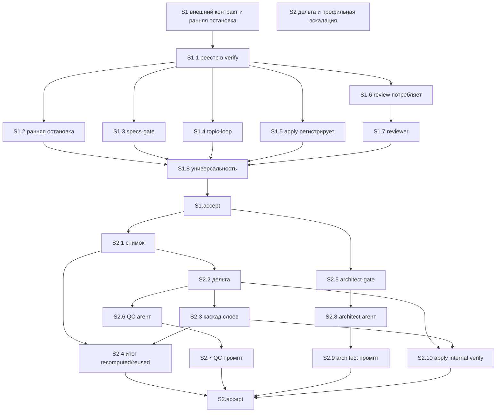

# Quality Control — Slice Coherence

**Change:** `value-efficient-verify`  
**Дата:** 2026-09-20  
**Прогон:** `quality-control-2026-09-20`  
**Режим:** slice mode (`# Срез S1`, `# Срез S2` в `tasks.md`)  
**Артефакты:** `proposal.md`, `design.md`, `tasks.md`, `specs/value-efficient-verify/spec.md`  
**Критерии:** 1–6, 8, 8b, 9–11 из `.cursor/rules/vertical-slices.mdc`; читаемость — `.cursor/rules/task-readability.mdc`  
**Линза:** kit-workflow (`form_mode: n/a`); пользователь среза — оператор kit, запускающий `/opsx:verify` на универсальной тестовой ЗНИ. Наблюдаемость — по итогу проверки, не по UX формы 1С.  
**Out of scope QC:** исполнимость приёмки «прямо сейчас»; тестовые данные / эталон ИБ (transient). Не перезаписывает `quality-control-new-2026-09-20.md`.

Pre-check оркестратора подтверждён независимым чтением `tasks.md`: маркеров ручной конфигурации 1С («вручную» / «Конфигуратор» / реквизит / элемент формы) в рабочих задачах нет; чекбоксы на месте; по одному `<!-- slice-gate -->` на срез; `<!-- phase-gate -->` нет; legacy `S<N>.T<M>` нет. DENY-маркеров User Task Contract в строках `^- \[[ x]\] S\d+\.\d+` нет; цепочек «При успешном verify S» / «после verify S» / «после стенда» в телах рабочих задач нет. Просьба прогнать `/opsx:verify` стоит только в `S<N>.accept` (граница среза). `openspec/project.md` в kit-репозитории нет.

Контекст относительно `quality-control-new-2026-09-20.md` (pre-spec): тогдашний CRITICAL по двум обязательным путям в Primary второго среза в текущем `tasks.md` снят — mandatory Primary только «Локальная дельта», остальные два Scenario optional. Четвёртый проектный Scenario «Профильный контекст участников» в spec/tasks отсутствует.

---

## Verdict

`OK`

Два среза с разными наблюдаемыми Primary: (1) проверка блокирует неклассифицированную ось принятого референса и снимает блокер после свежего подтверждения; (2) повторная проверка после локальной дельты показывает точечный пересчёт и переиспользование без необоснованной профильной эскалации. Все 6 заголовков `#### Scenario:` покрыты. Gate цел. Каждый Primary достижим задачами своего среза. Пары foundation+consumer нет: оба accept — black-box итог `/opsx:verify`. Structural user-spike в `S<N>.<M>` нет. Объединять срезы не требуется.

---

## Slice Summary

| Slice | Scenario | Tasks | Acceptance | Dependencies | Gate |
|---|---|---|---|---|---|
| S1: Внешний контракт и ранняя остановка повторной темы | Команда проверяет универсальную ЗНИ с прямым указанием или принятым референсом и получает точный блокер для открытой либо повторно открытой темы | 8 рабочих (`S1.1`–`S1.8` все `[ ]`) + `S1.accept` `[ ]` | `S1.accept` (3/3: 1 Primary + 2 optional) | нет | да (`<!-- slice-gate -->`) |
| S2: Дельта-проверка и профильная эскалация | Команда повторно проверяет универсальную ЗНИ после локальной дельты и видит только зависимые пересчёты без необоснованной профильной эскалации | 10 рабочих (`S2.1`–`S2.10` все `[ ]`) + `S2.accept` `[ ]` | `S2.accept` (3/3: 1 Primary + 2 optional) | S1 | да (`<!-- slice-gate -->`) |

Метаданные обоих срезов полные: `**Сценарий:**`, `**Primary acceptance:**`, `**Приёмка:**`, `**Связь со spec:**`, `**Зависимости:**`. `**Режим apply:**` не указан (не migration-only). `form_mode: n/a`.

Размер: 20 чекбоксов (Full, ≥16). Второй срез допустим: два самостоятельных пользовательских исхода (порог «ТРИГГЕРЫ И ПОРОГИ»). `## Follow-up` нет.

Имена Scenario в `tasks.md` (заголовки срезов, `**Связь со spec:**`, ёлочки в `S<N>.accept`) совпадают со spec буквально. В `design.md` § `## Slices` для S1 заголовки Requirement/Scenario **не** совпадают со spec (см. Alerts, SUGGESTION). Граф `S1 → нет` / `S2 → S1` в design и tasks совпадает.

Разбиение Связь со spec без дыр и без пересечения имён: 3 Scenario у S1 + 3 у S2 = 6 заголовков дельты.

---

## Scenario Coverage

В дельте **6** заголовков `#### Scenario:` (все в `specs/value-efficient-verify/spec.md`).

| Scenario | Covered by | Status |
|---|---|---|
| Открытый сигнал высокого авторитета | S1.accept optional + S1.2 | OK |
| Неклассифицированная ось референса | S1 Primary + S1.accept mandatory + S1.2 | OK |
| Второй уникальный сигнал | S1.accept optional + S1.2, S1.4 | OK |
| Дешёвый блокер до профильной эскалации | S2.accept optional + S2.3 | OK |
| Локальная дельта | S2 Primary + S2.accept mandatory + S2.2, S2.4 | OK |
| Дельта внешнего контракта | S2.accept optional + S2.2, S2.5 | OK |

**6/6.** `accept-bullets-missing-scenario` не ставится. `accept-bullet-foreign-scenario` не ставится: в телах accept нет Scenario из `**Связь со spec:**` другого среза.

**Критерий 1 (путь агента):** implementation-контракт (schema реестра, дедупликация, универсальность правил, сужение промптов ролей) закрыт агентскими задачами по файлам kit (`S1.1`, `S1.3`, `S1.8`, `S2.1`, `S2.6`–`S2.9`). User IB/runtime spike в `S<N>.<M>` нет. Живой прогон `/opsx:verify` — только `S1.accept` / `S2.accept`.

Смежные, но не дублирующие исходы: optional S1 «Второй уникальный сигнал» проверяет переоткрытие решения; optional S2 «Дельта внешнего контракта» — инвалидацию связанной сверки и профильный триггер. Разные наблюдаемые результаты, разные срезы — не foreign-bullet.

---

## Dependency Graph

Объявлено:

- S1 → нет
- S2 → S1

Циклов нет. Объявленный дед S1 существует. Forward-зависимости **приёмки** нет: Primary S1 не требует снимка, кэша, карты инвалидации и профильной эскалации из S2. Primary S2 выполняется после принятого S1 и не требует будущего среза.

Внутрисрезовые рёбра (из тел задач):

```text
S1.1 → S1.2, S1.3, S1.4, S1.5, S1.6
S1.6 → S1.7
S1.2, S1.3, S1.4, S1.5, S1.6, S1.7 → S1.8
S1.8 → S1.accept

S1.accept → S2.1, S2.5
S2.1 → S2.2
S2.2 → S2.3, S2.6, S2.10
S2.3 → S2.4, S2.10
S2.5 → S2.8 → S2.9
S2.6 → S2.7
S2.4, S2.7, S2.9, S2.10 → S2.accept
```

Фактическое пересечение файлов (не ребро приёмки; зависимость среза объявлена):

```text
openspec-verify-change/SKILL.md  — S1.1, S1.2, S1.8, затем S2.2, S2.3
openspec-apply-change/SKILL.md   — S1.5, затем S2.10
```

Это последовательное наращивание того же навыка (реестр/ранний стоп → дельта/каскад), а не скрытая `Зависимости:` и не дубль Primary. Риск повторной правки тех же секций — критерий 6 (SUGGESTION), не критерий 4.



Незаявленных рёбер, из-за которых Primary S1 был бы недостижим без S2, нет. `S2.10` явно фиксирует: S1 остаётся принимаемым со старым полным прогоном.

---

## Criteria

### 1. Scenario Coverage

Все 6 `#### Scenario:` покрыты Primary, optional accept или agent `S<N>.<M>`. Отдельный accept у S2 оправдан: «Локальная дельта» — самостоятельный исход повторной проверки, не тот же блокер внешнего контракта. Пропусков нет.

### 2. Slice Independence

S1 принимаем без S2: оператор запускает проверку универсальной тестовой ЗНИ с неклассифицированной осью, видит блокер с темой и осью, вносит свежее подтверждение, повторяет проверку — блокер снят. Для этого достаточно реестра, внешней валидности и учёта подтверждения (`S1.1`, `S1.2`, `S1.5`). Снимок/кэш S2 не нужны.

S2 принимаем после S1 (явная обратная зависимость): исходная проверка → одна локальная правка приёмочного атрибута → повтор → в итоге видны пересчитанные и переиспользованные контроли. Циклов нет. Forward acceptance dependency нет.

### 3. Slice Completeness

Kit-слои для Primary S1 (итог `/opsx:verify`: блокер темы/оси и снятие после подтверждения):

| Слой для Primary | Задача | Status |
|---|---|---|
| Чтение и schema реестра | S1.1 | есть |
| Ранняя остановка с темой/осью/источником | S1.2 | есть |
| Свежее подтверждение в том же реестре | S1.2 (критерий свежести) + S1.5 (регистрация через apply) | есть |
| Observability осей в specs-gate | S1.3 | есть (для optional/связанных осей; Primary не ломается без него) |
| Topic-loop vs acceptance-loop | S1.4 | есть (optional «Второй уникальный сигнал») |
| Потребление контракта в review | S1.6, S1.7 | есть (не требуется для Primary; полный стек capability) |
| Универсальность правил | S1.8 | есть (NFR/static, не accept) |

Kit-слои для Primary S2 (два последовательных итога проверки: перечни recomputed/reused, нет лишней эскалации):

| Слой для Primary | Задача | Status |
|---|---|---|
| Поля снимка / кэш / invalidation_map | S2.1 | есть |
| Детерминированная дельта и точечная инвалидация | S2.2 | есть |
| Каскад: дешёвые блокеры до профильной эскалации | S2.3 | есть |
| Человекочитаемый перечень recomputed/reused | S2.4 | есть |
| Триггеры профильного режима | S2.5, S2.8, S2.9 | есть |
| Сужение контроля срезов до дельты | S2.6, S2.7 | есть |
| Internal verify на границе среза | S2.10 | есть (не обязателен для ручного Primary; не дыра) |

Пропусков слоя, без которого Primary своего среза структурно ненаблюдаем, нет. Универсальная тестовая ЗНИ как носитель данных — transient, не completeness.

### 4. Slice Dependency Graph

`Зависимости:` S1 = нет, S2 = S1. Дед существует. Циклов нет. Тела `S2.1` / `S2.5` уточняют `S1.accept` — согласовано со slice-gate, не undeclared forward edge.

### 5. Slice Gate Integrity

Ровно один `S1.accept` и один `S2.accept`. Ровно один `<!-- slice-gate -->` на срез. Дублей и legacy `T<M>` нет.

### 5b. Acceptance Checklist Coverage

- `**Primary acceptance:**` есть в metadata обоих срезов.
- Первый sub-bullet обоих accept — `**Primary (обязательно):**`.
- Тела accept не пустые.
- Каждый Scenario из `**Связь со spec:**` своего среза имеет буллет (Primary или optional).
- Чужих Scenario в accept нет.
- Имена в ёлочках = заголовки spec буквально.

`primary-acceptance-missing`, `accept-checklist-empty`, `accept-bullets-missing-scenario`, `accept-bullet-foreign-scenario` не ставятся.

### 6. Rework Risk

Сценарии срезов не повторяются. S2 не опирается на S1 без явной зависимости.

Остаточный риск: S2.2/S2.3 перестраивают тот же `openspec-verify-change/SKILL.md`, куда S1 кладёт реестр и ранний стоп; S2.10 возвращается в `openspec-apply-change/SKILL.md` после S1.5. Это ожидаемый каскад D3/Migration Plan, не дубль user-journey. Острота низкая → SUGGESTION, не WARNING.

### 8. Slice Verticality / Acceptance Observability

Оценка семантическая. Пользователь — оператор kit.

- S1 mandatory Primary: запустить проверку → увидеть блокер с темой и осью → внести подтверждение → повторить → блокер снят. Чёрный ящик команды `/opsx:verify`, не вызов функции в отладчике и не код-ревью контракта.
- S2 mandatory Primary: исходная проверка → изменить один локальный приёмочный атрибут → повтор → в итоге видны перечни зависимых пересчитанных и неизменившихся переиспользованных контролей, без профильной эскалации. Наблюдаемый итог отчёта проверки (S2.4 делает перечень частью пользовательского результата).

`slice-not-vertical` не ставится: оба mandatory Primary описывают black-box поведение продукта.

### 8b. Self-Achievable Acceptance

Механическое сравнение Primary: общий префикс «проверка универсальной тестовой ЗНИ» — поверхность продукта, не дубль journey. Then различны (блокер оси vs перечень recomputed/reused).

Семантика: слой, дающий блокер темы/оси (реестр + external validity), лежит в S1. Слой, дающий точечный пересчёт (снимок, дельта, каскад, итог), лежит в S2. Primary S1 не требует макета инвалидации из S2. Primary S2 не заимствует journey S1.

`slice-accept-not-self-achievable` не ставится. Объединение срезов не требуется.

### 9. Foundation slice with gate

Структурно: у S1 есть accept и slice-gate; у S2 `**Зависимости:** S1`. Семантика третьего условия **не** выполняется: `S1.accept` сам описывает user-journey (блокер проверки), а не programmatic-only API/рефактор. `slice-foundation-with-gate` не ставится.

### 10. Acceptance Simplicity

В каждом `S<N>.accept` ровно один mandatory black-box путь; остальные два буллета помечены «(опционально)». `acceptance-simplicity-overload` не ставится.

S1 Primary «блокер → подтверждение → снятие» — один последовательный путь Scenario «Неклассифицированная ось референса» (spec THEN уже включает классификацию и свежее подтверждение), не два mandatory journey.

### 11. User Task Contract

Mechanical DENY по рабочим `S<N>.<M>`: совпадений нет. Repair-цепочек «после verify/стенда» в рабочих телах нет. `Зависимости: S1.accept` у S2.1/S2.5 — ребро графа apply, не user-spike.

Семантика: рабочие задачи правят навыки, правила, агенты и шаблоны kit. Прогон `/opsx:verify` на универсальной тестовой ЗНИ — только accept. `user-task-contract-violation` не ставится.

---

## Task Readability

Паттерн «глагол + файл/секция + что меняем + зачем» выполнен у всех `S1.1`–`S1.8` и `S2.1`–`S2.10`. Голых идентификаторов решений (`D7` без файла) нет. Заголовки длиннее 8 слов. Тела дают Результат / Критерий / Зависимости — не замена читаемого заголовка.

Заголовки accept содержат бизнес-результат: «нерешённая ось точно блокирует продолжение»; «повторный итог показывает точечный пересчёт и переиспользование».

`task-opaque-title`, `task-too-short`, `task-opaque-acceptance` не ставятся.

Рецепт vs исход: задачи указывают целевой файл и наблюдаемый контракт секции навыка; для kit файл и есть поверхность продукта. Имена новых процедур как критерий приёмки не закреплены.

---

## Alerts

CRITICAL: нет.

WARNING: нет.

### 1. `design-slice-spec-title-drift`

- **Affected:** `design.md` § `## Slices` / срез S1 (tasks.md не затронут)
- **Alert type:** `design-slice-spec-title-drift`
- **Severity:** SUGGESTION
- **Evidence:** в design S1 «Связь со spec» стоят Requirement «Внешний контракт как обязательный источник проверки», «Паритет по объявленным осям», «Ранний стоп повторной темы» и Scenario «Открытое указание высокого авторитета». В spec — Requirement «Внешний контракт участвует в проверке», «Уникальный сигнал переоткрывает решение» и Scenario «Открытый сигнал высокого авторитета». `tasks.md` S1 уже использует заголовки spec буквально; покрытие 6/6 не страдает.
- **Recommendation:** выровнять `design.md` § Slices «Связь со spec» с актуальными заголовками `specs/value-efficient-verify/spec.md`, чтобы design не оставался вторым расходящимся источником имён. Правка tasks/spec не нужна.

### 2. `rework-risk-same-skill-file`

- **Affected:** S2.2, S2.3 (тот же `openspec-verify-change/SKILL.md`, что S1.1/S1.2/S1.8); S2.10 (тот же `openspec-apply-change/SKILL.md`, что S1.5)
- **Alert type:** rework risk (критерий 6)
- **Severity:** SUGGESTION
- **Evidence:** Migration Plan и D3 прямо предусматривают сначала реестр/ранний стоп, затем перестройку слоёв и дельты. `S2.10` сохраняет принимаемость S1 со старым полным прогоном. Сценарии не дублируются.
- **Recommendation:** при apply S2 править секции Novelty/Layers так, чтобы контракт S1 (schema, ранний стоп, свежесть подтверждения) не переписывался заново, а встраивался в каскад. Отдельный срез или merge не нужны.

---

## Recommendations

### Automatic fix

Нет обязательных auto-repair (CRITICAL/WARNING отсутствуют). Repairable alerts из канона не сработали.

Опционально (не блокирует):

- В `design.md` § Slices S1 заменить «Связь со spec» на те же Requirement/Scenario, что в spec и `tasks.md`.

### Decision required

Нет. Объединение срезов не требуется (8b/9 не сработали). Переписывать Primary не требуется. Запрещённый обход «не подписывать S1.accept до S2» не предлагается.

---

## Notes for orchestrator

- Verdict Layer 2 Internal Coherence: **OK**.
- Не путать с `quality-control-new-2026-09-20.md` (pre-spec CRITICAL по простоте Primary S2 — в текущих tasks исправлено).
- User of slices = kit operator; вертикальность судить по итогу `/opsx:verify`, не по форме 1С.
