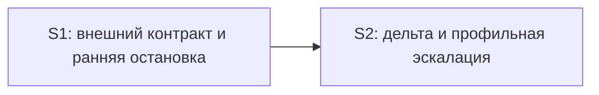

# Quick check декомпозиции `value-efficient-verify`

Дата: 2026-09-20  
Режим: pre-spec / pre-tasks  
Проверены: `proposal.md`, `design.md` § `Slices`, правила вертикальных срезов и полноты delta specs.

## Verdict

**Общий вердикт: CRITICAL до точечной правки S2.**

Фактическое отсутствие `specs/**` и `tasks.md` не считается дефектом на этой стадии. Поэтому не проверялись фактические `S<N>.accept`, маркеры `slice-gate`, формулировки задач и буквальное покрытие готовых Scenario. Проверена проектная декомпозиция, из которой эти артефакты будут созданы.

| Срез | Вердикт | Обоснование |
|---|---|---|
| S1 | OK | Есть самостоятельный наблюдаемый результат: проверка блокирует продолжение по внешнему контракту и снимает блокировку после свежего решения. Primary — один связный пользовательский путь, достижимый внутри S1; S2 для его приёмки не нужен. |
| S2 | CRITICAL | Срез даёт самостоятельный результат, а зависимость от S1 направлена назад и корректна. Но текущий Primary объединяет два обязательных пути: локальную дельту с переиспользованием результатов и изменение внешнего свидетельства с инвалидацией и профильной эскалацией. Это нарушает простоту Primary. |

## Slice Summary

| Slice | Проект сценариев | Primary | Зависимости | Самостоятельность |
|---|---:|---|---|---|
| S1 | 3 связанных Scenario | Наблюдаемый блокер → свежее решение → контроль пройден | нет | Да |
| S2 | 4 заявленных Scenario | Два альтернативных обязательных пути в одной формулировке | S1 | Да после упрощения Primary |

## Проверка применимых критериев

### S1 — внешний контракт и ранняя остановка

- **Сценарная связность:** соблюдена. Открытый внешний контракт, неклассифицированная ось и второй уникальный сигнал относятся к одному пользовательскому результату — проверка не продолжает работу при нерешённом расхождении.
- **Наблюдаемость:** соблюдена. Пользователь запускает проверку и видит блокировку с указанием темы/оси, затем видит снятие этого блокера после свежего решения.
- **Достижимость Primary:** соблюдена. Реестр, классификация осей, свежесть решения и ранняя остановка входят в S1; кэш и дельта из S2 не требуются.
- **Foundation-срез:** отсутствует. S1 не является подготовительным API/рефакторингом: он сам даёт принимаемое поведение workflow.
- **Простота Primary:** соблюдена. Блокировка и повтор после решения — один последовательный путь разрешения одного блокера.
- **Риск переработки:** низкий, если три Scenario будут покрыты одним Primary, optional-пунктами либо агентскими статическими задачами без отдельных gate.

### S2 — дельта и профильная эскалация

- **Сценарная связность:** в целом соблюдена, но заявлено 4 Scenario при норме 1–3 на срез. «Профильный контекст участников» является внутренним контрактом ответственности, а не самостоятельным наблюдаемым Scenario будущего spec.
- **Наблюдаемость:** потенциально соблюдена, потому что design предусматривает в итоге проверки попадания кэша и карту инвалидации. В Primary это нужно сказать явно: пользователь проверяет итог, а не внутренний факт выполнения.
- **Достижимость Primary:** соблюдена структурно. Снимок, дельта, кэш, инвалидация и триггеры профильной эскалации находятся в S2; более позднего среза нет.
- **Foundation-срез:** отсутствует. S2 даёт самостоятельный видимый результат повторной проверки, а не только внутреннюю основу.
- **Простота Primary:** нарушена. Локальная дельта и изменение внешнего свидетельства — два отдельных обязательных black-box пути.
- **Зависимость от S1:** корректна. S2 использует внешний контракт и его дайджест как один из входов инвалидации; S1 не зависит от S2. Цикла и forward-зависимости приёмки нет.

## Dependency Graph

Граф ацикличен. Приёмка S1 не требует S2. Приёмка S2 выполняется после принятого S1 и не требует будущего среза.

## Alerts

### 1. `acceptance-simplicity-overload`

- **Срез:** S2
- **Severity:** CRITICAL
- **Evidence:** Primary одновременно требует: (1) изменить локальный приёмочный атрибут и подтвердить переиспользование неизменившихся результатов; (2) изменить внешнее свидетельство и подтвердить инвалидацию связанного контроля с профильной эскалацией.
- **Рекомендация:** оставить mandatory Primary только для локальной дельты. Изменение внешнего свидетельства оформить отдельным Scenario и optional-пунктом будущего `S2.accept` либо агентской проверкой, если наблюдаемый пользовательский результат не нужен.

### Remediation (auto-repair)
- alert: acceptance-simplicity-overload
- target: `design.md`, slice S2
- action: заменить Primary на один путь «исходная проверка → одна локальная дельта → повторная проверка → в итоге видны только зависимые пересчёты и переиспользованные результаты»; вынести изменение внешнего свидетельства из mandatory Primary.

### 2. `slice-scenario-density`

- **Срез:** S2
- **Severity:** WARNING
- **Evidence:** в `Связь со spec` заявлены четыре Scenario: дешёвый блокер, локальная правка, новое внешнее свидетельство и профильный контекст участников. Канонический предел — 1–3 связанных пользовательских Scenario на срез.
- **Рекомендация:** не создавать Scenario «Профильный контекст участников». Оставить разделение ответственности внутренним контрактом design и будущей агентской статической задачей. После этого у S2 останутся три наблюдаемых Scenario.

### Remediation (auto-repair)
- alert: slice-scenario-density
- target: `design.md`, slice S2
- action: удалить из `Связь со spec` Requirement «Разделение ответственности» — Scenario «Профильный контекст участников»; сохранить соответствующие ограничения в D6 и покрыть их агентской статической задачей.

### 3. `scenario-implementation-leak`

- **Срез:** S2, проект будущего spec
- **Severity:** WARNING
- **Evidence:** «Профильный контекст участников» описывает внутреннюю передачу контекста между ролями, а не наблюдаемое поведение результата проверки.
- **Рекомендация:** не переносить эту формулировку в spec. Если продуктовый контракт профильной эскалации нужен, описать видимый итог: при изменении внешнего контракта итог проверки показывает связанную инвалидацию и выбранную профильную эскалацию.

### Remediation (auto-repair)
- alert: scenario-implementation-leak
- target: будущий `spec.md`, slice S2
- action: не создавать implementation-only Scenario о контексте участников; оставить внутренний контракт в design, а в spec использовать только наблюдаемый итог профильной эскалации.

## Точечные формулировки для `design.md`

### S1

Текущая граница среза корректна. Для более явной наблюдаемости рекомендуется заменить Primary на:

> **Primary acceptance:** выполнить проверку абстрактной ЗНИ с принятым референсом, у которого одна заявленная ось не классифицирована; итог блокирует продолжение и указывает тему и ось, после свежего подтверждения повторная проверка снимает этот блокер.

### S2

Заменить сценарий на:

> **Сценарий:** команда повторно проверяет ЗНИ после локальной дельты и в итоге видит пересчёт только зависимых контролей без необоснованной профильной эскалации.

Заменить Primary на:

> **Primary acceptance:** выполнить исходную проверку абстрактной ЗНИ, изменить один локальный приёмочный атрибут и повторить проверку; итог явно перечисляет пересчитанные зависимые контроли и переиспользованные неизменившиеся результаты, не запуская профильную эскалацию без её триггера.

Заменить связь со spec на:

> **Связь со spec:** Requirement «Каскад проверки» — Scenario «Дешёвый блокер до профильной эскалации»; Requirement «Точечная инвалидация» — Scenario «Локальная дельта» и Scenario «Дельта внешнего контракта».

Оставить:

> **Зависимости:** S1.

Разделение ответственности из D6 не превращать в Requirement/Scenario: это внутренний design-контракт и предмет агентской статической проверки.

## Рекомендуемая карта Requirement / Scenario

### Срез S1

1. **Requirement «Внешний контракт участвует в проверке»**
   - **Scenario «Открытый сигнал высокого авторитета»**  
     WHEN внешний контракт содержит открытый прямой сигнал или принятый референс  
     THEN проверка останавливает продолжение и указывает тему и ось.
   - **Scenario «Неклассифицированная ось референса»**  
     WHEN у принятого референса есть не классифицированная заявленная ось  
     THEN проверка блокирует продолжение до свежего решения по этой оси.
2. **Requirement «Уникальный сигнал переоткрывает решение»**
   - **Scenario «Второй уникальный сигнал»**  
     WHEN по подтверждённой теме появляется второй уникальный сигнал  
     THEN прежнее решение переоткрывается и требуется новое подтверждение либо явное исключение.

Рекомендуемый Primary S1 — «Неклассифицированная ось референса». Два остальных Scenario покрыть optional-пунктами будущего `S1.accept` либо агентскими статическими задачами.

### Срез S2

1. **Requirement «Точечная инвалидация»**
   - **Scenario «Локальная дельта»**  
     WHEN после исходной проверки изменён один локальный приёмочный атрибут  
     THEN итог показывает пересчёт только зависимых контролей и переиспользование остальных результатов.
   - **Scenario «Дельта внешнего контракта»**  
     WHEN изменяется внешнее свидетельство  
     THEN итог показывает инвалидацию связанного контроля и профильную эскалацию по объявленному триггеру.
2. **Requirement «Каскад проверки»**
   - **Scenario «Дешёвый блокер до профильной эскалации»**  
     WHEN детерминированный контроль или внешний контракт создаёт блокер  
     THEN профильная эскалация не запускается, а итог указывает ранний блокер.

Рекомендуемый Primary S2 — «Локальная дельта». Два остальных Scenario сделать optional-пунктами будущего `S2.accept` либо покрыть агентскими статическими задачами, сохранив один mandatory journey.

## Универсальность и User Task Contract

- В прочитанных `proposal.md` и `design.md` не обнаружены имена, объекты или пользовательские сценарии исходного исследовательского кейса.
- Рекомендуемая карта использует только абстрактные понятия внешнего контракта, референса, оси поведения, уникального сигнала, дельты, кэша и профильной эскалации.
- В предлагаемой модели нет пользовательских runtime-spike задач в ИБ, консоли, отладчике или через прямой вызов API.
- Будущие `S<N>.<M>` должны назначать исполнителю правки и статическую проверку. Пользователю остаётся только black-box приёмка результата команды в `S<N>.accept`.
- Переиспользование и инвалидацию следует принимать по детерминированным полям итога проверки, а не по длительности выполнения или внутренней трассировке.

## Recommendations

### Автоматические правки

1. Упростить S2 Primary до одного пути локальной дельты.
2. Удалить «Профильный контекст участников» из будущей карты spec и оставить его в design.
3. Явно привязать наблюдаемость S2 к итоговым данным о пересчёте, переиспользовании и эскалации.

### Решения пользователя

Структурного решения об объединении или новом разбиении срезов не требуется. После указанных точечных правок текущая пара S1 → S2 пригодна для генерации specs и tasks.

## Подтверждение последовательной независимой приёмки

**Да, S1 и S2 можно принимать независимо последовательно после упрощения Primary S2.** S1 имеет собственный пользовательский результат и не зависит от S2. S2 объявляет только обратную зависимость от принятого S1, имеет собственный видимый результат и не зависит от будущего среза.
