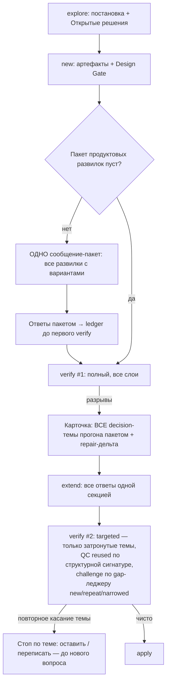

# Architecture (deep-analysis): корень хождения по кругу в процессе постановки

## Вводные

- **Вопрос:** почему процесс explore → new → verify → extend на реальной задаче (tz-tech-project) дал 5 полных прогонов проверки, 5 контролей качества с нуля, 3 несходящихся независимых разбора и 6 дописок за день — и каким процесс должен быть, а не где подкрутить счётчик.
- **Исходный запрос заказчика:** «Мы по сути просто хардкодим. Я хочу, чтобы ты вник в суть процесса — что и как стоит делать.»
- **Источники фактов:** три exploration-отчёта в `reports/` этого change (повторно не пересобирались); тексты пяти файлов правил; артефакты verify-stop-repeat; peer-review `architecture-new-2026-09-23.md` и `quality-control-2026-09-23.md` этого же change.
- **Код 1С не читался** — предмет анализа только правила набора (markdown).

## KB references

Discovery выполнен оркестратором до делегирования: совпадений нет; таксономии KB и ADR в репозитории нет. Секция Existing Knowledge пуста — конфликтов нет.

## Task

Независимый разбор всего процесса постановки, ответы на вопросы 1–6 постановки, целевая архитектура процесса и минимальный набор правок правил, убирающий класс проблемы (вопросы по одному, несходящийся challenge, холостые пересчёты, поздний стоп), а не сдвигающий порог.

---

## Корень (сводно, до разбора по вопросам)

Пять прогонов, три CHALLENGE и шесть дописок — это не пять разных дефектов, а **один конструктивный дефект: процесс превращает пакет известных заранее продуктовых развилок в последовательность одиночных вопросов, каждый из которых стоит полного прогона проверки.** Три механизма складываются:

1. **Воронка ширины 1 в verify.** Каскад слоёв спроектирован так, что дешёвый блокер завершает прогон («При любом алерте таблицы — не запускать QC, Layer 4 и Layer 5 этого прогона»), указатель открытого решения — скаляр («`open_decision_id` = самый ранний такой `EC-*`»), а карточка после challenge — «NO-GO с развилкой (**максимум одна**)». Даже если в отчётах уже лежат шесть разрывов (DC1 перечислил шесть), пользователю за прогон достаётся один вопрос.
2. **Frontload в new — декларация без механизма.** Шаг 1.56 («собрать открытые продуктовые развилки… не оставлять серию уточнений на потом») не имеет ни выходного артефакта, ни гейта, ни формата карточки. Хуже: Design Gate предписывает архитектору «apply them to design.md» — агент **сам отвечает** на продуктовые вопросы текстом design, и эти самоответы потом по одному оспариваются в verify.
3. **Каждый цикл — полный.** После internal-дописки правило требует «полный re-verify (слои 1–5)»; каждый ответ заказчика меняет текст `## Decisions` → меняется хэш оси → полный адверсариальный разбор снова; кэш контроля срезов инвалидируется любым изменением текста. Стоимость одного вопроса = полный прогон, и порог петли (считающий правки текста, а не касания темы) добегает до срабатывания только к пятой правке.

Дальше — по вопросам постановки.

---

## Q1. Почему вопросы по одному за прогон, а не пакетом? Где теряется frontload?

**Три точки потери, по стадиям:**

**new (главная потеря).** Шаг 1.56 «Frontload материальных вопросов» — три строки намерения без исполняемого шага: нет выходного артефакта «список открытых продуктовых развилок», нет проверки «развилки закрыты до первого verify», нет формата пакета. Поле «Открытые решения» из Handoff Contract маппится в «design.md § Открытые вопросы (и **карточка** решения пользователю до apply, если решение блокирующее)» — единственная карточка, и только если развилка пришла из explore. Развилки, которые находит **архитектор на Design Gate**, идут другим путём: «If architect suggests design changes — **apply them to design.md**» — гейт молча превращает открытые вопросы в авторские ответы агента. На tz-tech-project это видно буквально: `architecture-new-2026-09-23.md` (первый архитектурный отчёт задачи) уже на стадии new назвал G1 (контракт двух результатов = ось «когда второй файл») и G3 (HALT нормативов = ось «часы») — **обе будущие оси кругов были найдены до первого verify**, но были вписаны в design как решения, а не показаны заказчику как вопросы.

**verify.** Конструктивная воронка ширины 1 (см. корень): ранний стоп каскада + скалярный `open_decision_id` + «максимум одна развилка» + decision-блокер = «chat 3a-decision, **END TURN**». Прогон 4 tz показал ровно это: External validity FAIL по одной незарегистрированной теме — и прогон закончился одним вопросом «A или B», хотя открытых тем по часам было ещё несколько.

**extend.** Каждый user-extend завершается «Постановка дополнена, можно проверять. Следующий шаг: `/opsx:verify <name>`» — без шага «проверь ledger `open_known_questions`: остались ли ещё открытые развилки, которые можно задать **сейчас**, до следующего прогона». Ответ записан — и заказчика отправляют на полный круг за следующим вопросом.

**Классификация:** в new — «правило есть как декларация, исполняемого шага нет» (1.56); в verify — «правила пакета нет, есть правило одной развилки»; в extend — «правила нет» (нет сверки остатка открытых тем перед hint).

## Q2. Почему независимый разбор трижды даёт CHALLENGE по одной цепочке? Нужна ли сходимость?

**Почему не сходится — это следствие трёх осознанных правил, применённых без четвёртого:**

1. **Независимость по построению:** режиму design-challenge запрещено «опираться на собственные прошлые отчёты как на источник истины» — каждый разбор с нуля. Это правильный анти-анкоринг, его убирать нельзя.
2. **Бинарная лестница вердиктов без дельты:** APPROVE требует «все три вопроса — да»; CHALLENGE = «есть существенные сомнения». Любой найденный остаточный зазор той же темы (часы: «как строить строки» → «какое значение из диапазона» → «запретить §8 и середину») честно даёт CHALLENGE. Нет ни вердикта «APPROVE с остатком в repair», ни обязанности классифицировать каждый gap как «новый / повтор / сужение прошлого».
3. **Полный re-run после каждой правки:** repair → `verify_depth: full`; каждый extend меняет `## Decisions` → хэш оси → триггер полного Layer 4. Targeted-challenge («проверь только delta design с прошлого challenge») в правилах **есть**, но только для `verify_depth = incremental`, а после repair и после смены хэша оси он недостижим.

В challenger передаются только `closed_decisions` (решения, закрытые **заказчиком**) — но не gap-леджер (разрывы, закрытые **текстом** через repair). Поэтому DC2 и DC3 сами, добровольно, восстанавливали список «что уже закрыто» — и всё равно каждый раз проходили полный аудит одной цепочки.

**Нужна ли сходимость — да, но как контракт дельты, а не как ослабление адверсариальности.** Различать два разных входа: (a) прошлый **вердикт** как источник истины — запрещён, и это правильно; (b) прошлый **список разрывов** как список утверждений для проверки по текущему тексту — обязателен. Каждый следующий challenge должен получать леджер разрывов с их статусом и обязан для каждого своего вывода указать: `new` / `repeat: <gap-id>` / `narrowed: <gap-id>`. `repeat` без нового verified-факта и без смены наблюдаемого правила не удерживает CHALLENGE — уходит в repair или в остаток при APPROVE. Классификация: **правила нет** — новое правило (контракт сходимости), плюс правка условий, когда полный re-run обязателен (см. Q6 и набор изменений).

## Q3. Почему контроль срезов пять раз считал с нуля — дефект правила или исполнения?

**Дефект правила (ключа кэша), исполнение корректно.** Правило переиспользования в скилле есть и исполнялось буквально: «переиспользовать, если ключи попали в `check_cache` (**полный input match**)», ключ включает `ordered_input_hashes` — хэши текста артефактов. Но каждый раунд tz по определению менял текст (это и есть дописка) → хэш никогда не совпадал → «Reused: none» пять раз подряд — при том что **предмет** контроля (структура: набор заголовков Scenario, скелет accept, gate) со второго прогона был стабилен, и все прогоны с QC2 давали OK без алертов.

Дополнительный усилитель: scoping «только изменившиеся срезы» не помогает одно-срезовой ЗНИ — любая правка инвалидирует единственный срез целиком.

**Вывод:** ключ кэша меряет не тот инвариант — байты текста вместо структурной сигнатуры (упорядоченный набор заголовков `#### Scenario:` + скелет приёмки + прошлый вердикт). Ремедиация — правка ключа, не «заставить исполнять». Decision 3 текущей постановки verify-stop-repeat целится ровно сюда и является правильным рычагом (см. Q6).

## Q4. Правильная ли единица счётчика петли?

**Единица неполна: считаются события правки текста, а крутились оси.** `PatchRounds(S1)` = число секций `## Extend —` + rework — 5 правок дали срабатывание на пятой, хотя ось «часы» была тронута кругами 1→2→3→4 (четыре касания), а ось «второй файл» — 1→2→3→4→5. Счётчик по правкам не отличает **здоровую конвергенцию** (каждый раунд закрывает новые темы) от **осцилляции по одной оси** (одна тема уточняется четырьмя правками) — а сигнал петли несёт именно второе.

Показательно, что kit **уже сам это знает**: `vertical-slices.mdc` пишет «Порог трёх раундов остаётся **fallback** для ЗНИ без классифицированной темы `EC-*`» — то есть тематический счётчик предполагался, но определён только для тем уровня внешнего контракта (`EC-*` + `source_fingerprint`, «второй уникальный сигнал переоткрывает контракт»). На tz первые записи `EC-*` появились только на круге 4; вся цепочка часов кругов 1–3 жила как `implementation_invariant`-разрывы **без темы вообще** — тематический детектор был слеп до момента, когда петля уже раскрутилась.

**Правильнее:** считать **повторные касания одной темы/оси** (второе переоткрытие той же темы за раунды = сигнал, эскалация к пакету/архитектору), а `PatchRounds` оставить как fallback для неклассифицированных тем — ровно как уже задекларировано. Для этого темам ниже авторитета EC нужна дешёвая идентичность: gap-id из challenge-отчётов и строка `topics:` в секциях `## Extend —` (присваивается при первом упоминании; слияние по текстовой близости запрещено — тот же принцип, что для `EC-*`). Классификация: **правила нет, но каркас (fallback-оговорка, идентичность `EC-*`) уже есть** — достроить.

## Q5. Что должна была поймать стадия new?

**Обе оси. И фактически поймала — но не тем механизмом.** По exploration-scope суть задачи не менялась: две оси («когда появляется второй файл», «как считать часы») присутствовали в исходном задании. Первый архитектурный отчёт new (G1, G3) назвал обе. Дальше произошла подмена: гейт применил рекомендации к design (агент выбрал «один запуск пишет оба файла» и «часы из прозы» сам), заказчик увидел готовую постановку, и все шесть дописок — это заказчик, по одному вопросу за круг, **отматывающий авторские ответы агента к своим** (два вывода → по просьбе → по подтверждению листа; ×k → +надбавка → округление).

**Какой механизм нужен:** обязательный шаг new между Design/Slice Gate и финальной сводкой — **«Пакет продуктовых развилок»**:

- вход: gaps архитектора с классом «продуктовая развилка» (не `implementation_invariant`), поле «Открытые решения» handoff, `## Open Questions` design;
- если список непуст — **одно** сообщение-пакет: нумерованные вопросы, у каждого 2–3 варианта с честным «но» (формат — расширение слота **Варианты** brief-card), END TURN;
- ответы пакетом → `closed_decisions` / `EC-*` **до первого verify**; агент не вписывает в design авторский ответ на развилку, помеченную продуктовой.

Ирония, подтверждающая жизнеспособность: сама команда tz-tech-project, которую ставили эти пять кругов, — это «лист вопросов с вариантами, **пакетом**, вместо серии уточнений». Процесс должен есть свой же корм.

**Где здесь инвариант «один вопрос выбора за ход» (вторая часть вопроса 6 — разбираю тут, т.к. связано).** Инвариант сознательный и правильный **для интерактивных гейтов-визардов**, где следующий вопрос зависит от ответа на предыдущий: Metadata Gate (описание маркера влияет на preview), Mode Gate (режим каждой формы отдельно, «по одной за ход»), Slice Gate (принят/не принят). Там смешение двух выборов реально ломает гигиену решений. Но правила применили тот же инвариант к **независимым продуктовым развилкам**, где между вопросами нет зависимости (формула часов не зависит от момента второго файла): скалярный `open_decision_id`, «максимум одна развилка», одиночная «карточка решения» в new. «Один вопрос за ход» ≠ «один вопрос за прогон verify» и тем более ≠ «один вопрос за жизненный цикл дописки». Пакет из N независимых вопросов, оформленный одним связным опросным блоком с одним приглашением ответить, — это **один** акт выбора в смысле назначения инварианта (не смешивать разнородные решения в неструктурированной каше), и его нужно явно легализовать как исключение в guardrail «HALT dual selection questions».

---

## Целевая архитектура процесса

Принцип: **развилки собираются пакетами в двух точках (new — до первого verify; verify — все найденные за прогон), а повторные циклы дешевеют по мере закрытия тем (дельта вместо полного прогона).** Первый полный прогон и запись ответов заказчика не трогаются (ограничение постановки).

Что меняется в поведении по сравнению с текущим:

| Было (tz-tech-project) | Станет |
|---|---|
| Обе оси видны на new, но вписаны агентом как ответы | Обе оси заданы заказчику одним пакетом до первого verify |
| 1 вопрос за прогон × 5 прогонов | Все найденные за прогон decision-темы — в одной карточке |
| 3 CHALLENGE по одной цепочке, каждый с нуля | Challenge #2+ получает gap-леджер; `repeat` без нового факта не удерживает CHALLENGE |
| QC 5 раз с нуля при стабильном OK | QC reused при том же наборе заголовков Scenario и прошлом OK |
| Полный прогон после каждой записи ответа | Запись ответа не меняет «ось» → targeted-прогон |
| Стоп петли на 5-й правке (по числу правок) | Стоп на 2-м переоткрытии **той же темы** (по касаниям оси); правки — fallback |

Сознательно **не** меняется: первая полная проверка; adversarial-мандат challenge (≥2 альтернативы, право атаковать closed с verified-фактом); запись ответов заказчика в ledger; ранний стоп каскада на дешёвом блокере (он остаётся, но карточка стопа несёт весь известный пакет тем, а не одну).

---

## Минимальный набор изменений правил

Каждое изменение: файл → наблюдаемое поведение → как проверить. Классификация «правило есть / правила нет» указана. Порядок — по вкладу в устранение класса проблемы.

### И1. Пакет продуктовых развилок в new (materialize шаг 1.56)

- **Файлы:** `.cursor/skills/openspec-new-change/SKILL.md` (новый исполняемый шаг после Design Gate + Slice Generation Gate, до финальной сводки; правка Design Gate: gaps с классом «продуктовая развилка» не вписываются в design как ответы, а идут в пакет); `.cursor/docs/templates/brief-card.md` или `decision-block.md` (формат «пакет развилок»: нумерованные вопросы × варианты); guardrail «HALT dual selection questions» в new — carve-out: пакет = один акт выбора.
- **Класс:** правило 1.56 есть как декларация — дать ему выход; правила пакета нет — добавить.
- **Наблюдаемое поведение:** на постановке с ≥2 продуктовыми развилками new завершается одним сообщением-пакетом и END TURN; первый verify стартует с нулём открытых развилок, известных на момент авторинга.
- **Проверка:** фикстурная постановка с двумя осями (аналог tz: момент второго файла + формула часов) → new выдаёт один пакет из ≥2 вопросов, а не карточку одного и не молчаливый авторский ответ в design.

### И2. Пакетная decision-карточка в verify

- **Файлы:** `.cursor/skills/openspec-verify-change/SKILL.md` (§ External validity, Post-challenge classifier, Repair Loop п.1, Output to chat): при NO-GO класса decision карточка перечисляет **все** открытые decision-темы, известные к концу прогона (все алерты § External validity + decision-остаток classifier + `open_known_questions` ledger), одним пакетом; `open_decision_id` остаётся указателем на самую раннюю (для машинной части), но не ограничивает карточку; extend (§6a) принимает пакет ответов одной секцией.
- **Класс:** правила пакета нет; правило «максимум одна развилка» — заменить.
- **Наблюдаемое поведение:** прогон уровня «круг 4 tz» выдаёт в одной карточке и тему двух шагов, и порядок надбавки, и округление — вместо трёх кругов.
- **Проверка:** фикстура с двумя незарегистрированными событиями внешнего контракта + одним challenge-остатком → одна карточка с тремя нумерованными вопросами; после пакета ответов следующий прогон не задаёт ни одного из них повторно.

### И3. Контракт сходимости независимого разбора (gap-леджер)

- **Файлы:** `.cursor/agents/onec-code-architect.md` (режим design-challenge: обязательная классификация каждого вывода `new` / `repeat: <gap-id>` / `narrowed: <gap-id>`; `repeat` без нового verified-факта и без смены наблюдаемого правила не удерживает CHALLENGE); `.cursor/skills/openspec-verify-change/SKILL.md` (Layer 4 промпт: передавать леджер прошлых gaps со статусом «закрыт текстом / открыт» — как список утверждений для проверки по текущему тексту, не как источник вердикта).
- **Класс:** правила нет (запрет опоры на прошлые отчёты — сознательный, сохраняется для вердикта; леджер — новый отдельный вход).
- **Наблюдаемое поведение:** третий challenge по одной цепочке без смены наблюдаемого правила невозможен — остаток уходит в repair или в «APPROVE с остатком»; каждый отчёт challenge содержит дельта-таблицу закрытого/открытого.
- **Проверка:** прогнать challenge на артефактах tz после Extend (5) с леджером DC1–DC2: вердикт не CHALLENGE по темам, уже закрытым текстом (часы/SSOT/каркас), либо CHALLENGE только с выводами класса `new`.

### И4. Структурная сигнатура вместо полного input match для QC (= Decision 3 текущей постановки)

- **Файлы:** `.cursor/skills/openspec-verify-change/SKILL.md` §2.1 + `templates/report-header.md` (ключ кэша slice-coherence): reuse при (a) прошлый вердикт OK без блокирующих алертов и (b) неизменный упорядоченный набор заголовков `#### Scenario:` среза и скелет приёмки; текстовые хэши — не условие для этого класса проверок; детерминированные слои (2.3, 3) считаются как раньше — страховка от порчи формулировок.
- **Класс:** правило есть, исполняется, ключ неверный — правка ключа (осознанная замена контракта, зафиксировать как дельту, не как «уточнение»).
- **Наблюдаемое поведение:** аналоги QC-3…QC-5 tz становятся «reused» — без нового файла и без вызова агента.
- **Проверка:** фикстура: правка формулировки внутри сценария без смены заголовка → отчёт verify показывает опору на прошлый контроль; добавление нового заголовка Scenario → полный контроль.

### И5. Тематический счётчик петли (касания оси), правки — fallback

- **Файлы:** `.cursor/rules/vertical-slices.mdc` § ДЕТЕКТОР ПЕТЛИ (метрика `TopicRounds(<topic>)` = раунды Extend/repair, коснувшиеся темы; порог: 2-е переоткрытие той же темы → тот же стоп «оставить/переписать»); `.cursor/skills/openspec-extend-change/SKILL.md` §6 (строка `topics:` в секции `## Extend —`: id из gap-леджера challenge / `EC-*`, присваивается при первом упоминании, слияние по близости запрещено); `.cursor/skills/openspec-verify-change/SKILL.md` Layer 2.5 (читать обе метрики).
- **Класс:** правила нет; каркас есть (оговорка «порог трёх — fallback для ЗНИ без классифицированной темы» + идентичность `EC-*`) — достроить для тем ниже авторитета EC.
- **Наблюдаемое поведение:** на журнале tz детектор сработал бы на круге 3 (третье касание оси часов), а не на пятой правке.
- **Проверка:** replay `debug.md` tz как фикстуры → срабатывание на раунде 3 по теме «часы»; журнал с тремя правками трёх разных тем → детектор молчит (не ложное срабатывание на здоровой конвергенции).

### И6. Гранулярность хэша оси: запись ответа ≠ смена оси (+ стыковка с Decision 2 постановки)

- **Файлы:** `.cursor/skills/openspec-verify-change/SKILL.md` §1c и Layer 4: хэш архитектурной оси считается по `## Decisions` / `## Behavior Contract` **за вычетом** зеркала «Решения verify (зафиксировано)» и записей реестра внешнего контракта; extend, только фиксирующий ответ заказчика внутри выбранного подхода, не триггерит полный adversarial re-run — только targeted (механизм targeted уже описан, недостижим из-за гранулярности хэша); repair-путь — по Decision 2 постановки (не безусловный full).
- **Класс:** правило targeted есть, но перекрыто триггером хэша — конфликт правил, правка гранулярности.
- **Наблюдаемое поведение:** после ответа «A или B» следующий прогон не запускает полный независимый разбор; смена Chosen/Behavior Contract — по-прежнему полный.
- **Проверка:** фикстура: extend закрывает decision без правки Chosen → отчёт verify: Layer 4 targeted/reused; extend меняет формулу в Behavior Contract → Layer 4 полный.

**Зависимости набора:** И1 и И2 независимы и дают наибольший эффект (убирают «по одному за прогон»); И3 и И6 связаны (сходимость challenge бессмысленна, если каждый ответ всё равно триггерит full); И4 самостоятелен; И5 опирается на идентичность тем из И3 (gap-id) — внедрять после или вместе.

---

## Оценка текущей постановки verify-stop-repeat

Постановка — **не пустой хардкод, но и не корень**: она чинит три реальных дефекта правил (порядок карточек, полный re-verify после дописки, ключ кэша QC) и не трогает генератор проблемы (сериализацию вопросов). По пунктам:

| Элемент постановки | Вердикт | Обоснование |
|---|---|---|
| D3 / spec «Прошлый контроль среза остаётся» (reuse QC по названиям сценариев) | **Оставить** — правильный рычаг | Точно закрывает Q3; совпадает с И4. Peer-review уже зафиксировал: оформить как явную замену контракта `check_cache` |
| D1/D1a / spec «Стоп на третьей правке» (порог считается до продуктовой карточки; единственный вопрос прохода — стоп) | **Оставить с понижением ожиданий** — это упорядочивание карточек, не лечение петли | Без И1/И2 меняется лишь то, *какой* одиночный вопрос увидит заказчик на 3-й правке; вопросы после «оставить текст» всё равно пойдут по одному. Как guard корректен и дёшев |
| D2/D4a / spec «Уточнение той же темы» (после invariant-дописки — не полный проход; «та же тема» = то же наблюдаемое правило) | **Оставить и дополнить** | Правильное направление (пол-Q2), но без И3 (gap-леджер challenge) и И6 (гранулярность хэша оси) сужение не сработает: любой ответ заказчика меняет Decisions → хэш → full. Критерий «та же тема» без тематической идентичности (И5, `topics:`) останется суждением без опоры |
| Spec «Ответ человека сохраняется» | **Оставить** | Прямое ограничение постановки заказчика, конфликтов нет |
| Порог = 3 правки текста (единица счётчика не меняется) | **Дополнить** (не убирать) | По Q4: правки — fallback (это уже задекларировано в правиле срезов), основной сигнал — повторное касание темы (И5). Понижать порог не нужно — нужно сменить единицу |
| Scope: только verify + vertical-slices (S1.1–S1.4) | **Дополнить** | Класс проблемы живёт в new (И1) и в контракте challenge (И3). Рекомендация: verify-stop-repeat довести как есть (S1 — механика стопа/reuse, состоятельная и самопринимаемая), а И1–И3, И5–И6 оформить отдельной ЗНИ «пакет развилок и дельта-циклы» — это другая capability с другим набором файлов; смешивать в один срез нельзя (независимые пользовательские исходы) |
| Чего в постановке нет вовсе | — | Пакет развилок в new (И1); пакетная decision-карточка (И2); сходимость challenge (И3); тематический счётчик (И5); гранулярность хэша оси (И6) |

Отдельно про «сознательно по одному»: инвариант одного вопроса выбора за ход **оставить** для Metadata/Mode/Slice Gate (визарды с зависимыми ответами) и **явно ограничить уровнем хода**: он не распространяется на состав пакета независимых продуктовых развилок (один пакет = один акт выбора). Сейчас инвариант молча экстраполирован с «за ход» на «за прогон verify» тремя местами правил (скаляр `open_decision_id`, «максимум одна развилка», одиночная «карточка решения» в new) — эта экстраполяция и есть применение инварианта не к тому уровню.

## Simplicity Check

- **Viable alternatives:**
  1. Только текущая постановка verify-stop-repeat (D1–D4a) — дёшево, но убирает симптомы порядка/стоимости повтора, оставляя генератор (по одному вопросу за прогон): на следующей задаче с ≥2 осями круг повторится, короче на 1–2 прогона.
  2. Полный редизайн verify (единый «отчёт всех разрывов» без каскада и раннего стопа) — ломает осознанный принцип дешёвого блокера и удорожает каждый прогон; отклонено.
  3. **Выбрано:** И1–И6 — точечные правки пяти существующих файлов правил без нового контура: две точки пакетирования, три удешевления повтора, одна смена единицы счётчика.
- **Selected simplest viable design:** вариант 3; каждый элемент опирается на уже существующий каркас (шаг 1.56, targeted-challenge, fallback-оговорка порога, идентичность `EC-*`, ledger) — достраивается, а не изобретается.
- **Why not simpler:** вариант 1 не покрывает Why заказчика («вникнуть в суть процесса», а не подкрутить счётчик): факты показывают, что обе оси были известны на new — без И1 любая настройка verify лечит следствие.
- **Complexity budget:** файлов правок — 6 (`openspec-new-change`, `openspec-verify-change`, `openspec-extend-change`, `vertical-slices.mdc`, `brief-card.md`/`decision-block.md`, `onec-code-architect.md`); новых контуров/отчётов — 0; новых сущностей — 2 (формат пакета развилок; строка `topics:` + gap-id как идентичность темы).

## Риски

- **Пакет перегрузит заказчика** (decision fatigue в одном сообщении) → пакет ограничен известным на момент стадии; группировка по осям; у вопроса ≤3 варианта; формат листа вопросов уже подтверждён продуктом tz-tech-project как рабочий для того же заказчика.
- **Gap-леджер заякорит challenger** (ослабит адверсариальность) → леджер передаётся как список утверждений для перепроверки по текущему тексту, не как вердикт; мандат «≥2 альтернативы» и право атаковать closed с verified-фактом не трогаются; REJECT-путь без изменений.
- **Структурная сигнатура QC пропустит порчу формулировок без смены заголовков** → детерминированные проверки покрытия (Layer 2.3, Layer 3) остаются полными на каждом прогоне; ослабляется только повторный вызов агента; расхождение детерминированных слоёв снимает reuse (уже в Risks постановки).
- **Тематическая идентичность размоется** (слияние тем по текстовой близости, ложные «повторные касания») → идентичность присваивается при первом упоминании (gap-id / `EC-*`), автослияние по близости запрещено — тот же принцип, что действует для внешнего контракта; неклассифицированные темы падают в fallback `PatchRounds` (поведение не хуже текущего).
- **Carve-out хэша оси пропустит реальную смену подхода под видом «записи ответа»** → вычет строго ограничен зеркалом «Решения verify (зафиксировано)» и реестром; любая правка Chosen / Behavior Contract / Implementation Options — полный разбор.
- **Разнос на две ЗНИ растянет внедрение** → verify-stop-repeat самодостаточен (стоп + reuse + сужение повтора дают немедленное сокращение стоимости круга); пакет развилок — независимый пользовательский исход со своей приёмкой; последовательность безопасна.

## Источники

- Факты: `reports/exploration-2026-09-23-tz-verify-rounds.md` (5 кругов, ExtVal на 4-м, петля на 5-м), `reports/exploration-2026-09-23-tz-verify-side-reports.md` (QC «Reused: none» ×5, DC ×3 CHALLENGE одной цепочки), `reports/exploration-2026-09-23-tz-verify-scope.md` (две оси в исходном задании, 6 дописок, freeze).
- Правила: `.cursor/skills/openspec-verify-change/SKILL.md` (каскад, ранний стоп, `open_decision_id`, «максимум одна развилка», Repair Loop full, `check_cache`, targeted L4, хэш оси); `.cursor/skills/openspec-new-change/SKILL.md` (шаг 1.56, Design Gate «apply them to design.md», «Открытые решения → карточка», HALT dual selection); `.cursor/skills/openspec-extend-change/SKILL.md` (handoff «Следующий шаг: /opsx:verify», §6a ledger); `.cursor/rules/vertical-slices.mdc` (§ ДЕТЕКТОР ПЕТЛИ, «порог — fallback для ЗНИ без классифицированной темы», «Две петли не смешивать»); `.cursor/docs/templates/brief-card.md` (инвариант одного вопроса, форматы B1/B2).
- Постановка: `proposal.md`, `design.md` (D1–D4a), `specs/verify-stop-repeat/spec.md`, `tasks.md`; peer-review `reports/architecture-new-2026-09-23.md`; `reports/quality-control-2026-09-23.md`.
