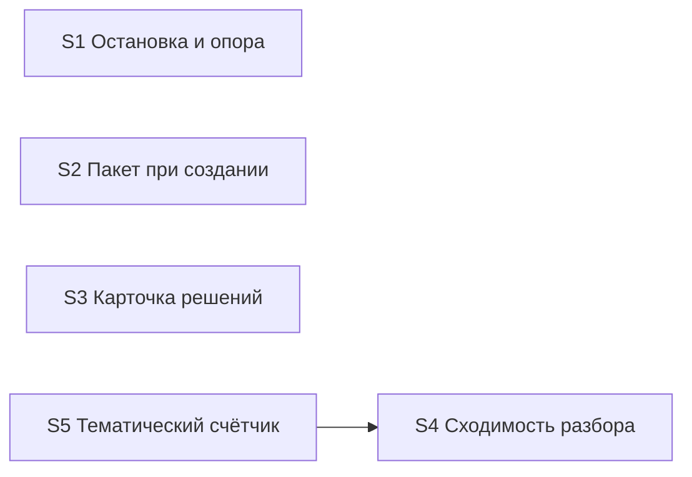

# Quality Control — verify-stop-repeat (прогон 2, декомпозиция design.md § Slices)

Дата: 2026-09-23. Контролёр: openspec-quality-controller.
Объект: предложенная декомпозиция из `design.md` секция `## Slices` (пять срезов S1–S5). `tasks.md` ещё не создан — критерии 5 (gate integrity), 5b (структура тела `S<N>.accept`) и 11 (User Task Contract по `S<N>.<M>`) оценены **проспективно** по метаданным срезов; их окончательная проверка — после генерации `tasks.md`.

Delta: changed_slices = all (структура пересобрана с одного среза на пять); reused_checks = none; deterministic_results = none. Все выводы — новые, переиспользованного скоупа нет.

Out of scope (по постановке): выполнимость на информационной базе 1С — не оценивалась (change правит только правила набора, markdown).

## Verdict

**WARNING**

Декомпозиция структурно здоровая: пять срезов с самостоятельными наблюдаемыми исходами, фундамент-среза без собственного исхода нет, граф зависимостей ацикличен, все 12 сценариев spec покрыты семантически. Блокирующих структурных дефектов (ложные границы, forward-приёмка) нет. Основные находки: перегруз Primary у S4 и S5 (второй обязательный journey внутри Primary — станет **CRITICAL** по критерию 10, если перенести в `tasks.md` без правки), два сценария spec не названы в `**Связь со spec:**`, и одна связка фикстур S1/S5, которую нужно развести формулировкой до генерации задач. Все правки — точечные, в метаданных срезов; пересборка структуры не требуется.

## Slice Summary

| Slice | Scenario (метаданные) | Tasks | Acceptance (Primary) | Dependencies | Gate |
|---|---|---|---|---|---|
| S1 Остановка и опора на прошлый проход | 5 сценариев spec | нет (tasks.md не создан) | стоп «оставить/переписать» на третьей правке без нового продуктового вопроса — 1 journey, наблюдаемый | нет | n/a (проспективно: 1×`S1.accept` + slice-gate) |
| S2 Пакет развилок при создании задачи | 1 сценарий | нет | одно сообщение-пакет из 2+ вопросов, без авторского ответа агента, первая проверка стартует чисто — 1 сквозной journey | нет | n/a |
| S3 Пакетная карточка решений в проверке | 1 сценарий | нет | одна карточка со всеми темами прогона, после пакета ответов повторов нет — 1 journey (зеркало сценария spec) | нет | n/a |
| S4 Сходимость разбора и точечный повтор | 2 сценария названы (факт. 3) | нет | **перегружен: 2 journey** (точечный прогон + обратный случай полного разбора) | нет | n/a |
| S5 Тематический счётчик петли | 1 сценарий назван (факт. 2) | нет | **перегружен: 2 journey** (позитивный реплей + негативный реплей) | S4 | n/a |

У всех пяти срезов поле `**Primary acceptance:**` присутствует — `primary-acceptance-missing` нет.

## Scenario Coverage

12 сценариев spec против метаданных срезов:

| Scenario (spec) | Covered by | Status |
|---|---|---|
| Вопросы пакетом при создании задачи | S2 Primary | OK |
| Все решения прогона одной карточкой | S3 Primary | OK |
| Разбор сходится | S4 Primary (исход «закрытые темы не возвращаются») | OK |
| Ответ не перезапускает всё | S4 Primary | OK |
| Смена подхода смотрится целиком | S4 Primary (хвост «правка контракта → полный разбор»), **не назван в Связь со spec S4** | WARNING (именование) |
| Стоп по теме | S5 Primary | OK |
| Здоровая конвергенция не стопится | S5 Primary (негативный случай), **не назван в Связь со spec S5** | WARNING (именование) |
| Прошлый контроль среза остаётся | S1 optional («Приёмка рядом») | OK |
| Уточнение той же темы | S1 optional | OK |
| Смена правила смотрится заново | S1 optional | OK |
| Стоп на третьей правке | S1 Primary | OK |
| Ответ человека сохраняется | S1 optional | OK, частично (см. алерт A5: ветка пакетной карточки — вне S1) |

Семантическое покрытие полное: непокрытых сценариев нет. Два расхождения — на уровне именования в `**Связь со spec:**` (алерты A3, A4).

## Dependency Graph

- Объявленные зависимости: только S5 → S4 (идентичность тем из номеров разрывов разбора). Дед существует, направление «назад», циклов нет — критерий 4 OK.
- Заявленная независимость S2, S3, S4 подтверждается на уровне приёмки: Primary каждого достижим без остальных. S1 также независим: механизм «продуктовый вопрос» существует в текущих правилах и без S3, стоп-вопрос S1 проверяем автономно.
- **Необъявленные пересечения поверхности** (не зависимости приёмки, но риск конфликтов правок): S1, S3, S4 и S5 все правят правило проверки (verify); S1 и S5 оба трогают счётчик правок/детектор петли (S1 — «правило подсчёта правок», S5 — «детектор петли в правиле срезов» с правками как запасным правилом). См. алерты A6, A7.

## Проверка по критериям

- **1. Scenario Coverage** — покрытие полное, два дефекта именования (A3, A4), одна частичная ветка (A5).
- **3. Slice Completeness** — перечни `**Файлы:**` каждого среза покрывают слои его Primary (change правит только markdown-правила; слоёв метаданных/форм/BSL нет по определению). Единственный пропуск — ветка «пакетная карточка не закрывает ответ» сценария «Ответ человека сохраняется»: файлы карточки — в S3, сценарий приписан S1 (A5).
- **5. Slice Gate Integrity** — n/a до tasks.md. Проспективное требование генерации: ровно один `S<N>.accept` + маркер `<!-- slice-gate -->` на каждый из пяти срезов.
- **5b. Acceptance Checklist Coverage** — `**Primary acceptance:**` есть у всех пяти; mandatory Primary sub-bullet проверить после генерации. Optional-чеклист S1 («Приёмка рядом») — правильный паттерн; для S4 и S5 optional-пункты появятся из ремедиации A1/A2.
- **8. Slice Verticality** (семантическая оценка, без ключевых слов) — **PASS у всех пяти**. «Пользователь» этого change — заказчик/оркестратор процесса постановки; все Primary описывают black-box исходы на этом уровне: видимое сообщение-пакет (S2), одна карточка с темами (S3), стоп-вопрос вместо продуктового (S1), точечный прогон, видимый в отчёте (S4), срабатывание/несрабатывание стопа на реплее журнала (S5). Заглядывания «внутрь» (диффы правил, grep текста правил как приёмка) нет ни в одном Primary.
- **8b. Self-Achievable Acceptance** — PASS. Дублей user-journey между соседними срезами нет; Primary S5 достижим задачами S5 при принятом S4 (зависимость объявлена и направлена назад); forward-зависимостей приёмки нет.
- **9. Foundation slice with gate** — PASS. Среза-фундамента нет: у каждого среза собственный наблюдаемый исход, S4 — не «API для S5», а самостоятельная сходимость разбора с собственным journey.
- **10. Acceptance Simplicity** — **нарушено у S4 и S5** (A1, A2): по два обязательных journey в одном Primary.
- **11. User Task Contract** — n/a до tasks.md (задач нет). Проспективный риск низкий: change без ИБ; в перечнях `**Файлы:**` runtime-обязанностей пользователя нет.
- **6. Rework Risk** — связка фикстур S1/S5 (A6) и общая поверхность файлов (A7).
- **Task Readability** — n/a до tasks.md; применить `task-readability.mdc` при генерации.

## Alerts

### A1. `acceptance-simplicity-overload` — Срез S4

- **Severity:** WARNING на стадии design; станет **CRITICAL** (критерий 10) при переносе в `tasks.md` без правки.
- **Evidence:** Primary S4 содержит два обязательных journey на одной фикстуре: (1) дополнение-только-ответ → точечный прогон + закрытые темы не возвращаются; (2) «правка контракта поведения на той же фикстуре снова даёт полный разбор» — это отдельный прогон и отдельный сценарий spec («Смена подхода смотрится целиком»).
- **Recommendation:** оставить mandatory Primary = journey (1) — точечный прогон после записи ответа, с исходом «закрытые темы не возвращаются» (покрывает «Ответ не перезапускает всё» и «Разбор сходится» одним прогоном). Обратный случай — optional sub-bullet `Scenario «Смена подхода смотрится целиком» (опционально)`.

### Remediation (auto-repair)
- alert: acceptance-simplicity-overload
- target: design.md § Slices, срез S4 (и генерация S4.accept в tasks.md)
- action: из `**Primary acceptance:**` S4 удалить хвост «правка контракта поведения на той же фикстуре снова даёт полный разбор»; добавить его optional-пунктом чеклиста `S4.accept` с именем `Scenario «Смена подхода смотрится целиком» (опционально)`; сценарий добавить в `**Связь со spec:**` S4 (см. A3).

### A2. `acceptance-simplicity-overload` — Срез S5

- **Severity:** WARNING на стадии design; станет **CRITICAL** (критерий 10) при переносе в `tasks.md` без правки.
- **Evidence:** Primary S5 — два реплея: позитивный («стоп на третьем раунде по теме часов») и негативный («журнал с тремя правками трёх разных тем стопа не даёт»). Негативный — самостоятельный journey и отдельный сценарий spec («Здоровая конвергенция не стопится»).
- **Recommendation:** mandatory Primary = позитивный реплей (стоп по теме на третьем раунде). Негативный — optional sub-bullet `Scenario «Здоровая конвергенция не стопится» (опционально)`.

### Remediation (auto-repair)
- alert: acceptance-simplicity-overload
- target: design.md § Slices, срез S5 (и генерация S5.accept в tasks.md)
- action: из `**Primary acceptance:**` S5 удалить фразу «журнал с тремя правками трёх разных тем стопа не даёт»; добавить optional-пункт `Scenario «Здоровая конвергенция не стопится» (опционально): реплей журнала с тремя правками трёх разных идентифицированных тем — тематический стоп не срабатывает`; сценарий добавить в `**Связь со spec:**` S5 (см. A4).

### A3. `accept-bullets-missing-scenario` (проспективно, метаданные) — Срез S4

- **Severity:** WARNING.
- **Evidence:** `**Связь со spec:**` S4 перечисляет «Разбор сходится», «Ответ не перезапускает всё»; сценарий spec «Смена подхода смотрится целиком» (тот же Requirement «Ответ не перезапускает всё») не назван ни в одном срезе, хотя семантически сидит в хвосте Primary S4.
- **Recommendation:** добавить «Смена подхода смотрится целиком» в `**Связь со spec:**` S4; в `S4.accept` — optional-пункт (совмещается с ремедиацией A1).

### Remediation (auto-repair)
- alert: accept-bullets-missing-scenario
- target: design.md § Slices, срез S4, поле `**Связь со spec:**`
- action: дополнить поле до «Разбор сходится», «Ответ не перезапускает всё», «Смена подхода смотрится целиком».

### A4. `accept-bullets-missing-scenario` (проспективно, метаданные) — Срез S5

- **Severity:** WARNING.
- **Evidence:** `**Связь со spec:**` S5 называет только «Стоп по теме»; сценарий «Здоровая конвергенция не стопится» (тот же Requirement) не назван нигде, хотя семантически сидит в негативной части Primary S5.
- **Recommendation:** добавить в `**Связь со spec:**` S5; в `S5.accept` — optional-пункт (совмещается с ремедиацией A2).

### Remediation (auto-repair)
- alert: accept-bullets-missing-scenario
- target: design.md § Slices, срез S5, поле `**Связь со spec:**`
- action: дополнить поле до «Стоп по теме», «Здоровая конвергенция не стопится».

### A5. Частичное покрытие ветки сценария «Ответ человека сохраняется»

- **Severity:** WARNING (частный случай Scenario Coverage / Slice Completeness).
- **Evidence:** сценарий spec имеет два триггера: «сработала остановка» **или** «собрана пакетная карточка». Он приписан S1 (optional «ответ заказчика сохраняется»), но файлы карточки решений — в S3 (`**Файлы:**` S3: правило проверки — карточка решений; правило дополнения — приём пакета). S1 проверит только ветку остановки; ветка «пакетирование не закрывает ответ» задачами и приёмкой S1 не наблюдаема.
- **Recommendation:** при генерации `tasks.md` добавить в `S3.accept` optional-пункт (или agent-задачу `S3.<M>` «верифицировать по тексту правила») на ветку «после сборки пакетной карточки ответ, меняющий правило, остаётся в журнале и не помечен закрытым». Формулировку optional-пункта S1 сузить до ветки остановки.

### Remediation (auto-repair)
- alert: accept-bullets-missing-scenario (ветка сценария)
- target: tasks.md (генерация), срезы S1 и S3
- action: в `S3.accept` добавить optional-пункт `Scenario «Ответ человека сохраняется» (опционально, ветка карточки): собрать пакетную карточку при имеющемся в журнале ответе, меняющем правило, — ответ остаётся в журнале и не закрыт`; в S1 оставить ветку остановки.

### A6. `rework-risk` — связка фикстур S1 и S5 (единица счётчика)

- **Severity:** WARNING (критерий 6).
- **Evidence:** Primary S1 — «журнал с тремя дополнениями по одному срезу → стоп»; негативный случай S5 — «три правки трёх разных тем стопа не дают». По design (решение 8) счёт правок с порогом три — запасное правило **для тем без идентичности**. Если фикстура S1 не оговаривает отсутствие тематической разметки, после принятия S5 исход приёмки S1 меняется (три правки трёх идентифицированных тем перестают давать стоп) — принятый срез S1 фактически потребует повторной приёмки.
- **Recommendation:** в `**Primary acceptance:**` S1 явно зафиксировать условие фикстуры: «три дополнения по одному срезу **без тематической разметки** (темы без идентичности)». Тогда приёмки S1 и S5 не пересекаются ни до, ни после S5. Зависимость S5→S1 объявлять не нужно — достаточно развести фикстуры.

### Remediation (auto-repair)
- alert: rework-risk (фикстурная связка)
- target: design.md § Slices, срез S1, поле `**Primary acceptance:**`
- action: дополнить формулировку: «на фикстуре или журнале с тремя дополнениями по одному срезу **без тематической идентичности тем** следующий проход задаёт только вопрос…».

### A7. `undeclared-surface-overlap` — общие файлы независимых срезов

- **Severity:** SUGGESTION.
- **Evidence:** S1, S3, S4, S5 все правят правило проверки (S1 — повторный проход; S3 — карточка решений; S4 — леджер и служебный отпечаток; S5 — чтение метрик); S3 и S4/S5 — правило дополнения. Независимость приёмки это не ломает (критерий 2 PASS), но параллельный apply срезов даст конфликты в одних файлах.
- **Recommendation:** применять срезы последовательно (порядок любой, S5 после S4); при генерации `tasks.md` не параллелить задачи разных срезов по общим файлам. Отдельной правки метаданных не требуется.

## Recommendations

**Автоматический фикс (внести в design.md § Slices до генерации tasks.md):**

1. S4: сузить Primary до одного journey; «Смена подхода смотрится целиком» → optional + в `**Связь со spec:**` (A1 + A3).
2. S5: сузить Primary до позитивного реплея; «Здоровая конвергенция не стопится» → optional + в `**Связь со spec:**` (A2 + A4).
3. S1: в Primary явно оговорить фикстуру «темы без идентичности» (A6).
4. При генерации `tasks.md`: optional-пункт ветки карточки сценария «Ответ человека сохраняется» в `S3.accept`, сужение формулировки в S1 (A5); на каждый срез — ровно один `S<N>.accept` с mandatory Primary sub-bullet и маркер `<!-- slice-gate -->`; формулировки задач — по `task-readability.mdc`.

**Decision required:** нет. Структура пяти срезов подтверждена: независимые исходы у S1–S4, объявленная обратная зависимость S5→S4, фундамент-срезов и forward-приёмок нет. Объединения или пересборки срезов не требуется.

**Повторный контроль:** после генерации `tasks.md` — стандартный QC-прогон по телу задач (критерии 5, 5b, 7, 11 в полном объёме); структурные критерии 1–4, 8, 8b, 9, 10 при неизменных названиях сценариев срезов можно опереть на этот отчёт.
