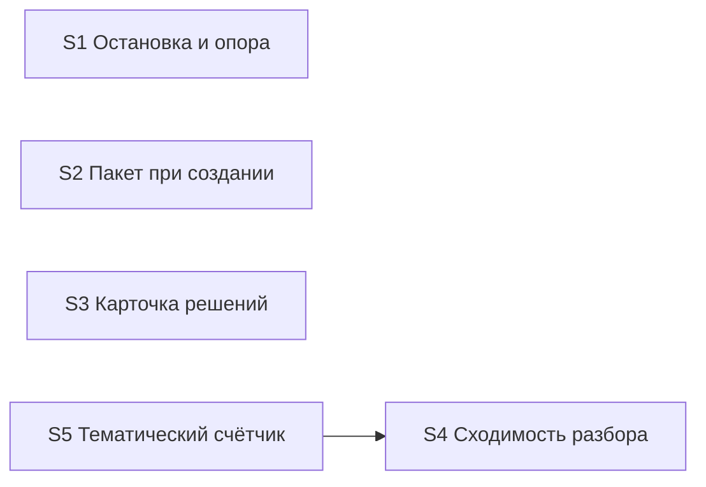

# Quality Control — verify-stop-repeat (прогон 3, tasks.md)

Дата: 2026-09-23. Контролёр: openspec-quality-controller.
Объект: `tasks.md` (пять срезов S1–S5) + `design.md` / `proposal.md` / `specs/verify-stop-repeat/spec.md`.

Delta: `changed_slices = all` (cache miss, первый полный прогон по tasks.md); `linked_scenarios` = все 12 сценариев spec; `deterministic_results` = none; `affected_contract_ids` = none; `reused_checks` = none. Все выводы — новые.

Файлы правил (целевые для задач): все семь путей существуют и непусты (байты: verify SKILL 80018; report-header 14411; vertical-slices 57816; new-change SKILL 57430; decision-block 13186; extend-change SKILL 48796; onec-code-architect 46288).

Mechanical / User Task Contract (вход оркестратора): чекбоксы есть; у всех пяти срезов ровно один `S<N>.accept` и закрывающий `<!-- slice-gate -->`; phase-gate нет; form_mode n/a; DENY-маркеров в `S<N>.<M>` нет; условных цепочек «после verify/стенда» нет. Подтверждено повторным чтением `tasks.md`.

Out of scope: исполняемость приёмки «прямо сейчас» на ИБ / наличие тестовых данных — не оценивались (change правит только markdown-правила; приёмка — фикстура/журнал/реплей).

## Verdict

**WARNING**

Структура срезов здоровая: пять независимых наблюдаемых исходов, gate integrity соблюдена, Primary у всех срезов один и black-box, self-achievable / foundation-with-gate / User Task Contract — без CRITICAL. Покрытие 12 сценариев spec полное. Замечания: чужой Scenario в `S3.accept`, непрозрачные заголовки `S*.accept`, риск коллизий правок общих файлов между срезами (уже отмечен в шапке tasks). Блокирующей пересборки срезов не требуется.

**Reused scope:** нет (первый прогон по tasks.md).  
**New findings:** A1–A3 ниже. Находки прогона 2 (`acceptance-simplicity-overload` S4/S5, пропуск имён в Связь) в текущем `tasks.md` **сняты** — не переиздаются.

## Slice Summary

| Slice | Scenario | Tasks | Acceptance | Dependencies | Gate |
|---|---|---|---|---|---|
| S1 Остановка и опора на прошлый проход | 5 (Стоп на 3-й + 4 optional) | S1.1–S1.5 | S1.accept (1 Primary + 4 optional = 5/5 Связь) | нет | `<!-- slice-gate -->` да |
| S2 Пакет развилок при создании задачи | 1 | S2.1–S2.4 | S2.accept (1/1) | нет | да |
| S3 Пакетная карточка решений | 1 (+ чужой optional, см. A1) | S3.1–S3.2 | S3.accept (1 Primary + 1 foreign optional) | нет | да |
| S4 Сходимость разбора и точечный повтор | 3 | S4.1–S4.4 | S4.accept (1 Primary + 1 optional; «Разбор сходится» в Primary Then) | нет | да |
| S5 Тематический счётчик петли | 2 | S5.1–S5.3 | S5.accept (1 Primary + 1 optional = 2/2) | S4 | да |

## Scenario Coverage

| Scenario | Covered by | Status |
|---|---|---|
| Вопросы пакетом при создании задачи | S2 Primary / S2.accept | OK |
| Все решения прогона одной карточкой | S3 Primary / S3.accept | OK |
| Разбор сходится | S4 Primary (Then: закрытые темы не возвращаются) + S4.1, S4.2 | OK |
| Ответ не перезапускает всё | S4 Primary | OK |
| Смена подхода смотрится целиком | S4.accept optional | OK |
| Стоп по теме | S5 Primary | OK |
| Здоровая конвергенция не стопится | S5.accept optional | OK |
| Прошлый контроль среза остаётся | S1.accept optional | OK |
| Уточнение той же темы | S1.accept optional | OK |
| Смена правила смотрится заново | S1.accept optional | OK |
| Стоп на третьей правке | S1 Primary | OK |
| Ответ человека сохраняется | S1.accept optional (ветка остановки); также чужой optional в S3 (A1) | OK по покрытию; WARNING по размещению |

Непокрытых сценариев spec нет (`accept-bullets-missing-scenario` по отсутствию покрытия — нет).

## Dependency Graph

- Объявлено: только `S5 → S4`. Дед существует, направление назад, циклов нет.
- Forward-зависимостей приёмки нет: Primary каждого среза не дублирует journey следующего.
- Необъявленные пересечения **файлов** (не рёбра приёмки): `openspec-verify-change/SKILL.md` — S1, S3, S4, S5; `vertical-slices.mdc` — S1, S5; `openspec-extend-change/SKILL.md` — S3, S5. Шапка tasks уже запрещает параллель между срезами (A3).

## Проверка по критериям

1. **Scenario Coverage** — PASS (12/12). Размещение ветки «пакетная карточка» сценария «Ответ человека сохраняется» — A1.
2. **Slice Independence** — PASS. Приёмка S1–S4 без следующих; S5 только после S4.
3. **Slice Completeness** — PASS для правил-kit: задачи каждого среза правят файлы, нужные его Primary (verify / new / extend / architect / templates / vertical-slices). Слоёв метаданных/форм/BSL нет по Non-Goals.
4. **Slice Dependency Graph** — PASS (см. граф).
5. **Slice Gate Integrity** — PASS: ровно один `S<N>.accept` + `<!-- slice-gate -->` на срез; legacy `T<M>` нет.
5b. **Acceptance Checklist Coverage** — PASS по Primary metadata + mandatory Primary sub-bullet у всех пяти. Имена в Связь согласованы с optional (S4/S5 — ремедиация прогона 2 применена). A1: foreign bullet в S3.
6. **Rework Risk** — WARNING/SUGGESTION: общая поверхность файлов (A3); иначе сценарии не дублируют Primary между срезами.
8. **Slice Verticality** — PASS у всех. Primary — наблюдаемые исходы процесса (вопрос в чате, пакет, карточка, точечный прогон, стоп на реплее), не programmatic-only «вызвать функцию / код-ревью API».
8b. **Self-Achievable Acceptance** — PASS. Дублей Primary соседних срезов нет; S5 достижим задачами S5 при принятом S4 (объявлено).
9. **Foundation slice with gate** — PASS. Нет среза с programmatic-only accept + consumer UX-срезом.
10. **Acceptance Simplicity** — PASS. По одному mandatory Primary на срез; обратные случаи S4/S5 вынесены в optional (в отличие от прогона 2).
11. **User Task Contract** — PASS. В `S<N>.<M>` нет runtime-spike / условных цепочек после verify; приёмка — на границе среза по фикстуре/журналу.
**Task Readability** — WARNING: заголовки `S*.accept` без бизнес-результата (A2). Рабочие задачи S*.M: глагол + файл + результат + (D#) — OK.

## Alerts

### A1. `accept-bullet-foreign-scenario` — Срез S3

- **Severity:** WARNING
- **Affected:** `S3.accept`, optional bullet Scenario «Ответ человека сохраняется»
- **Evidence:** `**Связь со spec:**` S3 содержит только «Все решения прогона одной карточкой». Scenario «Ответ человека сохраняется» заявлен в Связь S1 и описан в spec отдельным Requirement. Правило среза 6 / критерий 5b: сценарии другого среза в чеклист не включать.
- **Recommendation:** убрать optional из `S3.accept`. Ветку «пакетная карточка не закрывает ответ» либо оставить только в `S1.accept` (расширить формулировку optional до «остановка или пакет»), либо добавить agent-задачу `S3.<M>` «верифицировать по тексту правил: пакет/стоп не помечает ответ закрытым» без Scenario-bullet чужого среза. Если ветка должна быть частью S3 — добавить Scenario в `**Связь со spec:**` S3 и снять дубль из S1 (decision: один владелец сценария).

### Remediation (auto-repair)
- alert: accept-bullet-foreign-scenario
- target: tasks.md, срез S3, тело `S3.accept`
- action: удалить строку `- Scenario «Ответ человека сохраняется» (опционально, ветка карточки): …`. При необходимости добавить в S3 перед accept задачу вида: «В `.cursor/skills/openspec-verify-change/SKILL.md` и `.cursor/skills/openspec-extend-change/SKILL.md` верифицировать по тексту: сбор пакетной карточки и запись пакета ответов не стирают и не помечают закрытым ответ, меняющий правило (D6 / Requirement «Ответ человека сохраняется»)». В `S1.accept` optional «Ответ человека сохраняется» оставить (или расширить текст до «остановка или пакет»).

### A2. `task-opaque-title` — `S1.accept`…`S5.accept`

- **Severity:** WARNING
- **Affected:** заголовки `- [ ] S<N>.accept Приёмка среза S<N>`
- **Evidence:** `task-readability.mdc` (исключение для accept): заголовок SHALL быть `Принять срез S<N> «<имя>» — <бизнес-результат>:`, не голое «Приёмка среза».
- **Recommendation:** переименовать по шаблону с именем среза и однофразовым исходом (можно взять из Primary / slice-gate).

### Remediation (auto-repair)
- alert: task-opaque-title
- target: tasks.md, все `S1.accept`…`S5.accept`
- action: заменить заголовки, например:
  - S1: `Принять срез S1 «Остановка и опора на прошлый проход» — на трёх правках без тематической идентичности только вопрос «оставить или переписать»:`
  - S2: `Принять срез S2 «Пакет развилок при создании задачи» — одно сообщение-пакет без авторских ответов агента:`
  - S3: `Принять срез S3 «Пакетная карточка решений в проверке» — одна карточка со всеми темами, без повторов после пакета:`
  - S4: `Принять срез S4 «Сходимость разбора и точечный повтор» — после записи ответа прогон точечный, закрытые темы не возвращаются:`
  - S5: `Принять срез S5 «Тематический счётчик петли» — стоп на третьем раунде по теме часов, не на пятой правке:`

### A3. Rework risk — общая поверхность файлов (SUGGESTION)

- **Severity:** SUGGESTION
- **Affected:** S1, S3, S4, S5 (verify SKILL); S1+S5 (vertical-slices); S3+S5 (extend SKILL)
- **Evidence:** шапка tasks уже требует последовательный apply (QC A7 прогона 2). Структурной зависимости приёмки нет, но конфликт правок одного файла между срезами реален.
- **Recommendation:** сохранить последовательный apply по срезам; при extend/fix не открывать параллельные правки одного SKILL из разных срезов. Дополнительных задач не требуется.

## Recommendations

### Automatic fix
- A1: удалить foreign optional из `S3.accept`; при нужде — agent static-задача в S3.
- A2: переименовать пять заголовков `S*.accept` по шаблону бизнес-результата.

### Decision required
- Владелец Scenario «Ответ человека сохраняется»: только S1 (рекомендуется) vs явный перенос ветки карточки в Связь S3 с снятием из S1. Не оставлять дубль в двух accept.

### Не требуется
- Объединение срезов, перепись Primary, правка графа зависимостей, миграция legacy `T<M>`.
- Повторная декомпозиция design § Slices: прогон 2 по simplicity S4/S5 уже отражён в tasks.md.
