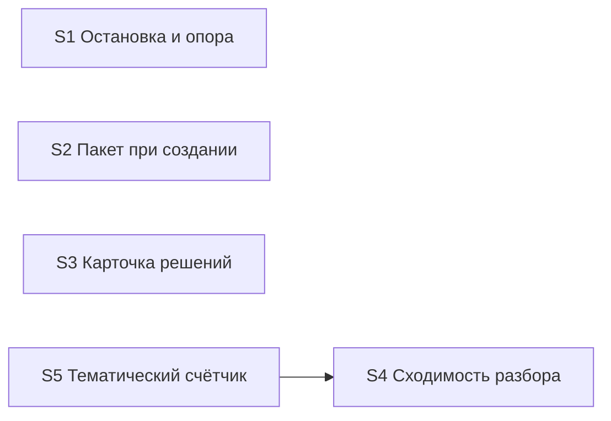

# Quality Control — verify-stop-repeat (прогон 4)

Дата: 2026-09-23. Контролёр: openspec-quality-controller.
Объект: `tasks.md` (пять срезов S1–S5) + `design.md` / `proposal.md` / `specs/verify-stop-repeat/spec.md`.

Delta: `changed_slices = all` (после дописки design/spec/tasks; кэш прогонов 1–3 **не** переиспользован); `linked_scenarios` = все сценарии spec, включая новый «Неподтверждённое закрытие открывает тему» (13); `deterministic_results` = none; `affected_contract_ids` = none; `reused_checks` = none. Все выводы — новые по текущим артефактам.

Файлы правил (целевые для задач): все семь путей существуют и непусты (байты: verify SKILL 80018; report-header 14411; vertical-slices 57816; new-change SKILL 57430; decision-block 13186; extend-change SKILL 48796; onec-code-architect 46288).

Mechanical / User Task Contract: чекбоксы `S<N>.<M>` на месте; у всех пяти срезов ровно один `S<N>.accept` и закрывающий `<!-- slice-gate -->`; `<!-- phase-gate -->` нет; `form_mode: n/a`; DENY-маркеров (`тестовой ИБ`, `на стенде`, `runtime-verify`, `спайк`, `в консоли`, `отладчик`, `эмулировать вызов`, `вызвать API`) и цепочек «после verify / после стенда» в `S<N>.<M>` — нет. Подтверждено повторным чтением `tasks.md`.

Out of scope: исполняемость приёмки «прямо сейчас» на ИБ / наличие тестовых данных — не оценивались (change правит только markdown-правила; приёмка — фикстура/журнал/реплей).

## Verdict

**OK**

Структура срезов здоровая: пять независимых наблюдаемых исходов, gate integrity соблюдена, у каждого среза один mandatory Primary (black-box), критерии 8b / 9 / 10 / 11 — без CRITICAL/WARNING. Покрытие 13 сценариев spec полное. Находки прогона 3 (`accept-bullet-foreign-scenario` в S3, `task-opaque-title` у accept) в текущем `tasks.md` **сняты**. Остаётся только SUGGESTION о последовательном apply из‑за общей поверхности файлов.

**Reused scope:** нет.  
**New findings:** A1 (SUGGESTION) ниже. Снятые алерты прогона 3 не переиздаются.

## Slice Summary

| Slice | Scenario | Tasks | Acceptance | Dependencies | Gate |
|---|---|---|---|---|---|
| S1 Остановка и опора на прошлый проход | 5 (Primary «Стоп на третьей правке» + 4 optional) | S1.1–S1.5 | S1.accept (1 Primary + 4 optional = 5/5 Связь) | нет | `<!-- slice-gate -->` да |
| S2 Пакет развилок при создании задачи | 1 | S2.1–S2.5 | S2.accept (1/1) | нет | да |
| S3 Пакетная карточка решений в проверке | 1 | S3.1–S3.2 | S3.accept (1/1; чужого optional нет) | нет | да |
| S4 Сходимость разбора и точечный повтор | 4 | S4.1–S4.4 | S4.accept (1 Primary + 2 optional; «Разбор сходится» и «Ответ не перезапускает всё» в Primary) | нет | да |
| S5 Тематический счётчик петли | 2 | S5.1–S5.3 | S5.accept (1 Primary + 1 optional = 2/2) | S4 | да |

## Scenario Coverage

| Scenario | Covered by | Status |
|---|---|---|
| Вопросы пакетом при создании задачи | S2 Primary / S2.accept | OK |
| Все решения прогона одной карточкой | S3 Primary / S3.accept | OK |
| Разбор сходится | S4 Primary (Then: закрытые темы не возвращаются) + S4.1, S4.2 | OK |
| Неподтверждённое закрытие открывает тему | S4.accept optional | OK |
| Ответ не перезапускает всё | S4 Primary | OK |
| Смена подхода смотрится целиком | S4.accept optional | OK |
| Стоп по теме | S5 Primary | OK |
| Здоровая конвергенция не стопится | S5.accept optional | OK |
| Прошлый контроль среза остаётся | S1.accept optional | OK |
| Уточнение той же темы | S1.accept optional | OK |
| Смена правила смотрится заново | S1.accept optional | OK |
| Стоп на третьей правке | S1 Primary | OK |
| Ответ человека сохраняется | S1.accept optional (ветка остановки) | OK |

Непокрытых сценариев spec нет (`accept-bullets-missing-scenario` — нет). Foreign-сценариев в accept — нет.

## Dependency Graph

- Объявлено: только `S5 → S4`. Дед существует, направление назад, циклов нет.
- Forward-зависимостей приёмки нет: Primary соседних срезов не дублируют один user-journey.
- Необъявленные пересечения **файлов** (не рёбра приёмки): `openspec-verify-change/SKILL.md` — S1, S3, S4, S5; `vertical-slices.mdc` — S1, S5; `openspec-extend-change/SKILL.md` — S3, S5; `onec-code-architect.md` — S2, S4. Шапка tasks запрещает параллель между срезами (A1).

## Проверка по критериям

1. **Scenario Coverage** — PASS (13/13). Новый Scenario «Неподтверждённое закрытие открывает тему» — optional в `S4.accept`.
2. **Slice Independence** — PASS. Приёмка S1–S4 без следующих; S5 только после S4.
3. **Slice Completeness** — PASS для правил-kit: задачи каждого среза правят файлы, нужные его Primary (verify / new / extend / architect / templates / vertical-slices). Слоёв метаданных/форм/BSL нет по Non-Goals. S2.5 закрывает метку продуктовой развилки у архитектора.
4. **Slice Dependency Graph** — PASS (см. граф).
5. **Slice Gate Integrity** — PASS: ровно один `S<N>.accept` + `<!-- slice-gate -->` на срез; legacy `T<M>` нет.
5b. **Acceptance Checklist Coverage** — PASS: у всех пяти есть `**Primary acceptance:**` и mandatory `**Primary (обязательно):**`; foreign bullets нет; покрытие Scenarios — Primary / optional / `S<N>.<M>`.
6. **Rework Risk** — SUGGESTION: общая поверхность файлов (A1); сценарии Primary между срезами не дублируются.
8. **Slice Verticality** — PASS у всех. Primary — наблюдаемые исходы процесса (вопрос в чате, пакет, карточка, точечный прогон, стоп на реплее), не programmatic-only.
8b. **Self-Achievable Acceptance** — PASS. Дублей Primary соседних срезов нет; S5 достижим задачами S5 при принятом S4 (объявлено).
9. **Foundation slice with gate** — PASS. Нет среза с programmatic-only accept + consumer UX-срезом.
10. **Acceptance Simplicity** — PASS. По одному mandatory Primary на срез; обратные случаи — optional.
11. **User Task Contract** — PASS. В `S<N>.<M>` нет runtime-spike / условных цепочек после verify; приёмка — на границе среза по фикстуре/журналу/реплею.
**Task Readability** — PASS. Заголовки `S*.accept` в форме `Принять срез S<N> «…» — <бизнес-результат>:`. Рабочие `S*.M`: глагол + файл + результат + (D#) — OK.

## Alerts

### A1. Rework risk — общая поверхность файлов (SUGGESTION)

- **Severity:** SUGGESTION
- **Affected:** S1, S3, S4, S5 (verify SKILL); S1+S5 (vertical-slices); S3+S5 (extend SKILL); S2+S4 (onec-code-architect)
- **Evidence:** шапка `tasks.md` уже требует последовательный apply между срезами. Структурной зависимости приёмки нет, конфликт правок одного файла при параллели реален.
- **Recommendation:** сохранить последовательный apply по срезам; при extend/fix не открывать параллельные правки одного SKILL/правила из разных срезов. Дополнительных задач не требуется.

## Recommendations

### Automatic fix

Нет открытых CRITICAL/WARNING, требующих auto-repair.

### Decision required

Нет. Объединение срезов / перепись Primary не нужны.

### Already resolved vs прогон 3

- `accept-bullet-foreign-scenario` (S3 optional «Ответ человека сохраняется») — удалён из `S3.accept`.
- `task-opaque-title` (заголовки accept) — переименованы по шаблону task-readability.
- Новый Scenario «Неподтверждённое закрытие открывает тему» — покрыт optional в S4 без нарушения simplicity.

## Scope notes

- **Reused checks:** none.
- **Invalidated / new:** полный пересчёт критериев 1–6, 8, 8b, 9–11 по текущим design/spec/tasks.
