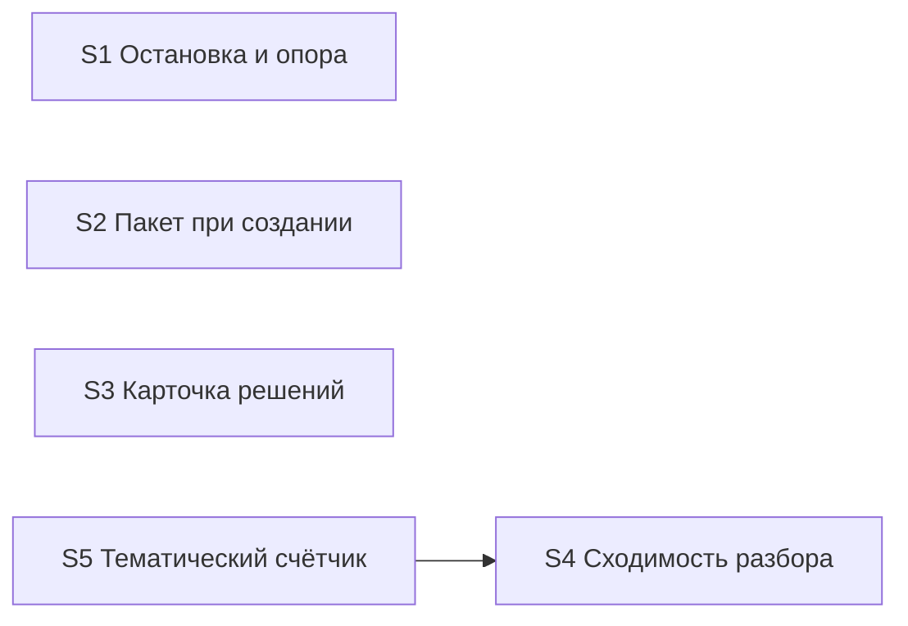

# Quality Control — verify-stop-repeat (прогон 2026-09-24)

Дата: 2026-09-24. Контролёр: openspec-quality-controller.
Объект: `tasks.md` (инвалидирован только срез S3) + `design.md` / `proposal.md` / `specs/verify-stop-repeat/spec.md`.

Delta: `changed_slices = S3` (заголовок Scenario «Вторая тема остаётся на карточке»; задача S3.3 перед S3.accept; optional-буллет в S3.accept; «Связь со spec» дополнена этим названием; Primary S3 без изменений); `linked_scenarios` = «Все решения прогона одной карточкой», «Вторая тема остаётся на карточке»; `deterministic_results` = сценарий есть в spec, design S3 и optional S3.accept; `affected_contract_ids` = none; `reused_checks` = S1, S2, S4, S5 из `reports/quality-control-2026-09-23-4.md` (вердикт OK).

Mechanical / User Task Contract (оркестратор verify 2.1a / 5.1): DENY-маркеров и цепочек «после verify / после стенда» в `S\d+.\d+` — нет; manual config checklist — нет. Подтверждено входным evidence; для S3.3 дополнительно: правка SKILL/шаблона агентом, без runtime-spike.

Out of scope: исполняемость приёмки «прямо сейчас» на ИБ / тестовые данные.

## Verdict

**OK**

Инвалидированный срез S3 остаётся когерентным: новый Scenario «Вторая тема остаётся на карточке» принадлежит S3 (не чужой), покрыт optional-буллетом и задачей S3.3, не перегружает mandatory-чеклист (один Primary). Primary S3 достижим задачами S3.1–S3.3. Критерии 1–6, 8, 8b, 9–11 для S3 — PASS. S1/S2/S4/S5 — reused OK. Детерминированное покрытие всего spec: 14/14.

**Reused scope:** S1, S2, S4, S5 — критерии и вердикты из `quality-control-2026-09-23-4.md` (OK); упорядоченные названия сценариев и текст обязательного пункта приёмки этих срезов не менялись.  
**New findings:** полный пересчёт критериев для S3 + сверка покрытия 14 сценариев spec. Новых CRITICAL/WARNING нет. SUGGESTION A1 (общая поверхность файлов) — reused из прогона 4; A2 — лёгкая устарелость поля «Приёмка» у S3.

## Slice Summary

| Slice | Scenario | Tasks | Acceptance | Dependencies | Gate | Scope |
|---|---|---|---|---|---|---|
| S1 Остановка и опора на прошлый проход | 5 | S1.1–S1.5 | S1.accept (1+4 = 5/5) | нет | да | **reused** OK |
| S2 Пакет развилок при создании задачи | 1 | S2.1–S2.5 | S2.accept (1/1) | нет | да | **reused** OK |
| S3 Пакетная карточка решений в проверке | 2 | S3.1–S3.3 | S3.accept (1 Primary + 1 optional = 2/2 Связь) | нет | да | **new** OK |
| S4 Сходимость разбора и точечный повтор | 4 | S4.1–S4.4 | S4.accept (1+2; 2 в Primary) | нет | да | **reused** OK |
| S5 Тематический счётчик петли | 2 | S5.1–S5.3 | S5.accept (1+1 = 2/2) | S4 | да | **reused** OK |

## Scenario Coverage

| Scenario | Covered by | Status |
|---|---|---|
| Вопросы пакетом при создании задачи | S2 Primary / S2.accept | OK (reused) |
| Все решения прогона одной карточкой | S3 Primary / S3.accept | OK (**linked**, S3) |
| Вторая тема остаётся на карточке | S3.accept optional + S3.3 | OK (**new**, S3) |
| Разбор сходится | S4 Primary + S4.1, S4.2 | OK (reused) |
| Неподтверждённое закрытие открывает тему | S4.accept optional | OK (reused) |
| Ответ не перезапускает всё | S4 Primary | OK (reused) |
| Смена подхода смотрится целиком | S4.accept optional | OK (reused) |
| Стоп по теме | S5 Primary | OK (reused) |
| Здоровая конвергенция не стопится | S5.accept optional | OK (reused) |
| Прошлый контроль среза остаётся | S1.accept optional | OK (reused) |
| Уточнение той же темы | S1.accept optional | OK (reused) |
| Смена правила смотрится заново | S1.accept optional | OK (reused) |
| Стоп на третьей правке | S1 Primary | OK (reused) |
| Ответ человека сохраняется | S1.accept optional | OK (reused) |

Непокрытых сценариев: 0/14. Foreign-сценариев в accept: нет (`accept-bullet-foreign-scenario` — нет).

## Dependency Graph

- Объявлено: только `S5 → S4` (reused). S3: `**Зависимости:** нет`.
- Циклов нет. Forward-зависимости приёмки S3 от S4/S5 нет.
- Необъявленные пересечения файлов (не рёбра приёмки): `openspec-verify-change/SKILL.md` — S1, S3, S4, S5; `openspec-extend-change/SKILL.md` — S3, S5. Шапка tasks запрещает параллель (A1).

## Проверка по критериям (S3 — new; S1/S2/S4/S5 — reused)

### S3 (invalidated)

1. **Scenario Coverage** — PASS. Оба linked Scenario из Связь S3 покрыты: Primary («Все решения…») и optional + S3.3 («Вторая тема…»).
2. **Slice Independence** — PASS. Приёмка S3 не требует S4+.
3. **Slice Completeness** — PASS для rules-kit: S3.1 (карточка в verify SKILL), S3.2 (пакет ответов в extend), S3.3 (запрет снятия темы в SKILL + шаблон карточки) закрывают слои Primary и нового Scenario. Метаданные/формы/BSL не требуются (Non-Goals change).
4. **Slice Dependency Graph** — PASS для рёбер, касающихся S3 (нет исходящих/входящих объявленных зависимостей приёмки).
5. **Slice Gate Integrity** — PASS: ровно один `S3.accept` + `<!-- slice-gate -->`; legacy `T<M>` нет.
5b. **Acceptance Checklist Coverage** — PASS:
   - `**Primary acceptance:**` и `**Primary (обязательно):**` на месте → нет `primary-acceptance-missing` / `accept-checklist-empty`.
   - «Вторая тема остаётся на карточке» — в Связь S3 и в optional accept → не `accept-bullets-missing-scenario`, не `accept-bullet-foreign-scenario`.
6. **Rework Risk** — SUGGESTION A1 (общая поверхность verify/extend SKILL с другими срезами) — без усиления после добавления S3.3.
8. **Slice Verticality** — PASS. Mandatory Primary — black-box: заказчик видит одну карточку с тремя вопросами и отсутствие повторов после пакета ответов; не programmatic-only.
8b. **Self-Achievable Acceptance** — PASS. Primary S3 = «три нумерованных вопроса на одной карточке + нет повторов после пакета» достижим силами S3.1 (перечень тем), S3.2 (приём пакета), S3.3 (запрет снятия известной темы формулировкой «дописать вместе»). Дубля Primary с S4 нет; слой для карточки не вынесен в более поздний срез. Новый Scenario не делает Primary чужим/недостижимым — наоборот, S3.3 усиливает внутрисрезовую достижимость кейса «две темы на карточке».
9. **Foundation slice with gate** — PASS. S3.accept — UX-journey, не foundation-only API.
10. **Acceptance Simplicity** — PASS. Ровно один mandatory black-box journey; «Вторая тема…» помечен «(опционально)» → нет `acceptance-simplicity-overload`.
11. **User Task Contract** — PASS. S3.3 — агентская правка `.cursor/skills/openspec-verify-change/SKILL.md` и шаблона карточки; DENY-маркеров / user-spike нет.

**Task Readability (S3.3):** PASS. «Запретить в `…/SKILL.md` и в шаблоне карточки остановки … (D6)» — глагол + файлы + результат + опорная ссылка.

### S1, S2, S4, S5 (reused)

Критерии 1–6, 8, 8b, 9–11 и readability — **PASS / OK** по `quality-control-2026-09-23-4.md`. Полный пересчёт не выполнялся. Детерминированная сверка названий Scenario этих срезов против текущего spec — без расхождений (новый Scenario только у S3).

## Alerts

### A1. Rework risk — общая поверхность файлов (SUGGESTION) — reused

- **Severity:** SUGGESTION
- **Affected:** S1, S3, S4, S5 (verify SKILL); S3+S5 (extend SKILL); прочие пересечения — см. прогон 4
- **Evidence:** S3.3 дополнительно правит verify SKILL / шаблон карточки на той же поверхности, что S1/S4/S5.
- **Recommendation:** сохранять последовательный apply по срезам; не параллелить правки одного SKILL из разных срезов.

### A2. Устаревшее поле «Приёмка» у S3 (SUGGESTION)

- **Severity:** SUGGESTION
- **Affected:** S3 metadata `**Приёмка:**`
- **Evidence:** текст «дополнительных сценариев рядом нет», при этом в Связь и в `S3.accept` есть optional Scenario «Вторая тема остаётся на карточке». На покрытие и simplicity не влияет (canonical — Связь + accept).
- **Recommendation (не auto-repair CRITICAL):** при следующем extend/правке metadata выровнять «Приёмка» под наличие optional-сценария (или оставить «—» без утверждения «сценариев нет»).

## Recommendations

### Automatic fix

Нет CRITICAL/WARNING, требующих auto-repair (`primary-acceptance-missing`, `accept-bullets-missing-scenario`, `acceptance-simplicity-overload`, `slice-not-vertical`, `slice-foundation-with-gate`, `user-task-contract-violation` — не сработали).

### Decision required

Нет. Объединение срезов / перепись Primary S3 не нужны (`slice-accept-not-self-achievable` — нет).

## Scope notes

- **Reused checks:** S1, S2, S4, S5 @ `quality-control-2026-09-23-4.md` (OK).
- **Invalidated / new:** S3 + linked scenarios + покрытие 14 сценариев spec.
- **Особые проверки delta:** Primary S3 self-achievable — да; новый Scenario не чужой для S3 — да; чеклист не перегружен (1 mandatory) — да.
