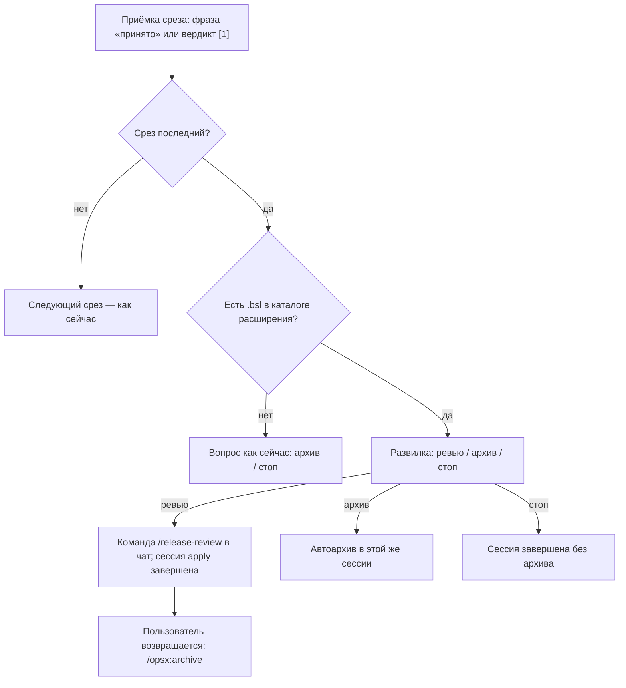

# Архитектура: развилка «ревью или архив» после приёмки последнего среза

**Исход:** выбран один хук — единая развилка из трёх слов (`ревью` / `архив` / `стоп`) на событии «последний срез принят», с рекомендованным порядком «сначала ревью, потом архив»; автоархив по слову `архив` сохраняется без изменений; `/release-review` только предлагается командой в чат, не запускается внутри apply. Правки — два места в `.cursor/skills/openspec-apply-change/SKILL.md` (ручная приёмка и тонкая карточка «Реализация завершена») плюс одна строка в памятке ревью. Новых команд, файлов и детекторов не появляется. ADR не требуется.

## Задача

В момент, когда разработчик написал «принято» на последнем срезе, границы ЗНИ ещё известны (задачи `[x]` с путями, `reports/code-map.md`, архитектурные отчёты), а предрелизное ревью ещё не проведено. Сегодня в этой точке пользователю предлагается только архив. Нужно предложить развилку «предрелизное ревью или архив» с ясным порядком, не ломая существующий автоархив и контракт чата.

## Сложность

Medium (правки в 1 скилле + 1 памятка; влияние на UX двух путей приёмки).

## KB references

База знаний в этом репозитории отсутствует: индекса `openspec/knowledge/_index.yaml` нет, таксономии нет, KB Discovery выполнен без совпадений. Ни один KB-факт не использован и не оспорен; секция `## Knowledge conflicts` не требуется.

## Проверка фактов из промпта (Read/Grep по файлам)

| № | Факт из промпта | Статус | Точная привязка |
|---|---|---|---|
| 1 | Ручная приёмка последнего среза: вопрос «Архивировать ЗНИ? … `архив` / `стоп`», ход без автоархива до ответа; `архив` → шаги archive в той же сессии | Подтверждён | `.cursor/skills/openspec-apply-change/SKILL.md:415–423` (шаги 1–7 блока «Manual acceptance shortcut»; вопрос — строка 422, автоархив — строка 423) |
| 2 | Критерий «последний срез»: нет следующего заголовка `# Срез S<K>:` с K > N | Подтверждён | там же, строка 420 |
| 3 | Тонкая карточка `final`: строка «Ready to archive: `/opsx:archive <change-name>`» | Подтверждён | там же, строка 528; в скелете файла handoff — маркер-комментарий строка 590; таблица вариантов — строка 550 |
| 4 | Проверка постановки после apply: единственный следующий шаг — `/opsx:archive` | Подтверждён | `.cursor/skills/openspec-verify-change/templates/chat-summary.md:9–12` (таблица `verify_mode` → `post-apply` = `/opsx:archive <change-name>`) |
| 5 | `/release-review` принимает `<change>` и `<расширение> <change>`; change-scoped резолв — шаг 1.3a с приоритетом источников | Подтверждён | `.cursor/commands/release-review.md:16–20`; `.cursor/skills/review/SKILL.md:50–58` (таблица release-режима, строка «Только change без расширения» — cfe выводится из путей) и `90–107` (резолвер 1.3a, источники: `reports/architecture-*.md` → `tasks.md` `[x]` → `design.md` → git fallback) |
| 6 | Apply-reviewer — не замена предрелиза | Подтверждён | `.cursor/docs/review-guide.md:9–15` |

### Дополнительно найдено (не было в промпте, влияет на решение)

- **Второй путь приёмки последнего среза.** Кроме фразы «принято» есть структурный вердикт при возврате в сессию: `SKILL.md:152–165`, вариант `[1] Принят` → «отметить приёмку, **перейти к задачам S<N+1>**». Для последнего среза `S<N+1>` не существует, поэтому ход уходит в шаг 7 и печатается карточка `final` со строкой «Ready to archive» (строка 528). **Вывод: два разных финала одного и того же события существуют уже сегодня** — на одном пути вопрос с автоархивом, на другом строка с командой. Это прямо закрывает пункт «трогать ли карточку `final`»: трогать обязательно, иначе развилка появится только на одном из двух равновероятных путей.
- **`/opsx:extend` отказывает архивированной ЗНИ.** `.cursor/skills/openspec-extend-change/SKILL.md:184`: «Проверить, что `openspec/changes/<name>/` существует и **не находится в `archive/`**». Это верифицированное обоснование порядка «сначала ревью»: штатный follow-up предрелиза при архитектурных замечаниях — `/opsx:extend <change> --from-review <path>` (`.cursor/skills/review/SKILL.md:500`, `654–655`) — после архива недоступен, потребуется новая ЗНИ.
- **Технически ревью после архива работает.** `.cursor/skills/review/SKILL.md:81` принимает `.../archive/<name>` как вход. Значит порядок — рекомендация, а не техническая необходимость; жёсткий гейт не обоснован.
- **Детектор «есть ли BSL» в apply уже вычисляется.** `SKILL.md:120–128`, переменная `marker_scope` (Grep `tasks.md` и `design.md` на пути `src/.../*.bsl`, значения `cf-ea` / `cfe` / `mixed`; пустое значение = маркеры не применяются, kit-only). Новый детектор не нужен.
- **Прецедент условного вопроса «только если будет BSL»** уже зафиксирован спекой: `openspec/specs/sequential-gate-questions/spec.md:29–40` (вопрос маркера автора задаётся только при наличии `.bsl`). Наша условность — тот же паттерн.
- **Ни одна main-спека не фиксирует эти две строки.** Grep по `openspec/specs/**` совпадений с «Ready to archive» / «Архивировать ЗНИ?» не дал: отменяемого архивного контракта нет.

## Existing Mechanisms

| Механизм | Где | Как используется в решении |
|---|---|---|
| Вопрос архива + автоархив в сессии apply | `openspec-apply-change/SKILL.md:422–423` | **Расширяется**, не заменяется: сохраняем слово `архив` и автозапуск шагов archive в той же сессии; добавляем третий ответ |
| Карточка `final` «Реализация завершена» | там же, `528`, `550`, `590` | Ветка «есть BSL расширения» печатает ту же развилку вместо строки «Ready to archive» |
| Команда `/release-review <change>` | `.cursor/commands/release-review.md:20` | Предлагается как готовая user-action команда; аргумент — только имя ЗНИ |
| Change-scoped резолвер 1.3a + Scope Preview | `.cursor/skills/review/SKILL.md:90–107` | Резолв cfe и списка файлов остаётся **на стороне review**; apply ничего не резолвит и не дублирует |
| `marker_scope` (есть ли `.bsl` и где) | `openspec-apply-change/SKILL.md:120–128` | Готовое условие «предлагать ли ревью» — переиспользуется как есть |
| Прецедент ADR-0002 «предложить, пока границы горячие; не автостарт» | `openspec/adrs/ADR-0002-…md` §Решение п.2 | Форма предложения: одно слово в развилке, приоритет ниже устранения блокеров, без автозапуска |
| Контракт чата: один сигнал ответственности | `.cursor/docs/opsx-output-style.md:113–123` | Развилка оформлена как **один вопрос** с тремя ответами; в ответной реплике — ровно один «Следующий шаг» |

**Уровень reuse:** расширение существующего хука текстом и одной веткой. Новая `/opsx:*` команда не нужна, потому что ни одного нового действия не появляется: `/release-review` и `/opsx:archive` уже существуют и уже умеют всё, что требуется, включая разбор границ ЗНИ по её артефактам.

## Simplicity Check

**Рассмотренные варианты:**

1. **Жёсткий порядок (гейт):** после приёмки последнего среза архив недоступен, пока не пройден предрелиз. Отклонён: ЗНИ без кода расширения (правки kit, документов, только базовой конфигурации) вообще не имеют предмета для предрелиза; гейт ломает существующий автоархив и противоречит прецеденту ADR-0002 «предлагать, не принуждать».
2. **Развилка из трёх слов на одном событии (выбран).**
3. **Автозапуск `/release-review` внутри сессии apply.** Отклонён: у команды свой протокол со своим входом (`release_mode = true` с шага 0 скилла review, Scope Preview через AskQuestion, Tier 2 explorer, disposition по ADR-0003). Запуск изнутри apply смешал бы два протокола в одном ходе и нарушил «один сигнал ответственности».
4. **Предложение в другом месте — строка «Следующий шаг» проверки постановки после apply.** Отклонён: там жёсткий контракт «одна user-action команда» (`chat-summary.md:9–12`), и момент не тот — разработчик уже ушёл из точки приёмки. Явный scope out заказчика.
5. **Новая команда-обёртка (`/opsx:release` и т. п.).** Отклонён: не добавляет поведения, добавляет ещё один вход в документацию и в памятки.

**Выбран самый простой исполнимый:** вариант 2 — одна формулировка развилки, привязанная к одному событию, с маршрутизацией обоих путей приёмки на неё.

**Почему не проще.** Совсем минимальный вариант — дописать в текущий вопрос ещё одну строчку «а ещё можно `/release-review`». Он нарушает контракт чата: в сообщении окажется вопрос с ответами-словами **и** команда как второй призыв к действию, то есть два сигнала ответственности (`opsx-output-style.md:113–123`, self-check пункт 2). Ответ-слово `ревью` — минимальная форма, которая укладывается в контракт.

**Бюджет сложности:**

- Файлов затронуто: **2** (`openspec-apply-change/SKILL.md`, `review-guide.md`).
- Точек правки: **3** (ручная приёмка; ветка `[1]` структурного вердикта; карточка `final`) + 1 строка памятки.
- Хуков/перехватов: **1** логический (событие «последний срез принят»), формулировка развилки — единственная, остальные места ссылаются на неё.
- Новых процедур/детекторов: **0** (условие берётся из уже вычисляемого `marker_scope`).
- Ветвлений: **1** (есть ли `.bsl` в каталоге расширения) + один ответ пользователя добавлен к двум существующим.

**Data Contract Gate / Identity Filter Gate:** неприменимы — BSL не пишется, перехватов платформы нет. Условие «есть ли `.bsl` в `/cfe/`» — проверка шаблона пути, а не закрытый список имён форм или метаданных, поэтому `## Hardcode Justification` не требуется.

## Chosen Approach

**Подход:** минимальное расширение существующего хука приёмки.

### Порядок «ревью или архив» — однозначно

1. Рекомендуемый порядок — **сначала предрелизное ревью, потом архив**. Причина проверяемая: пока ЗНИ не в архиве, замечания предрелиза, требующие правки постановки, закрываются через `/opsx:extend <change> --from-review …`; после архива этот путь закрыт (`openspec-extend-change/SKILL.md:184`) и потребуется новая ЗНИ.
2. Порядок остаётся **рекомендацией, а не гейтом**: ответ `архив` по-прежнему архивирует немедленно, поведение слова `архив` не меняется ни на строку.
3. Предрелиз **не запускается** внутри сессии apply: на ответ `ревью` оркестратор печатает готовую команду и завершает сессию apply. ЗНИ остаётся активной.
4. После ревью пользователь возвращается к архиву обычным `/opsx:archive <change-name>` — этот путь уже существует и не меняется.

### Точка встраивания

Развилка привязана к **событию** «приёмка последнего среза произошла в этой сессии», а не к конкретному тексту:

- **Ручная приёмка фразой** («принято») — блок «Manual acceptance shortcut», шаг 6 (`SKILL.md:422`): текущий бинарный вопрос заменяется развилкой.
- **Структурный вердикт `[1]`** при возврате в сессию (`SKILL.md:165`): для последнего среза (нет `S<N+1>`) ход идёт на ту же развилку, а не в карточку `final`. Это устраняет расхождение двух финалов, которое есть сегодня.
- **Карточка `final`** (`SKILL.md:528`, маркер `590`): остаётся для остаточного состояния «пришли в apply, а всё уже принято». В ней строка «Ready to archive» заменяется той же развилкой при наличии кода расширения; без него — прежняя одиночная команда архива (заодно её стоит перевести на русский, это гигиена, не требование).

### Условие показа ответа `ревью`

Ответ `ревью` показывается, если в путях выполненных задач ЗНИ есть `.bsl` внутри каталога расширения — то есть `marker_scope` = `cfe` либо `mixed` (`SKILL.md:120–128`). Обоснование:

- Резолвер предрелиза строит Tier 1 как «`.bsl` внутри выбранного cfe» (`review/SKILL.md:94`). Для ЗНИ без кода расширения список окажется пустым и пользователь получит вопрос Scope Preview вместо ревью — предлагать такое нельзя.
- ЗНИ только по kit / документам (`marker_scope` пуст) и ЗНИ только по базовой конфигурации (`cf-ea`) сохраняют сегодняшний бинарный вопрос без изменений.
- Условность «спрашивать только при BSL» — уже зафиксированный в спеке паттерн (`sequential-gate-questions/spec.md:29`), а не новое изобретение.

### Аргументы `/release-review`

Подставляется **только имя ЗНИ**: `/release-review <change-name>`. Расширение не подставляется. Обоснование: вызов с одним change поддержан командой (`release-review.md:20`), cfe выводится резолвером из путей в артефактах ЗНИ (`review/SKILL.md:56`), а неоднозначность обрабатывается там же через Scope Preview (`review/SKILL.md:102–107`). Дублировать резолв в apply означало бы второй источник истины для границ ЗНИ.

### Тексты в чат

**Развилка (единственная формулировка; оба места ссылаются на неё):**

```
Срез S3: «Индикатор на форме параметров» принят — он последний в этой ЗНИ.

Перед архивом стоит прогнать предрелизное ревью. Пока ЗНИ активна, замечания
к постановке можно дописать; после архива для этого нужна новая ЗНИ.

Напишите одно слово:
- `ревью` — дам команду предрелизного ревью, архив останется доступен после него;
- `архив` — заархивирую ЗНИ сейчас;
- `стоп` — оставлю как есть.
```

**Ответ `ревью`** (ровно один следующий шаг, сессия apply завершается):

```
Предрелизное ревью по ЗНИ «<название>». ЗНИ остаётся активной.

**Следующий шаг:** `/release-review <change-name>`
```

**Ответ `архив`** — без изменений: шаги скилла архивации в этой же сессии, тонкий итог (`SKILL.md:423`).
**Ответ `стоп`** — без изменений: сессия apply завершается без архива.
**Нет кода расширения** — прежний текст: «Архивировать ЗНИ? Напишите `архив` … или `стоп` …».

### Что автозапускается, а что только предлагается

| Действие | Поведение |
|---|---|
| Архивация по слову `архив` | **Автозапуск** в той же сессии — как сегодня, без изменений |
| Предрелизное ревью по слову `ревью` | **Только предложение** — команда в чат, сессия apply завершается |
| Архивация после ревью | **Только предложение** — обычный `/opsx:archive <change-name>` следующей командой пользователя |
| Проверка постановки после apply | Не трогаем |

## Схема хода



## Компоненты правки

### 1. Блок ручной приёмки

- **Путь:** `.cursor/skills/openspec-apply-change/SKILL.md`, шаги 6–7 блока «Manual acceptance shortcut» (строки 422–423).
- **Ответственность:** носитель единственной формулировки развилки, условия показа и разбора трёх ответов.
- **Зависимости:** `marker_scope` со шага 4 (строки 120–128).
- **Evidence:** прочитан целиком, строки 415–423.

### 2. Ветка структурного вердикта `[1]`

- **Путь:** тот же файл, строка 165.
- **Ответственность:** для последнего среза направлять ход на развилку компонента 1 вместо «перейти к задачам S<N+1>».
- **Evidence:** строки 152–169.

### 3. Карточка «Реализация завершена»

- **Путь:** тот же файл, строка 528 (и маркер-комментарий 590).
- **Ответственность:** при наличии кода расширения печатать ту же развилку вместо строки «Ready to archive»; иначе — прежняя команда архива.
- **Evidence:** строки 504, 528, 550, 590.

### 4. Памятка ревью

- **Путь:** `.cursor/docs/review-guide.md`, таблица «Когда что вызывать» (строки 21–28).
- **Ответственность:** одна строка «Последний срез принят, перед выкладкой» → `/release-review <change>`, чтобы предложение из чата совпадало с памяткой.
- **Evidence:** файл прочитан целиком.

## Фазы реализации

**Фаза 1 — развилка на событии приёмки.**
Файлы: `openspec-apply-change/SKILL.md`.
Критерии: текст развилки существует в одном месте; описано условие показа через `marker_scope`; описан разбор трёх ответов; поведение слов `архив` и `стоп` дословно прежнее; ветка вердикта `[1]` для последнего среза ссылается на ту же развилку.
Зависимости: нет.

**Фаза 2 — карточка «Реализация завершена».**
Файлы: тот же.
Критерии: при наличии кода расширения печатается развилка; иначе — одиночная команда архива; в скелете файла handoff маркер соответствует новому поведению.
Зависимости: фаза 1 (формулировка уже существует).

**Фаза 3 — памятка.**
Файлы: `.cursor/docs/review-guide.md`.
Критерии: в таблице «Когда что вызывать» появилась строка про момент после приёмки последнего среза; форма вызова совпадает с той, что печатает чат.
Зависимости: фаза 1.

## Test scenarios (что видит разработчик)

1. **ЗНИ с кодом расширения, фраза «принято» на последнем срезе.** В чате: подтверждение приёмки с названием среза, абзац про момент для предрелиза и три слова на выбор. Ничего не заархивировано, ход завершён.
2. **Ответ `ревью`.** Одна строка «Следующий шаг: `/release-review <имя-ЗНИ>`», сессия apply завершена, каталог ЗНИ на месте.
3. **Ответ `архив`.** Архивация проходит в той же сессии и заканчивается тонким итогом — ровно как до изменения.
4. **Ответ `стоп`.** Сессия завершается, ЗНИ не тронута — как до изменения.
5. **ЗНИ только по правилам kit и документам.** Тот же старый вопрос «Архивировать ЗНИ? `архив` / `стоп`», слова `ревью` в чате нет.
6. **Возврат в сессию, ответ `[1] Принят` на последнем срезе.** Тот же экран, что в сценарии 1, а не другой финал со строкой про архив.
7. **Новая сессия apply, когда всё уже принято, ЗНИ с кодом расширения.** Вместо строки «Ready to archive» — та же развилка.
8. **После предрелиза.** `/opsx:archive <имя>` работает как раньше; если ревью нашло замечания к постановке, `/opsx:extend <имя> --from-review …` доступен, потому что ЗНИ не в архиве.
9. **Неполный срез.** Приёмка не последнего среза — поведение без изменений, никакой развилки.

## Error handling (граничные случаи текста)

- **Ответ не из трёх слов** (например «давай ревью, потом архив»): считать намерением первое названное действие, подтвердить его одной фразой; при полной неоднозначности — один уточняющий вопрос, второй вопрос выбора в том же ходе запрещён (`sequential-gate-questions/spec.md:10`).
- **Несколько срезов в ожидании приёмки:** сначала работает существующее уточнение «какой срез» (`SKILL.md:416`), развилка появляется только после того, как стало ясно, что принят последний.
- **Пустой резолв на стороне предрелиза:** обрабатывает сам `/release-review` через Scope Preview; apply не пытается это предугадать.
- **Блокер архивации после слова `архив`:** поведение прежнее — карточка по правилам скилла архивации, не молчание (`SKILL.md:423`).

## Assumptions

- **A1.** Разработчику нужен предрелиз только там, где есть код расширения. Уверенность: high. Проверка: резолвер Tier 1 строится по `.bsl` внутри cfe (`review/SKILL.md:94`), для остальных ЗНИ предмет ревью отсутствует.
- **A2.** `marker_scope` доступен в сессии к моменту приёмки. Уверенность: high. Проверка: вычисляется на шаге 4, до цикла задач (`SKILL.md:120–128`). Если ЗНИ пришла из старой сессии без пересчёта — тот же Grep по `tasks.md` повторяется дёшево.

## Open Questions

Открытых вопросов нет: точка встраивания, порядок, тексты, условие показа и форма аргумента определены выше и подтверждены файлами. Выбор слова `ревью` (а не, например, `предрелиз`) — обратимая правка одной строки, отдельного решения человека до `/opsx:new` не требует.

## Precedent / Blast Radius

- **ADR-0002** (не load-bearing): решение применяет тот же принцип «предложить следующую команду, пока границы известны; не автостарт» к новой точке. Отмены нет, есть повторное использование.
- **ADR-0001, ADR-0003:** не затрагиваются — внутренние слои в чат не выносятся, порядок disposition на `/review` и `/release-review` не меняется.
- **Архивные ЗНИ** `2026-08-09-explain-after-review-apply-scope`, `2026-08-18-independent-review-disposition`, активная `overview-map-offer`: соседние по классу, ни один их контракт не отменяется — момент и команда другие.
- **Секция `## Blast Radius` в будущем `design.md` не требуется:** ни одна main-спека не фиксирует ни вопрос архива, ни строку «Ready to archive» (Grep по `openspec/specs/**` без совпадений), отменяемого контракта нет. Единственный контракт, который меняется по смыслу, — «последний срез принят → предлагаем только архив»; он живёт в самом скилле и меняется осознанно, что и нужно описать в `## What Changes` постановки.

## ADR: нужен ли

**Нет.** Решение не вводит новый архитектурный принцип, а применяет уже принятый (ADR-0002) к соседней точке; оно обратимо правкой нескольких строк текста и не является load-bearing. Достаточно `design.md` будущей ЗНИ и дельта-спеки. Kit-мета: маркеры BSL не применяются, вопрос автора при `/opsx:new` задаваться не должен (`sequential-gate-questions/spec.md:31`).

## Рекомендации оркестратору для `/opsx:new`

1. Дельта-спеку класть в capability **`chat-surface-clarity`** (поведение чата в точке приёмки) — либо, если понадобится отдельная поверхность, завести новую capability; в `sequential-gate-questions` не класть: там инвариант «один вопрос за ход», который мы соблюдаем, а не расширяем.
2. Сценарии спеки формулировать по списку «Test scenarios» выше — они уже написаны на языке того, что видит разработчик.
3. В `## What Changes` явно указать, что поведение слов `архив` и `стоп` не меняется, и что расхождение двух финалов последнего среза устраняется.
4. При `/opsx:new` не задавать вопрос про маркер автора: охват доказуемо kit-only (`.cursor/**`), в постановку писать `developer: n/a`.

## Источники

- `.cursor/skills/openspec-apply-change/SKILL.md` — строки 120–128, 152–169, 415–423, 504, 528, 550, 590
- `.cursor/skills/review/SKILL.md` — строки 50–58, 81, 90–107, 500, 654–655
- `.cursor/commands/release-review.md` — строки 14–20
- `.cursor/docs/review-guide.md` — строки 9–15, 21–28
- `.cursor/skills/openspec-verify-change/templates/chat-summary.md` — строки 9–12
- `.cursor/skills/openspec-extend-change/SKILL.md` — строка 184
- `.cursor/skills/openspec-archive-change/SKILL.md` — строки 273–283
- `.cursor/docs/opsx-output-style.md` — строки 84–123, 514–531
- `openspec/adrs/ADR-0002-explain-scope-handoff-from-review-apply.md`
- `openspec/specs/sequential-gate-questions/spec.md` — строки 10, 29–40
