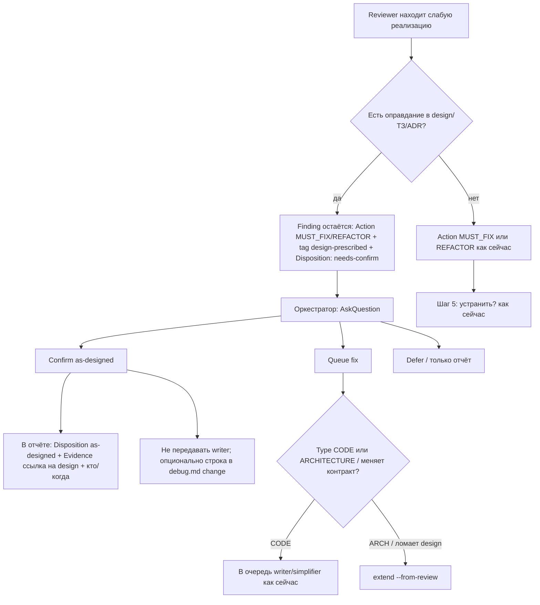

# Exploration: независимое критическое ревью качества (`/review` + `/release-review`)

**Дата:** 2026-08-09  
**Профиль:** исследование kit Cursor (не код 1С)  
**user-goal:** ревьюер не слепо принимает договорённости ЗНИ/design; подсвечивает слабую реализацию независимо от принятых решений; пользователь подтверждает «так задумано» или ставит в очередь на исправление; единый подход для `/review` и `/release-review`.

---

## Свод

Сейчас `/review` и `/release-review` уже делят один skill (`.cursor/skills/review/SKILL.md`) и одного агента (`onec-code-reviewer`). Договорённости ЗНИ попадают в ревью как `## Architectural Context` с формулировкой «оценивать на соответствие» — это **рамка compliance**, а не adversarial challenge. Параллельно в `reviewer-checks.md` есть правило *Design authority* («design не освобождает от AP»), но оно **не продублировано** в системном промпте агента и **конфликтует** с легитимными override через `spec-explicit-tolerance`, `## Hardcode Justification`, исключениями в gates. UX «флаг → as-designed / queue fix» **отсутствует**: после отчёта есть только «устранить через writer» или extend при ARCH/противоречии постановке. Независимый challenge постановки есть в `/opsx:verify` (Layer 4 / architect `design-challenge`), но **не** в code-review контуре.

**Рекомендуемое имя ЗНИ:** `independent-review-disposition`

---

## Для заказчика (простым языком)

Ревью сейчас умеет хорошо ловить «плохой код по стандартам». Но если в постановке ЗНИ уже написано «делайте так» (тихо глотать ошибку, список имён форм, отладочный журнал) — ревьюер часто **соглашается с постановкой** и либо молчит, либо помечает замечание как «проверено, ок». В итоге слабая реализация уходит в релиз как «так решили», без вашего явного «да, осознанно оставляем» или «нет, чиним».

Нужно наоборот: ревьюер **всегда поднимает руку**, если реализация слабая по качеству — даже если design это разрешил. Дальше вы одним выбором: «оставляем как задумано» или «в очередь на исправление». Один и тот же сценарий для обычного ревью и предрелиза.

---

## Как сейчас (факты с путями к файлам)

### Единый контур команд

| Артефакт | Роль |
|----------|------|
| `.cursor/commands/review.md` | Вход `/review` → skill с `release_mode=false` |
| `.cursor/commands/release-review.md` | Вход `/release-review` → тот же skill с `release_mode=true` |
| `.cursor/skills/review/SKILL.md` | SSOT оркестрации (scope, evidence, Task reviewer, отчёт, fix loop) |
| `.cursor/docs/review-guide.md` | Памятка заказчика: уровни apply / review / release-review |

Оба режима вызывают один агент; отличие — `mode=prerelease`, Category 12, Tier 2 explorer, эскалация severity. **Отдельного «критического» режима нет.**

### Как design/ЗНИ попадают в ревью

1. **Шаг 2.2 Architectural Context** (`.cursor/skills/review/SKILL.md`): при активном change оркестратор читает `design.md` и `reports/architecture-*.md` и кладёт в промпт блок `## Architectural Context`.
2. **Шаблон промпта** (`.cursor/skills/1c-agent-patterns/reviewer.md`, обычный / предрелиз / bug-fix):  
   > «Оценивать решения в коде **на соответствие** контексту.»  
   Это явная рамка *compliance with design*, не *challenge of design*.
3. В памяти заказчика (`.cursor/docs/review-guide.md`) про независимость от постановки **ничего нет**.

### Где design **ослабляет / снимает** findings (легитимные каналы)

| Механизм | Где | Эффект |
|----------|-----|--------|
| Evidence `spec-explicit-tolerance` | `onec-code-reviewer.md` Phase 2.5 | Override `contract-compensating-try` / AP-032 → OK / VERIFIED_OK, если ТЗ/design явно допускает |
| Исключение HIDDEN_PARTIAL_RESULT_GATE | `1c-agent-patterns/reviewer.md` gates §8 | «тихо задокументировано в design/ТЗ» → не finding |
| `## Hardcode Justification` + Evidence `design-hardcode-justification` | `onec-code-reviewer.md` Phase 2.6; AP-055 | Identity-filter литералы → OK / VERIFIED_OK |
| AP-042 debug-ЖР | `onec-code-reviewer.md` RELEASE-HYGIENE | Нет строки в tasks/design → flag; **есть** → не flag |
| AP-045 `spec-explicit-timestamp` | тот же агент | Дата+время в комментарии может остаться OK |

Итог: design — не только «контекст намерения», но и **авторитет для снятия дефектов качества** через Evidence-override и «наличие в постановке».

### Где design **не** должен освобождать (частично зафиксировано)

| Механизм | Где | Статус |
|----------|-----|--------|
| «`design term` — INVALID dismiss» для AP-031 | `onec-code-reviewer.md` Phase 1c; `review/SKILL.md` 1.9; AP-каталог | **Жёстко** — имена из постановки не OK |
| Design authority: «design.md decisions do NOT exempt code from anti-pattern checks»; tag `design-prescribed` | `.cursor/docs/standard/reviewer-checks.md` (§11 Band-Aid, Phase 2 п.4) | Есть в чеклисте |
| То же правило в системном промпте агента | `onec-code-reviewer.md` | **Отсутствует** (grep по `design-prescribed` / Design authority — пусто) |
| То же в шаблоне промпта | `1c-agent-patterns/reviewer.md` | **Отсутствует**; наоборот — «соответствие контексту» |
| То же в `review-guide.md` | памятка | **Отсутствует** |

### Действия после отчёта (оркестратор)

`.cursor/skills/review/SKILL.md`:

- Шаг 5: AskQuestion только «устранить MUST_FIX / упростить REFACTOR?» — бинарно fix vs только отчёт.
- Шаг 7.2: ARCHITECTURE → architect / extend.
- Шаг 7.2b: MUST_FIX, который **противоречит** design → `Review disposition required` → `/opsx:extend --from-review` (accepted/rejected/deferred уже в extend, см. `openspec-extend-change/SKILL.md` §6).

**Нет** ветки: «finding валиден по качеству, но совпадает с design → спросить as-designed vs queue fix».  
`VERIFIED_OK` из-за design-override **не попадает** в шаг 5 (writer не вызывается) и **не требует** явного confirm пользователя.

### Формат finding сегодня

`onec-code-reviewer.md` REPORT FORMAT:

- `Action`: `MUST_FIX | REFACTOR | VERIFIED_OK | OPTIONAL`
- `Type`: `CODE | ARCHITECTURE`
- Поля Disposition / AsDesigned / NeedsUserConfirm — **нет**
- Отдельных шаблонов отчёта под `.cursor/skills/review/` кроме самого `SKILL.md` — **нет** (шаблон = REPORT FORMAT в агенте)

### Смежный, но другой контур

Независимый adversarial audit постановки — `/opsx:verify` Layer 4 (`architect-gate.mdc` INDEPENDENT CHALLENGE, режим `design-challenge`). Это **proposal↔design**, не «код vs принятое слабое решение». Не смешивать с explain (вне scope).

### Apply-reviewer

Уровень 1 из `review-guide.md` (после writer в `/opsx:apply`) использует тот же `onec-code-reviewer` / шаблон «Reviewer (ревью кода)». Та же проблема framing Architectural Context, если оркестратор передаёт design. ЗНИ может затронуть и apply-путь для единообразия, но user-goal явно про `/review` и `/release-review`.

---

## Gaps

### G1. Противоречивый контракт «design vs качество»

- **Жёстко:** design не оправдывает плохие имена (AP-031).
- **Мягко / снимает:** design оправдывает тихие fallback, частичную запись, hardcode identity-filter, debug-ЖР.
- **Чеклист говорит «не освобождает»**, агент и шаблон промпта это **не проводят** и местами **ведут к compliance**.

### G2. Framing промпта = compliance, не challenge

Строка «Оценивать решения в коде на соответствие контексту» в `reviewer.md` (все три шаблона) прямо толкает ревьюера принимать design как эталон правильности реализации.

### G3. Design authority / `design-prescribed` не в агенте

Правило и tag живут только в `reviewer-checks.md`. Агент v3 не обязан строить finding с tag `design-prescribed` и не обязан **оставлять** MUST_FIX/REFACTOR при наличии design-оправдания (вместо тихого VERIFIED_OK).

### G4. Нет UX disposition для «слабое, но как в design»

- Нет Action/поля вроде `NEEDS_DISPOSITION` / `AS_DESIGNED_CANDIDATE`.
- Нет шага оркестратора AskQuestion: confirm as-designed / queue fix / defer.
- Существующий disposition в extend — про **изменение постановки**, не про осознанное принятие слабого кода.

### G5. `VERIFIED_OK` через design-override без видимости заказчику

Override с Evidence `spec-explicit-tolerance` / `design-hardcode-justification` попадает в Main report как VERIFIED_OK. Карточка в чате (4 слота) не обязана выделять такие пункты как «требуют вашего confirm». Памятка `review-guide.md` молчит.

### G6. Нет единого «skeptic stance» к Architectural Context

Phase 2.5/2.6 имеют SKEPTIC'S STANCE к guards/hardcode. К блоку Architectural Context скепсиса нет: контекст подаётся как данность для соответствия.

### G7. Release и ordinary — одинаковый пробел

`release_mode` усиливает severity и Category 12, но **не** добавляет независимого challenge design. Предрелиз может зеленее выглядеть при VERIFIED_OK «по design», чем при честном флаге.

### G8. Документация заказчика

`review-guide.md` не объясняет: что ревью может оспорить постановку; что «так в design» ≠ автоматический ок; какой будет ваш выбор после флага.

### G9 (вторичный). Дублирование SSOT

Design authority размазан: checks vs agent vs prompt template. Риск рассинхрона при любой правке одним файлом.

---

## Предлагаемый поток UX

Единый для `release_mode=false` и `true` (отличия только severity/Category 12/Tier 2 — без отдельной ветки disposition).



### Правила для ревьюера (продуктовые)

1. **Architectural Context = факты намерения**, не индульгенция. Соответствие design ≠ отсутствие finding.
2. Если код нарушает AP/Phase0/gates, но design явно предписывает такое поведение → **всё равно finding** с:
   - tag `design-prescribed` (уже есть в checks);
   - поле `Disposition: needs-confirm` (новое);
   - в Issue/Root cause: «совпадает с design §…; качество спорное потому что …»;
   - **запрет** тихого `VERIFIED_OK` только на основании цитаты design (кроме узкого whitelist: см. риски).
3. `spec-explicit-tolerance` / Hardcode Justification **не закрывают** finding сами: максимум понижают confidence или помечают `design-endorsed: true`, но Action остаётся MUST_FIX/REFACTOR до confirm пользователя.
4. Исключения, где design по-прежнему может давать VERIFIED_OK без disposition (узкий список, зафиксировать в ЗНИ): например `documented-protocol-key`, `platform-documented-behavior`, `resolved-contract:dynamic` — **не** «нам так удобнее в design».

### Правила для оркестратора (skill)

После шага 4 (отчёт), **до** шага 5:

1. Собрать findings с `Disposition: needs-confirm` / tag `design-prescribed`.
2. В чат — компактный список (без jargon severity): «N пунктов совпадают с постановкой, но спорны по качеству».
3. AskQuestion на каждый или пакетом:
   - **Оставить как задумано** → записать `as-designed` в main report (+ appendix), не в writer.
   - **Исправить** → в очередь fix (CODE) или extend (если нужен пересмотр постановки).
   - **Отложить** → `deferred` в отчёте; не блокировать остальной fix-loop.
4. Тот же шаг при `release_mode=true` (предрелиз не пропускает disposition).

### Поля отчёта (предложение)

В каждый такой finding:

```text
Disposition: needs-confirm | as-designed | queued-fix | deferred
Design ref: design.md §… / Decision …
design-endorsed: true
```

В Summary main report — счётчик: `Design-prescribed awaiting disposition: N`.

---

## Файлы kit к изменению

| Файл | Зачем |
|------|--------|
| `.cursor/agents/onec-code-reviewer.md` | SKEPTIC к Architectural Context; запрет VERIFIED_OK «только потому что design»; поля Disposition; tag `design-prescribed` в Phase 0/2/REPORT FORMAT; bump `prompt_contract_version` при breaking |
| `.cursor/docs/standard/reviewer-checks.md` | Усилить Design authority → полный алгоритм + связка с Disposition; согласовать с Phase 2.5/2.6 overrides |
| `.cursor/skills/1c-agent-patterns/reviewer.md` | Заменить framing «на соответствие» → «контекст намерения; слабое — flag даже при endorse design»; три шаблона единообразно |
| `.cursor/skills/review/SKILL.md` | Шаг 2.2: как подавать Architectural Context; новый шаг disposition между 4 и 5; Summary/карточка; единый для `release_mode` |
| `.cursor/docs/review-guide.md` | Памятка: что значит флаг «как в постановке, но спорно»; ваши 2 кнопки |
| `.cursor/commands/review.md` / `release-review.md` | При необходимости одна строка-указатель на независимое качество (без дублирования протокола) |
| `.cursor/rules/bsl-antipatterns.mdc` (точечно) | Если нужен явный AP или уточнение remediation «не снимать finding design-ом» для AP-032/055/042 |
| `.cursor/skills/openspec-extend-change/SKILL.md` (опционально) | Стык: `queued-fix` с пересмотром постановки vs чистый CODE fix; не дублировать as-designed |
| `.cursor/rules/1c-agent-delegation.mdc` (опционально) | Одна строка: apply-reviewer наследует тот же disposition-контракт, если ЗНИ расширит scope |

**Не трогать в этой ЗНИ:** explain / брифа explain; Layer 4 verify (можно только *сослаться* как аналог роли, не менять).

**Не создавать** `openspec/changes/` в рамках этого исследования (уже соблюдено).

---

## Критерии приёмки

1. При активном change с `design.md`, явно предписывающим поведение-антипаттерн (например тихий fallback / identity-filter без делегирования), прогон `/review` (и зеркально `/release-review` на том же scope) даёт **finding** с tag `design-prescribed` и `Disposition: needs-confirm`, а не только `VERIFIED_OK`.
2. В чате после отчёта оркестратор **обязательно** предлагает выбор: confirm as-designed / queue fix (/ defer); без выбора finding не считается «закрытым согласием постановки».
3. Выбор **as-designed** фиксируется в main report (`Disposition: as-designed` + Design ref) и **не** уходит в writer; выбор **queue fix** уходит в существующий fix-loop или extend по Type.
4. Один и тот же алгоритм disposition для `release_mode=false` и `true` (в skill — без второй копии протокола).
5. Промпт-шаблоны `reviewer.md` не содержат инструкции «оценивать на соответствие» как единственный критерий; содержат skeptic stance к Architectural Context.
6. `onec-code-reviewer.md` содержит Design authority + формат Disposition; `prompt_contract_version` согласован с `expected_reviewer_prompt_contract_version` в `review/SKILL.md`.
7. `review-guide.md` описывает сценарий простым языком (заказчик понимает без чтения агента).
8. Регрессия: AP-031 по-прежнему не dismiss через «термин из design»; границы Review Boundaries / light-review / Category 12 не ломаются.
9. (Опционально в ЗНИ) Узкий whitelist Evidence-типов, которые по-прежнему могут давать VERIFIED_OK без disposition, явно перечислен и не включает «просто цитата design».

---

## Имя ЗНИ (kebab)

**Рекомендуемое:** `independent-review-disposition`

Альтернативы (если занято / не нравится):

- `critical-review-independence`
- `review-as-designed-confirm`

---

## Риски / открытые вопросы

1. **Шум disposition:** много `design-prescribed` на большом change утомит. Нужен ли пакетный AskQuestion («все N — as-designed») vs по одному? Рекомендация: пакет с возможностью точечно переопределить.
2. **Узкий whitelist VERIFIED_OK:** оставлять ли Hardcode Justification как путь к as-designed-по-умолчанию или всегда needs-confirm? Продуктово ближе к user-goal — **всегда confirm**; Justification = обязательный Design ref, не авто-OK.
3. **AP-042:** «есть в design» сейчас = не flag. Менять на flag+disposition или оставить hygiene-исключение? Решить в ЗНИ явно.
4. **Совместимость с extend disposition** (`accepted/rejected/deferred`): не смешивать семантику. Предложение: as-designed = принятие *кода при текущей постановке*; extend accepted = *изменение постановки*.
5. **Apply-reviewer:** включать ли в scope ЗНИ сразу или только `/review`+`/release-review`? Для единообразия лучше сразу упомянуть в delegation/apply шаблоне одной строкой.
6. **Breaking prompt contract:** поле Disposition → bump `prompt_contract_version` (сейчас 3); оркестратор должен ожидать новую версию.
7. **Не путать с verify Layer 4:** challenge постановки до apply ≠ challenge реализации после. В документации ЗНИ — явное разделение.
8. **Chat lexicon / HALT:** слова Disposition/design-prescribed — в файл отчёта; в чат — UX-формулировки («совпадает с постановкой, но спорно по качеству»).

---

## Источники (прочитанные)

- `.cursor/commands/review.md`
- `.cursor/commands/release-review.md`
- `.cursor/skills/review/SKILL.md` (целиком)
- `.cursor/agents/onec-code-reviewer.md`
- `.cursor/docs/standard/reviewer-checks.md` (в т.ч. Design authority, Band-Aid §11, Phase 2)
- `.cursor/docs/review-guide.md`
- `.cursor/skills/1c-agent-patterns/reviewer.md`
- Связанно: `.cursor/skills/openspec-extend-change/SKILL.md` (disposition from-review), `.cursor/rules/architect-gate.mdc` (Independent Challenge — соседний контур), фрагменты AP-каталога / `1c-agent-patterns/SKILL.md`

Шаблонов отчёта ревью под `.cursor/skills/review/templates/` не найдено — формат задан в агенте (MAIN REPORT + REASONING APPENDIX).
