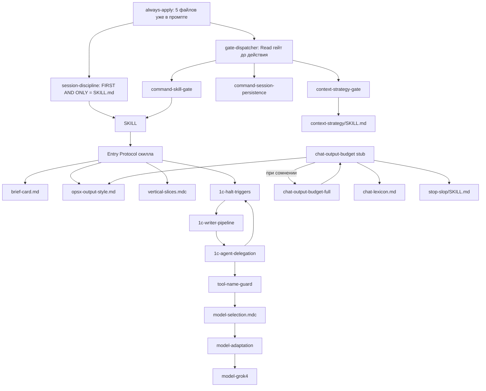

# Ревью: логика исполнения и контекст-бюджет правил kit

Оценка токенов: **байты UTF-8 / 3** (смесь RU/EN; для кириллицы BPE обычно плотнее английского). Физические строки — включая пустые. Измерения на диске, 2026-08-20.

Кап поставки (`.cursor/docs/delivery-integrity.md` п.7): always-apply `.mdc` + `AGENTS.md` **≤ 34 КБ**. Факт: **37,17 КБ (+3,2 КБ)**.

---

## Контекст-бюджет always-apply

| Файл | Строк | Байты | ~токены | Нужность на каждом ходе |
|------|------:|------:|--------:|-------------------------|
| `1c-agent-delegation.mdc` | 141 | 14,0 КБ | ~4 700 | **Низкая.** На ходе без BSL/XML/Task достаточно 15–20 строк: «не пиши `.bsl`/XML», «1С-обследование → explorer», apply-gate одной фразой. Остальное — apply/review: авто-fix, три цикла итераций, якорь simplifier, граница промпта writer, LINT, таблица XML. |
| `chat-output-budget.mdc` | 77 | 8,4 КБ | ~2 900 | **Высокая по роли, раздутая по объёму.** Навигатор + HALT + канон первой строки + русский progress — да. Полная таблица 13 сценариев (включая explain), 10-пунктовый self-check и сжатая копия full-тела — нет. |
| `AGENTS.md` | 58 | 6,5 КБ | ~2 200 | **Низкая для агента.** Человеческий индекс + карта SSOT, дублирует `gate-dispatcher` и `README`. На ходе не исполняется. |
| `session-discipline.mdc` | 53 | 5,5 КБ | ~1 900 | **Высокая** для входа в команду и free-text. Anti-patterns и абзац «режим сессии → читай `model-selection`» — специализированы. |
| `gate-dispatcher.mdc` | 46 | 3,2 КБ | ~1 100 | **Средняя.** Таблица cue полезна. Пункт алгоритма «при любом совпадении **Read** файл гейта **до действия**» сам по себе раздувает цепочки (см. конфликты). |
| **Итого** | **375** | **37,2 КБ** | **~12 800** | Уже в каждом промпте Cursor (блок always-apply). Повторный Read тех же файлов — чистый расход. |

**Что из always-apply реально нужно на каждом ходе**

- Не писать `.bsl`/XML метаданных самому.
- Команда → первый батч только `SKILL.md`; протокол живёт до смены команды.
- Free-text про 1С → explore (или явный bypass).
- В чат: навигатор, без жаргона движка, один следующий шаг; после липкого сбоя — канон в первой строке.
- Cue: при правке BSL / форме / баге — есть on-demand файл, не его тело.

**Что специализировано и должно уехать в on-demand**

Из `1c-agent-delegation.mdc`: APPLY GATE целиком, XML-таблица, авто-исправление ревью (якоря weak / design-prescribed / simplifier), DELEGATION GATE с двумя порогами, «ЧТО не КАК», LINT, три цикла итераций, KB/пути (в kit `openspec/project.md` нет — абзац мёртв локально).

Из `chat-output-budget.mdc`: строки explain, pause-wait, handoff; self-check из 10 пунктов; отсылка «при сомнении Read full».

Из `session-discipline.mdc`: таблица anti-patterns (уже есть в `command-session-persistence.mdc`); «не копируй таблицу моделей — SSOT `model-selection.mdc`» (провоцирует Read 195 строк перед каждым `Task`).

### Стабы, выросшие до полного тела

1. **`chat-output-budget.mdc` (заявлен как stub) vs `chat-output-budget-full.mdc` (199 строк / 39,5 КБ / ~13 500 токенов).** В стабе уже: таблица лимитов, HALT top-20, канон, progress, non-events, No Acknowledgement, 10 пунктов self-check, pause-wait, иерархия лимит/шаблон. Full добавляет §1c тест понятности, §5a verify, таблицы примеров. Нормативная поверхность стаба ≈ 70–80% full. Фраза «при сомнении Read full» почти гарантирует **двойную** загрузку (~48 КБ) на чувствительном ходе.

2. **`1c-agent-delegation.mdc` — перевёрнутый стаб.** «Полная HALT-таблица» (`1c-halt-triggers.mdc`) — 84 строки / 6,1 КБ. Always-apply «компакт» — **141 строка / 14 КБ**, больше «полного» тела. Plus якорь «читай `1c-writer-pipeline.mdc` **до** появления `.bsl` в контексте» — ещё 333 строки / 29 КБ.

3. **`session-discipline.mdc` — относительно честный стаб** трёх гейтов, но почти дословно копирует FIRST AND ONLY из `command-skill-gate.mdc`. Диспетчер всё равно велит Read тот же гейт (см. L1).

### Скрытый always-apply: glob `**/*.bsl`

Не `alwaysApply: true`, но Cursor подмешивает при любом `.bsl` в контексте:

| Файл | Строк | КБ |
|------|------:|---:|
| `1c-writer-pipeline.mdc` | 333 | 28,6 |
| `1c-halt-triggers.mdc` | 84 | 6,1 |
| `1c-metadata-validation.mdc` | 21 | 2,4 |
| `1c-coding-standards.mdc` | 18 | 0,6 (+ велит Read ещё 4 документа стандартов) |
| **Пакет** | **~456** | **~37,7 КБ (~12 900 токенов)** |

На ходе apply с BSL: **already-apply 37 КБ + glob-пакет 38 КБ ≈ 75 КБ правил**, ещё до SKILL apply (71 КБ) и `model-selection` (21 КБ).

`opsx-output-style.md` (745 строк / **100 КБ** / ~34 000 токенов) формально не always-apply, но стаб бюджета указывает его как SSOT Chat Surface. Один «добросовестный» Read съедает больше, чем все always-apply вместе.

---

## Граф Read-цепочек

**Циклы (A требует Read B, B отсылает к A):**

- `1c-agent-delegation` ↔ `1c-halt-triggers` ↔ `1c-writer-pipeline`
- `chat-output-budget.mdc` ↔ `chat-output-budget-full.mdc`
- `forms-mxl-mode-gate` ↔ `1c-xml-write-guard` ↔ apply `SKILL.md`
- `tool-name-guard` ↔ `model-selection` ↔ `1c-agent-delegation`
- `architect-gate` → KB CONTEXT в delegation → снова architect-gate

Бесконечного цикла нет, если читать файл один раз. На практике модель «дожимает SSOT» и перечитывает.

### Типовые сценарии: обязательные Read до первого полезного действия

**Полезное действие** = первое, ради которого пользователь написал: бриф/ответ в чат, либо `Task` writer.

#### A. `/opsx:explore` (новая тема, есть текст задачи)

| Шаг | Что требует правило | Обязательность |
|-----|---------------------|----------------|
| Батч 1 | Только `openspec-explore/SKILL.md` (356 строк / 31 КБ) | Жёстко, FIRST AND ONLY |
| После скилла | `openspec/project.md` (в kit нет), `_index.yaml`, `openspec list`, 1–3 Glob имён | Entry Protocol |
| «SSOT формы» | `brief-card.md` (223 строки / 14 КБ) — слоты B3 уже **внутри** скилла | Дубль |
| «классификатор» | `opsx-output-style.md` §5.1 (100 КБ) | Дубль, опасный |
| Микрофикс | `task-triage.mdc` | По маркеру |
| 3+ файла во входе | `context-strategy-gate.mdc` **и/или** `context-strategy/SKILL.md` (187 строк) | Конфликт с FIRST AND ONLY |
| Диспетчер | `command-skill-gate.mdc` + `command-session-persistence.mdc` | Дубль already-apply |

- **Минимум до брифа:** **1 Read** (SKILL).
- **Добросовестный агент:** **4–8 Read** правил/шаблонов + Shell, ещё **без** ответа по существу.
- **После «да» до explorer:** ещё `model-selection` (195), `tool-name-guard` (92), `preserve-subagent-reports`, `1c-agent-patterns` (316), при баге — `verified-cause` + `1c-error-analysis`. Итого **8–12 файлов правил** до первого `Task`.

#### B. `/opsx:apply` с правкой `.bsl`

Батч 1: только apply `SKILL.md` (**634 строки / 71 КБ / ~24 000 токенов**) — уже больше всего always-apply.

Дальше до writer (скилл + гейты + glob):

| # | Файл | Зачем |
|---|------|--------|
| 1 | apply `SKILL.md` | FIRST AND ONLY |
| 2–4 | `tasks.md`, `proposal.md`, `openspec/project.md` | шаги 2–4 скилла |
| 5 | `reports/verification-*.md`, `debug.md` | preflight / slice-gate |
| 6 | `marker-canon.md` (183) | metadata |
| 7 | `vertical-slices.mdc` (**387 / 55 КБ**) | команда apply явно ссылается; диспетчер — на срезы |
| 8 | `1c-halt-triggers.mdc` | glob + диспетчер + delegation |
| 9 | `1c-writer-pipeline.mdc` (**333 / 29 КБ**) | glob + «читай до `.bsl`» |
| 10 | `forms-mxl-mode-gate.mdc` | если форма |
| 11 | `decision-block.md` (142) | открытая развилка |
| 12 | `model-selection.mdc` + `tool-name-guard.mdc` | каждый Task |
| 13 | `1c-agent-patterns/writer.md` (249) | INPUT CONTRACT |
| 14 | при сомнении в чате: `chat-output-budget-full` и/или `opsx-output-style` | стаб |

Артефакты change не считаем «правилами», но они в той же очереди.

- **Правил до первого writer `Task`:** типично **8–12** (порог «4+» стабильно пробит).
- **Первое полезное действие** — не раньше 2–4 батчей после входа; батч 1 по протоколу **пустой** для работы.

#### C. Простой вопрос без команды («как проводится документ X?»)

| Источник | Требование |
|----------|------------|
| `session-discipline.mdc` | Первое действие — Read explore `SKILL.md` |
| Explore Entry Protocol | Бриф B3 + **Подтвердить?** + END TURN; **нельзя** сразу ответить |
| `chat-output-budget.mdc` §4 | «простой read-only → **сразу результат**» |

- **По протоколу explore:** 1 тяжёлый Read (31 КБ) → бриф → ждать «да» → ещё цепочка A. Ответа в этом ходе нет.
- **По §4 бюджета чата:** 0 Read, сразу ответ.
- Порядка приоритетов **нет** (см. L3).

### Где для одного действия требуют 4+ файлов правил

- Старт любой `/opsx:*` при буквальном диспетчере: SKILL + `command-skill-gate` + `command-session-persistence` + (часто) `context-strategy-gate` = **4** ещё до Entry Protocol.
- Первый `Task` с платной моделью: `tool-name-guard` + `model-selection` + (Grok) `model-adaptation` + `model-grok4` = **4**, плюс роль-специфичный паттерн.
- Правка `.bsl` в apply: halt-triggers + writer-pipeline + coding-standards (+ 4 docs) + metadata-validation + delegation (уже в промпте) ≥ **4**.
- Verify-чат: verify SKILL + `verify-user-communication` + budget stub + full + `verdict-card` + `chat-summary` + `decision-block` ≥ **6**.

---

## Конфликты

Порядок приоритетов **нигде не записан как единый список**. Частичные иерархии есть (чат: лимит > шаблон > пример, **кроме** теста понятности; профиль модели: MUST NOT гейтов; Light выше «общей правки `.bsl`»), но они **не** покрывают вход в команду vs диспетчер vs бюджет чата.

### L1 — высокий. FIRST AND ONLY vs «Read гейт до действия»

- `session-discipline.mdc` (15–17): первый батч — **только** Read `SKILL.md`.
- `gate-dispatcher.mdc` (31–34): при **любом** совпадении триггера — **Read файл гейта до действия**.
- На `/opsx:explore` / `/opsx:apply` сразу срабатывают строки диспетчера «команда-обёртка» и «протокол на каждом ходе» → Read `command-skill-gate.mdc` и `command-session-persistence.mdc` **до** SKILL — прямое нарушение FIRST AND ONLY.

**Как агент разрешает:** не определено. Наблюдаемое поведение: кто-то чтит FIRST AND ONLY (гейт не читает — ок, текст уже в always-apply), кто-то батчит SKILL+гейты (ломает Entry Protocol).

**Предложение:** в диспетчере пометить три гейта сессии как «тело уже в `session-discipline`, **не** Read». FIRST AND ONLY — единственное правило батча 1.

### L2 — высокий. Free-text explore vs Context Strategy на ходе 1

- `session-discipline.mdc` (41–43): вопрос по 1С без команды → **первое** действие Read explore SKILL.
- Там же (33–37): 3+ файлов / XML / 500+ строк → **СТОП**, Read `context-strategy/SKILL.md` **до** файлов задачи.
- Пользователь прикладывает 3 модуля без `/opsx:*`: оба триггера истинны, оба претендуют на первый Read.

**Разрешение по смыслу (не записано):** SKILL explore первый; context-strategy — только когда оркестратор **сам** собирается читать файлы задачи. После брифа обследование и так с порогом 0 `.bsl` (delegation gate) → explorer. Тогда context-strategy на 1С-коде **избыточен**.

### L3 — высокий. «Сразу результат» vs бриф explore

- `chat-output-budget.mdc` (48–50): простой read-only → сразу результат.
- Explore Entry Protocol: до подтверждённого брифа запрещены Task и чтение `.bsl`; финал хода — карточка **Подтвердить?**.

**Разрешение не определено.** Persistence говорит «внутри команды протокол скилла», но free-text ещё не команда, пока агент не прочитал SKILL, который объявляет «любой свободный текст = explore». Цикл самозахвата: чтобы узнать, что это explore, нужно прочитать 31 КБ и уже нельзя ответить.

**Предложение:** явный fast-path: вопрос, ответимый без кода / из уже загруженного контекста → §4; иначе explore. Зафиксировать precedence: write-guard > активный SKILL > бюджет чата §4.

### L4 — высокий. Несколько обязательных «первых строк»

Одновременно требуют быть первой строкой первого сообщения хода:

1. Канон лимита: «дорогие модели недоступны — дальше на модели чата» (`chat-output-budget.mdc` 54; `model-selection.mdc` 28).
2. Verify: вердикт в первой строке (`verdict-card.md`; таблица лимитов).
3. Apply pause-wait: «где мы» (не slug).
4. Review: «Ревью: …».
5. Исключение: «Модель архитектора: Opus 5» тоже не ждёт вердикта.
6. Chat Surface: первая строка — суть ≤25 слов.

Full-бюджет оговаривает (1) vs (2): канон — первая строка **первого** сообщения хода; вердикт — первая строка **карточки**; канон не ждёт финала. Это **два** user-facing сообщения при норме verify «одно финальное сообщение» (исключение прописано, но держать в голове тяжело).

Канон + pause-wait + «суть ≤25 слов» в одном ходе apply **физически несовместимы** без ранжирования. Ранжирования нет (только канон vs вердикт).

**Предложение:** один стек первой строки: (1) канон если липкий сбой **в этом ходе**, (2) сценарийная первая строка (вердикт / где мы / ревью), (3) суть. Не больше одной user-visible реплики до карточки, кроме канона.

### L5 — средний. Лимит строк vs шаблоны vs тест понятности vs профиль Grok

- Иерархия чата: лимит > шаблон > эталон; **исключение:** тест понятности важнее лимита.
- `brief-card.md`: бюджет **слотов**, не строк.
- `model-grok4.mdc`: MAY прямой речи / понятность **внутри** лимита, не важнее лимита.
- Apply SKILL (25): «Always announce: Using change: \<name\>» vs No Acknowledgement и non-events.

Агент не знает, резать ли B3 под 6 слотов или раздувать «понятность»; объявлять ли change (скилл) или молчать (бюджет).

**Предложение:** объявление change — non-event, удалить из скилла. Для брифа — только `brief-card`. Тест понятности — только A/B и pause-wait, не любой ответ.

### L6 — средний. Порог чтения `.bsl`: 0 vs 3 vs context-strategy «читай сам»

- Delegation: обследование → **0** Read `.bsl`.
- Иначе до агента допустимо **до 3** точечных Read.
- Context-strategy: файл 150–500 строк, конкретный аспект → оркестратор читает фрагмент сам.
- Explore: «обследуй» сам через Grep — антипаттерн.

На 2 небольших `.bsl` с вопросом «как работает» три нормы расходятся.

**Предложение:** если активен explore **или** задача = обследование → 0, context-strategy не применяется к `src/**` / `.bsl`. Иначе порог 3.

### L7 — средний. Light Mode vs Architect Gate vs Verified Cause

- Halt-triggers: Light (1 файл, 2–10 строк) **выше** общей правки `.bsl`; bug в Light — HALT 1, 1b, 2 (без HALT 3).
- Architect-gate: UX-значимый фикс, >10 строк, >1 файл — вызов архитектора.
- Dispatcher: UX-значимый фикс → `verified-cause-gate` (там HALT 3 — архитектурный impact).

Пятистрочный UX-фикс: Light говорит writer+reviewer; architect/verified-cause могут требовать архитектора.

### L8 — средний. Progress marker vs verify «0 промежуточных»

- §6: одна русская строка при ≥2 субагентах / ≥30 с.
- Verify: 0 промежуточных, кроме «Дописываю постановку…», канона и «Модель архитектора: Opus 5».

«Проверяю артефакты…» легален по §6 и запрещён по verify, если это не repair.

### L9 — низкий. Профиль Grok «грузить каждую сессию» vs FIRST AND ONLY

`model-grok4.mdc`: грузить при семействе Grok 4. На ходе 1 команды это второй Read. На практике профиль **не** грузится на входе → MAY мёртв, MUST NOT и так в always-apply.

### L10 — низкий. Bootstrap explore vs Entry Protocol

Explore SKILL: на новой теме одна строка «Готов разобрать… Опишите, с чем работаем». Entry Protocol при том же ходе требует полный B3. Если пользователь уже описал задачу (типичный `/opsx:explore <текст>`), bootstrap **ложный**. Кто побеждает — не сказано.

---

## Мёртвые нормы

1. **«Источник: … перенесено в always-apply»** в `verified-cause-gate.mdc:26`. Гейт `alwaysApply: false`; в always-apply только cue диспетчера. Комментарий лжет.

2. **Блок путей `openspec/project.md` в always-apply.** В kit файла нет, текст сам говорит «блок опускается». Норма жива в потребительских репозиториях, **мертва в этом репо**, но занимает место в каждом ходе kit-разработки.

3. **Context-strategy на обследовании 1С.** После explore/delegation ответ всегда «зови explorer». Матрица «прямое чтение vs субагент» для `.bsl` не достигается, если чтить порог 0.

4. **Read `command-skill-gate` / `command-session-persistence` / `context-strategy-gate`.** Тела уже в `session-discipline`. Отдельный Read ничего не добавляет, кроме списка шаблонов обрезки verify/new (его как раз **нет** в стабе сессии — дыра, не мёртвая норма).

5. **`sdd-workflow.mdc`.** На него указывает `AGENTS.md`; живой workflow — в SKILL команд. Файл почти не попадает в Read-цепочку.

6. **`no-roi-estimates.mdc`.** Без glob, не в диспетчере; в промпте только однострочное description. Тело недостижимо, пока агент сам не догадается.

7. **Bootstrap «опишите, с чем работаем»** при непустом запросе — недостижим без конфликта с B3 (L10).

8. **«Always announce: Using change»** в apply SKILL — недостижимо без нарушения No Acknowledgement / non-events, либо non-events мертвы в apply.

9. **§4 «сразу результат»** для 1С-вопроса без команды — недостижимо, если чтить free-text → explore.

10. **Две «первых строки» в одном сообщении** (канон + вердикт) — физически невозможно; обход через два сообщения конфликтует с «одно финальное».

11. **Pre-send пункт 7: полный каталог anti-slop = Read `stop-slop/SKILL.md` перед каждой отправкой.** На каждом ходе неисполнимо (ещё один Read). Либо мёртв, либо бесконечная цепочка.

12. **Дублирование платформы Cursor.** Always-apply и так инжектируется целиком. `available_skills` уже содержит длинные description всех скиллов. Нормы «обязательно Read SKILL.md» частично дублируют то, что Cursor уже кладёт в промпт при `/opsx:*` (команда тонкая, SKILL — нет; Read всё равно нужен). Glob `**/*.bsl` дублирует «прочитай halt-triggers при правке BSL».

13. **`1c-coding-standards.mdc` как loader.** 18 строк, затем 4 документа стандартов. На каждом ходе с `.bsl` в контексте правило молча просит ещё пачку docs — для оркестратора, которому нельзя писать BSL. Мёртво для оркестратора, шумно для контекста.

---

## Когнитивная нагрузка

Места, где модель должна **удерживать изменяемое состояние** и длинные чеклисты:

1. **Липкая память сессии «с API / без API».** Токены `-noapi`/`-api` (целый фрагмент, последний слева направо), память после лимита ≠ таймаут, шаг 1 vs шаг 2 цепочки, уже ушедший фон не отменять, канон один раз, явный слаг vs режим. Размазано по `session-discipline` (абзац), `model-selection` (~80 строк), `tool-name-guard` (чеклист из 3 пунктов, внутри снова токены). Это один конечный автомат на три файла.

2. **Активная команда + follow-up.** Каждый ход: какая команда, какие HALT скилла, TodoWrite `in_progress`, не выходить самому. Explore vs apply меняют разрешённые Write. Состояние не в файле (кроме косвенно `debug.md`).

3. **Режимы apply:** default step-by-slice, `--slice`, `--since-slice`, `--step-by-step`, `--batch`, awaiting-acceptance, inside-slice rework vs fix-срез, form_mode на форму, mxl permission, marker_scope cf/cfe/mixed, `developer: n/a`. Скилл 634 строки — это не «шаги», это VM.

4. **Pre-send self-check из 10 пунктов** плюс тест понятности из 3 частей плюс HALT top-20 плюс lexicon «при сомнении». Перед каждым пользовательским сообщением — мета-проход, сравнимый с генерацией ответа. Пункты 9 и 10 специально «не путать».

5. **Три цикла итераций** (2 / 3 / 2) в always-apply, плюс лимит «две неудачи делегирования», плюс якорь apply-reviewer (какие MUST_FIX чинить, какие нет).

6. **Несколько словарей запрета в чате:** §7 top-20, `chat-lexicon.md`, stop-slop, HALT в brief-card, запрет имён гейтов. Полнота якобы у теста читателя, не у списков — значит списки нельзя ни выучить, ни считать достаточными.

7. **Профиль модели MAY/MUST NOT** поверх всего, с оговоркой «любое чтение как ослабление гейта — ошибка». Дополнительный слой интерпретации без новых фактов.

**Упрощения без потери функции**

- Память API: 6 буллетов в `session-discipline`, таблица ролей — одна маленькая таблица рядом. `model-selection.mdc` оставить справочником сбоев, не runtime.
- Apply: вынести metadata/маркеры/forms в `templates/` с чеклистом из 5 галок; в SKILL оставить «открой шаблон X».
- Self-check: **3 пункта** — (1) нет HALT-подстрок, (2) один следующий шаг, (3) первая строка по стеку L4. Остальное — в шаблоне сценария (verify card уже содержит вердикт и next step).
- Один словарь чата: top-20 в always-apply; lexicon только при написании шаблонов.
- Удалить профили MAY из runtime оркестратора (MUST NOT уже в guard). Grok и так рекомендованный чат.

---

## Рекомендации

**R1. Вернуть кап 34 КБ.** Сейчас 37,17 КБ. Резать в первую очередь `1c-agent-delegation.mdc` и таблицу лимитов/self-check в `chat-output-budget.mdc`, не диспетчер.

**R2. Сжать `1c-agent-delegation.mdc` до ~40 строк.** Оставить: запрет Write `.bsl`/XML, apply-gate одной фразой, «1С-код → только onec-* через Task», «подробности: halt-triggers / writer-pipeline». Авто-fix, циклы, XML-таблица, промпт writer, LINT — уже есть в on-demand; удалить копии.

**R3. Сделать стаб бюджета чата настоящим стабом (~25 строк).** Навигатор, HALT top-20, канон, русский progress, указатель «лимиты сценария — full, читать только verify/explain/handoff». Убрать «при сомнении Read full». Убрать 10-пунктовый чеклист из always-apply.

**R4. Явный precedence (новый короткий блок в `session-discipline` или вместо алгоритма диспетчера).**  
(1) FIRST AND ONLY на батче 1.  
(2) Write/XML/apply-gate.  
(3) Entry Protocol активного SKILL.  
(4) Бюджет чата.  
(5) Профиль модели только MAY внутри (4).  
Диспетчер: **не** Read файлов, чьё тело уже в always-apply (`command-skill-gate`, `command-session-persistence`, `context-strategy-gate`).

**R5. Снять glob `**/*.bsl` с `1c-writer-pipeline.mdc`.** 29 КБ на любом чтении модуля — скрытый always-apply. Оставить glob на тонком `1c-halt-triggers.mdc` (6 КБ) + loader «pipeline — Read при фактической правке». `1c-coding-standards.mdc` не грузить оркестратору; только writer/reviewer в промпте агента.

**R6. Запретить runtime-Read `opsx-output-style.md`.** 100 КБ. Файл — для авторов скиллов (это уже сказано в full §8). В always-apply оставить одну фразу: оркестратору не читать. Слоты брифа — только `brief-card.md` **или** таблица внутри SKILL, не оба.

**R7. Fast-path вопроса.** В `session-discipline` bypass: вопрос / справка, если ответ из контекста или без `src/**`, — §4 «сразу результат», без explore SKILL. Иначе explore. Снимает L3.

**R8. Context-strategy не для `src/**`, `.bsl`, 1С XML.** Там всегда explorer (уже delegation). Скилл оставить для markdown/отчётов/CSV. Снимает L2 и мёртвость матрицы.

**R9. Один автомат «с API / без API».** 6 буллетов в session-discipline; из `tool-name-guard` убрать повтор токенов; `model-selection` — таблица ролей + классификация сбоев, грузить при **первом** `Task` с `model=`, не перед каждым.

**R10. Стек первой строки** (см. L4) — в стаб бюджета, 4 строки. Удалить конкурирующие «Always announce» (apply SKILL:25) и bootstrap explore при непустом вводе.

**R11. Починить дыру обрезки SKILL без второго Read гейта.** Список `templates/*.md` для verify/new перенести в `session-discipline` (страховка от обрезки уже есть, но без имён файлов) **или** в сами команды. Тогда `command-skill-gate.mdc` можно не держать в диспетчере.

**R12. Разрезать apply `SKILL.md` (634) и review (722).** Entry Protocol ≤80 строк; metadata, slice-gate, pause-wait — шаблоны. Иначе батч 1 apply сжигает ~24k токенов до любой работы — это больший раздув, чем always-apply.

**R13. Ужать `AGENTS.md` до ~20 строк** (вход `/opsx:explore`, ссылка на README, один диспетчер). Карту SSOT не дублировать: она уже в `gate-dispatcher` + `AGENTS` + `chat-output-budget` § SSOT.

**R14. Зачистить мёртвые строки:** `verified-cause-gate.mdc:26`; apply announce; bootstrap при непустом вводе; «Read stop-slop на каждый self-check».

**R15. Не добавлять always-apply, пока не вырезан эквивалентный объём.** Следующий абзац в delegation/budget без выреза — повторение текущего капа.